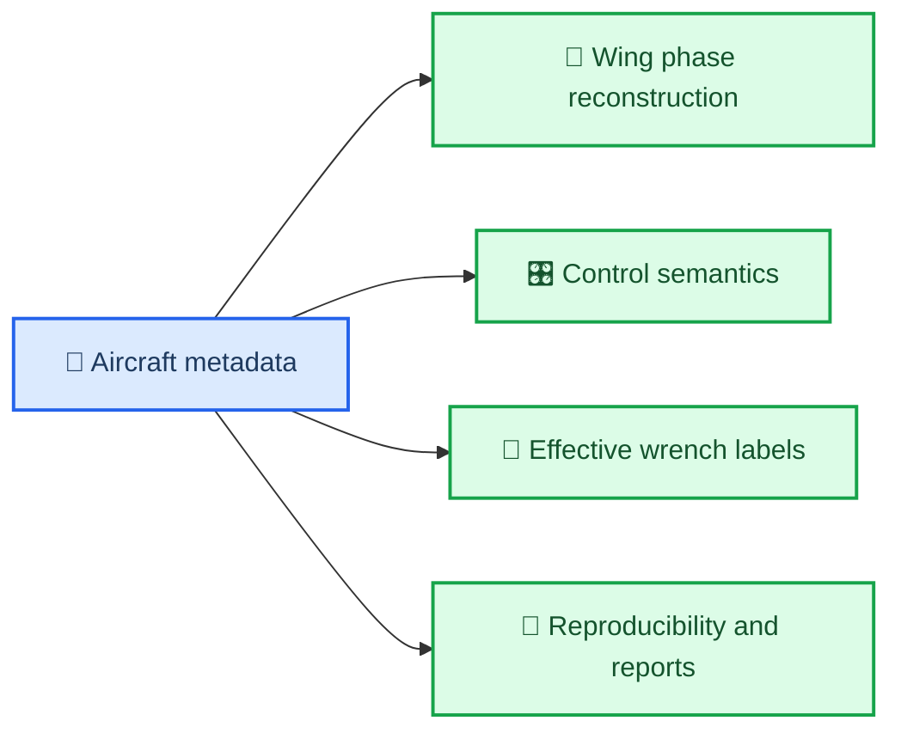

# 扑翼飞行器 Aircraft Metadata Contract Draft

_面向 `/home/zn/system-identification` canonical dataset `v0.1-draft` 的飞机常量与标定信息草案，2026-03-23_

---

## 📋 目标

这份 metadata contract 用来把“**日志里没有、但做标签和解释输入时必须知道**”的飞机信息单独固定下来。

它服务的对象不是飞控实时运行，而是离线系统辨识数据管线。核心目的是避免后面出现下面这类问题：

- `mass`、`inertia` 只存在于某个 notebook 变量里
- `FLAP_RATIO=7.5` 只是口头约定，没有版本记录
- `wing phase = 0` 到底对应哪一个机械姿态，团队里每个人理解不一样
- `actuator_servos.control[0] = +0.3` 到底是左 elevon 上偏还是下偏，没有统一语义

第一版 metadata contract 的定位很明确：

- 给 canonical dataset 提供 **标签计算常量**
- 给 phase-aware 模型提供 **扑翼相位定义**
- 给后续不同批次飞行提供 **可复现的飞机配置基线**

## 🔗 与现有文档的关系

- 总体认知与项目计划见：
  - [2026-03-23-flapping-system-identification-overview-and-plan.md](./2026-03-23-flapping-system-identification-overview-and-plan.md)
- 数据集字段与标签 contract 见：
  - [2026-03-23-flapping-dataset-contract-draft.md](./2026-03-23-flapping-dataset-contract-draft.md)
- 预处理流水线见：
  - [2026-03-23-ulg-to-canonical-parquet-preprocessing-spec.md](./2026-03-23-ulg-to-canonical-parquet-preprocessing-spec.md)

## 🧭 设计原则

### 1. metadata 不从 notebook 继承

只要一个常量会影响：

- 标签计算
- 相位定义
- 控制语义解释
- 样本过滤

它就必须显式进入 metadata 文件，而不是散落在脚本里。

### 2. 每个关键数值都要带 provenance

对关键字段，不仅要写 `value`，还要写：

- `unit`
- `source`
- `status`
- `uncertainty`

其中 `status` 推荐使用：

| 状态 | 含义 |
| --- | --- |
| `measured` | 实测得到 |
| `calibrated` | 经标定得到 |
| `estimated` | 由 CAD、辨识或工程估算得到 |
| `assumed` | 暂时假设，只用于早期实验 |

### 3. 坐标系与 PX4 对齐

第一版统一使用：

- 机体系：`FRD`
- 局部导航系：`NED`

这样可以直接对接 PX4 当前消息定义。

### 4. 机翼 phase 定义必须跨日志稳定

对这个项目来说，`phase` 不是一个随手定义的辅助特征，而是核心输入。

所以必须固定：

- 正方向
- 零相位对应的机械姿态
- 编码器轴角到机翼相位的映射

否则不同日志里的 `phase=0` 可能根本不是同一个物理姿态。

## 🗺️ Metadata 在数据管线中的作用



## 📦 推荐文件落点

第一版建议把 metadata 作为独立版本化文件保存，例如：

```text
metadata/
  aircraft/
    flapper_v1/
      aircraft_metadata.yaml
      measurement_notes.md
      calibration_notes.md
```

如果暂时还不建 `metadata/` 目录，至少应保证这份 contract 先把字段定死，后面按它落文件。

## 🏷️ 字段分组

### A. 身份与版本信息

| 字段 | 必要性 | 说明 |
| --- | --- | --- |
| `schema_version` | 必选 | metadata schema 版本 |
| `aircraft_id` | 必选 | 飞机唯一标识 |
| `configuration_id` | 必选 | 当前构型标识 |
| `description` | 建议 | 构型简述 |
| `px4_repo_path` | 建议 | 使用的 PX4 路径 |
| `px4_branch_or_tag` | 建议 | 固件分支/标签 |
| `px4_commit` | 建议 | 固件 commit |

### B. 坐标系与参考点

| 字段 | 必要性 | 说明 |
| --- | --- | --- |
| `body_frame` | 必选 | 第一版固定为 `FRD` |
| `local_frame` | 必选 | 第一版固定为 `NED` |
| `body_reference_origin` | 必选 | 机体系原点定义，例如 `imu_origin` |
| `cg_reference_origin` | 必选 | `cg_b_m` 相对哪个点定义 |
| `drive_phase_zero_definition` | 必选 | `drive_phase=0` 对应的机械姿态文本说明 |

### C. 质量与惯量

| 字段 | 必要性 | 说明 |
| --- | --- | --- |
| `mass_kg` | 必选 | 飞行构型总质量 |
| `mass_uncertainty_kg` | 建议 | 称重误差 |
| `cg_b_m` | 必选 | 重心在机体系下相对参考点的位置 |
| `inertia_b_kg_m2` | 必选 | 绕重心、机体系表达的 `3x3` 惯量矩阵 |
| `inertia_source` | 必选 | `measured / estimated / assumed` |
| `inertia_uncertainty` | 建议 | 对角项或矩阵误差说明 |

这里的惯量矩阵建议直接存完整 `3x3`，即使第一版先假设对称、非对角元为零，也要显式写出来，而不是隐含假设。

### D. 扑翼传动与相位定义

| 字段 | 必要性 | 说明 |
| --- | --- | --- |
| `encoder_sensor` | 必选 | 当前为 `AS5600` |
| `encoder_counts_per_rev` | 必选 | 当前 AS5600 建议填 `4096` |
| `encoder_to_drive_ratio` | 必选 | 编码器相位映射到驱动齿轮相位的传动比 |
| `encoder_to_drive_sign` | 必选 | 编码器正方向映射到驱动齿轮正方向的符号，`+1` 或 `-1` |
| `drive_phase_zero_offset_rad` | 必选 | 驱动齿轮相位零点偏置 |
| `drive_phase_zero_definition` | 必选 | `drive_phase=0` 对应的机械姿态文本说明 |
| `wing_stroke_model` | 必选 | 当前建议写 `sinusoidal_from_drive_phase` |
| `wing_stroke_amplitude_rad` | 必选 | 当前用户给出的第一版值为 `deg2rad(30)` |
| `wing_stroke_phase_offset_rad` | 必选 | 机翼扑动角相对驱动齿轮相位的偏置 |
| `phase_calibration_method` | 建议 | 说明零点如何校准 |
| `mechanism_notes` | 建议 | 补充机构说明 |

这一组字段很关键，因为当前日志里直接记录的是：

- 编码器轴角
- 编码器轴转速

不是已经定义好的“机翼 phase”。

当前用户给出的第一版机构关系更适合写成：

```text
drive_phase_unwrapped_rad
  = encoder_to_drive_sign * encoder_phase_unwrapped_rad / encoder_to_drive_ratio
    + drive_phase_zero_offset_rad

wing_stroke_angle_rad
  = wing_stroke_amplitude_rad * sin(drive_phase_rad + wing_stroke_phase_offset_rad)
```

按这次沟通，第一版临时建议值可以先写成：

- `wing_stroke_amplitude_rad = deg2rad(30)`
- `wing_stroke_phase_offset_rad = 0`
- `drive_phase_zero_definition = sine_argument_zero_crossing`
- `positive_wing_stroke_direction = upstroke`
- `encoder_to_drive_ratio = 7.5`
- `phase_calibration_method = as5600_relative_angle_plus_hall_index_on_drive_gear`

结合用户最新确认：

- `AS5600` 测的是 **驱动齿轮上游高速齿轮**
- 历史上的 `FLAP_RATIO = 7.5` 现在可以更明确地解释成：
  - `encoder_to_drive_ratio = 7.5`

### E. 执行器语义与正方向

| 字段 | 必要性 | 说明 |
| --- | --- | --- |
| `motor_cmd_0_semantics` | 必选 | `actuator_motors.control[0]` 的物理语义 |
| `left_elevon_topic` | 必选 | 例如 `actuator_servos.control[0]` |
| `right_elevon_topic` | 必选 | 例如 `actuator_servos.control[1]` |
| `rudder_topic` | 必选 | 例如 `actuator_servos.control[2]` |
| `left_elevon_positive_deflection` | 必选 | 正号对应的物理偏转方向 |
| `right_elevon_positive_deflection` | 必选 | 正号对应的物理偏转方向 |
| `rudder_positive_deflection` | 必选 | 正号对应的物理偏转方向 |
| `neutral_trim_norm` | 建议 | 中立点归一化值，若已知 |

这组字段的目的不是复刻控制分配，而是让离线训练时能确定每个输入的物理含义。

### F. 传感器与估计器上下文

| 字段 | 必要性 | 说明 |
| --- | --- | --- |
| `airspeed_sensor_present` | 必选 | 是否装有物理空速计 |
| `expected_airspeed_source` | 建议 | 例如 `SOURCE_SENSOR_1` |
| `rtk_absolute_expected` | 建议 | 是否期望 RTK absolute positioning |
| `moving_baseline_expected` | 建议 | 是否期望 `sensor_gnss_relative` 可用 |
| `imu_mount_notes` | 可选 | IMU 安装说明 |

### G. 标签生成约定

| 字段 | 必要性 | 说明 |
| --- | --- | --- |
| `gravity_m_s2` | 必选 | 默认 `9.81` |
| `force_definition` | 必选 | 第一版应为 `effective_non_gravity_external_force` |
| `moment_definition` | 必选 | 第一版应为 `effective_external_moment_about_cg` |
| `cg_correction_enabled` | 建议 | 是否对 `cg_offset` 做刚体加速度修正 |
| `time_varying_inertia_mode` | 建议 | 第一版建议为 `ignored_in_v0_1` |

## 🧮 第一版最小必备字段

如果只看 “能不能先稳定地产出 `effective external wrench` 标签”，最少必须有：

| 字段 | 为什么不能缺 |
| --- | --- |
| `mass_kg` | 没有质量就没有力标签 |
| `cg_b_m` | 决定是否需要刚体参考点修正 |
| `inertia_b_kg_m2` | 没有惯量就没有力矩标签 |
| `encoder_to_drive_ratio` | 没法从编码器相位变成驱动齿轮相位 |
| `encoder_counts_per_rev` | 没法把编码器 raw 值变成角度 |
| `encoder_to_drive_sign` | drive phase 正方向不确定 |
| `drive_phase_zero_offset_rad` | 不同日志 drive phase 零点不统一 |
| `wing_stroke_amplitude_rad` | 没法把驱动相位映射成机翼扑动角 |
| `drive_phase_zero_definition` | 团队内部无法一致解释相位 |
| `left/right/rudder positive_deflection` | 控制输入物理语义不稳定 |

## 📝 推荐 YAML 草案

下面是第一版建议的 metadata 文件形状。未知值先留空，但字段必须在：

```yaml
schema_version: aircraft_metadata_v0.1
aircraft_id: flapper_01
configuration_id: flapper_01_elevon_rudder_v1
description: >
  Symmetric flapping main wings, twin elevon tail, single rudder, airspeed sensor,
  RTK-capable GPS.

px4_firmware:
  repo_path: /home/zn/PX4-Autopilot
  branch_or_tag: flapping-dataset-logging
  commit: null

frames:
  body_frame: FRD
  local_frame: NED
  body_reference_origin: imu_origin
  cg_reference_origin: imu_origin

mass_properties:
  mass_kg:
    value: null
    unit: kg
    status: measured
    source: scale_measurement
    uncertainty: null
  cg_b_m:
    value: [null, null, null]
    unit: m
    status: measured
    source: cg_balance_test
    uncertainty: [null, null, null]
  inertia_b_kg_m2:
    value:
      - [null, null, null]
      - [null, null, null]
      - [null, null, null]
    unit: kg*m^2
    status: estimated
    source: cad_or_bifilar_test
    uncertainty: null

flapping_drive:
  encoder_sensor: AS5600
  encoder_counts_per_rev: 4096
  encoder_to_drive_ratio:
    value: 7.5
    unit: encoder_rad_per_drive_rad
    status: confirmed
    source: user_confirmed_mechanical_ratio
  encoder_to_drive_sign: null
  drive_phase_zero_offset_rad: null
  wing_stroke_model: sinusoidal_from_drive_phase
  wing_stroke_amplitude_rad:
    value: 0.5235987756
    unit: rad
    status: user_defined
    source: user_stated_30_deg_amplitude
  wing_stroke_phase_offset_rad: 0.0
  drive_phase_zero_definition: sine_argument_zero_crossing
  positive_wing_stroke_direction: upstroke
  phase_calibration_method: as5600_relative_angle_plus_hall_index_on_drive_gear
  mechanism_notes: null

actuators:
  motor_cmd_0:
    topic: actuator_motors.control[0]
    semantics: flapping_drive_command
  left_elevon:
    topic: actuator_servos.control[0]
    positive_deflection: null
    neutral_trim_norm: 0.0
  right_elevon:
    topic: actuator_servos.control[1]
    positive_deflection: null
    neutral_trim_norm: 0.0
  rudder:
    topic: actuator_servos.control[2]
    positive_deflection: null
    neutral_trim_norm: 0.0

sensors:
  airspeed_sensor_present: true
  expected_airspeed_source: SOURCE_SENSOR_1
  rtk_absolute_expected: true
  moving_baseline_expected: false

label_definition:
  gravity_m_s2: 9.81
  force_definition: effective_non_gravity_external_force
  moment_definition: effective_external_moment_about_cg
  cg_correction_enabled: false
  time_varying_inertia_mode: ignored_in_v0_1
```

## ⏳ 当前先占位、后填写的字段

按你现在的要求，下面这些东西先作为 `placeholder` 保留，后面再填实值：

### A. 机体系质量与惯量

| 字段 | 当前状态 |
| --- | --- |
| `mass_properties.mass_kg.value` | `null`，待称重 |
| `mass_properties.cg_b_m.value` | `[null, null, null]`，待测重心 |
| `mass_properties.inertia_b_kg_m2.value` | `3x3 null matrix`，待 CAD 初值或 bench test |

### B. drive phase 标定

| 字段 | 当前状态 |
| --- | --- |
| `flapping_drive.encoder_to_drive_sign` | `null`，待确认正方向 |
| `flapping_drive.drive_phase_zero_offset_rad` | `null`，待标定 |
| `flapping_drive.phase_calibration_method` | 已确认 `AS5600 + Hall`，但当前 good log 中未见独立 `Hall` / `absolute_drive_phase` topic |

### C. 控制面语义

| 字段 | 当前状态 |
| --- | --- |
| `actuators.left_elevon.positive_deflection` | `null` |
| `actuators.right_elevon.positive_deflection` | `null` |
| `actuators.rudder.positive_deflection` | `null` |

### D. 日志侧缺口

这些不是 metadata 字段，但当前也处于“没正式写进日志 contract”的状态：

| 项目 | 当前状态 |
| --- | --- |
| `wing_phase` 独立 uORB topic | 当前 PX4 checkout 中没有 |
| `absolute_drive_phase` / `Hall` topic | 当前 good log 中没有看到 |

如果后面你补完这些内容，我会优先把它们写进：

- `aircraft_metadata.yaml`
- `ulog -> canonical parquet` 预处理配置
- PX4 日志 topic contract

## 📏 建议的测量优先级

如果要把这份 metadata 从 draft 变成可用版本，优先级建议是：

1. `mass_kg`
   - 按真实飞行构型称重，包含电池、任务载荷、传感器
2. `cg_b_m`
   - 至少先量出 `x/z` 主方向偏置
3. `inertia_b_kg_m2`
   - 先用 CAD/工程估算给出初值，后续再用试验修正
4. `drive_phase_zero_definition` 与 `drive_phase_zero_offset_rad`
   - 这是 phase-aware 模型跨日志泛化的关键
5. `control surface positive_deflection`
   - 必须在地面 bench test 里固定下来

## 🧪 质量、重心、惯量怎么测

这是第一版最现实的问题，而且它确实会直接影响标签精度。

### 1. 质量 `mass_kg`

最简单，也最应该先做。

建议做法：

- 按 **真实飞行构型** 称重
- 包含：
  - 电池
  - 空速计
  - RTK/GNSS
  - 飞控和任务载荷
  - 真实飞行时会装上的机翼和尾翼
- 同一构型至少称 `3` 次，取均值

这一步对力标签最直接，因为：

```text
F_eff = m * a_non_gravity
```

质量误差会直接按比例进入力标签。

### 2. 重心 `cg_b_m`

第一版最实用的方法不是复杂设备，而是 **已知支撑点位置 + 电子秤反力**。

#### `x` 方向重心

把飞机按飞行姿态摆正，在前后两个已知 `x` 位置支撑：

- 支撑点位置：`x1`, `x2`
- 两个秤读数：`W1`, `W2`

则：

```text
x_cg = (W1 * x1 + W2 * x2) / (W1 + W2)
```

#### `y` 方向重心

同理，换成左右两个已知 `y` 位置支撑：

```text
y_cg = (Wl * yl + Wr * yr) / (Wl + Wr)
```

如果机体左右高度对称，这个值通常应接近 `0`。

#### `z` 方向重心

`z` 方向比 `x/y` 难一些。第一版推荐两个可行方案：

方案 A：

- **悬挂法**
- 从两个不同悬挂点吊起机体
- 每次都用铅垂线记录重力线
- 在机体侧视图中求两条重力线交点

方案 B：

- **带俯仰角的双秤法**
- 分别在两个不同俯仰姿态下称重
- 联立静力矩方程求 `z_cg`

如果只是先做 `v0.1` 标签，建议顺序是：

1. 先把 `x_cg` 测准
2. `y_cg` 作为对称性检查
3. `z_cg` 先用悬挂法拿一个工程可用值

### 3. 转动惯量 `inertia_b_kg_m2`

对这个项目，惯量主要影响：

- `Mx, My, Mz` 标签

因为 moment label 直接依赖：

```text
M_eff_B = I_B * alpha_B + omega_B x (I_B * omega_B)
```

#### 第一版最务实的路线

不要一上来就追求“特别准的全矩阵惯量”，建议分两层：

1. **初值**
   - 用 CAD 或部件质量清单估一个 `Ixx, Iyy, Izz`
2. **修正值**
   - 用 bench test 做 `bifilar / trifilar pendulum` 测试

#### Bench test 推荐口径

推荐测：

- `Ixx`
- `Iyy`
- `Izz`

第一版先把非对角项设为 `0`，前提是机体左右基本对称、安装误差不大。

测试建议：

- 飞机保持 **真实飞行构型**
- 两个主翼固定在一个 **对称、可重复** 的参考相位
  - 最推荐先固定在 **中位 / 中性扑动角**
- 小角度自由振荡
- 每个轴至少做 `3~5` 次重复
- 每次记录连续 `10` 个周期以上求平均

#### 为什么扑翼机会更麻烦

因为严格来说，你这不是一个完全“常惯量刚体”：

- 两个主翼在动
- 机构本身会引入时间变惯量和反作用

所以第一版 bench test 得到的更准确说法应该是：

- **基准刚体惯量**

也就是：

- 机翼固定在一个参考相位时
- 整机对机体动力学的等效惯量近似

这个近似足够支撑 `v0.1` 的 effective wrench 标签，但要明确它不是最终真值。

### 4. 工程上先测什么最值钱

如果时间有限，收益排序建议是：

1. `mass_kg`
2. `x_cg`
3. `Iyy`
4. `Izz`
5. `Ixx`
6. `z_cg`

原因是：

- 力标签先吃 `mass`
- 纵向和俯仰通常先受 `x_cg`、`Iyy` 影响
- 航向和横侧向再逐步吃 `Izz`、`Ixx`

### 5. 第一版我建议你接受的现实

对 `v0.1` 来说，最合理的策略不是等所有量都测到“非常准”再开始，而是：

1. 用称重和静力平衡把 `mass/cg` 先拿到
2. 用 CAD 给一版惯量初值
3. 先打通数据管线和标签生成
4. 再用 bench inertia test 迭代修正 moment label

这样工程推进速度是最快的，也最符合你现在这个项目阶段。

## ⚠️ 当前项目里最关键的三个空缺

从现在掌握的信息看，第一版最可能卡住标签精度和跨日志一致性的不是 backbone，而是下面三件事：

1. `mass_kg / inertia_b_kg_m2 / cg_b_m` 还没有正式入档
2. `drive phase = 0` 的机械定义还没有固化
3. `absolute drive phase` 还没有以独立 topic 稳定写进当前 good log
4. 三个尾翼通道的正偏转语义还没有单独文档化

这三项一旦补齐，后面的 preprocessing 和 baseline 训练都会顺很多。
