# 扑翼飞行器系统辨识项目认知与初步计划

_基于 `/home/zn/QgcLogs/2026.3.22/log_6_2026-3-22-18-46-24good.ulg` 与 `/home/zn/PX4-Autopilot` `flapping-dataset-logging` 分支整理，2026-03-23_

---

## 📋 执行摘要

- 当前机体并没有运行一套“独立扑翼飞控”，而是运行在 **PX4 fixed-wing 控制栈** 上，核心链路仍然是 `fw_mode_manager -> fw_lateral_longitudinal_control / fw_att_control -> fw_rate_control -> control_allocator -> actuator outputs`。
- 扑翼相关的定制目前主要集中在 **传感、日志和空速质量判别** 三层：`AS5600` 编码器驱动、自定义 `flap_frequency` / `encoder_count` / `ekf2_airspeed_quality` 主题，以及 airspeed selector 的质量门控逻辑。
- 这份 good log 时长约 **253.1 s**，掉包总计 **0.1 s**，包含三种主要飞行段：
  - `NAVIGATION_STATE_MANUAL` 约 **33.5 s**
  - `NAVIGATION_STATE_STAB` 约 **92.2 s**
  - `NAVIGATION_STATE_AUTO_MISSION` 约 **126.9 s**
- 当前日志中可用于系统辨识的高价值量已经较丰富：
  - `actuator_motors` / `actuator_servos` 约 **405 Hz**
  - `flap_frequency` / `rpm` / `encoder_count` / `debug_vect` 为 **100 Hz**
  - `vehicle_local_position` / `vehicle_odometry` 约 **101 Hz**
  - `airspeed_validated` / `ekf2_airspeed_quality` 约 **10 Hz**
  - `sensor_gps` / `sensor_gnss_relative` 约 **5 Hz**
- 这份日志中的空速来源全程为 **physical airspeed sensor 1**，因此可以作为第一版模型中的重要输入或辅助筛选量。
- 这份日志中的 `sensor_gnss_relative` 全程无效，说明当前可用的是 **RTK absolute positioning**，不是可直接用于 moving baseline 相对定位/相对航向监督的 `sensor_gnss_relative`。
- 当前仓库里已经有 “flapping dataset logging” 的 **计划文档和测试**，但主代码中 **还没有真正实现** bit 12 的 logger profile。也就是说，这份日志里出现的高频 topic，**不能仅靠当前 checkout 的 logger 代码解释**，更像是依赖了机上的运行时日志配置。
- 如果只依赖机载日志做监督，当前最稳妥、最可辨识的目标不是“纯 aerodynamic wrench”，而是 **机体系下的 net effective external wrench**。这里的 `wrench` 可以直接理解成“**3个力 + 3个力矩** 的 6 维量”，后文也会用“**有效外力/外力矩**”来指代它。如果要进一步剥离出“纯气动力/气动力矩”，还需要额外的扑翼机构惯性/反作用模型或台架标定。

## 🏗️ 当前系统实现认知

### 机体布局与 PX4 参数映射

| 项目 | 观测值 | 含义 |
| --- | --- | --- |
| `SYS_AUTOSTART` | `2100` | 启动脚本是标准固定翼 `2100_standard_plane` |
| `CA_AIRFRAME` | `1` | `control_allocator` 使用 `FIXED_WING` effectiveness source |
| `CA_ROTOR_COUNT` | `1` | 分配器视角下只有 1 个 motor channel |
| `CA_SV_CS_COUNT` | `3` | 分配器视角下有 3 个 control surface |
| `CA_SV_CS0_TYPE` | `5` | `LeftElevon` |
| `CA_SV_CS1_TYPE` | `6` | `RightElevon` |
| `CA_SV_CS2_TYPE` | `4` | `Rudder` |
| `CA_SV_CS0_TRQ_P / R / Y` | `1 / -0.5 / 0` | 左平尾同时参与 pitch 和 roll |
| `CA_SV_CS1_TRQ_P / R / Y` | `1 / 0.5 / 0` | 右平尾同时参与 pitch 和 roll |
| `CA_SV_CS2_TRQ_P / R / Y` | `0 / 0 / 1` | 垂尾参与 yaw |
| `PWM_MAIN_FUNC1` | `201` | `Servo 1` |
| `PWM_MAIN_FUNC2` | `202` | `Servo 2` |
| `PWM_MAIN_FUNC3` | `101` | `Motor 1` |
| `PWM_MAIN_FUNC5` | `203` | `Servo 3` |

结合参数和 `ActuatorServos.msg` / `ActuatorMotors.msg` 的定义，当前机体的实际输出映射可以理解为：

- `actuator_motors.control[0]` -> 扑翼主驱动通道
- `actuator_servos.control[0]` -> 左 elevon
- `actuator_servos.control[1]` -> 右 elevon
- `actuator_servos.control[2]` -> 垂尾 rudder

这与用户描述的机体构型是一致的：一对对称扑翼主翼、两片平尾 elevon、一个垂尾 yaw 面。

### 控制链路

```mermaid
flowchart LR
    accTitle: Flapping Aircraft Control Chain
    accDescr: PX4 fixed-wing control chain for this flapping aircraft, from manual or mission intent through attitude and rate control to allocator outputs and onboard sensing.

    manual_mode[👤 Manual or stabilized input]
    mission_mode[📋 Mission or navigator setpoint]
    fw_mode_mgr[⚙️ Fixed-wing mode manager]
    fw_guidance[⚙️ Fw lateral longitudinal control]
    fw_att_ctrl[⚙️ Fixed-wing attitude control]
    fw_rate_ctrl[⚙️ Fixed-wing rate control]
    torque_thrust_sp[📤 vehicle_torque_setpoint<br/>vehicle_thrust_setpoint]
    allocator[⚙️ Control allocator]
    actuator_topics[📤 actuator_motors<br/>actuator_servos]
    outputs[🔌 PWM outputs]
    aircraft[🖥️ Flapping aircraft dynamics]
    sensors[📥 IMU, airspeed, GPS, AS5600]
    logs[📝 ULog topics]

    manual_mode --> fw_att_ctrl
    mission_mode --> fw_mode_mgr --> fw_guidance --> fw_att_ctrl
    fw_att_ctrl --> fw_rate_ctrl --> torque_thrust_sp --> allocator --> actuator_topics --> outputs --> aircraft --> sensors --> logs
    sensors --> fw_guidance
    sensors --> fw_att_ctrl
    sensors --> fw_rate_ctrl

    classDef process fill:#dbeafe,stroke:#2563eb,stroke-width:2px,color:#1e3a5f
    classDef io fill:#dcfce7,stroke:#16a34a,stroke-width:2px,color:#14532d
    classDef output fill:#fef9c3,stroke:#ca8a04,stroke-width:2px,color:#713f12

    class fw_mode_mgr,fw_guidance,fw_att_ctrl,fw_rate_ctrl,allocator process
    class manual_mode,mission_mode,sensors,logs io
    class torque_thrust_sp,actuator_topics,outputs,aircraft output
```



这个图对应代码里的实际职责如下：

- `fw_mode_manager` / `navigator` 决定任务模式和 fixed-wing guidance setpoint。
- `fw_lateral_longitudinal_control` 根据 `FixedWingLateralSetpoint.msg` 和 `FixedWingLongitudinalSetpoint.msg` 生成更底层的姿态/油门意图。
- `fw_att_control` 在 `STAB` 模式下直接把遥控输入转成 `vehicle_attitude_setpoint`。
- `fw_rate_control` 把姿态/角速度意图转成 `vehicle_torque_setpoint` 和 `vehicle_thrust_setpoint`。
- `control_allocator` 根据 `CA_*` 参数把 torque/thrust setpoint 分配到 `actuator_motors` 和 `actuator_servos`。
- 输出驱动再把这两类归一化指令映射到 `PWM_MAIN_FUNC*` 的物理输出。

### 当前分支里与扑翼辨识直接相关的代码

| 模块 | 关键文件 | 当前作用 |
| --- | --- | --- |
| 翼相位/频率测量 | `src/drivers/encoder/as5600/AS5600.cpp` | 100 Hz 读取编码器并发布 `rpm`、`flap_frequency`、`encoder_count`、`debug_vect` |
| 扑翼频率主题 | `msg/FlapFrequency.msg` | 给 EKF2 和日志系统使用的简化扑频输入 |
| 编码器计数主题 | `msg/EncoderCount.msg` | 提供累计计数和当前位置原始值 |
| 空速质量主题 | `msg/Ekf2AirspeedQuality.msg` | 输出 airspeed quality、flap active、spectral ratio 等 |
| EKF2 扑翼空速逻辑 | `src/modules/ekf2/EKF2.cpp` / `src/modules/ekf2/params_airspeed.yaml` | 订阅 `flap_frequency` 并计算 `ekf2_airspeed_quality` |
| 空速发布门控 | `src/modules/airspeed_selector/airspeed_selector_main.cpp` | 当 airspeed quality 差时可禁止下游继续用污染空速 |
| 控制分配 | `src/modules/control_allocator/*` | 固定翼分配矩阵、舵面 torque mapping、输出归一化 |
| 日志设计 | `docs/plans/2026-03-21-flapping-dataset-logging.md` | 已有 logger profile 的设计说明 |
| 日志测试 | `src/modules/logger/LoggedTopicsTest.cpp` | 已对 “flapping dataset profile” 写测试，但主实现未补齐 |

### 关键实现细节

#### `AS5600` 现在到底提供了什么

`AS5600.cpp` 当前每 10 ms 调度一次，核心输出为：

- `rpm.rpm_raw`
- `rpm.rpm_estimate`
- `flap_frequency.frequency_hz`
- `encoder_count.total_count`
- `encoder_count.position_raw`
- `debug_vect`
  - `x = angle_rad`
  - `y = rpm_estimate`
  - `z = rpm_raw`
  - `name = "AS5600ANG"`

结合用户后续补充，当前更准确的理解应是：

- `AS5600` 装在 **驱动齿轮上游的高速齿轮** 上
- 它主要提供 **高分辨率相对角度与转速**，用于频率 PID
- **绝对 drive phase** 不是单靠 `AS5600` 得到的，而是由
  - `AS5600` 相对角
  - 驱动齿轮 `0 phase` 处的 `Hall` 传感器
  联合确定

因此，按当前 checkout 和这份 good log 能确认的事实是：

- 可以稳定离线恢复 **上游编码器相位/转速**
- `flap_frequency` 的频率标度在 `FLAP_RATIO = 7.5` 前提下可用
- 但 **不能仅凭当前日志里已看到的 topic，就保证恢复绝对 drive phase**

因为在当前代码与这份 good log 中，还没有看到一个明确记录 `Hall` 或“绝对 drive phase”的 topic。

进一步核对后可以明确：

- 当前 PX4 checkout 中 **没有已实现的 `wing_phase` / `WingKinematics` uORB 主题**
- 只有一份 logger 规划文档里提到，后续可选新增 `WingKinematics.msg`
- 这份 good log 里与扑翼相位最相关的 topic 只有：
  - `debug_vect`
  - `encoder_count`
  - `rpm`
  - `flap_frequency`
- 另外两个容易混淆但其实无关的 topic 是：
  - `flight_phase_estimation`
    - 这是 fixed-wing 的飞行阶段估计，不是机翼相位
  - `flaps_setpoint`
    - 这是固定翼 flap/舵面指令，不是扑翼 phase

#### `FLAP_RATIO` 当前状态

`AS5600.cpp` 会尝试读取 `FLAP_RATIO` 参数，但在当前仓库中没有找到这个参数定义。结果是：

- 如果机上没有一个同名参数，驱动就会一直使用内部默认值 `7.5`
- 当前这份日志的参数快照中也没有 `FLAP_RATIO`

用户已确认当前实际 **机械传动比就是 `7.5`**，因此这份日志里的 `flap_frequency` 标度目前可以认为是成立的。

不过从工程可复现性角度看，`FLAP_RATIO` 仍然应该被正式加入参数系统并写入日志，因为：

- 现在它还不是一个仓库内可追踪的正式参数
- 后续如果机构改版，这个前提很容易在数据处理中被遗忘

#### Logger 状态存在“代码与日志不一致”

当前 checkout 中：

- `logged_topics.h` 只定义到 bit `11`
- `module.yaml` 也只公开到 bit `11`
- `LoggedTopicsTest.cpp` 却已经在测试 bit `12`

而这份 good log 的参数里：

- `SDLOG_PROFILE = 4097 = 1 + 4096`

同时日志里又确实出现了：

- `flap_frequency/rpm/debug_vect/encoder_count` 的 100 Hz
- `sensor_gps` / `wind` 的高于默认值的记录率

因此，比较合理的推断是：

- 当前机上高频日志能力并不是单靠这份仓库里的 logger 主代码提供的
- 更可能依赖了 **运行时 `logger_topics.txt` 或其它机载日志覆盖配置**

这意味着：**如果要把系统辨识流程做成可复现工程，第一步必须把日志 contract 固化回仓库代码，而不是继续依赖机上临时配置。**

## 📡 这份 good log 当前能提供什么

### 模式覆盖

| `vehicle_status.nav_state` | 语义 | 约持续时间 |
| --- | --- | --- |
| `0` | `MANUAL` | 33.5 s |
| `15` | `STAB` | 92.2 s |
| `3` | `AUTO_MISSION` | 126.9 s |

这说明这份日志已经天然包含：

- 人手自稳段
- 任务航线段
- 两类不同控制风格下的状态-控制-响应关系

### 主要 topic 与有效频率

| Topic | 频率 | 当前价值 |
| --- | --- | --- |
| `actuator_motors` | 404.9 Hz | 主扑翼驱动输入 |
| `actuator_servos` | 404.9 Hz | 三个尾翼舵面输入 |
| `flap_frequency` | 100.0 Hz | 扑频输入 |
| `rpm` | 100.0 Hz | 角速度原始/滤波值 |
| `encoder_count` | 100.0 Hz | 离线恢复 phase 的主输入 |
| `debug_vect` | 100.0 Hz | 直接包含 `angle_rad` / `rpm_est` / `rpm_raw` |
| `vehicle_local_position` | 101.5 Hz | 位置、速度、局部系状态 |
| `vehicle_odometry` | 101.5 Hz | 姿态、速度、位置统一表述 |
| `airspeed_validated` | 10.0 Hz | 当前下游使用的空速 |
| `ekf2_airspeed_quality` | 10.0 Hz | 空速质量与 flap gate 辅助信息 |
| `sensor_gps` | 5.0 Hz | RTK absolute positioning 质量 |
| `sensor_gnss_relative` | 5.0 Hz | moving baseline 相对定位，但本日志中无效 |
| `control_allocator_status` | 5.0 Hz | 饱和和未分配控制量筛选 |

### 这份日志里的实际信号状态

| 项目 | 观测结果 | 对辨识的含义 |
| --- | --- | --- |
| `airspeed_validated.airspeed_source` | 全程为 `1` | 全程使用物理空速计，不是 synthetic airspeed |
| `sensor_gps.fix_type` | `6` 占绝大多数 | RTK absolute fix 基本可用 |
| `sensor_gnss_relative.*valid` | 全程 `0` | 不能把它当成 moving baseline 高精度相对监督 |
| `Hall / absolute drive phase topic` | 当前日志中未见 | 当前日志更适合先做 `encoder-phase variant`，不适合直接宣称可恢复绝对 drive phase |
| `EKF2_ASP_QLTY` | `0` | 当前并未真正启用 flap-aware airspeed quality estimator |
| `ekf2_airspeed_quality.airspeed_q` | 全程 `1.0` | 这是“占位输出”，不是有效污染检测结果 |
| `ekf2_airspeed_quality.flap_active` | 全程 `0` | 当前没有真正使用 flap-active gate |
| `control_allocator_status.torque_setpoint_achieved` | `1215 / 1266` 次为真 | 少量样本存在 torque allocation 不完全实现，应作为过滤条件 |
| `control_allocator_status.thrust_setpoint_achieved` | 全程为真 | 主 thrust 通道分配没有明显问题 |

### 当前可直接作为模型输入的信号分层

| 分层 | 推荐字段 |
| --- | --- |
| 机翼运动学 | `encoder_count.position_raw`、`encoder_count.total_count`、`debug_vect.x`、`rpm.rpm_raw`、`rpm.rpm_estimate`、`flap_frequency.frequency_hz` |
| 控制输入 | `actuator_motors.control[0]`、`actuator_servos.control[0:2]` |
| 姿态与角运动 | `vehicle_attitude`、`vehicle_angular_velocity`、`vehicle_acceleration` |
| 平动运动学 | `vehicle_local_position` 或 `vehicle_odometry` |
| 气动环境 | `airspeed_validated`、`vehicle_air_data`、`wind`、`airspeed_wind` |
| 飞行模式/质量标签 | `vehicle_status`、`control_allocator_status`、`sensor_gps`、`sensor_gnss_relative`、`ekf2_airspeed_quality` |

### 当前还缺什么

- 没有一个直接发布的 `wing_phase` / `wing_kinematics` 主题
- 没有一个直接记录 `Hall` 索引或 `absolute drive phase` 的日志主题
- 没有一个仓库内可复现的 flapping dataset logger profile 主实现
- 没有明确记录机体 **质量、惯量、重心位置、机翼机构惯量**
- 没有能直接区分 “pure aerodynamic” 与 “mechanical/inertial flapping reaction” 的传感链

## 🧠 标签定义建议

### 术语说明: `wrench` 到底是什么

在 robotics / rigid-body dynamics 里，`wrench` 不是日常英语里“扳手”的意思，而是一个标准术语，表示：

- 三个力分量：`Fx, Fy, Fz`
- 三个力矩分量：`L, M, N` 或 `Mx, My, Mz`

合起来就是一个 **6 维广义力**。

如果你觉得 `wrench` 这个词不直观，在这个项目里完全可以把它翻成下面任一种说法：

- **机体系外力/外力矩**
- **六维广义力**
- **force/moment**
- **有效外载荷**

后面如果我们继续写文档，我建议优先用：

- **有效外力/外力矩**

这样读起来比直接写 `wrench` 更顺。

### 建议先把目标定义成 `effective body-frame wrench`

如果目标是尽快利用现有飞行日志做出第一版可用模型，建议先把监督目标定义为：

- `F_eff^B`: 机体系下的有效外力
- `M_eff^B`: 机体系下的有效外力矩

其本质是：**刚体动力学中除重力外，为了解释当前运动状态所需要的净外力/外力矩**。

对于机载日志，比较现实的离线标签路线是 inverse dynamics：

```text
F_eff^B = m * (dv^B/dt + omega^B x v^B) - R_IB^T * [0, 0, m g]^T
M_eff^B = I * domega^B/dt + omega^B x (I * omega^B)
```

这里的 `effective` 有意识地保留了“等效”而不是“纯气动”的含义，因为在当前观测条件下：

- 扑翼产生的非定常气动力
- 扑翼机构的惯性反作用
- 可能存在的未建模推进/耦合项

会一起体现为机体上的净外力/外力矩。

### 如果目标必须是 pure aerodynamic wrench

那就需要额外补充至少一类信息：

- 机构动力学模型
  - 电机转子、连杆、机翼刚体惯量
  - 扑动时的内部反作用力矩模型
- 台架标定
  - 固定机体后测量扑翼机构在无风/有风条件下的反力
- 仿真或 CFD/ROM 辅助分解

否则单靠当前 ULog，监督标签更接近 **effective aero-propulsive force/moment**，而不是“纯空气动力”。

## 🗺️ 初步项目计划

### Phase 0: 明确 project contract

目标不是先选神经网络结构，而是先把下面三件事定义清楚：

1. **监督目标**
   - 先做 `effective body-frame wrench`
   - 还是强行追求 `pure aerodynamic wrench`
2. **最小可复现实验协议**
   - 哪些 topic 必须记录
   - 这些 topic 的最小有效频率是多少
   - 哪些飞行模式先纳入，哪些先排除
3. **统一的时间基准**
   - 最终建模数据是 `100 Hz`、`200 Hz` 还是其它频率

这一阶段的输出应该是：

- 一份固定的输入字段表
- 一份固定的标签定义
- 一份固定的样本过滤规则

### Phase 1: 固化日志与机翼运动学 contract

优先完成以下工程动作：

1. 在 PX4 主代码里真正实现 flapping dataset logger profile，而不是只保留测试和计划。
2. 决定是否添加 `WingKinematics.msg`。
   - 如果继续用当前主题，也能工作。
   - 但如果要让数据管线长期稳定，建议加一个明确的 `wing_phase / phase_norm / angle / omega / flap_frequency` 主题。
3. 修复 `FLAP_RATIO` 参数问题。
   - 让它在参数系统里真正可配置
   - 确保日志里能记录到
4. 明确 `sensor_gnss_relative` 是否本来就不打算用。
   - 如果只是 absolute RTK，就不要在计划里把它当成核心监督源
   - 如果你本来想用 moving baseline，则要先补好机上配置

这一阶段的目标是：**让以后每一份系统辨识日志都可复现，不靠临时机载配置。**

### Phase 2: 建立离线数据管线

建议单独做一个 `ulog -> parquet/hdf5` 的 preprocessing pipeline，核心任务是：

1. 解析多频 topic
2. 统一重采样到目标频率
3. 重建 wing phase
4. 对齐 actuator / state / airdata / GNSS
5. 输出训练友好的时间窗样本

推荐处理步骤：

1. 以 `vehicle_odometry` 或 `vehicle_local_position` 时间轴为主轴
2. 把 `actuator_*`、`wing kinematics`、`airspeed_*`、`gps` 对齐到这个主轴
3. 对角速度、速度、位置做一致的坐标系整理
4. 对导数项使用同一套平滑和数值微分方案
5. 对每个样本打上质量标签
   - `mode`
   - `airspeed_valid`
   - `gps_valid`
   - `allocator_saturated`
   - `relative_gnss_valid`

这一阶段的输出应该是一个长期稳定的数据表，而不是一次性 notebook。

### Phase 3: 构造监督标签

在这一阶段，把“日志”变成“可训练样本”。

推荐先做两个 label 版本：

1. **Version A**
   - `F_eff^B`
   - `M_eff^B`
2. **Version B**
   - 分轴标签
   - `Fx, Fy, Fz, L, M, N`

同时保留样本级 confidence / mask：

- IMU 导数是否可信
- 姿态解是否稳定
- allocator 是否饱和
- airspeed 是否可信
- GPS/RTK 是否可信

这里的重点不是“立刻追求最准”，而是先让标签计算流程可解释、可重复。

### Phase 4: 建立 baseline

不要一开始就上复杂时序网络。建议按下面顺序推进：

1. **Physics-lite baseline**
   - 只用 `airspeed + attitude + rates + control surfaces`
   - 不引入 wing phase
   - 看它对 effective wrench 的解释能力有多差
2. **Phase-aware static model**
   - 在 baseline 上加入 `wing phase / flap frequency / rpm`
   - 可用 MLP 或 per-axis MLP
3. **Windowed temporal model**
   - 用固定时间窗输入
   - 可考虑 TCN、small Transformer、GRU/LSTM
4. **Mode-conditioned model**
   - 区分 `STAB` 与 `AUTO_MISSION`
   - 或把 `nav_state` 作为条件输入

这样做的好处是：

- 可以清楚看出 wing phase 信息到底带来了多少增益
- 可以判断“时序记忆”是否真的必要
- 可以避免一开始就把工程复杂度推得过高

### Phase 5: 设计更适合辨识的数据采集飞行

自然飞行日志可以做第一版，但它对系统辨识通常不够“激励充分”。后面建议补充专门的 excitation flight。

推荐从风险较低的动作开始：

1. 定速、定高度、定频 straight and level
2. 小幅 pitch doublet
3. 小幅 roll doublet
4. 小幅 yaw doublet
5. 扑频 sweep
6. 扑翼相位/频率变化下的尾翼小扰动
7. `STAB` 和 `MISSION` 下都采一遍

每一种动作都尽量保持：

- 单一变量主变化
- 其它变量缓慢变化
- 重复 3 到 5 次

这样才能更好地区分：

- 扑翼频率效应
- 相位效应
- 尾翼控制效应
- 速度/姿态耦合效应

### Phase 6: 验证与闭环

最终不要只看 loss，要看下面这些物理和工程指标：

- 分轴误差：`Fx/Fy/Fz/L/M/N`
- 不同 mode 下的泛化误差
- 不同 airspeed 区间下的泛化误差
- 不同 flap frequency 区间下的泛化误差
- 长时间 rollout 时是否稳定
- 用模型反推的 wrench 是否与飞行现象一致

最终目标不是做一个“拟合日志的黑箱”，而是做一个 **可放回控制/仿真闭环中使用的 reduced-order aerodynamic model**。

## ⚠️ 当前最值得优先处理的风险

| 风险 | 当前状态 | 为什么重要 |
| --- | --- | --- |
| `FLAP_RATIO` 未真正参数化 | 中风险 | 当前这台机确认为 `7.5`，但后续改机构时容易造成日志口径漂移 |
| logger profile 只在测试中存在 | 高风险 | 新日志不可复现 |
| `sensor_gnss_relative` 无效 | 中风险 | 不能把它当成 moving baseline 真值 |
| `EKF2_ASP_QLTY=0` | 中风险 | 当前没有真正启用 flap-aware airspeed gate |
| 监督目标定义不清 | 高风险 | 会导致模型学到“想学的”和“能监督的”不是同一个东西 |
| 自然飞行激励不足 | 中风险 | 模型可能只能学到局部包线 |

## ❓当前最关键的待确认问题

1. 你最终要的输出，是否接受先定义为 **effective external wrench**？
   - 如果你坚持要 pure aerodynamic wrench，后续就必须补机构动力学分解
2. 你这里说的 RTK，是 **absolute RTK positioning**，还是原本就想做 **moving baseline relative positioning / heading**？
   - 因为当前日志里 `sensor_gnss_relative` 没有真正可用的数据

## 📝 建议的下一步

最合理的下一步不是直接开训网络，而是按下面顺序走：

1. 先确认 RTK 形态和监督目标定义
2. 然后把 logger contract 和 wing kinematics contract 固化
3. 再做统一的数据提取与标签生成
4. 最后才进入 baseline 模型比较

如果这三件基础定义没有先定住，后面的网络结构选择基本都会变成二次返工。
