# ULog 到 Canonical Parquet 预处理规范 Draft

_面向 `/home/zn/system-identification` canonical dataset `v0.1-draft` 的离线数据管线草案，2026-03-23_

---

## 📋 目标

这份规范用来固定从原始 `.ulg` 飞行日志到 canonical dataset 的离线处理过程。

它要解决的不是“怎么临时读出一个表”，而是下面四件事：

- 同一份日志，多次处理结果一致
- 不同模型共享同一套样本口径
- 相位、控制、姿态、空速、RTK 这些多频信号有明确对齐规则
- 质量过滤和 soft flag 不再依赖 notebook 里临时判断

第一版目标输出是：

- `100 Hz` 的 `samples.parquet`
- `segment` 级摘要
- 可追溯的 `manifest/report`

## 🔗 与现有文档的关系

- 总体项目认知与路线见：
  - [2026-03-23-flapping-system-identification-overview-and-plan.md](./2026-03-23-flapping-system-identification-overview-and-plan.md)
- canonical dataset 字段定义见：
  - [2026-03-23-flapping-dataset-contract-draft.md](./2026-03-23-flapping-dataset-contract-draft.md)
- 飞机 metadata 要求见：
  - [2026-03-23-flapping-aircraft-metadata-contract-draft.md](./2026-03-23-flapping-aircraft-metadata-contract-draft.md)

## 🗺️ 处理流水线总览

```mermaid
flowchart LR
    accTitle: ULog to Canonical Dataset Pipeline
    accDescr: Offline preprocessing pipeline from a raw ULog and aircraft metadata to canonical parquet samples, segment summaries, and quality reports.

    ulg["🗂️ Raw ULog"]
    meta["📄 Aircraft metadata"]
    manifest["🧾 Source manifest"]
    extract["📥 Topic extraction"]
    segment["✂️ Segment detection"]
    align["⏱️ Resample and align"]
    derive["🧮 Derived kinematics and labels"]
    quality["✅ Quality flags and filters"]
    out["📦 Parquet and JSON outputs"]

    ulg --> manifest --> extract --> segment --> align --> derive --> quality --> out
    meta --> derive
    meta --> quality

    classDef input fill:#dbeafe,stroke:#2563eb,stroke-width:2px,color:#1e3a5f
    classDef proc fill:#fef9c3,stroke:#ca8a04,stroke-width:2px,color:#713f12
    classDef out fill:#dcfce7,stroke:#16a34a,stroke-width:2px,color:#14532d

    class ulg,meta input
    class manifest,extract,segment,align,derive,quality proc
    class out out
```



## 📥 输入

第一版管线建议显式接收三类输入：

| 输入 | 必要性 | 说明 |
| --- | --- | --- |
| `source_log.ulg` | 必选 | 原始飞行日志 |
| `aircraft_metadata.yaml` | 必选 | 飞机常量、phase 定义、标签约定 |
| `pipeline_config.yaml` | 建议 | 时间轴、阈值、过滤规则 |

其中：

- `.ulg` 负责提供时序信号
- `aircraft_metadata` 负责提供日志里无法恢复的常量
- `pipeline_config` 负责提供这次数据生产的可调参数

## 📤 输出

第一版建议每条日志产出：

```text
dataset/
  canonical_v0.1/
    aircraft_id=<aircraft_id>/
      log_id=<log_id>/
        samples.parquet
        segments.parquet
        source_manifest.json
        preprocessing_report.json
```

文件职责建议如下：

| 文件 | 说明 |
| --- | --- |
| `samples.parquet` | 每行一个 `100 Hz` sample |
| `segments.parquet` | 每个连续 segment 一行 |
| `source_manifest.json` | 原始日志、metadata、pipeline config 的来源和 hash |
| `preprocessing_report.json` | 丢弃样本数、flag 统计、异常摘要 |

## 🧾 Step 0: Source Manifest

在真正解析 topic 之前，先生成 `source_manifest.json`。

建议至少记录：

| 字段 | 说明 |
| --- | --- |
| `pipeline_version` | 例如 `ulog_to_canonical_v0.1` |
| `source_log_path` | 原始日志路径 |
| `source_log_sha256` | 日志 hash |
| `source_log_size_bytes` | 文件大小 |
| `aircraft_metadata_path` | metadata 文件路径 |
| `aircraft_metadata_sha256` | metadata hash |
| `pipeline_config_path` | config 路径 |
| `pipeline_config_sha256` | config hash |
| `generated_at` | 生成时间 |
| `log_id` | 日志唯一 ID |
| `aircraft_id` | 飞机 ID |

这个步骤的意义是：后面即使重新跑出不同结果，也能知道到底换了哪一个输入。

## 📥 Step 1: Topic 提取与 schema 校验

第一版建议的 topic contract 如下：

| Topic | 必要性 | 关键字段 | 用途 |
| --- | --- | --- | --- |
| `vehicle_local_position` | 必选 | `x y z vx vy vz ax ay az`、valid flags、reset counters | 平动状态与力标签 |
| `vehicle_attitude` | 必选 | `q`、`quat_reset_counter` | 姿态与坐标变换 |
| `vehicle_angular_velocity` | 必选 | `xyz`、`xyz_derivative` | 角速度与力矩标签 |
| `actuator_motors` | 必选 | `control[0]` | 扑翼主驱动输入 |
| `actuator_servos` | 必选 | `control[0:2]` | 三个尾翼输入 |
| `encoder_count` | 必选 | `total_count`、`position_raw` | phase 重建主输入 |
| `flap_frequency` | 必选 | `frequency_hz` | 扑翼周期量 |
| `rpm` | 建议 | `rpm_raw`、`rpm_estimate` | 编码器轴转速 |
| `debug_vect` | 建议 | `name x y z` | 编码器轴角与 rpm 交叉校验 |
| `hall_zero_phase` 或 `absolute_drive_phase` | 建议 | `index event` 或 `drive_phase_rad` | 恢复绝对驱动齿轮相位 |
| `airspeed_validated` | 建议 | `indicated/calibrated/true_airspeed_m_s`、`airspeed_source` | 气动环境输入 |
| `vehicle_air_data` | 建议 | `rho` | 空气密度 |
| `wind` | 建议 | `windspeed_north/east` | 风估计 |
| `ekf2_airspeed_quality` | 建议 | `airspeed_q`、`fuse_enabled`、`flap_active` | 质量 flag |
| `vehicle_status` | 必选 | `arming_state`、`nav_state` | 模式切段与过滤 |
| `vehicle_land_detected` | 必选 | `landed` | 地面/空中过滤 |
| `control_allocator_status` | 建议 | `torque_setpoint_achieved`、`thrust_setpoint_achieved`、`actuator_saturation` | 执行器质量 flag |
| `sensor_gps` | 建议 | `fix_type`、`eph`、`epv`、`heading` | RTK absolute quality |
| `sensor_gnss_relative` | 可选 | `relative_position_valid`、`heading_valid` 等 | moving baseline 质量 |

### 缺失策略

- 必选 topic 缺失：整条日志判为 `unusable_for_v0_1`
- 建议 topic 缺失：保留日志，但对应字段置空并打 `*_available=false`
- 可选 topic 缺失：不影响第一版数据生产

对当前这份 good log，要额外记一条现实约束：

- 日志中已看到 `encoder_count / rpm / debug_vect / flap_frequency`
- 但没有看到 `Hall` 或 `absolute_drive_phase` topic

因此当前日志更稳妥的定位是：

- **可生成 encoder-phase dataset**
- **暂不能直接宣称可生成 absolute-drive-phase dataset**

## ⏱️ Step 2: 统一事件时间

第一版建议每个 topic 先生成统一的 `event_time_us`：

```text
event_time_us = timestamp_sample  (如果 topic 有该字段)
event_time_us = timestamp         (否则)
```

这个规则的目的很简单：

- 尽量对齐“信号真正对应的采样时刻”
- 避免 `timestamp` 发布延迟把多源信号错开

## ✂️ Step 3: Segment 切分

一条日志不直接当成一个连续样本流，而是先切成若干 `segment`。

### 强制切段事件

出现以下任一事件时切段：

- `nav_state` 变化
- `arming_state` 变化
- `vehicle_land_detected.landed` 变化
- `vehicle_local_position.xy_reset_counter` 变化
- `vehicle_local_position.z_reset_counter` 变化
- `vehicle_local_position.vxy_reset_counter` 变化
- `vehicle_local_position.vz_reset_counter` 变化
- `vehicle_local_position.heading_reset_counter` 变化
- `vehicle_attitude.quat_reset_counter` 变化
- `vehicle_odometry.reset_counter` 变化
- 主时间轴 topic 出现大间断

### 默认阈值

| 参数 | 建议值 | 说明 |
| --- | --- | --- |
| `main_gap_split_s` | `0.05` | 主时间轴 gap 超过 50 ms 直接切段 |
| `reset_guard_s` | `0.25` | reset 前后 250 ms 不产 label |
| `min_segment_duration_s` | `1.0` | 短于 1 s 的段直接丢弃 |

### 模式过滤

第一版默认只保留：

- `NAVIGATION_STATE_MANUAL`
- `NAVIGATION_STATE_STAB`
- `NAVIGATION_STATE_AUTO_MISSION`

其它模式先不进 `clean_v1`。

## 🕰️ Step 4: 建立主时间轴

### 主时间轴频率

第一版主时间轴固定为：

- `100 Hz`
- `Δt = 0.01 s`

### 主状态来源

第一版建议优先以 `vehicle_local_position` 为主状态 topic，因为：

- 当前日志里它接近 `100 Hz`
- 直接包含 `position/velocity/acceleration`
- reset counters 完整

如果某条日志里 `vehicle_local_position` 不稳定，再退回 `vehicle_odometry`。

### 网格构造规则

对每个 segment：

```text
t0 = ceil_to_grid(max(first_time_of_core_topics))
t1 = floor_to_grid(min(last_time_of_core_topics))
t_k = t0 + k * 0.01 s
```

这里的 `core_topics` 建议定义为：

- `vehicle_local_position`
- `vehicle_attitude`
- `vehicle_angular_velocity`
- `actuator_motors`
- `actuator_servos`
- `encoder_count`

低频 topic 不参与 `t0/t1` 裁边，而是交给 freshness 逻辑处理。

## 🔄 Step 5: 重采样与对齐规则

### 总表

| 信号类型 | 规则 |
| --- | --- |
| 高频 actuator | bin mean |
| 连续状态量 | 线性插值 |
| 四元数 | `slerp` + 归一化 |
| 100 Hz 编码器轴量 | 线性插值或 nearest with tolerance |
| 低频 airspeed/wind/GPS | ZOH + `age_s` + freshness mask |
| 离散 mode/flag | ZOH |

### A. `actuator_motors` / `actuator_servos`

由于原始频率约 `405 Hz`，第一版对每个 `10 ms` bin 计算：

- `mean`
- `last`（可选）
- `std`（可选）

`v0.1` canonical dataset 只要求 `mean` 必选进入主字段。

### B. `vehicle_local_position` / `vehicle_angular_velocity`

这些属于连续状态量，使用：

- `event_time_us` 上的线性插值

前提是插值窗口两侧都有效，且不跨 reset/segment 边界。

### C. `vehicle_attitude.q`

四元数必须使用：

- `slerp`
- 插值后再归一化

不允许逐元素线性插值后直接使用。

### D. `airspeed_validated` / `vehicle_air_data` / `wind` / `sensor_gps`

这类低频量一律按：

- `ZOH`
- 记录 `age_s`
- 超过 freshness 阈值则置 `valid=false`

第一版默认 freshness 建议如下：

| 字段组 | freshness 阈值 |
| --- | --- |
| `airspeed_validated` | `0.2 s` |
| `vehicle_air_data` | `0.2 s` |
| `ekf2_airspeed_quality` | `0.2 s` |
| `wind` | `0.3 s` |
| `control_allocator_status` | `0.5 s` |
| `sensor_gps` | `0.5 s` |
| `sensor_gnss_relative` | `0.5 s` |
| `vehicle_status` | `1.0 s` |
| `vehicle_land_detected` | `0.5 s` |

## 🪽 Step 6: 编码器轴量与机翼 phase 重建

这是第一版里最需要写清楚的地方。

当前用户已经补充了一条关键机构定义：

```text
如果 φ_drive 是驱动齿轮相位
则机翼扑动角 θ_wing ≈ deg2rad(30) * sin(φ_drive)
```

因此第一版 canonical dataset 不应把“周期相位”和“机翼扑动角”混成一个字段。

当前 PX4 `AS5600` 驱动发布的是：

- `encoder_count.position_raw`
- `encoder_count.total_count`
- `rpm.rpm_raw`
- `rpm.rpm_estimate`
- `debug_vect.x = angle_rad`

其中：

- `debug_vect.x` 是 **编码器轴角**
- `rpm.*` 是 **编码器轴转速**
- 它们都不是直接的机翼扑翼 phase

### 推荐重建流程

#### 1. 构造连续编码器计数

以日志里第一个有效编码器样本为基准：

```text
shaft_count_cont
  = encoder_total_count
    - encoder_total_count_first
    + encoder_position_raw_first
```

#### 2. 得到编码器展开相位

```text
encoder_phase_unwrapped_rad
  = 2π * shaft_count_cont / encoder_counts_per_rev
```

其中：

- `encoder_counts_per_rev` 对 AS5600 应为 `4096`

#### 3. 从编码器相位映射到驱动齿轮相位

```text
drive_phase_unwrapped_rad
  = encoder_to_drive_sign * encoder_phase_unwrapped_rad / encoder_to_drive_ratio
    + drive_phase_zero_offset_rad

drive_phase_rad
  = wrap_to_2pi(drive_phase_unwrapped_rad)
```

这里必须依赖 aircraft metadata 中的：

- `encoder_to_drive_ratio`
- `encoder_to_drive_sign`
- `drive_phase_zero_offset_rad`

结合用户最新说明，当前项目实际属于：

- `AS5600` 在上游高速齿轮
- `Hall` 在驱动齿轮 `0 phase` 位置
- 绝对 drive phase 需要 `AS5600 + Hall` 联合恢复
- `encoder_to_drive_ratio = 7.5`

#### 4. 从驱动齿轮相位映射到机翼扑动角

```text
wing_stroke_angle_rad
  = wing_stroke_amplitude_rad * sin(drive_phase_rad + wing_stroke_phase_offset_rad)
```

按当前用户说明，第一版暂取：

- `wing_stroke_amplitude_rad = deg2rad(30)`
- `wing_stroke_phase_offset_rad = 0`
- `drive_phase_zero_definition = sine_argument_zero_crossing`
- `positive_wing_stroke_direction = upstroke`

但如果日志里没有 `Hall` 或等价的 `absolute_drive_phase` 记录，则这一步只能做到：

- 基于某个假设初相位的近似恢复

而不能保证跨日志一致的绝对相位口径。

#### 5. 生成 phase 相关字段

建议至少生成：

- `encoder_phase_rad`
- `encoder_phase_unwrapped_rad`
- `drive_phase_rad`
- `drive_phase_sin`
- `drive_phase_cos`
- `wing_stroke_angle_rad`
- `wing_stroke_direction`
- `encoder_rpm_raw`
- `encoder_rpm_est`

### `debug_vect` 的角色

`debug_vect.name == "AS5600ANG"` 时，可用来做交叉校验：

```text
angle_debug_error_rad
  = wrap_to_pi(debug_vect.x - encoder_phase_rad)
```

如果这个误差长期过大，说明：

- topic 混入了别的 `debug_vect`
- 编码器重建逻辑有 bug
- 或日志本身异常

## 🧮 Step 7: 派生状态与标签

### A. 坐标变换派生量

建议生成：

- `vx_b, vy_b, vz_b`
- `position_ned_rel_segment`
- `roll, pitch, yaw`

其中：

```text
v_B = R_BN * v_N
```

### B. 有效外力标签

第一版推荐用：

```text
a_ref_B = R_BN * a_N
g_B = R_BN * [0, 0, gravity_m_s2]

a_cg_B = a_ref_B
```

若 `cg_b_m` 已知且需要修正，可进一步写成：

```text
a_cg_B = a_ref_B + alpha_B x r_cg_b + omega_B x (omega_B x r_cg_b)
```

然后：

```text
F_eff_B = mass_kg * (a_cg_B - g_B)
```

### C. 有效外力矩标签

第一版推荐：

```text
M_eff_B = I_B * alpha_B + omega_B x (I_B * omega_B)
```

其中：

- `omega_B` 来自 `vehicle_angular_velocity.xyz`
- `alpha_B` 来自 `vehicle_angular_velocity.xyz_derivative`
- `I_B` 来自 aircraft metadata

### D. 第一版限制

这一定义默认接受下面这个工程近似：

- 把机体看成一个常惯量刚体
- 不显式剥离扑翼机构时间变惯量项

因此得到的是：

- **effective external wrench**

而不是纯净的“只含气动力、不含机构反作用”的 aerodynamic wrench。

## ✅ Step 8: 质量标记与过滤

### Hard filter

以下条件不满足，则样本直接删除：

- `armed == true`
- `landed == false`
- `nav_state` 在目标模式集合内
- `vehicle_local_position.xy_valid == true`
- `vehicle_local_position.z_valid == true`
- `vehicle_local_position.v_xy_valid == true`
- `vehicle_local_position.v_z_valid == true`
- `vehicle_attitude.q` 有效
- `vehicle_angular_velocity.xyz` 有效
- `vehicle_angular_velocity.xyz_derivative` 有效
- `drive_phase` 与 `wing_stroke_angle` 可重建
- 标签可计算

### Soft flag

以下条件不一定删样本，但必须记录：

- `allocator_torque_ok == false`
- 任一 actuator saturation 非零
- `airspeed_valid == false`
- `gps_fix_type < 6`
- `relative_gnss_valid == false`
- `ekf2_airspeed_quality.fuse_enabled == false`
- `debug_vect` 与 `encoder_count` 角度不一致
- 样本落在 reset guard 窗口内

### 推荐输出的质量字段

建议 `samples.parquet` 至少带：

- `label_valid`
- `phase_valid`
- `wing_stroke_valid`
- `airspeed_valid`
- `gps_rtk_fixed`
- `relative_gnss_valid`
- `allocator_torque_ok`
- `allocator_thrust_ok`
- `actuator_any_saturated`
- `reset_margin_ok`
- `use_for_clean_v1`

## 🗂️ Step 9: `segments.parquet` 建议字段

每个 `segment` 建议至少记录：

| 字段 | 说明 |
| --- | --- |
| `segment_id` | 段 ID |
| `log_id` | 原始日志 ID |
| `start_time_us` | 起点 |
| `end_time_us` | 终点 |
| `duration_s` | 时长 |
| `nav_state` | 主模式 |
| `sample_count` | 样本数 |
| `label_valid_ratio` | 标签有效比例 |
| `airspeed_valid_ratio` | 空速有效比例 |
| `gps_rtk_fixed_ratio` | RTK fixed 比例 |
| `allocator_torque_ok_ratio` | torque 分配成功比例 |
| `notes` | 异常摘要 |

## ⚙️ 推荐默认 `pipeline_config`

```yaml
pipeline_version: ulog_to_canonical_v0.1
target_rate_hz: 100
primary_state_topic: vehicle_local_position

segmentation:
  main_gap_split_s: 0.05
  reset_guard_s: 0.25
  min_segment_duration_s: 1.0
  allowed_nav_states: [0, 15, 3]

freshness:
  airspeed_validated_s: 0.2
  vehicle_air_data_s: 0.2
  ekf2_airspeed_quality_s: 0.2
  wind_s: 0.3
  control_allocator_status_s: 0.5
  sensor_gps_s: 0.5
  sensor_gnss_relative_s: 0.5
  vehicle_status_s: 1.0
  vehicle_land_detected_s: 0.5

resampling:
  actuator_policy: bin_mean
  continuous_policy: linear
  quaternion_policy: slerp
  low_rate_policy: zoh

phase_reconstruction:
  source: encoder_count
  debug_cross_check: debug_vect
```

## ⚠️ 当前第一版必须记住的限制

结合当前 good log 和 PX4 分支状态，第一版 preprocessing 需要明确接受下面这些事实：

1. 现有 `logger profile` 在仓库里还没有完全主实现，日志可复现性仍需工程补齐
2. `debug_vect.x` 是编码器相位，不是现成的机翼扑动角
3. `rpm.*` 是编码器测得的转速，不一定直接等于驱动齿轮转速
4. 当前这份 good log 中 `sensor_gnss_relative` 无效，不能把 moving baseline 当硬依赖
5. 当前这份 good log 中 `ekf2_airspeed_quality` 基本是占位输出，不能把它当可靠监督
6. 第一版 `effective wrench` 标签仍然依赖常惯量刚体近似
7. `AS5600` 到驱动齿轮之间是否还存在 `7.5` 传动比，需要在 metadata 里单独确认
8. 当前 good log 中未见 `Hall` / `absolute_drive_phase` topic，因此绝对 drive phase 监督链尚未闭合

## 📝 下一步建议

如果按这个 spec 继续推进，顺序建议是：

1. 先把 `aircraft_metadata.yaml` 按这份 contract 填出第一版真实草稿
2. 再实现 `ulg -> canonical parquet` 脚本
3. 用这份 good log 先打通一条端到端样例
4. 最后再开始 baseline 模型比较

这样工程顺序是对的，因为只有当 metadata 和 preprocessing 先稳定，backbone 比较才有意义。
