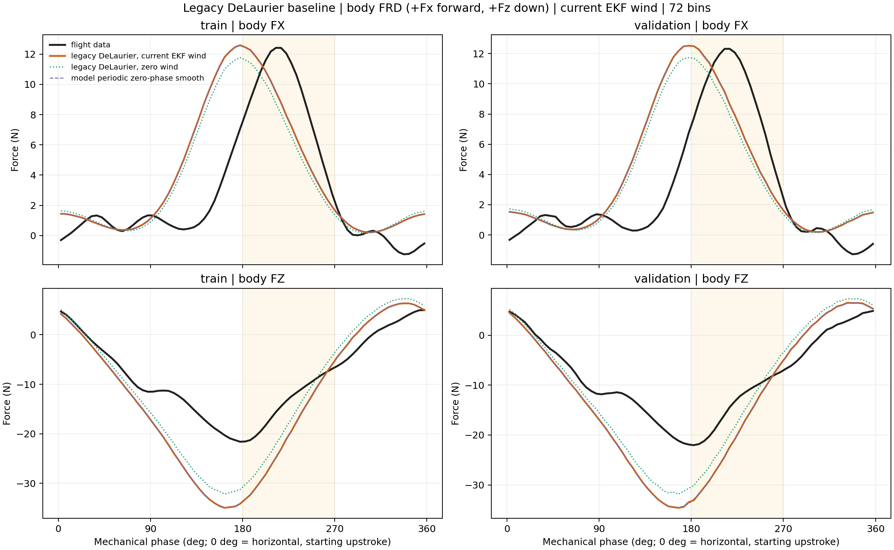
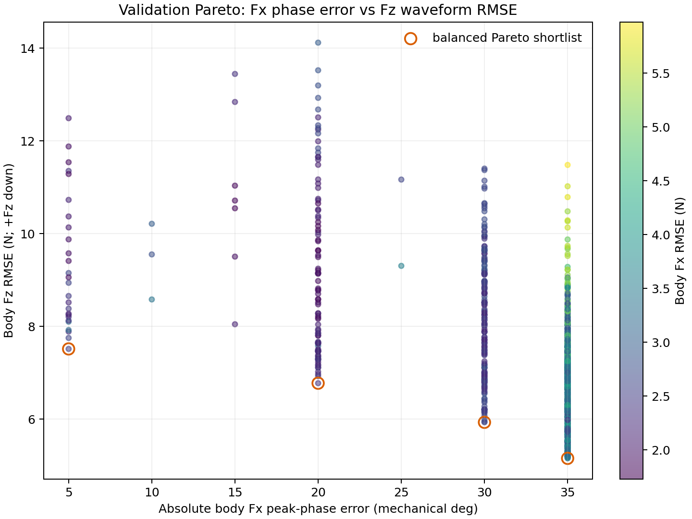
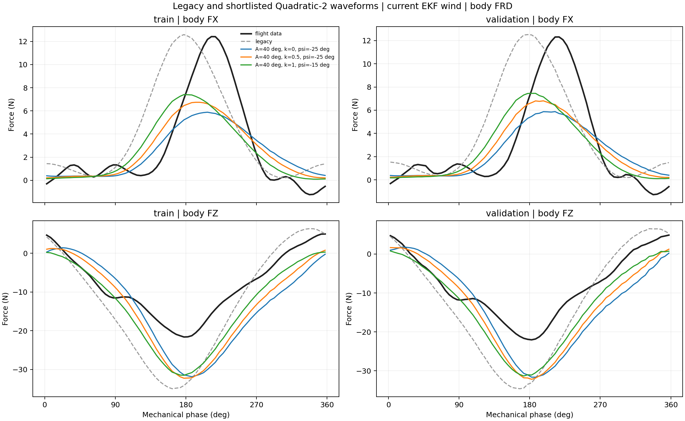
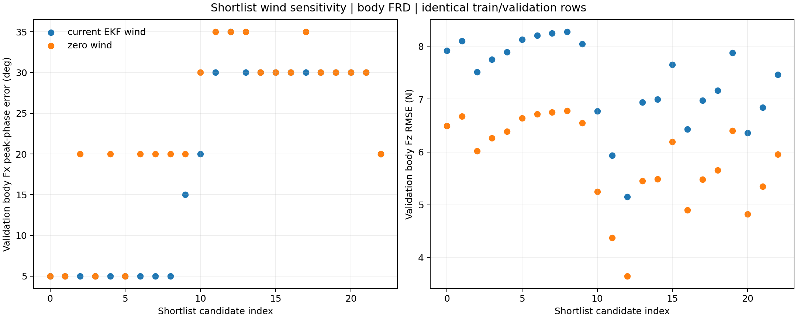

# Quadratic-2 spanwise dynamic-twist sweep v1

## Contract and scope

This train/validation-only experiment retains canonical body FRD: +Fx forward and +Fz down. `Fz minimum` is therefore the upward-lift extremum. Mechanical phase is the sole reported phase coordinate. Test remained sealed.

Baseline full-cycle Fx peak: train `177.5 deg`, validation `177.5 deg`. Data primary-window peak: train `212.5 deg`, validation `217.5 deg`.

## Direct answers

1. **kappa alone:** validation primary Fx peak range `182.5–182.5 deg` (span `0.0 deg`).
2. **A_tip alone:** validation range `182.5–182.5 deg` (span `0.0 deg`).
3. **psi_theta alone at baseline A_tip:** validation range `182.5–182.5 deg` (span `0.0 deg`).
4. **static offset alone:** validation range `182.5–182.5 deg` (span `0.0 deg`).
Because the registered baseline has `A_tip=0 deg`, the OAT kappa and psi_theta rows are structurally inactive; their zero OAT spans are not evidence that they remain insensitive once a nonzero dynamic twist amplitude is introduced.
5. **Most sensitive mechanism:** variable twist timing adds `30.0 deg` of best validation phase-error reduction relative to the best psi=0 candidate.
6. **Reachability:** best validation phase error is `5.0 deg`; within-one-bin reachability is `True`.
7. **Fz cost:** the best validation reachability candidate changes validation Fz RMSE from `7.562 N` to `7.513 N`, and its Fz-minimum amplitude error from `12.559 N` to `9.595 N`; physical gate passed=`True`.
8. **Train/validation consistency:** shortlist admission required non-worsening Fx phase direction on both partitions plus validation Fx/Fz waveform gates.
9. **Zero-wind check:** complete conclusion reversal is `False`. For the leading balanced candidate, validation Fx phase error changes from `5.0 deg` to `20.0 deg`.
10. **Prior decision:** conclusion `B`; no shortlist is promoted to the default model.
11. **Next structure:** conclusion B supports retaining Quadratic-2 plus independent twist phase as an experimental physical prior, not a default replacement. A spanwise phase gradient or passive-twist ODE is a robustness follow-up; circulation/LEV lag should be introduced only if the remaining waveform and wind sensitivity cannot be resolved after synchronization checks.

## Best candidates

Best train reachability candidate: `A_tip=40.00 deg`, `kappa=-1.000`, `psi_theta=-60.00 deg`, `static_offset=0.00 deg`; Fx phase error `0.0 deg`, Fx RMSE `2.177 N`, Fz RMSE `12.919 N`.

Best validation reachability candidate: `A_tip=40.00 deg`, `kappa=0.000`, `psi_theta=-25.00 deg`, `static_offset=0.00 deg`; Fx phase error `5.0 deg`, Fx RMSE `2.523 N`, Fz RMSE `7.513 N`.

## Final classification

**B. Spanwise distribution can help, but the dominant Fx phase correction comes from the independent twist-phase offset.**

## Key figures

Machine-readable metrics, full figures, compact resume logs, and manifests are under `outputs/analysis/quadratic2_twist_sweep_v1/`.
Compact committed manifests and shortlist summaries are under `docs/analysis/results/quadratic2_twist_sweep_v1/`.
