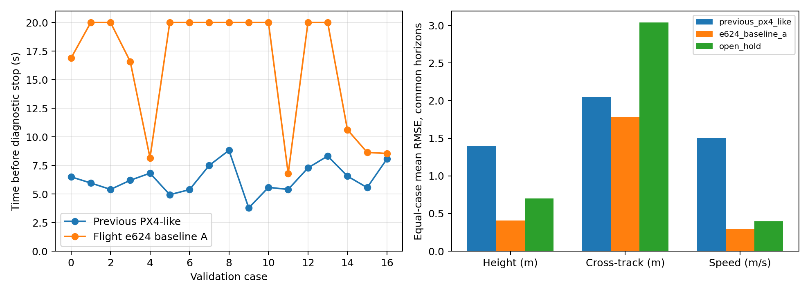

# 实飞控制链路对齐与直线闭环验证

采用 2026-09-18 第一架次的实际参数（`FLAP_SLOW_EN=0`），固件固定为 `e624a99f2955addbf76681e636c44162a0c03055`。本次没有重新训练模型、修改模型权重或调参。

## 实现

- 直接编译该提交的 TECS、DirectionalGuidance、AirspeedDirectionController、CourseToAirspeedRefMapper 及其数学/轨迹平滑依赖；算法源文件不改动。适配层只提供可控时钟、平台宏和未使用的 uORB 头文件，不运行 SITL。
- 外环使用日志内的 NPFG、TECS 参数及俯仰偏置：NPFG 周期 10 s，FW_PSP_OFF=15°，滚转限制 ±30°，俯仰限制 -5°..30°，油门 0.10..0.98，油门变化率 0.15/s。
- 姿态环保留欧拉角到机体系角速度变换、协调转弯项、前一周期偏航状态及角速度限幅。
- 三轴角速度环复用已验证的 e624 PID/前馈、空速低通和缩放、增益压缩、积分限幅。控制分配后的未实现力矩反馈到下一内环周期，阻止同方向积分累积，允许反向释放。
- 控制分配使用实飞效果矩阵的未归一化伪逆。左/右 elevon 为 `-0.90909*roll + 0.5*pitch` / `+0.90909*roll + 0.5*pitch`，rudder 为 yaw；随后裁剪。模型输入为 PWM 反向前的归一化指令，不重复应用 PWM REV。
- 通过显式 `--flight-chain` 开关接入现有 IsaacLab 实验入口，旧控制器仍保留。控制器输出不修改模型状态或动力学参数。

## 验证

21 项相关测试通过，覆盖饱和反馈、积分释放、姿态状态顺序、控制分配、坐标/动作传输、重复运行确定性及原有模型后端。

9 月 18 日第一架次 AUTO 片段姿态环回放 RMSE：roll 0.002987、pitch 0.003570、yaw 0.000115 rad/s（5265 个样本）。控制分配回放 RMSE：左舵 0.000761、右舵 0.000745、方向舵 0.000187；95% 绝对误差不超过 8.1e-8。日志异步采样存在离群误差，这不是整套飞控逐位等价证明。角速度环沿用之前验证过的算术实现；没有声称本轮完整重建所有实机滤波/积分历史。

## 同一批 17 个验证初始状态

| 指标 | 原 PX4-like | 实飞 e624 基线 A | 开环保持 |
|---|---:|---:|---:|
| 完成 20 s | 0 | 10 | 0 |
| 运行时长中位数 (s) | 6.20 | 20.00 | 6.90 |
| 各例饱和时间占比均值 | 80.6% | 7.8% | 0.0% |

保持原停止阈值：高度偏差 5 m、横向偏差 10 m、速度偏差 5 m/s、滚转 80°、俯仰 60°，最长 20 s。完成表示未触发这些诊断阈值，并不等于高精度跟踪。新闭环剩余 5 例横向超限、2 例高度超限。

下面按每个案例三种方法都存在的公共时间段计算 RMSE，再对 17 个案例等权平均；保留失败案例：

| 控制器 | 高度 RMSE (m) | 横向 RMSE (m) | 速度 RMSE (m/s) |
|---|---:|---:|---:|
| previous_px4_like | 1.395 | 2.049 | 1.504 |
| e624_baseline_a | 0.406 | 1.786 | 0.294 |
| open_hold | 0.699 | 3.038 | 0.395 |

开环保持的轨迹与原实验逐样本完全一致（最大状态差 0），确认模型、初始状态和开环输入没有发生变化。闭环改善不能单独归因于某一个环节：本轮同时恢复了实飞外环、内环、参数和分配/反馈。

## 边界

这是自主巡航直线任务的实飞基线 A，不是完整 PX4 系统移植。后两架次启用的 B2b 滚转积分转移尚未接入，传入该配置会明确报错；起降、任务切换、手动输入、自动整定和传感器故障流程也不在本次任务内。

仿真假设零风、海平面密度、有效导航（引导质量因子为 1），以水平地速代表校准空速；外环/姿态环 50 Hz，角速度/分配 400 Hz，后者在每个模型步内保持观测不变，使用最后一次内环输出驱动 50 Hz 模型。D 增益均为 0，不伪造高频陀螺微分。率积分从 0 初始化，空速滤波从初始速度初始化，TECS 按原生重置启动，未恢复实机完整控制器历史。

IsaacLab 实际运行 34 次，USD 位置读回误差为 0；代理模型负责全部动力学，场景用于呈现，不叠加 PhysX 飞行器。实验全部完成并写盘后，Isaac 应用关闭再次挂起，已单独终止进程；未将进程退出码当作实验成功依据。

这些是验证集上的模型内闭环结果，说明控制链路对齐后已有可用闭环案例；不能据此证明代理模型在实机上预测正确或控制器能直接迁移实飞。未打开封存测试集/9 月 19 日预留数据。

## 复现

项目 Python：`/home/zn/anaconda3/envs/flap-train-gpu/bin/python`。

1. `python scripts/build_px4_native_outer.py`
2. `python scripts/verify_flight_chain_alignment.py`
3. 激活 `env_isaaclab`，用其 Python 运行：`scripts/run_isaac_surrogate_straight.py --cases docs/analysis/results/isaac_straight_level_cases_v2 --output <新输出目录> --flight-chain --headless`
4. `python scripts/report_flight_chain_alignment.py`（读取本次冻结结果）。

源代码、参数、库、模型、数据和案例哈希见本目录 manifest、原生库构建 manifest 及 `../isaac_straight_flight_chain_v1/manifest.json`。详细结果保留每个日志/案例的指标与完整控制诊断。
