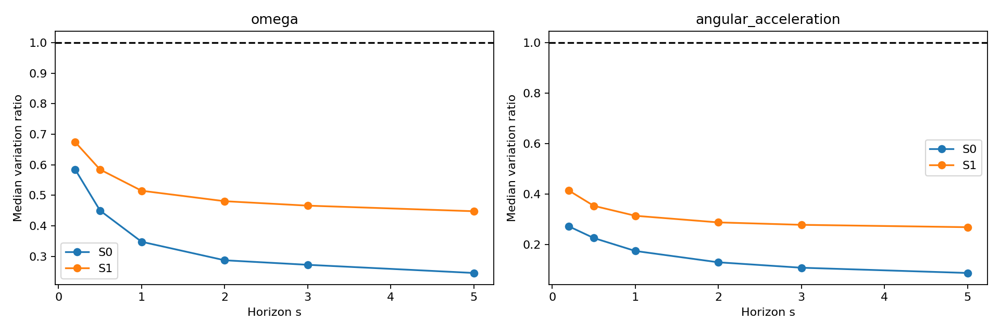
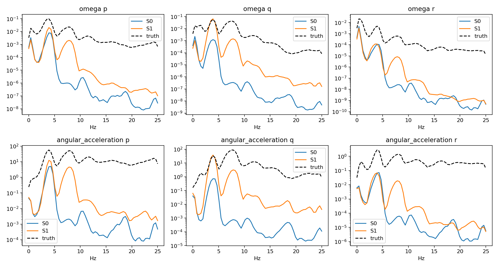
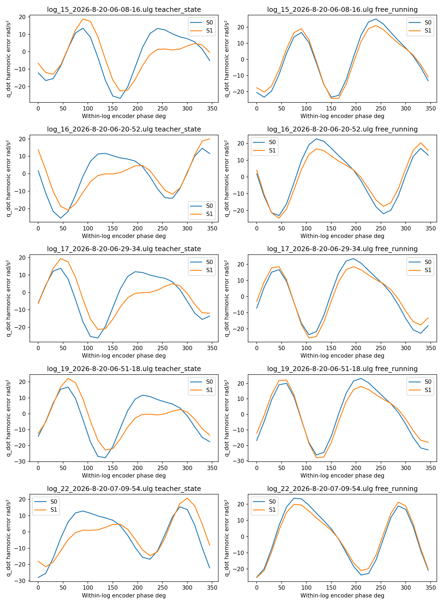

# Step 5 — State-Increment Supervision for Main V2

**结论 B：** P2局部有效，但长期free-running改善不足。

S1 的teacher-state Δv₂ RMSE降低 62.87%，Δω₂降低 8.18%；但5s velocity/attitude误差分别变化 +7.04% / +4.58%。5s body-rate variation由 0.246 到 0.448，末1s由 0.074 到 0.407。局部target更准确、持续角运动更强，与长期trajectory更准确是不同结论。

完整阅读Step 4报告及Step 2/3报告与CSV；inventory和historical hashes已记录。本轮不更改架构、phase、actuator constants、history、split或simulator，不打开sealed test。S0重新按A0合同训练，S1从相同seed独立重训；不是旧checkpoint微调。

## Target、normalization与实验预算

`Δv_pred=vhat[t+2]−vhat[t]`、`Δω_pred=ωhat[t+2]−ωhat[t]`；t为真实窗口起点，两个预测步来自原Main V2 forward，vhat[t]/ωhat[t]等于真实初始化。t+1之后没有teacher forcing，没有独立head，没有跳步推理。

每个原始4214 train window监督其起点两步；50步原loss继续完整free-running。与Step 3 A3的整段内部差分不同，此处明确从真实起点约束局部两步，同时加入velocity和omega，尺度由实际增量统计决定。未新增position increment或quaternion subtraction。

真实2step时长：{"count": 4214, "min": 0.02957, "max": 0.049907999999999994, "p1": 0.029938999999999997, "p99": 0.049904000000000004, "mean": 0.039958961319411485, "median": 0.039921}；50step时长：{"count": 4214, "min": 0.9880099999999999, "max": 1.0081399999999998, "p1": 0.98810213, "p99": 1.0080868699999999, "mean": 1.000021011627907, "median": 0.998039}。固定的是实现steps，积分读取每个原生dt。

| signal | train_rms_vector_increment | axis_rms | baseline_normalized_error | baseline_vector_increment_rmse | lambda_inc |
| --- | --- | --- | --- | --- | --- |
| velocity_n | 0.4323 | [0.12083129330841155, 0.12495323247163984, 0.39577148408189516] | 0.8687 | 0.4029 | 0.1646 |
| angular_velocity_b | 1.1953 | [0.9394217673710562, 0.7185339575380806, 0.1732978835331027] | 0.5517 | 0.8879 | 0.3672 |

单个向量一个RMS尺度，三轴等权；λ=冻结baseline对应50step state项 / 冻结baseline归一化increment error。没有根据validation反推权重，保留所有旧loss权重。原Main V2没有raw derivative loss，因此不存在可降低的raw-derivative权重。

| experiment | base_epochs | actuator_epochs | base_optimizer_steps | actuator_optimizer_steps | wall_time_s | base_windows_per_s | actuator_windows_per_s | peak_gpu_bytes | checkpoint_sha256 | device | old_checkpoint_max_parameter_difference |
| --- | --- | --- | --- | --- | --- | --- | --- | --- | --- | --- | --- |
| S0 | 40 | 25 | 680 | 425 | 1118.0452 | 280.3433 | 207.2094 | 144409088 | 0bc3f7bc1a72ff203cd32e6f2a14459b95f8c680afed7ca86e8f03e4a40cdf71 | cuda:1 | 0.0000 |
| S1 | 40 | 25 | 680 | 425 | 1111.3369 | 280.8672 | 209.2122 | 144403456 | a1de4f0476033fa3e27abd230c57abfbf14514387804d6f4d70b1f5c1c4da2f0 | cuda:1 | nan |

两阶段40+25epoch，base/actuator seed17/29，AdamW lr3e-4/5e-4，batch256，weight decay1e-5，gradient clip5。每组冻结自己训练的backbone，再训练actuator residual，固定最后epoch。S0最大参数差见training_summary。GPU并发墙钟受共享负载影响。

S2/S3条件判定（train-only，训练前记录规则）：
```json
{
  "train_only": true,
  "train_increment_mean_relative_improvement": 0.584873323849957,
  "final_median_gradient_ratio": 0.04343449315964375,
  "s2_triggered": false,
  "rule": "only if S1 final train incremental loss improvement <5% AND median weighted increment/original gradient norm <0.1; S2 uses exactly 4x S1 weights with all original terms retained",
  "s3_trained": false,
  "s3_reason": "optional follow-up omitted from bounded primary experiment"
}
```

S2仅在局部train改善<5%且increment/original梯度比<0.1时触发，λ只允许4倍，不删原约束；S3为可选后续，本轮有界矩阵不自动增加。初始梯度比小不等于最终被淹没，需查看final_gradient_probes与训练loss占比。

## Q1/Q2：完整Main V2是否复现局部优势？

用Step 4固定40,085个validation真实起点，warm26后自主运行两步。误差单位为Δv的m/s、Δω的rad/s，不是除duration后的acceleration。先每日志RMSE，再日志等权。

| experiment | signal | rmse | axis_0_rmse | axis_1_rmse | axis_2_rmse |
| --- | --- | --- | --- | --- | --- |
| S0 | omega | 0.6780 | 0.4577 | 0.4870 | 0.1136 |
| S0 | velocity | 0.3902 | 0.0954 | 0.0989 | 0.3652 |
| S1 | omega | 0.6225 | 0.4532 | 0.4112 | 0.1135 |
| S1 | velocity | 0.1449 | 0.0678 | 0.0686 | 0.1081 |

| experiment | signal | s0_rmse | candidate_rmse | change_pct | ci95_low | ci95_high | x_or_p_change_pct | y_or_q_change_pct | z_or_r_change_pct |
| --- | --- | --- | --- | --- | --- | --- | --- | --- | --- |
| S1 | velocity | 0.3902 | 0.1449 | -62.8706 | -63.3263 | -62.3250 | -28.9289 | -30.5872 | -70.4058 |
| S1 | omega | 0.6780 | 0.6225 | -8.1819 | -9.3084 | -7.4197 | -0.9921 | -15.5560 | -0.0960 |

本轮复现了局部优势的方向，但幅度不等同于Step 4 probe：velocity改善较大，angular改善较小且主要来自q。所有结果基于本轮重新训练的S0对照。

Gate1要求两个increment的paired-flight 95%CI均低于0；是否通过见晋级表。这只比较同一2step target，不能直接把Step 4 probe的不同训练样本/单导数输出20%作为本轮应达到的阈值。

## Q3：0.2–5秒free-running核心指标

所有模型固定722 origins、warm26、相同commands/实际dt、六个horizon，未来truth仅评分。完整mean/median/p90/p95/max与failure数量保存在各模型per_horizon/per_rollout/per_flight；失败但有限路径保留。

| experiment | horizon_s | position_m_equal_log_rmse | velocity_m_s_equal_log_rmse | attitude_deg_equal_log_rmse | body_rate_rad_s_equal_log_rmse | frequency_hz_equal_log_rmse | phase_rad_equal_log_rmse |
| --- | --- | --- | --- | --- | --- | --- | --- |
| S0 | 0.2000 | 0.0875 | 0.5038 | 3.2274 | 0.7074 | 0.1925 | 0.2262 |
| S0 | 0.5000 | 0.2038 | 0.6912 | 6.4270 | 0.7423 | 0.1870 | 0.3366 |
| S0 | 1.0000 | 0.5707 | 1.1559 | 10.5139 | 0.7495 | 0.1969 | 0.5899 |
| S0 | 2.0000 | 1.9358 | 2.0956 | 18.0142 | 0.7633 | 0.2024 | 0.9143 |
| S0 | 3.0000 | 4.2692 | 3.2490 | 27.1578 | 0.7742 | 0.2039 | 1.1810 |
| S0 | 5.0000 | 11.8073 | 5.0515 | 45.5318 | 0.7879 | 0.2016 | 1.6259 |
| S1 | 0.2000 | 0.0493 | 0.3259 | 3.2427 | 0.6706 | 0.1539 | 0.1818 |
| S1 | 0.5000 | 0.1728 | 0.6459 | 6.2751 | 0.7000 | 0.1653 | 0.3101 |
| S1 | 1.0000 | 0.5669 | 1.1396 | 10.4251 | 0.7152 | 0.1767 | 0.5769 |
| S1 | 2.0000 | 2.0303 | 2.2234 | 18.8427 | 0.7587 | 0.1902 | 0.9087 |
| S1 | 3.0000 | 4.5518 | 3.4816 | 28.8058 | 0.7844 | 0.2020 | 1.1740 |
| S1 | 5.0000 | 12.6345 | 5.4072 | 47.6193 | 0.8198 | 0.2150 | 1.6564 |

相对S0变化，负数为改善：

| experiment | horizon_s | position_m_change_pct | velocity_m_s_change_pct | attitude_deg_change_pct | body_rate_rad_s_change_pct | frequency_hz_change_pct | phase_rad_change_pct |
| --- | --- | --- | --- | --- | --- | --- | --- |
| S1 | 0.2000 | -43.7064 | -35.3229 | 0.4742 | -5.1974 | -20.0467 | -19.6142 |
| S1 | 0.5000 | -15.2093 | -6.5473 | -2.3646 | -5.6963 | -11.5969 | -7.8778 |
| S1 | 1.0000 | -0.6663 | -1.4041 | -0.8454 | -4.5756 | -10.2440 | -2.2141 |
| S1 | 2.0000 | 4.8795 | 6.1014 | 4.5994 | -0.6032 | -6.0495 | -0.6052 |
| S1 | 3.0000 | 6.6184 | 7.1600 | 6.0682 | 1.3262 | -0.9585 | -0.5914 |
| S1 | 5.0000 | 7.0060 | 7.0415 | 4.5847 | 4.0579 | 6.6137 | 1.8756 |

长期paired-flight置信区间：

| experiment | horizon_s | metric | change_pct | ci95_low | ci95_high | improved_flights |
| --- | --- | --- | --- | --- | --- | --- |
| S1 | 2.0000 | velocity_m_s | 6.1014 | 4.9885 | 7.5773 | 0 |
| S1 | 2.0000 | attitude_deg | 4.5994 | 2.5449 | 6.0570 | 0 |
| S1 | 3.0000 | velocity_m_s | 7.1600 | 5.7647 | 8.1958 | 0 |
| S1 | 3.0000 | attitude_deg | 6.0682 | 3.7373 | 7.7587 | 0 |
| S1 | 5.0000 | velocity_m_s | 7.0415 | 4.5916 | 10.3380 | 0 |
| S1 | 5.0000 | attitude_deg | 4.5847 | 2.1593 | 7.4453 | 0 |

候选在五条flight的2/3/5s velocity与attitude均未改善（每项improved_flights=0）；长期退化不是被单个最差flight拉高的平均值。

五flight的3125种cluster bootstrap，不把重叠722起点视为独立样本；单seed政策，不宣称跨seed显著或在新控制策略下泛化。

free-running滑动两步增量（每个prefix内全部成对预测状态差），与teacher-state分开：

| experiment | horizon_s | signal | rmse |
| --- | --- | --- | --- |
| S0 | 0.2000 | omega | 0.8800 |
| S0 | 0.2000 | velocity | 0.3832 |
| S0 | 0.5000 | omega | 0.8801 |
| S0 | 0.5000 | velocity | 0.3976 |
| S0 | 1.0000 | omega | 0.8914 |
| S0 | 1.0000 | velocity | 0.4040 |
| S0 | 2.0000 | omega | 0.8980 |
| S0 | 2.0000 | velocity | 0.4083 |
| S0 | 3.0000 | omega | 0.8999 |
| S0 | 3.0000 | velocity | 0.4097 |
| S0 | 5.0000 | omega | 0.9004 |
| S0 | 5.0000 | velocity | 0.4109 |
| S1 | 0.2000 | omega | 0.7883 |
| S1 | 0.2000 | velocity | 0.1536 |
| S1 | 0.5000 | omega | 0.8096 |
| S1 | 0.5000 | velocity | 0.1671 |
| S1 | 1.0000 | omega | 0.8338 |
| S1 | 1.0000 | velocity | 0.2024 |
| S1 | 2.0000 | omega | 0.8631 |
| S1 | 2.0000 | velocity | 0.2672 |
| S1 | 3.0000 | omega | 0.8788 |
| S1 | 3.0000 | velocity | 0.3099 |
| S1 | 5.0000 | omega | 0.8999 |
| S1 | 5.0000 | velocity | 0.3788 |

## Q4：变化幅度是否恢复？

| experiment | horizon_s | signal | median | p10 | p90 |
| --- | --- | --- | --- | --- | --- |
| S0 | 0.2000 | omega | 0.5846 | 0.3360 | 0.8791 |
| S0 | 0.5000 | omega | 0.4500 | 0.2655 | 0.7001 |
| S0 | 1.0000 | omega | 0.3480 | 0.2166 | 0.5687 |
| S0 | 2.0000 | omega | 0.2874 | 0.1974 | 0.4500 |
| S0 | 3.0000 | omega | 0.2726 | 0.1888 | 0.4033 |
| S0 | 5.0000 | omega | 0.2458 | 0.1718 | 0.3606 |
| S0 | 5.0000 | omega_last1s | 0.0741 | 0.0542 | 0.1136 |
| S1 | 0.2000 | omega | 0.6742 | 0.4623 | 0.9499 |
| S1 | 0.5000 | omega | 0.5844 | 0.4387 | 0.7829 |
| S1 | 1.0000 | omega | 0.5150 | 0.3712 | 0.6983 |
| S1 | 2.0000 | omega | 0.4808 | 0.3283 | 0.6386 |
| S1 | 3.0000 | omega | 0.4662 | 0.3258 | 0.6018 |
| S1 | 5.0000 | omega | 0.4479 | 0.3223 | 0.5750 |
| S1 | 5.0000 | omega_last1s | 0.4072 | 0.2593 | 0.5312 |
| S0 | 0.2000 | angular_acceleration | 0.2718 | 0.1412 | 0.4397 |
| S0 | 0.5000 | angular_acceleration | 0.2257 | 0.1194 | 0.3745 |
| S0 | 1.0000 | angular_acceleration | 0.1744 | 0.0895 | 0.3028 |
| S0 | 2.0000 | angular_acceleration | 0.1295 | 0.0712 | 0.2308 |
| S0 | 3.0000 | angular_acceleration | 0.1081 | 0.0627 | 0.1937 |
| S0 | 5.0000 | angular_acceleration | 0.0873 | 0.0539 | 0.1542 |
| S0 | 5.0000 | angular_acceleration_last1s | 0.0337 | 0.0250 | 0.0555 |
| S1 | 0.2000 | angular_acceleration | 0.4136 | 0.2760 | 0.6271 |
| S1 | 0.5000 | angular_acceleration | 0.3532 | 0.2528 | 0.4839 |
| S1 | 1.0000 | angular_acceleration | 0.3139 | 0.2128 | 0.4298 |
| S1 | 2.0000 | angular_acceleration | 0.2876 | 0.1832 | 0.3980 |
| S1 | 3.0000 | angular_acceleration | 0.2781 | 0.1779 | 0.3744 |
| S1 | 5.0000 | angular_acceleration | 0.2687 | 0.1747 | 0.3491 |
| S1 | 5.0000 | angular_acceleration_last1s | 0.2432 | 0.1384 | 0.3199 |



prefix包含初始状态；last1s为最后51个状态/50个导数。比值接近1不是充分条件，不能把只是增加抖动当作恢复。

## Q5：周期动态还是高频噪声？

| experiment | signal | axis | relative_spectral_l1 | high_frequency_ratio |
| --- | --- | --- | --- | --- |
| S0 | angular_acceleration | p | 0.9846 | 0.0001 |
| S0 | angular_acceleration | q | 0.9967 | 0.0001 |
| S0 | angular_acceleration | r | 0.9926 | 0.0000 |
| S0 | omega | p | 0.9560 | 0.0001 |
| S0 | omega | q | 0.9864 | 0.0000 |
| S0 | omega | r | 0.9236 | 0.0000 |
| S1 | angular_acceleration | p | 0.9449 | 0.0004 |
| S1 | angular_acceleration | q | 0.8715 | 0.0030 |
| S1 | angular_acceleration | r | 0.9900 | 0.0001 |
| S1 | omega | p | 0.8974 | 0.0005 |
| S1 | omega | q | 0.7164 | 0.0023 |
| S1 | omega | r | 0.9441 | 0.0001 |

证据支持恢复了部分**记录中的phase同步成分**，并非只有无关高频振幅增加。teacher-state q_dot harmonic RMSE从 12.873 到 11.162 rad/s²；free-running从 15.795 到 14.618。但free-running谱形和autocorrelation仍未匹配truth，不能声称完整恢复真实物理动力学，也不能将已记录的高频全部判为噪声。





高频边界13.122682Hz来自Step 3冻结train omega谱95%累计功率；不是人为把5Hz外都当噪声。PSD和autocorrelation保持原生时间重采样诊断，不作为训练或simulator输入。

raw/filtered teacher-state导数误差：

| experiment | target | signal | rmse |
| --- | --- | --- | --- |
| S0 | D0_raw | angular | 25.8820 |
| S0 | D0_raw | linear | 10.4081 |
| S0 | D1_lp12 | angular | 16.0079 |
| S0 | D1_lp12 | linear | 9.8787 |
| S0 | D1_lp6 | angular | 9.5210 |
| S0 | D1_lp6 | linear | 9.3916 |
| S0 | D1_lp8 | angular | 11.5367 |
| S0 | D1_lp8 | linear | 9.6951 |
| S1 | D0_raw | angular | 24.7642 |
| S1 | D0_raw | linear | 4.2637 |
| S1 | D1_lp12 | angular | 15.8259 |
| S1 | D1_lp12 | linear | 3.5595 |
| S1 | D1_lp6 | angular | 14.4289 |
| S1 | D1_lp6 | linear | 2.7651 |
| S1 | D1_lp8 | angular | 13.5064 |
| S1 | D1_lp8 | linear | 3.0576 |

D1沿用Step 4：状态插值到50Hz网格，4阶Butterworth、6/8/12Hz cutoff、sosfiltfilt零相位双向过滤，再插回原生时间求差分。**仅用于离线target diagnosis**；没有进入loss或simulator输入。

teacher-state q_dot幅值（rad/s²；各log统计后等权）：

| experiment | source | mean | std | rms |
| --- | --- | --- | --- | --- |
| S0 | D0_raw | 0.0079 | 18.9278 | 18.9278 |
| S0 | D1_lp12 | -0.0059 | 14.7936 | 14.7936 |
| S0 | D1_lp6 | -0.0025 | 6.6919 | 6.6919 |
| S0 | D1_lp8 | -0.0047 | 10.6793 | 10.6793 |
| S0 | prediction | -1.9846 | 7.5807 | 7.8436 |
| S1 | D0_raw | 0.0079 | 18.9278 | 18.9278 |
| S1 | D1_lp12 | -0.0059 | 14.7936 | 14.7936 |
| S1 | D1_lp6 | -0.0025 | 6.6919 | 6.6919 |
| S1 | D1_lp8 | -0.0047 | 10.6793 | 10.6793 |
| S1 | prediction | -1.6215 | 13.8783 | 13.9761 |

phase-conditioned component使用每log现有坐标独立描述，不拟合validation offset、不改变模型phase：

| experiment | mode | signal | harmonic_rmse | pred_harmonic_std | truth_harmonic_std | shape_correlation |
| --- | --- | --- | --- | --- | --- | --- |
| S0 | free_running | ax_n | 0.3903 | 0.0272 | 0.3645 | 0.1086 |
| S0 | free_running | ay_n | 0.2262 | 0.0168 | 0.2047 | 0.2038 |
| S0 | free_running | az_n | 9.4278 | 0.1337 | 9.5473 | 0.9446 |
| S0 | free_running | p_dot | 12.4765 | 0.8125 | 12.8749 | 0.5100 |
| S0 | free_running | q_dot | 15.7948 | 0.2099 | 15.8637 | 0.3431 |
| S0 | free_running | r_dot | 2.1338 | 0.0845 | 2.1409 | 0.1051 |
| S0 | teacher_state | ax_n | 0.3344 | 0.0324 | 0.3263 | 0.0969 |
| S0 | teacher_state | ay_n | 0.2212 | 0.0326 | 0.1895 | -0.0118 |
| S0 | teacher_state | az_n | 9.1098 | 1.9465 | 9.5873 | 0.3958 |
| S0 | teacher_state | p_dot | 9.0272 | 5.2348 | 12.8890 | 0.8412 |
| S0 | teacher_state | q_dot | 12.8733 | 6.3437 | 15.8994 | 0.6520 |
| S0 | teacher_state | r_dot | 2.0350 | 0.3780 | 2.1663 | 0.5788 |
| S1 | free_running | ax_n | 0.3004 | 0.1346 | 0.3645 | 0.8364 |
| S1 | free_running | ay_n | 0.2481 | 0.0845 | 0.2047 | 0.2889 |
| S1 | free_running | az_n | 5.1726 | 4.5819 | 9.5473 | 0.9774 |
| S1 | free_running | p_dot | 12.0959 | 1.4043 | 12.8749 | 0.5966 |
| S1 | free_running | q_dot | 14.6184 | 3.3929 | 15.8637 | 0.4674 |
| S1 | free_running | r_dot | 2.1276 | 0.0933 | 2.1409 | 0.1784 |
| S1 | teacher_state | ax_n | 0.2057 | 0.2389 | 0.3263 | 0.9074 |
| S1 | teacher_state | ay_n | 0.2071 | 0.1247 | 0.1895 | 0.5462 |
| S1 | teacher_state | az_n | 1.9526 | 9.2707 | 9.5873 | 0.9806 |
| S1 | teacher_state | p_dot | 8.3711 | 7.6448 | 12.8890 | 0.8096 |
| S1 | teacher_state | q_dot | 11.1623 | 12.5648 | 15.8994 | 0.7269 |
| S1 | teacher_state | r_dot | 2.0083 | 0.4091 | 2.1663 | 0.7460 |

这些是记录动态的同步描述，不证明全部高频为真实刚体运动。噪声guard同时检查omega spectral L1、free-running increment RMSE与angular acceleration RMSE。autocorrelation.csv保留全部对照。

## Q6：q/q_dot及pitch通道

| experiment | horizon_s | p_rmse | q_rmse | r_rmse | delta_p2_rmse | delta_q2_rmse | delta_r2_rmse | q_dot_rmse | pitch_axis_so3_error_deg |
| --- | --- | --- | --- | --- | --- | --- | --- | --- | --- |
| S0 | 0.2000 | 0.4701 | 0.4890 | 0.1982 | 0.6077 | 0.6242 | 0.1231 | 18.5595 | 2.2848 |
| S0 | 0.5000 | 0.5155 | 0.4953 | 0.1962 | 0.6013 | 0.6304 | 0.1238 | 18.7651 | 4.1059 |
| S0 | 1.0000 | 0.5250 | 0.4876 | 0.2154 | 0.6155 | 0.6325 | 0.1234 | 18.8223 | 6.2616 |
| S0 | 2.0000 | 0.5311 | 0.4875 | 0.2466 | 0.6229 | 0.6349 | 0.1225 | 18.8714 | 7.4893 |
| S0 | 3.0000 | 0.5431 | 0.4853 | 0.2586 | 0.6256 | 0.6350 | 0.1220 | 18.8667 | 7.8115 |
| S0 | 5.0000 | 0.5475 | 0.4996 | 0.2637 | 0.6267 | 0.6347 | 0.1213 | 18.8402 | 7.3953 |
| S1 | 0.2000 | 0.4818 | 0.4274 | 0.1843 | 0.5833 | 0.5164 | 0.1188 | 16.0644 | 2.2782 |
| S1 | 0.5000 | 0.5093 | 0.4359 | 0.1955 | 0.5885 | 0.5423 | 0.1212 | 16.6507 | 3.7538 |
| S1 | 1.0000 | 0.5106 | 0.4493 | 0.2186 | 0.6032 | 0.5625 | 0.1216 | 17.1342 | 5.6379 |
| S1 | 2.0000 | 0.5287 | 0.4803 | 0.2541 | 0.6141 | 0.5939 | 0.1216 | 17.8743 | 7.6773 |
| S1 | 3.0000 | 0.5466 | 0.4933 | 0.2672 | 0.6209 | 0.6096 | 0.1217 | 18.2408 | 8.7399 |
| S1 | 5.0000 | 0.5628 | 0.5336 | 0.2624 | 0.6291 | 0.6317 | 0.1214 | 18.7351 | 8.5182 |

teacher-state Δq₂变化 -15.56%，而Δp₂/Δr₂为 -0.99% / -0.10%，角增量收益主要集中在q。5s q endpoint RMSE变化 +6.82%，pitch-axis姿态误差变化 +15.18%。局部q增量与长期pitch drift必须独立判断。

p/q/r与Δp/Δq/Δr均完整保留；pitch是Log(Rtruthᵀ Rpred)的body-y分量RMSE（deg），不是quaternion分量减法，也不是近奇异Euler pitch直接相减。angular_acceleration的单轴结果见axis_summary.csv。

## Q7：高控制区是否改善？

| experiment | variable | horizon_s | n_rollouts | velocity_m_s_change_pct | attitude_deg_change_pct | body_rate_rad_s_change_pct |
| --- | --- | --- | --- | --- | --- | --- |
| S1 | motor_command | 0.5000 | 86 | -6.8701 | -1.5133 | -11.0484 |
| S1 | motor_command | 2.0000 | 86 | 7.9319 | 3.5033 | -0.5744 |
| S1 | motor_command | 3.0000 | 86 | 3.2613 | 3.4698 | -2.1809 |
| S1 | motor_command | 5.0000 | 86 | 2.4107 | 0.2407 | 2.0174 |
| S1 | tail_command_magnitude | 0.5000 | 220 | -7.5462 | 1.6185 | -5.8061 |
| S1 | tail_command_magnitude | 2.0000 | 220 | 5.9434 | 6.0454 | -0.5316 |
| S1 | tail_command_magnitude | 3.0000 | 220 | 6.1444 | 6.5319 | -0.1027 |
| S1 | tail_command_magnitude | 5.0000 | 220 | 5.7941 | 4.5393 | 5.1936 |
| S1 | command_variation | 0.5000 | 241 | -7.3215 | -0.9731 | -8.0358 |
| S1 | command_variation | 2.0000 | 241 | 6.2556 | 4.9642 | -1.3674 |
| S1 | command_variation | 3.0000 | 241 | 6.9008 | 7.0056 | 0.4981 |
| S1 | command_variation | 5.0000 | 241 | 6.8018 | 5.8177 | 2.9984 |

高motor、tail及command-variation桶在0.5s有velocity收益，但2/3/5s的velocity与attitude均退化。此次没有证据说明P2解决了高控制区的长期精度问题。

motor/tail bins沿用Step 2 train边界；command variation沿用原722 command tapes总变差三分位。future commands只用于离线分桶。各桶flight构成不同，不据此作控制因果结论。

## Q8：晋级判定

| experiment | gate1_local_increment | gate2_long_velocity_or_attitude | gate3_variation | gate4_short_accuracy | gate5_frequency | gate6_failures | noise_guard | result |
| --- | --- | --- | --- | --- | --- | --- | --- | --- |
| S1 | True | False | True | True | True | True | True | B |

操作性保守规则：Gate2要求velocity或attitude在2/3/5秒均改善且至少两个CI低于0；Gate3要求prefix5及last1s variation均更接近1；Gate4短期velocity/attitude/body-rate退化均<10%；Gate5 frequency退化<10%；Gate6三类failure均不增加。10%为沿用的审查警戒线，不是物理安全阈值；support来源于训练支持域，包含raw derivative噪声影响，不是适航包线。

| experiment | numeric_failures | support_failures | clipping_failures |
| --- | --- | --- | --- |
| S0 | 0 | 255 | 0 |
| S1 | 0 | 40 | 0 |

选择用于主结论的候选：S1，按2/3/5秒velocity/attitude日志等权RMSE几何比排序，不等于自动晋级。下一步第一优先P1 phase-reference方案，必须保留/解决跨log unknown zero，不能直接沿用已退化的phase替换。第二优先transition representation调查。本轮没有证明phase是长期漂移的单一原因；不继续增大increment权重、不将S1晋级为最终simulator。

Simulator structural readiness: 100%

Dynamics fidelity readiness: 60%

RL-ready: NO

保留既有评分，本轮不因局部指标提高而追加readiness；未做反事实动作验证或sealed test。

## 一条完整复现命令

```bash
/home/zn/anaconda3/envs/flap-train-gpu/bin/python scripts/run_main_v2_increment.py \
  --results /tmp/main-v2-increment/results --artifacts /tmp/main-v2-increment/models --device cuda:1
```

使用空目录；自动train-only校准、预检、S0/S1、条件S2、冻结benchmark、增量/频谱/phase诊断、报告、pytest和git diff检查。旧checkpoint与Step1–4结果hash会再次核对。