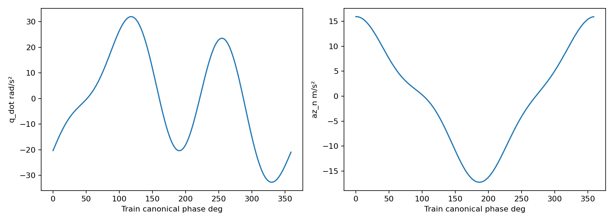
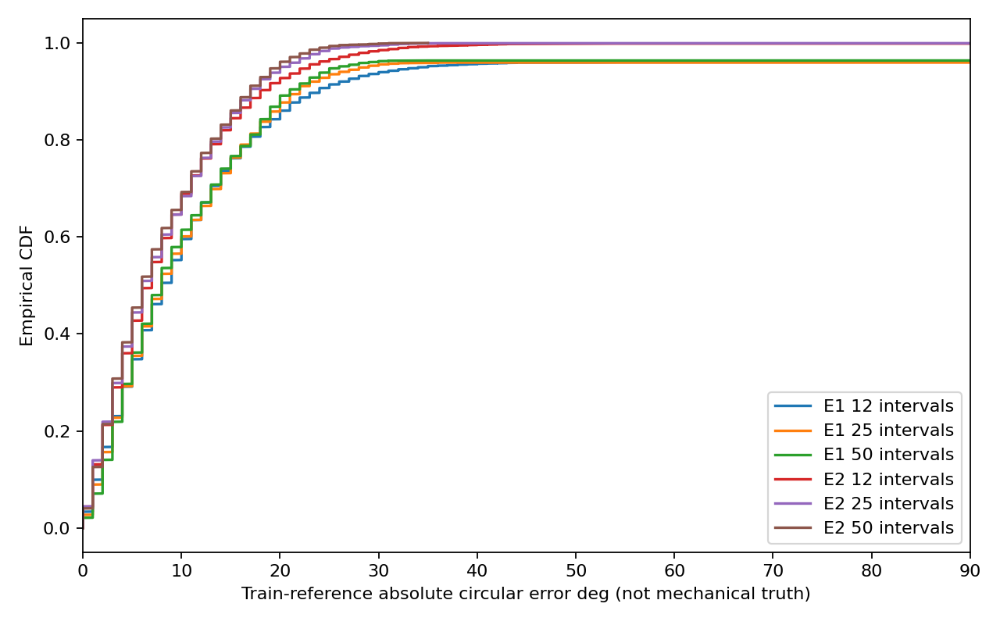
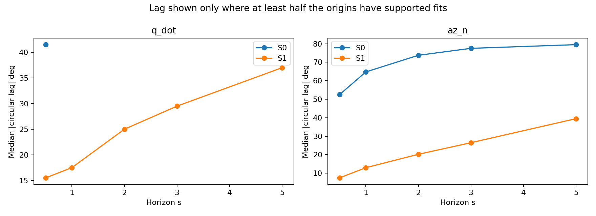
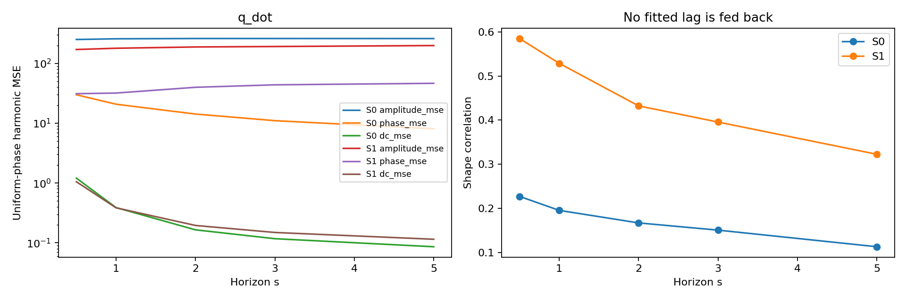
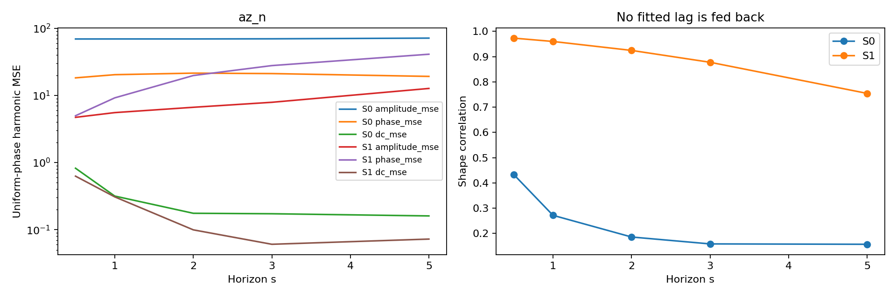
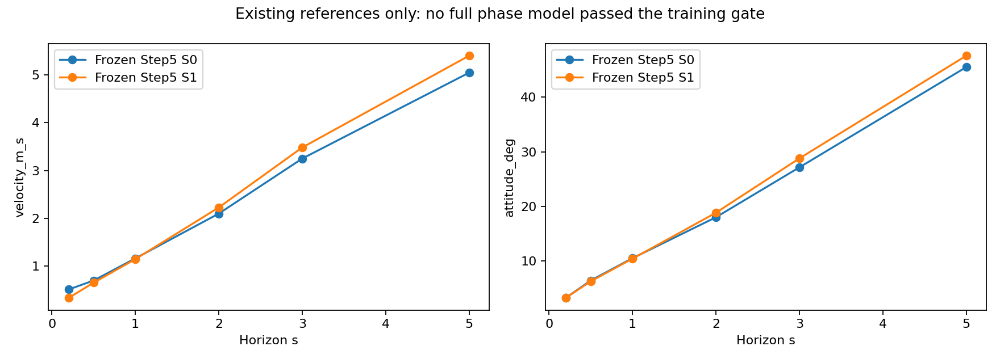

# Step 6 — Deployable Phase Reference under Unknown Cross-Log Mechanical Zero

**结论 C（范围受限）：当前constant cross-log offset路线没有显示足够新增预测收益，按预先定义的probe gate停止完整模型训练。** 这不是“已经测得完整Main V2 oracle的5s结果无效”，也不证明所有phase问题都无关；本轮没有训练F1/F2/F_oracle。

past-only E2确实能显著改善训练模板在validation的相位条件一致性，但合法26点history probe已间接利用了大部分相关信息。额外给出oracle reference后，2step Δω只有约0.32%改善、Δv约2.34%；不足以支持再训练完整Main V2。架构、actuator constants、旧checkpoint、Step1–5结果及train/validation split均保持不变。

## 边界、命名与可复现合同

P0=每window φ−φt0；P1=raw within-log φ；P2=φ+past-only估计offset；P_oracle=φ+full-log truth alignment offset，**ORACLE / NOT DEPLOYABLE**。P2在本轮是phase contract，勿与Step5的P2 state-increment优先级混淆。

canonical gauge固定为第一个排序training log的统计相位参考，使用train前70%减2s purge拟合3阶harmonic模板。没有可信机械trigger，所以“oracle”也是针对该统计模板的整日志最佳常数对齐，不是实测机械真值，更不是数学上保证优于所有因果模型的性能上界。validation oracle文件与deployable选择明确隔离。

先冻结train模板、E1/E2和12/25/50步history选择，再生成单独oracle文件，再训练probe。E1仅用past body-rate q backward差分；E2加past navigation velocity z backward差分，az_n不是IMU specific force。v_NED是已有可观测state；仍需真实系统导航链的延迟/带宽验证，不能把数据对齐后的50Hz直接当独立高频加速度传感器。

backward difference只使用[t−1,t]，无中心差分、无zero-phase filter。模板使用区间harmonic平均，即sin/cos中点乘sinc(kΔφ/2)，在线性区间phase假设下显式处理差分区间时移与幅频响应。匹配DC和非负gain只用当前history，权重为train variance倒数，角度网格1°，没有validation调参。

## Q1：oracle上限改善多少？

| contract | trained_target | evaluation_target | signal | baseline_rmse | candidate_rmse | change_pct | ci95_low | ci95_high | improved_flights | oracle_not_deployable |
| --- | --- | --- | --- | --- | --- | --- | --- | --- | --- | --- |
| P1 | increment2 | increment2_state | angular | 0.5762 | 0.5862 | 1.7450 | 0.5106 | 2.9603 | 0 | False |
| P2 | increment2 | increment2_state | angular | 0.5762 | 0.5702 | -1.0388 | -2.1972 | -0.0252 | 4 | False |
| P_oracle | increment2 | increment2_state | angular | 0.5762 | 0.5743 | -0.3178 | -1.3731 | 0.7206 | 3 | True |
| P1 | increment2 | increment2_state | linear | 0.1567 | 0.1605 | 2.4325 | 1.2573 | 3.4076 | 0 | False |
| P2 | increment2 | increment2_state | linear | 0.1567 | 0.1538 | -1.8176 | -2.9684 | -0.7626 | 5 | False |
| P_oracle | increment2 | increment2_state | linear | 0.1567 | 0.1530 | -2.3418 | -3.8661 | -0.9908 | 5 | True |

单位：increment2_state为真实native两步duration乘probe平均导数后的Δv(m/s)/Δω(rad/s)。所有contract训练相同420→64→64→6 MLP、30epoch、AdamW 0.001、batch512、seeds415/416/417，fit第一70%各train log、purge2s、stride2；固定原始target normalization。分别训练raw与2step-average target，共24个小诊断模型，不是24个Main V2模型。

95%CI对五条flight做cluster bootstrap，先平均配对seeds；每seed变化另存probe_seed_changes.csv，不能把重叠起点当独立样本。raw target下oracle三维角导数反而变差，完整数字如下：

| contract | trained_target | evaluation_target | signal | baseline_rmse | candidate_rmse | change_pct | ci95_low | ci95_high | improved_flights | oracle_not_deployable |
| --- | --- | --- | --- | --- | --- | --- | --- | --- | --- | --- |
| P1 | D0_raw | D0_raw | angular | 23.1293 | 23.8010 | 2.9038 | 0.8220 | 4.8117 | 1 | False |
| P2 | D0_raw | D0_raw | angular | 23.1293 | 24.2912 | 5.0234 | 3.1977 | 6.6928 | 0 | False |
| P_oracle | D0_raw | D0_raw | angular | 23.1293 | 24.0880 | 4.1450 | 2.3261 | 5.6932 | 0 | True |
| P1 | D0_raw | D0_raw | az_n | 2.3691 | 2.4268 | 2.4380 | 0.6729 | 4.2471 | 1 | False |
| P2 | D0_raw | D0_raw | az_n | 2.3691 | 2.1664 | -8.5534 | -9.6407 | -7.1474 | 5 | False |
| P_oracle | D0_raw | D0_raw | az_n | 2.3691 | 2.1353 | -9.8687 | -11.5603 | -8.1204 | 5 | True |
| P1 | D0_raw | D0_raw | linear | 4.3952 | 4.4544 | 1.3463 | 0.1874 | 2.4346 | 1 | False |
| P2 | D0_raw | D0_raw | linear | 4.3952 | 4.3141 | -1.8448 | -2.8991 | -0.6837 | 4 | False |
| P_oracle | D0_raw | D0_raw | linear | 4.3952 | 4.2720 | -2.8038 | -4.2386 | -1.5895 | 5 | True |
| P1 | D0_raw | D0_raw | q_dot | 9.1195 | 9.3196 | 2.1936 | -1.2747 | 4.6347 | 1 | False |
| P2 | D0_raw | D0_raw | q_dot | 9.1195 | 8.6402 | -5.2557 | -6.9118 | -3.8197 | 5 | False |
| P_oracle | D0_raw | D0_raw | q_dot | 9.1195 | 8.8483 | -2.9742 | -4.5032 | -1.2957 | 5 | True |

完整simulator oracle上限：**NOT RUN**。您的条件“P_oracle≈P0则停止”已触发，不为填表而继续完整训练。phase_oracle_upper_bound.csv明确标记LOCAL_PROBE_ONLY。

## Q2：仅past history能否恢复canonical phase？

对于训练定义的统计参考：有较强证据；对于绝对mechanical zero：本数据不能验证。固定模板用φ(t0)、f(t0)及native dt预测下一间隔，不使用future encoder phase；下表validation没有拟合gain、DC、权重或offset（oracle列除外且不可部署）。

| contract | signal | rmse | r2 |
| --- | --- | --- | --- |
| P0 | az_n | 17.9363 | -2.2351 |
| P0 | q_dot | 23.1588 | -0.4976 |
| P1 | az_n | 16.9164 | -1.9376 |
| P1 | q_dot | 27.9506 | -1.1894 |
| P2 | az_n | 2.5180 | 0.9362 |
| P2 | q_dot | 11.2384 | 0.6470 |
| P_oracle | az_n | 2.5880 | 0.9326 |
| P_oracle | q_dot | 12.0347 | 0.5951 |

P2的az/q_dot模板R²约0.936/0.647，但这不能直接推导完整recurrent simulator也会改善。局部窗口估计可适应部分非平稳记录相位，因此P2有时优于常数oracle；不能将它解释为发现了真正机械零点。



## Q3：需要多少history / cycles？

| method | history_steps | n | cycles_median | duration_mean_s | p50_offset_error_deg | p75_offset_error_deg | p90_offset_error_deg | p95_offset_error_deg |
| --- | --- | --- | --- | --- | --- | --- | --- | --- |
| E1 | 12 | 12168 | 0.8536 | 0.2400 | 8.0000 | 15.0000 | 24.0000 | 35.0000 |
| E1 | 25 | 12168 | 1.7805 | 0.5000 | 8.0000 | 15.0000 | 22.0000 | 29.0000 |
| E1 | 50 | 12168 | 3.5623 | 1.0000 | 8.0000 | 15.0000 | 21.0000 | 26.0000 |
| E2 | 12 | 12168 | 0.8536 | 0.2400 | 7.0000 | 12.0000 | 18.0000 | 23.0000 |
| E2 | 25 | 12168 | 1.7805 | 0.5000 | 6.0000 | 12.0000 | 17.0000 | 20.0000 |
| E2 | 50 | 12168 | 3.5623 | 1.0000 | 6.0000 | 12.0000 | 17.0000 | 20.0000 |

匹配同12,168个train temporal holdout起点后，E2的0.5s与1s在1°网格下几乎并列：median≈6°、p90≈17°、p95≈20°；没有证据称1s必需。脚本按预声明median+p90选中了1s，微小浮点差及原始eligible cohort差异不是1s显著更好的证据。E1尾部更差。validation没有absolute offset error。

低于一个周期的训练子集（样本很少的桶不能泛化）：

| split | method | history_steps | cycle_bin | n | duration_mean_s | cycles_median | offset_abs_error_p50 | offset_abs_error_p75 | offset_abs_error_p90 | offset_abs_error_p95 |
| --- | --- | --- | --- | --- | --- | --- | --- | --- | --- | --- |
| train | E1 | 12 | less_than_one_cycle | 11898 | 0.2399 | 0.8503 | 0.1571 | 0.2618 | 0.4189 | 0.6109 |
| train | E1 | 25 | less_than_one_cycle | 41 | 0.4990 | 0.8973 | 2.5482 | 2.7751 | 2.8274 | 2.8274 |
| train | E2 | 12 | less_than_one_cycle | 11898 | 0.2399 | 0.8503 | 0.1222 | 0.2094 | 0.3142 | 0.4014 |
| train | E2 | 25 | less_than_one_cycle | 41 | 0.4990 | 0.8973 | 0.5411 | 0.6109 | 2.4784 | 2.6704 |



选择的E2/50在validation逐点重估的45°以上jump率为0；这只是日志上的稳定性诊断，不采用逐点更新驱动simulator。实际合同是episode reset估一次并固定，history不足时使用可用past并显式记录duration/cycles/fallback。

| method | history_steps | median_circular_jump_rad | p95_circular_jump_rad | jump_over_45deg_fraction |
| --- | --- | --- | --- | --- |
| E1 | 12 | 0.0209 | 0.2197 | 0.0112 |
| E1 | 25 | 0.0131 | 0.0372 | 0.0023 |
| E1 | 50 | 0.0000 | 0.0183 | 0.0013 |
| E2 | 12 | 0.0175 | 0.0620 | 0.0003 |
| E2 | 25 | 0.0070 | 0.0279 | 0.0000 |
| E2 | 50 | 0.0000 | 0.0175 | 0.0000 |

## Q4：S1长期退化是否伴随phase lag？

| model | horizon_s | signal | n_total | n_full_cycle_fit | n_lag_supported | all_full_cycle_median_abs_lag_deg | median_abs_lag_deg | p90_abs_lag_deg | median_shape_correlation |
| --- | --- | --- | --- | --- | --- | --- | --- | --- | --- |
| S0 | 0.2000 | az_n | 722 | 0 | 0 | nan | nan | nan | nan |
| S0 | 0.2000 | q_dot | 722 | 0 | 0 | nan | nan | nan | nan |
| S0 | 0.5000 | az_n | 722 | 722 | 567 | 63.2500 | 52.5000 | 157.7000 | 0.4334 |
| S0 | 0.5000 | q_dot | 722 | 722 | 501 | 49.7500 | 41.5000 | 143.0000 | 0.2274 |
| S0 | 1.0000 | az_n | 722 | 722 | 606 | 73.7500 | 64.7500 | 155.7500 | 0.2719 |
| S0 | 1.0000 | q_dot | 722 | 722 | 317 | 57.5000 | 43.5000 | 142.7000 | 0.1957 |
| S0 | 2.0000 | az_n | 722 | 722 | 636 | 78.5000 | 73.7500 | 157.5000 | 0.1861 |
| S0 | 2.0000 | q_dot | 722 | 722 | 109 | 73.2500 | 44.0000 | 147.9000 | 0.1673 |
| S0 | 3.0000 | az_n | 722 | 722 | 627 | 80.0000 | 77.5000 | 157.4000 | 0.1587 |
| S0 | 3.0000 | q_dot | 722 | 722 | 36 | 75.7500 | 36.0000 | 134.0000 | 0.1509 |
| S0 | 5.0000 | az_n | 722 | 722 | 561 | 80.2500 | 79.5000 | 161.0000 | 0.1573 |
| S0 | 5.0000 | q_dot | 722 | 722 | 2 | 81.0000 | 23.0000 | 35.0000 | 0.1133 |
| S1 | 0.2000 | az_n | 722 | 0 | 0 | nan | nan | nan | nan |
| S1 | 0.2000 | q_dot | 722 | 0 | 0 | nan | nan | nan | nan |
| S1 | 0.5000 | az_n | 722 | 722 | 720 | 7.5000 | 7.5000 | 19.0000 | 0.9731 |
| S1 | 0.5000 | q_dot | 722 | 722 | 717 | 15.5000 | 15.5000 | 31.0000 | 0.5849 |
| S1 | 1.0000 | az_n | 722 | 722 | 721 | 13.0000 | 13.0000 | 30.5000 | 0.9599 |
| S1 | 1.0000 | q_dot | 722 | 722 | 712 | 18.0000 | 17.5000 | 36.4500 | 0.5287 |
| S1 | 2.0000 | az_n | 722 | 722 | 720 | 20.5000 | 20.2500 | 51.5500 | 0.9245 |
| S1 | 2.0000 | q_dot | 722 | 722 | 705 | 25.5000 | 25.0000 | 57.3000 | 0.4324 |
| S1 | 3.0000 | az_n | 722 | 722 | 716 | 27.0000 | 26.5000 | 62.5000 | 0.8776 |
| S1 | 3.0000 | q_dot | 722 | 722 | 699 | 30.0000 | 29.5000 | 78.5000 | 0.3957 |
| S1 | 5.0000 | az_n | 722 | 722 | 717 | 39.5000 | 39.5000 | 99.2000 | 0.7544 |
| S1 | 5.0000 | q_dot | 722 | 722 | 688 | 38.0000 | 37.0000 | 119.5000 | 0.3227 |

YES，S1 q_dot/az在0.5→5s的lag约15.5→38°、7.5→39.5°。0.2s未覆盖完整周期，不能稳定估3阶circular lag，保留NaN及有效数量，不伪造0.2s点。S0后期振幅很弱，lag角度缺少可辨识性；lag_supported额外要求预测harmonic RMS≥truth的10%，是透明的弱信号标记，不是物理安全门。图中若某horizon不足半数起点通过弱信号检查，则不连接该点；表保留全部数量，避免把S0末期仅2个可用q_dot样本误读为lag下降。



## Q5：amplitude / phase / DC谁主导？

| model | horizon_s | signal | amplitude_mse | phase_mse | dc_mse | amplitude_mse_fraction | phase_mse_fraction | dc_mse_fraction | native_residual_mse |
| --- | --- | --- | --- | --- | --- | --- | --- | --- | --- |
| S0 | 5.0000 | az_n | 71.4176 | 19.2024 | 0.1601 | 0.7867 | 0.2115 | 0.0018 | 3.8720 |
| S0 | 5.0000 | q_dot | 260.3134 | 8.0694 | 0.0861 | 0.9696 | 0.0301 | 0.0003 | 89.8459 |
| S1 | 5.0000 | az_n | 12.7038 | 41.0969 | 0.0723 | 0.2358 | 0.7628 | 0.0013 | 28.2596 |
| S1 | 5.0000 | q_dot | 198.8447 | 46.4473 | 0.1148 | 0.8103 | 0.1893 | 0.0005 | 104.5269 |

这是uniform phase grid上的精确harmonic误差分解：每阶0.5(Apred−Atruth)² + Apred·Atruth·(1−cosΔθ)，另加DC²。native未解释residual单独保留。S1的az以phase误差为主，q_dot仍以幅值不足为主；不支持“幅值都已恢复，剩下全部是phase”。小DC误差能长期一致积累，不能用它在高频误差能量中占比小来排除轨迹bias。该分解不是对position/attitude误差的因果百分比分摊。





频率误差与phase-state drift：

| model | log_id | horizon_s | mean_frequency_error_hz | slow_rms_hz | zero_mean_residual_rms_hz | frequency_integral_rmse_rad | phase_drift_unwrapped_rmse_rad | phase_drift_circular_rmse_rad | integral_vs_phase_correlation | encoder_frequency_closure_rmse_rad | decomposition_identity_max_rad |
| --- | --- | --- | --- | --- | --- | --- | --- | --- | --- | --- | --- |
| S0 | 2026.8.10-8.20/log_15_2026-8-20-06-08-16.ulg | 5.0000 | -0.0433 | 0.0924 | 0.1521 | 2.2537 | 2.2880 | 1.7001 | 0.9977 | 0.1369 | 0.0000 |
| S0 | 2026.8.10-8.20/log_16_2026-8-20-06-20-52.ulg | 5.0000 | -0.0228 | 0.0725 | 0.1579 | 1.4426 | 1.4836 | 1.4515 | 0.9947 | 0.1439 | 0.0000 |
| S0 | 2026.8.10-8.20/log_17_2026-8-20-06-29-34.ulg | 5.0000 | 0.0007 | 0.0893 | 0.1562 | 1.7167 | 1.7730 | 1.5956 | 0.9981 | 0.1223 | 0.0000 |
| S0 | 2026.8.10-8.20/log_19_2026-8-20-06-51-18.ulg | 5.0000 | -0.0170 | 0.0892 | 0.1547 | 1.6910 | 1.7411 | 1.5953 | 0.9978 | 0.1218 | 0.0000 |
| S0 | 2026.8.10-8.20/log_22_2026-8-20-07-09-54.ulg | 5.0000 | -0.0389 | 0.0948 | 0.1540 | 2.2348 | 2.2901 | 1.7872 | 0.9982 | 0.1326 | 0.0000 |
| S1 | 2026.8.10-8.20/log_15_2026-8-20-06-08-16.ulg | 5.0000 | -0.0334 | 0.0950 | 0.1473 | 2.1606 | 2.1988 | 1.7923 | 0.9979 | 0.1369 | 0.0000 |
| S1 | 2026.8.10-8.20/log_16_2026-8-20-06-20-52.ulg | 5.0000 | -0.0221 | 0.0735 | 0.1462 | 1.5037 | 1.5444 | 1.4731 | 0.9953 | 0.1439 | 0.0000 |
| S1 | 2026.8.10-8.20/log_17_2026-8-20-06-29-34.ulg | 5.0000 | 0.0079 | 0.0913 | 0.1476 | 1.8269 | 1.8845 | 1.6639 | 0.9983 | 0.1223 | 0.0000 |
| S1 | 2026.8.10-8.20/log_19_2026-8-20-06-51-18.ulg | 5.0000 | -0.0049 | 0.0910 | 0.1436 | 1.7083 | 1.7652 | 1.5867 | 0.9981 | 0.1218 | 0.0000 |
| S1 | 2026.8.10-8.20/log_22_2026-8-20-07-09-54.ulg | 5.0000 | -0.0300 | 0.0939 | 0.1510 | 2.1084 | 2.1671 | 1.7660 | 0.9982 | 0.1326 | 0.0000 |

每log mean bias、约1s慢分量、zero-mean high-pass residual分开保存；残差不被假定为白噪声。2π∫Δfdt与phase drift相关约0.995–0.998，encoder phase与自身frequency trapezoid积分仍有约0.12–0.14rad closure residual。完整代数identity及constant/slow/residual积分在frequency_integral_per_rollout.csv；这些是离线分解，不能当部署phase校正。

常数cross-log offset只校正reset reference，不能消除后续frequency error积分造成的phase drift；本轮probe的负结果不能否定后一种同步问题。S1 phase lag增长与drift相伴，但未证明它造成S1全部轨迹退化。autonomous benchmark不读t0后encoder。在线predictor可另研究真实encoder观测更新；RL simulator phase是内部真状态，两者不能混成一个精度结论。

## Q6：causal phase是否改善teacher-state及长预测？

| contract | trained_target | evaluation_target | signal | baseline_rmse | candidate_rmse | change_pct | ci95_low | ci95_high | improved_flights | oracle_not_deployable |
| --- | --- | --- | --- | --- | --- | --- | --- | --- | --- | --- |
| P2 | increment2 | increment2_state | angular | 0.5762 | 0.5702 | -1.0388 | -2.1972 | -0.0252 | 4 | False |
| P2 | increment2 | increment2_state | linear | 0.1567 | 0.1538 | -1.8176 | -2.9684 | -0.7626 | 5 | False |

teacher Δω/Δv只有约1.04%/1.82%改善；q_dot/az部分单通道改善而三维raw angular aggregate退化。0.5–1s及2–5s新phase候选：**NOT EVALUATED**，因为oracle probe收益不足。下面图及free_running_per_horizon/variation_summary/regime_summary仅引用已冻结S0/S1的722共同起点，不冒称P1/P2/F1的新结果。



## Q7：unknown cross-log zero是否成为部署时可解决问题？ PARTIAL

已实现对已记录信号有效且past-only的统计相位对齐；尚无跨log mechanical truth、真实传感器延迟验证，低于一个周期有明显歧义，也没有完整simulator fidelity收益。不能称问题已完全解决。

state合同：保留raw phase；P0 anchor=φt0，P1 anchor=0，P2 anchor=−offset，canonical phase=wrap(raw−anchor)。phase_anchor本已在SimulatorState snapshot中，故不重复保存可推导offset。reset_phase仅在reset估计/接收offset；step与restore不重估、不重编码history。新API的250步/100+150步续跑已用严格相等回归验证；它是接口能力，不代表旧checkpoint适合新phase输入。

## Q8：选择C，并停止当前constant-offset phase路线

oracle在相同合法history probe中没有显示足够新增收益，因而不进入完整Main V2 phase训练。下一步应调查transition / recurrent representation如何利用已有history信息，而不是继续搜索offset权重或增加网络大小。本轮证据无法做“完整simulator oracle已证明无效”的更强结论；论文方法候选A未成立，oracle明显有效但估计不足的B也不符合数据。

Simulator structural readiness: **100%**

Dynamics fidelity readiness: **60%**

RL-ready: **NO**

## 复现与验收

```bash
/home/zn/anaconda3/envs/flap-train-gpu/bin/python /home/zn/flap-system-identification/scripts/run_main_v2_phase_reference.py --output /tmp/main-v2-phase-reference/results --artifacts /tmp/main-v2-phase-reference/probes --device cuda:1
```

使用空目录；依次构建train模板、past-only估计、独立oracle、24个固定预算probe、gate、冻结trace诊断、报告和回归。若复现时gate意外通过，脚本会明确停止要求完整模型实验，不会静默输出C。pytest、git diff、旧文件hash及source hashes见verification.json。