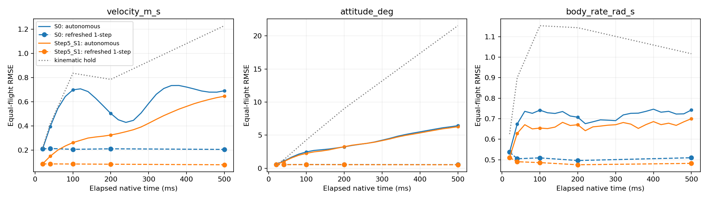
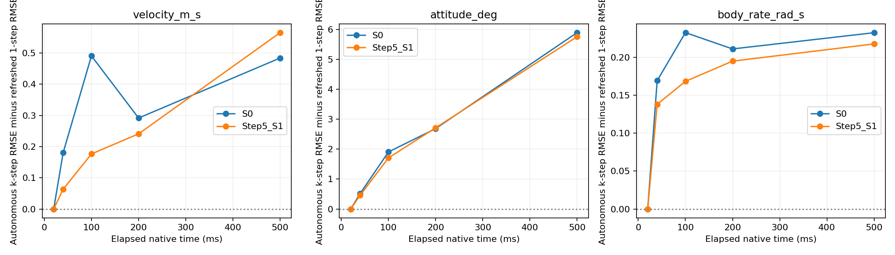
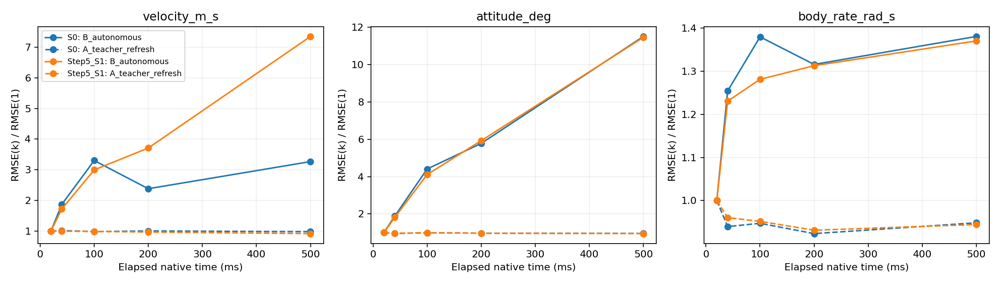
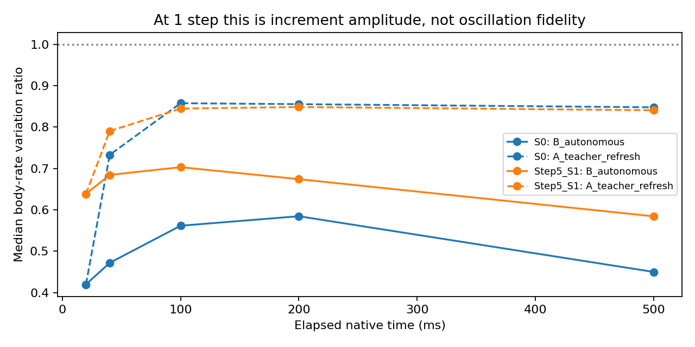

# Step 9.1 — Control-oriented Prediction Horizon Identification

本轮只对冻结S0和Step5 S1做GPU evaluation；未训练、未改变权重/actuator/phase/integration/split，sealed test未打开。S0没有替换为Step8未晋级候选。所有正式指标使用同722起点、5条validation flight、warm26、相同command tape/native dt。

## Mode contract — avoid false k-step claims

- **A_teacher_refresh：NOT DEPLOYABLE diagnostic**。在第k个endpoint，使用真实x_(k-1)、截至t_(k-1)的26点真实history重新编码，预测一步。沿用Step7 A_native的当前时刻phase anchor；actuator proxies由t0初始化后沿commands更新。A的一列k表示时间位置，不表示k步forecast lead。
- **B_autonomous：真正从t0发出的k-step forecast**。只在t0使用truth/history，随后全部使用自身physical/hidden/proxy状态，读取同一future command tape和native dt。没有future frequency/phase/state输入。
- 若“teacher-state k-step”指从相同真实t0发出连续k步预测，它与B数学上相同，不能另造一个更好的Mode A。这里按“每一步输入真实状态、history保持真实”的文字采用teacher-refresh诊断，明确不同信息预算。A/B gap包含truth refresh/history重编码及anchor策略差异，不是严格因果百分比。
- A拼接序列的variation很容易因truth refresh接近1，不是autonomous dynamics恢复证据。k=1只有两个点，variation等价于单次增量幅值比；20–100ms也可能不足一个扑翼周期。

## 五个问题与窗口建议

**本轮建议：使用Step5 S1进入100ms、measurement-refreshed的受限MPC/control验证；200ms作为需要额外验证的上界，500ms不作为默认窗口。S0仅优先用于20ms局部调用，40ms需放宽误差预算，不能把它的200ms endpoint偶然下降解释为整个前缀都准确。** 这是基于本数据的控制验证建议，不是最优控制lookahead的理论鉴定，也不是已经控制成功。

### Q1：多少ms以内保持高质量？

必须按状态区分。S0在20ms的v/attitude RMSE为 0.212m/s / 0.558°；40ms v增至 0.396m/s，p90为 0.646m/s。S1在20/40ms v为 0.088/0.151m/s，attitude为 0.547/0.991°，是更好的短期候选。

但**没有证明任何窗口的所有刚体动态都已高保真**：20ms S0/S1 body-rate RMSE已为 0.538/0.511rad/s（约 30.8/29.3deg/s 的向量误差RMS）；同点variation是增量幅值比，不是频谱/周期保真。raw recorded rate变化包含快速成分，本轮也没有把它全部解释为可控物理响应。

| Window category | S0 | Step5 S1 | Interpretation |
| --- | --- | --- | --- |
| Safe short horizon | 20ms | 20–40ms | 仅表示较小的v/attitude误差，不是安全认证；body-rate局部误差仍存在 |
| Practical control-validation horizon | 20ms优先；40ms需明确容许误差 | 100ms起步；200ms探索上界 | 每次规划用新测量/合法history初始化；不能用刷新后的teacher误差代替B |
| Long / degraded horizon in this study | 100ms velocity已明显偏差；500ms整体不推荐 | 500ms不推荐默认使用 | 本轮只到500ms，不用5秒结果替代短时域证据 |

### Q2：teacher/autonomous gap何时明显扩大？

1步完全一致，验证逐数组相等。2步（实际约40ms）已经出现清楚差距：S0的autonomous/refreshed teacher v比值=1.84、attitude比值=1.98；S1对应 1.73/1.87。100ms差距进一步扩大。不是到秒级才开始；但A不断注入truth、B没有，差距本身不能归为某一个隐藏机制。

### Q3：推荐控制prediction horizon？

**S1推荐100ms作为第一轮控制验证窗口，200ms作为探索上界。** 100ms v/attitude/rate RMSE=0.263m/s / 2.251° / 0.654rad/s，variation=0.703。200ms对应 0.326m/s / 3.243° / 0.671rad/s，variation=0.674。

不是只按RMSE选：整个100ms prefix内同时v<0.5m/s、attitude<5°的origin比例是 95.57%，到200ms降为 83.10%，到500ms仅 6.37%。这些是描述性覆盖率，未人为设定成功门槛。S0对应100/200ms仅 34.63%/4.16%；其200ms endpoint联合比例却为 52.49%，说明单一endpoint会掩盖中间误差。

相对S0，S1的100ms v误差改变 -62.32%，200ms改变 -35.32%；100ms rate误差改变 -11.77%。因此increment监督确实扩展了本轮可用于控制验证的精度窗口，尽管此前未改善5秒trajectory。

### Q4：短transition还是长期递推累积？

**两者都有，不能把A排除后只选B。** 一步angular误差在两个模型中都不小；S1相同结构的一步velocity误差大幅改善，也说明局部transition精度本身重要。Teacher误差随后维持同一量级，而自主v/attitude在40–100ms已经积累，限制更长窗口。数据支持“局部误差经过多步传播”，不支持“只有长时间才出错”或“原one-step已足够好”的泛化说法。E(k)/E(1)需同时看绝对误差：S1因为E(1)更小，归一化增长可能更大，不能据此判断它绝对预测更差。

### Q5：能否进入MPC/RL control validation？

**受限MPC/短时控制模型验证：CONDITIONAL YES。** S1存在合理的100ms试验窗口，可从20ms原生更新、warm26真实过去history、每次规划测量刷新开始验证；200ms需单独检查约束和误差尾部。需要在下一阶段验证候选控制动作、动作排序/局部响应和闭环约束；当前recorded-command benchmark没有证明这些。

**长episode纯模型RL训练或直接真机闭环就绪：NO。** 短时模型调用可进入离线验证，但不能把每周期teacher reset的优势当作无真实状态反馈的RL simulator能力。本轮没有运行MPC/RL，也没有证明所有控制任务只需100ms；真实所需lookahead仍取决于任务、代价、约束和控制带宽。

## Metrics

主要标量为五条flight各自vector/geodesic RMSE的等权平均；同时保存pooled RMSE、mean/median/p90/p95/max和每flight/每origin。姿态使用quaternion geodesic角度，不计算quaternion分量RMSE。phase使用circular error。

Seed=17，GPU=NVIDIA GeForce RTX 4090，native dt min/mean/max=0.009855/0.019998/0.029945s。1/2/5/10/25步只是名义20/40/100/200/500ms；actual_ms_mean/min/max保存在指标表，未用固定20ms替代积分。

| steps | nominal_ms | actual_ms_mean | actual_ms_min | actual_ms_max |
| --- | --- | --- | --- | --- |
| 1 | 20 | 19.99533 | 9.85700 | 29.94100 |
| 2 | 40 | 40.10221 | 29.57000 | 49.90300 |
| 5 | 100 | 100.02145 | 88.71400 | 109.78600 |
| 10 | 200 | 199.96028 | 189.61000 | 209.59100 |
| 25 | 500 | 499.95559 | 488.98500 | 509.01100 |

| model | mode | steps | attitude_deg | body_rate_rad_s | frequency_hz | phase_rad | position_m | velocity_m_s |
| --- | --- | --- | --- | --- | --- | --- | --- | --- |
| S0 | A_teacher_refresh | 1 | 0.55832 | 0.53752 | 0.10883 | 0.04372 | 0.00695 | 0.21158 |
| S0 | A_teacher_refresh | 2 | 0.53175 | 0.50505 | 0.10909 | 0.04415 | 0.00712 | 0.21475 |
| S0 | A_teacher_refresh | 5 | 0.55479 | 0.50916 | 0.10354 | 0.04170 | 0.00666 | 0.20767 |
| S0 | A_teacher_refresh | 10 | 0.54222 | 0.49628 | 0.10692 | 0.04611 | 0.00665 | 0.21210 |
| S0 | A_teacher_refresh | 25 | 0.53363 | 0.50978 | 0.10638 | 0.04367 | 0.00649 | 0.20708 |
| S0 | B_autonomous | 1 | 0.55832 | 0.53752 | 0.10883 | 0.04372 | 0.00695 | 0.21158 |
| S0 | B_autonomous | 2 | 1.05061 | 0.67434 | 0.18729 | 0.08620 | 0.01264 | 0.39562 |
| S0 | B_autonomous | 5 | 2.46156 | 0.74177 | 0.20901 | 0.16231 | 0.04071 | 0.69855 |
| S0 | B_autonomous | 10 | 3.22738 | 0.70738 | 0.19248 | 0.22616 | 0.08749 | 0.50382 |
| S0 | B_autonomous | 25 | 6.42703 | 0.74227 | 0.18697 | 0.33658 | 0.20379 | 0.69117 |
| Step5_S1 | A_teacher_refresh | 1 | 0.54725 | 0.51073 | 0.10023 | 0.04283 | 0.00695 | 0.08784 |
| Step5_S1 | A_teacher_refresh | 2 | 0.52850 | 0.49047 | 0.09951 | 0.04321 | 0.00716 | 0.08732 |
| Step5_S1 | A_teacher_refresh | 5 | 0.54321 | 0.48609 | 0.09694 | 0.04103 | 0.00642 | 0.08667 |
| Step5_S1 | A_teacher_refresh | 10 | 0.52979 | 0.47559 | 0.09881 | 0.04527 | 0.00650 | 0.08485 |
| Step5_S1 | A_teacher_refresh | 25 | 0.51806 | 0.48232 | 0.09828 | 0.04281 | 0.00632 | 0.08038 |
| Step5_S1 | B_autonomous | 1 | 0.54725 | 0.51073 | 0.10023 | 0.04283 | 0.00695 | 0.08784 |
| Step5_S1 | B_autonomous | 2 | 0.99063 | 0.62859 | 0.16507 | 0.08208 | 0.01165 | 0.15099 |
| Step5_S1 | B_autonomous | 5 | 2.25077 | 0.65443 | 0.15286 | 0.13496 | 0.02403 | 0.26321 |
| Step5_S1 | B_autonomous | 10 | 3.24268 | 0.67062 | 0.15389 | 0.18180 | 0.04925 | 0.32586 |
| Step5_S1 | B_autonomous | 25 | 6.27505 | 0.69999 | 0.16529 | 0.31006 | 0.17279 | 0.64592 |
| kinematic_hold | reference | 1 | 0.58903 | 0.62507 | 0.11428 | 0.04413 | 0.00717 | 0.21865 |
| kinematic_hold | reference | 2 | 1.27134 | 0.89961 | 0.20408 | 0.08839 | 0.01356 | 0.41817 |
| kinematic_hold | reference | 5 | 4.27228 | 1.15317 | 0.26204 | 0.18107 | 0.04817 | 0.83579 |
| kinematic_hold | reference | 10 | 9.01270 | 1.14350 | 0.27200 | 0.29907 | 0.12327 | 0.78505 |
| kinematic_hold | reference | 25 | 21.53920 | 1.01674 | 0.27689 | 0.63123 | 0.38924 | 1.22786 |



## Threshold descriptions, not success gates

threshold使用严格<，不据此颁发安全/控制成功判断。RMSE通过不代表每个rollout通过；同时列出p90和逐origin fraction。

| model | steps | metric | threshold | equal_flight_rmse | rmse_below | p90 | p90_below | fraction_below |
| --- | --- | --- | --- | --- | --- | --- | --- | --- |
| S0 | 1 | velocity_m_s | 0.50000 | 0.21158 | True | 0.33598 | True | 0.99307 |
| S0 | 1 | velocity_m_s | 1.00000 | 0.21158 | True | 0.33598 | True | 1.00000 |
| S0 | 1 | attitude_deg | 5.00000 | 0.55832 | True | 0.92755 | True | 1.00000 |
| S0 | 1 | attitude_deg | 10.00000 | 0.55832 | True | 0.92755 | True | 1.00000 |
| S0 | 2 | velocity_m_s | 0.50000 | 0.39562 | True | 0.64614 | False | 0.76731 |
| S0 | 2 | velocity_m_s | 1.00000 | 0.39562 | True | 0.64614 | True | 0.99861 |
| S0 | 2 | attitude_deg | 5.00000 | 1.05061 | True | 1.65847 | True | 1.00000 |
| S0 | 2 | attitude_deg | 10.00000 | 1.05061 | True | 1.65847 | True | 1.00000 |
| S0 | 5 | velocity_m_s | 0.50000 | 0.69855 | False | 1.08997 | False | 0.39751 |
| S0 | 5 | velocity_m_s | 1.00000 | 0.69855 | True | 1.08997 | False | 0.82964 |
| S0 | 5 | attitude_deg | 5.00000 | 2.46156 | True | 3.77746 | True | 0.99030 |
| S0 | 5 | attitude_deg | 10.00000 | 2.46156 | True | 3.77746 | True | 1.00000 |
| S0 | 10 | velocity_m_s | 0.50000 | 0.50382 | False | 0.73793 | False | 0.57895 |
| S0 | 10 | velocity_m_s | 1.00000 | 0.50382 | True | 0.73793 | True | 0.98753 |
| S0 | 10 | attitude_deg | 5.00000 | 3.22738 | True | 4.77601 | True | 0.91274 |
| S0 | 10 | attitude_deg | 10.00000 | 3.22738 | True | 4.77601 | True | 1.00000 |
| S0 | 25 | velocity_m_s | 0.50000 | 0.69117 | False | 0.98962 | False | 0.34765 |
| S0 | 25 | velocity_m_s | 1.00000 | 0.69117 | True | 0.98962 | True | 0.90305 |
| S0 | 25 | attitude_deg | 5.00000 | 6.42703 | False | 9.32884 | False | 0.42382 |
| S0 | 25 | attitude_deg | 10.00000 | 6.42703 | True | 9.32884 | True | 0.92798 |
| Step5_S1 | 1 | velocity_m_s | 0.50000 | 0.08784 | True | 0.13059 | True | 1.00000 |
| Step5_S1 | 1 | velocity_m_s | 1.00000 | 0.08784 | True | 0.13059 | True | 1.00000 |
| Step5_S1 | 1 | attitude_deg | 5.00000 | 0.54725 | True | 0.89958 | True | 1.00000 |
| Step5_S1 | 1 | attitude_deg | 10.00000 | 0.54725 | True | 0.89958 | True | 1.00000 |
| Step5_S1 | 2 | velocity_m_s | 0.50000 | 0.15099 | True | 0.22487 | True | 0.99584 |
| Step5_S1 | 2 | velocity_m_s | 1.00000 | 0.15099 | True | 0.22487 | True | 1.00000 |
| Step5_S1 | 2 | attitude_deg | 5.00000 | 0.99063 | True | 1.52585 | True | 1.00000 |
| Step5_S1 | 2 | attitude_deg | 10.00000 | 0.99063 | True | 1.52585 | True | 1.00000 |
| Step5_S1 | 5 | velocity_m_s | 0.50000 | 0.26321 | True | 0.37656 | True | 0.96260 |
| Step5_S1 | 5 | velocity_m_s | 1.00000 | 0.26321 | True | 0.37656 | True | 0.99723 |
| Step5_S1 | 5 | attitude_deg | 5.00000 | 2.25077 | True | 3.37424 | True | 0.99307 |
| Step5_S1 | 5 | attitude_deg | 10.00000 | 2.25077 | True | 3.37424 | True | 1.00000 |
| Step5_S1 | 10 | velocity_m_s | 0.50000 | 0.32586 | True | 0.45869 | True | 0.94321 |
| Step5_S1 | 10 | velocity_m_s | 1.00000 | 0.32586 | True | 0.45869 | True | 1.00000 |
| Step5_S1 | 10 | attitude_deg | 5.00000 | 3.24268 | True | 4.84261 | True | 0.91413 |
| Step5_S1 | 10 | attitude_deg | 10.00000 | 3.24268 | True | 4.84261 | True | 1.00000 |
| Step5_S1 | 25 | velocity_m_s | 0.50000 | 0.64592 | False | 0.89695 | False | 0.34903 |
| Step5_S1 | 25 | velocity_m_s | 1.00000 | 0.64592 | True | 0.89695 | True | 0.94321 |
| Step5_S1 | 25 | attitude_deg | 5.00000 | 6.27505 | False | 9.13114 | False | 0.45706 |
| Step5_S1 | 25 | attitude_deg | 10.00000 | 6.27505 | True | 9.13114 | True | 0.92798 |

## Growth and teacher gap

| model | steps | metric | actual_ms_mean | teacher_one_step | autonomous_k_step | gap | ratio |
| --- | --- | --- | --- | --- | --- | --- | --- |
| S0 | 1 | velocity_m_s | 19.99533 | 0.21158 | 0.21158 | 0.00000 | 1.00000 |
| S0 | 2 | velocity_m_s | 40.10221 | 0.21475 | 0.39562 | 0.18087 | 1.84221 |
| S0 | 5 | velocity_m_s | 100.02145 | 0.20767 | 0.69855 | 0.49088 | 3.36370 |
| S0 | 10 | velocity_m_s | 199.96028 | 0.21210 | 0.50382 | 0.29173 | 2.37544 |
| S0 | 25 | velocity_m_s | 499.95559 | 0.20708 | 0.69117 | 0.48409 | 3.33768 |
| S0 | 1 | attitude_deg | 19.99533 | 0.55832 | 0.55832 | 0.00000 | 1.00000 |
| S0 | 2 | attitude_deg | 40.10221 | 0.53175 | 1.05061 | 0.51886 | 1.97575 |
| S0 | 5 | attitude_deg | 100.02145 | 0.55479 | 2.46156 | 1.90676 | 4.43690 |
| S0 | 10 | attitude_deg | 199.96028 | 0.54222 | 3.22738 | 2.68516 | 5.95220 |
| S0 | 25 | attitude_deg | 499.95559 | 0.53363 | 6.42703 | 5.89340 | 12.04397 |
| S0 | 1 | body_rate_rad_s | 19.99533 | 0.53752 | 0.53752 | 0.00000 | 1.00000 |
| S0 | 2 | body_rate_rad_s | 40.10221 | 0.50505 | 0.67434 | 0.16929 | 1.33520 |
| S0 | 5 | body_rate_rad_s | 100.02145 | 0.50916 | 0.74177 | 0.23261 | 1.45684 |
| S0 | 10 | body_rate_rad_s | 199.96028 | 0.49628 | 0.70738 | 0.21110 | 1.42537 |
| S0 | 25 | body_rate_rad_s | 499.95559 | 0.50978 | 0.74227 | 0.23250 | 1.45607 |
| Step5_S1 | 1 | velocity_m_s | 19.99533 | 0.08784 | 0.08784 | 0.00000 | 1.00000 |
| Step5_S1 | 2 | velocity_m_s | 40.10221 | 0.08732 | 0.15099 | 0.06367 | 1.72916 |
| Step5_S1 | 5 | velocity_m_s | 100.02145 | 0.08667 | 0.26321 | 0.17654 | 3.03694 |
| Step5_S1 | 10 | velocity_m_s | 199.96028 | 0.08485 | 0.32586 | 0.24101 | 3.84042 |
| Step5_S1 | 25 | velocity_m_s | 499.95559 | 0.08038 | 0.64592 | 0.56554 | 8.03629 |
| Step5_S1 | 1 | attitude_deg | 19.99533 | 0.54725 | 0.54725 | 0.00000 | 1.00000 |
| Step5_S1 | 2 | attitude_deg | 40.10221 | 0.52850 | 0.99063 | 0.46213 | 1.87443 |
| Step5_S1 | 5 | attitude_deg | 100.02145 | 0.54321 | 2.25077 | 1.70755 | 4.14342 |
| Step5_S1 | 10 | attitude_deg | 199.96028 | 0.52979 | 3.24268 | 2.71289 | 6.12068 |
| Step5_S1 | 25 | attitude_deg | 499.95559 | 0.51806 | 6.27505 | 5.75699 | 12.11253 |
| Step5_S1 | 1 | body_rate_rad_s | 19.99533 | 0.51073 | 0.51073 | 0.00000 | 1.00000 |
| Step5_S1 | 2 | body_rate_rad_s | 40.10221 | 0.49047 | 0.62859 | 0.13813 | 1.28162 |
| Step5_S1 | 5 | body_rate_rad_s | 100.02145 | 0.48609 | 0.65443 | 0.16834 | 1.34631 |
| Step5_S1 | 10 | body_rate_rad_s | 199.96028 | 0.47559 | 0.67062 | 0.19503 | 1.41008 |
| Step5_S1 | 25 | body_rate_rad_s | 499.95559 | 0.48232 | 0.69999 | 0.21767 | 1.45129 |





每个native step另算E(t)，避免只看5个endpoint遗漏中间误差峰值。下面报告同一origin在整个prefix内同时满足velocity/attitude阈值的比例；仍是描述性覆盖率，不是成功/安全gate。

| model | steps | velocity_threshold | attitude_threshold | prefix_joint_fraction | endpoint_joint_fraction | n |
| --- | --- | --- | --- | --- | --- | --- |
| S0 | 1 | 0.50000 | 5.00000 | 0.99307 | 0.99307 | 722 |
| S0 | 1 | 1.00000 | 10.00000 | 1.00000 | 1.00000 | 722 |
| S0 | 2 | 0.50000 | 5.00000 | 0.76731 | 0.76731 | 722 |
| S0 | 2 | 1.00000 | 10.00000 | 0.99861 | 0.99861 | 722 |
| S0 | 5 | 0.50000 | 5.00000 | 0.34626 | 0.39197 | 722 |
| S0 | 5 | 1.00000 | 10.00000 | 0.81856 | 0.82964 | 722 |
| S0 | 10 | 0.50000 | 5.00000 | 0.04155 | 0.52493 | 722 |
| S0 | 10 | 1.00000 | 10.00000 | 0.74792 | 0.98753 | 722 |
| S0 | 25 | 0.50000 | 5.00000 | 0.00000 | 0.14266 | 722 |
| S0 | 25 | 1.00000 | 10.00000 | 0.53047 | 0.85042 | 722 |
| Step5_S1 | 1 | 0.50000 | 5.00000 | 1.00000 | 1.00000 | 722 |
| Step5_S1 | 1 | 1.00000 | 10.00000 | 1.00000 | 1.00000 | 722 |
| Step5_S1 | 2 | 0.50000 | 5.00000 | 0.99584 | 0.99584 | 722 |
| Step5_S1 | 2 | 1.00000 | 10.00000 | 1.00000 | 1.00000 | 722 |
| Step5_S1 | 5 | 0.50000 | 5.00000 | 0.95568 | 0.95706 | 722 |
| Step5_S1 | 5 | 1.00000 | 10.00000 | 0.99723 | 0.99723 | 722 |
| Step5_S1 | 10 | 0.50000 | 5.00000 | 0.83102 | 0.87396 | 722 |
| Step5_S1 | 10 | 1.00000 | 10.00000 | 0.99446 | 1.00000 | 722 |
| Step5_S1 | 25 | 0.50000 | 5.00000 | 0.06371 | 0.17036 | 722 |
| Step5_S1 | 25 | 1.00000 | 10.00000 | 0.87258 | 0.89889 | 722 |

## Dynamic variation and kinematic hold reference

简单reference固定t0的NED velocity、body rate和frequency，按native dt积分position/quaternion/phase；不拟合参数、不加入第三个NN。它检查复杂模型是否优于局部保持/运动学外推，不代表真实控制器。

| model | steps | median | p10 | p90 | valid_count |
| --- | --- | --- | --- | --- | --- |
| S0 | 1 | 0.41972 | 0.19063 | 1.04099 | 719 |
| S0 | 2 | 0.47198 | 0.23896 | 0.86284 | 722 |
| S0 | 5 | 0.56166 | 0.31344 | 0.92400 | 722 |
| S0 | 10 | 0.58464 | 0.33603 | 0.87908 | 722 |
| S0 | 25 | 0.45001 | 0.26550 | 0.70006 | 722 |
| Step5_S1 | 1 | 0.63873 | 0.28442 | 1.41962 | 719 |
| Step5_S1 | 2 | 0.68451 | 0.34964 | 1.16140 | 722 |
| Step5_S1 | 5 | 0.70321 | 0.44477 | 1.02617 | 722 |
| Step5_S1 | 10 | 0.67423 | 0.46226 | 0.94986 | 722 |
| Step5_S1 | 25 | 0.58440 | 0.43871 | 0.78288 | 722 |

| model | steps | metric | hold_rmse | model_rmse | change_vs_hold_pct |
| --- | --- | --- | --- | --- | --- |
| S0 | 1 | velocity_m_s | 0.21865 | 0.21158 | -3.23448 |
| S0 | 1 | attitude_deg | 0.58903 | 0.55832 | -5.21420 |
| S0 | 1 | body_rate_rad_s | 0.62507 | 0.53752 | -14.00593 |
| S0 | 2 | velocity_m_s | 0.41817 | 0.39562 | -5.39296 |
| S0 | 2 | attitude_deg | 1.27134 | 1.05061 | -17.36208 |
| S0 | 2 | body_rate_rad_s | 0.89961 | 0.67434 | -25.04034 |
| S0 | 5 | velocity_m_s | 0.83579 | 0.69855 | -16.41989 |
| S0 | 5 | attitude_deg | 4.27228 | 2.46156 | -42.38311 |
| S0 | 5 | body_rate_rad_s | 1.15317 | 0.74177 | -35.67593 |
| S0 | 10 | velocity_m_s | 0.78505 | 0.50382 | -35.82309 |
| S0 | 10 | attitude_deg | 9.01270 | 3.22738 | -64.19077 |
| S0 | 10 | body_rate_rad_s | 1.14350 | 0.70738 | -38.13869 |
| S0 | 25 | velocity_m_s | 1.22786 | 0.69117 | -43.70937 |
| S0 | 25 | attitude_deg | 21.53920 | 6.42703 | -70.16126 |
| S0 | 25 | body_rate_rad_s | 1.01674 | 0.74227 | -26.99454 |
| Step5_S1 | 1 | velocity_m_s | 0.21865 | 0.08784 | -59.82643 |
| Step5_S1 | 1 | attitude_deg | 0.58903 | 0.54725 | -7.09394 |
| Step5_S1 | 1 | body_rate_rad_s | 0.62507 | 0.51073 | -18.29188 |
| Step5_S1 | 2 | velocity_m_s | 0.41817 | 0.15099 | -63.89170 |
| Step5_S1 | 2 | attitude_deg | 1.27134 | 0.99063 | -22.07977 |
| Step5_S1 | 2 | body_rate_rad_s | 0.89961 | 0.62859 | -30.12583 |
| Step5_S1 | 5 | velocity_m_s | 0.83579 | 0.26321 | -68.50694 |
| Step5_S1 | 5 | attitude_deg | 4.27228 | 2.25077 | -47.31702 |
| Step5_S1 | 5 | body_rate_rad_s | 1.15317 | 0.65443 | -43.24940 |
| Step5_S1 | 10 | velocity_m_s | 0.78505 | 0.32586 | -58.49223 |
| Step5_S1 | 10 | attitude_deg | 9.01270 | 3.24268 | -64.02096 |
| Step5_S1 | 10 | body_rate_rad_s | 1.14350 | 0.67062 | -41.35387 |
| Step5_S1 | 25 | velocity_m_s | 1.22786 | 0.64592 | -47.39489 |
| Step5_S1 | 25 | attitude_deg | 21.53920 | 6.27505 | -70.86682 |
| Step5_S1 | 25 | body_rate_rad_s | 1.01674 | 0.69999 | -31.15318 |



## Stability support

| model | steps | n | numerical_failures | clipping_failures | support_failures |
| --- | --- | --- | --- | --- | --- |
| S0 | 1 | 722 | 0 | 0 | 0 |
| S0 | 2 | 722 | 0 | 0 | 0 |
| S0 | 5 | 722 | 0 | 0 | 0 |
| S0 | 10 | 722 | 0 | 0 | 2 |
| S0 | 25 | 722 | 0 | 0 | 17 |
| Step5_S1 | 1 | 722 | 0 | 0 | 0 |
| Step5_S1 | 2 | 722 | 0 | 0 | 1 |
| Step5_S1 | 5 | 722 | 0 | 0 | 1 |
| Step5_S1 | 10 | 722 | 0 | 0 | 1 |
| Step5_S1 | 25 | 722 | 0 | 0 | 2 |

训练域越界不等同物理不安全；finite也不等同模型可用于闭环控制。

## Control interpretation

结果只识别该validation command-tape分布下的模型误差窗口，不能从离线预测误差唯一确定MPC代价/约束/频率所需的最佳lookahead，也没有验证优化器提出的新commands或闭环动作因果响应。进入下一步受限控制验证不等于已证明MPC稳定或允许长时间model-only RL训练。本轮不运行控制器或RL。

## Reproduction and verification

```bash
/home/zn/anaconda3/envs/flap-train-gpu/bin/python scripts/run_main_v2_prediction_horizon.py --output /tmp/main-v2-prediction-horizon --device cuda:1
```

使用空目录。manifest记录所有冻结input/checkpoint/source hashes；verification.json记录旧结果保护、checkpoint不变、GPU、native prefix与历史trace parity及相关pytest/diff检查。全仓上轮633 passed/1 failed（外部PX4缺少rpm_pid_params.c）的限制仍保留，本轮不修改外部PX4。
