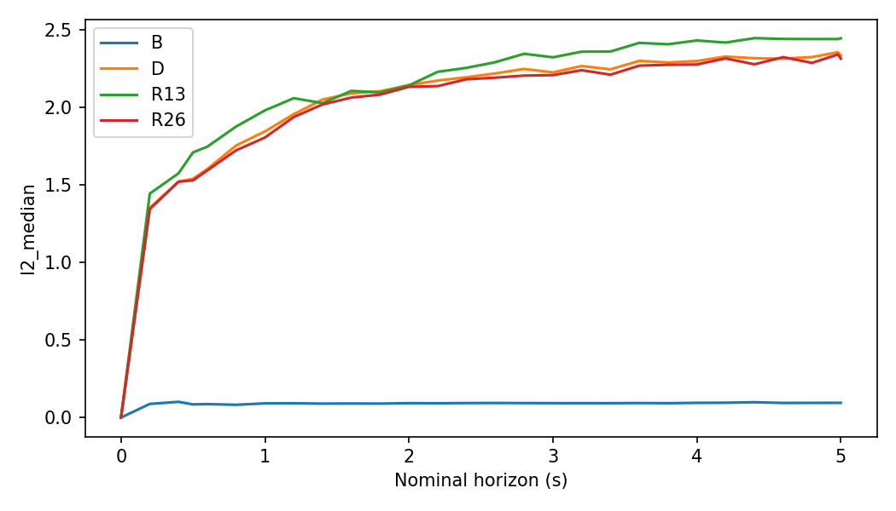
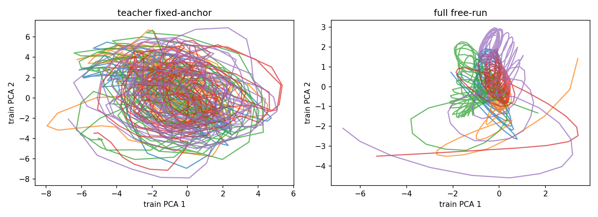
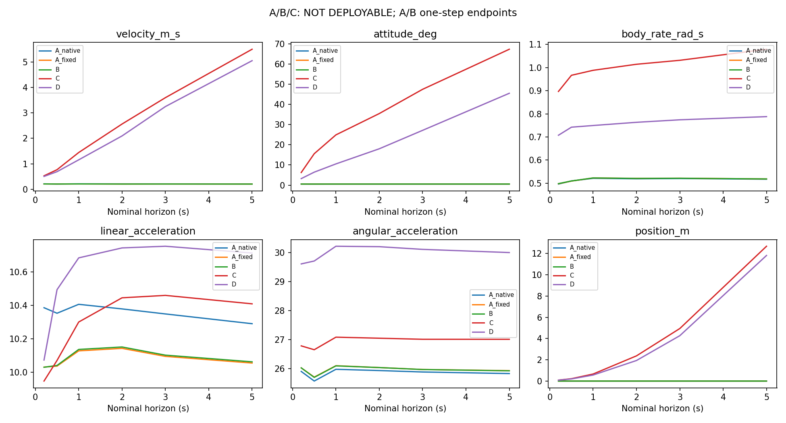
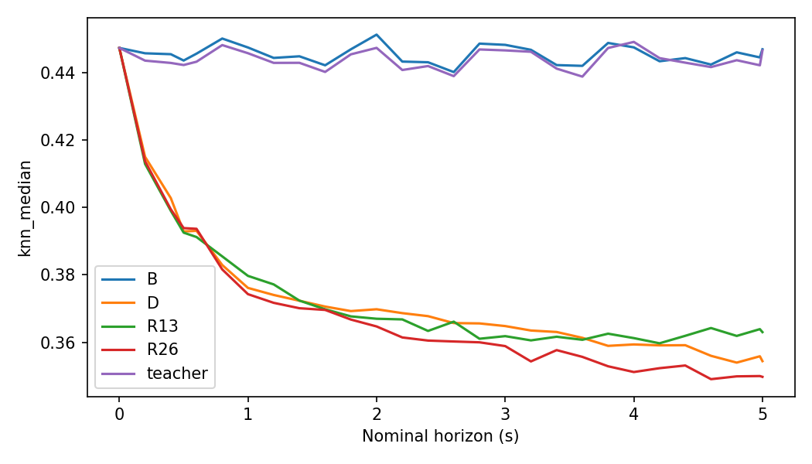
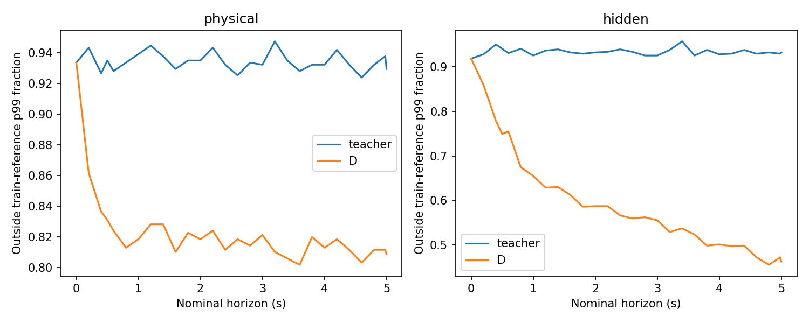
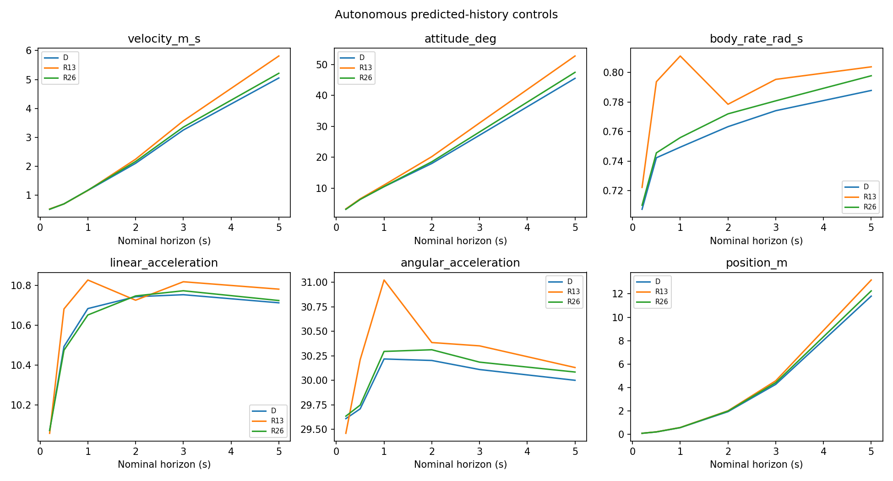

# Step 7 — Recurrent-State Drift and Transition Representation Audit

**结论 R-B：hidden 与真实轨迹对应 representation 明显失配，但没有发现它在真实 physical input 下独立累积退化；predicted-history re-encoding 未改善完整 autonomous simulator。** 下一步优先调查 **transition function / physical-state representation**，不据此增加 GRU、latent、Transformer 或 TCN。

原 Main V2 checkpoint 全程冻结；本轮不训练 dynamics 模型。仅训练一个固定 ridge=1 的小型线性信息 decoder，PCA/OOD/decoder 均只拟合 train。sealed test 未打开，未启动 RL，未修改 Step 1–6 或任何旧 checkpoint。

## 合同与对照口径

722 个共同 validation 起点、五条 flight、warm26、同 commands、250 个原生 dt。dt范围 0.009855–0.029945s，均值 0.02000013s；250步实际时长 4.989626–5.010254s。0.2/0.5/1/2/3/5为10/25/50/100/150/250步的名义标签，积分没有改为固定20ms。

- **A_native（Full Teacher，NOT DEPLOYABLE）**：每t真实physical + 原始26点history重新以当前t归零编码，只预测一步。它是正式reset语义下的局部参考。
- **A_fixed（匹配anchor的Teacher控制，NOT DEPLOYABLE）**：同样真实history/physical，但history及当前feature均保持原t0 anchor，用于和B/C/D隔离hidden更新差异。
- **B（NOT DEPLOYABLE）**：只在t0编码；每t用真实physical输出一步，随后用 **真实x_(t+1)** 更新GRU。不能先用预测x更新GRU再仅覆盖physical，那不是本问题的B。
- **C（NOT DEPLOYABLE）**：physical自主递推，每t换入A_fixed hidden；anchor保持t0。另报C_native：原reset重锚teacher hidden并匹配当前teacher anchor，避免把两种坐标合同混为一谈。
- **D**：原始自主simulator；与旧S0逐字段重跑校验见baseline_parity.json。
- **R13/R26（autonomous frozen-weight probes）**：相同warm26 h0，此后每一步用最近13/26个自身预测feature重编码。保持原t0 anchor、actuator代理、weights、integration。早期buffer包含合法t0前真实history，t0之后只append预测；完全替换后是纯预测history。

所有模式的actuator proxies都由同一t0 history初始化并沿commands递推，不每步重置。B的teacher physical包含frequency/encoder phase，因此它同时阻断这些预测误差，不能把B结果仅归于velocity/body-rate。A/B报告的是各时点**一次native-step预测误差**，不是5s累计轨迹；C/D/R才是连续预测。导数指标取每horizon末10个native转移的向量RMSE，各flight先聚合再等权；endpoint同Step2合同。raw差分仍含快速变化，本轮不将其全部认定为独立物理真值。

teacher、free、reencode 的history控制对齐显式记录：legacy GRU更新为G(h_t,feature(x_(t+1)),u_t)，history encoder原样读取各历史row的command。当前base.use_controls=False，因此这一索引差不影响hidden，但actuator路径没有忽略command。

## Q1：Full Teacher一步预测随时间稳定吗？

**YES，指没有随rollout elapsed time累积恶化，不表示局部误差小。** A_native及A_fixed各horizon导数误差基本平稳；raw angular error仍约26 rad/s²。B与A应比较单步endpoint，而非把它们的小数误读为5秒准确轨迹。

| mode | horizon_s | velocity_m_s_equal_log_rmse | attitude_deg_equal_log_rmse | body_rate_rad_s_equal_log_rmse | linear_acceleration_equal_log_rmse | angular_acceleration_equal_log_rmse |
| --- | --- | --- | --- | --- | --- | --- |
| A_fixed | 0.20000 | 0.20907 | 0.54113 | 0.49759 | 10.03134 | 26.02053 |
| A_fixed | 0.50000 | 0.20679 | 0.53303 | 0.50907 | 10.03717 | 25.70342 |
| A_fixed | 1.00000 | 0.20956 | 0.54120 | 0.52261 | 10.12824 | 26.09598 |
| A_fixed | 2.00000 | 0.20537 | 0.54017 | 0.52093 | 10.14313 | 26.03209 |
| A_fixed | 3.00000 | 0.20690 | 0.54031 | 0.52158 | 10.09529 | 25.96564 |
| A_fixed | 5.00000 | 0.20500 | 0.54132 | 0.51827 | 10.05548 | 25.92486 |
| A_native | 0.20000 | 0.21210 | 0.54222 | 0.49628 | 10.38586 | 25.89839 |
| A_native | 0.50000 | 0.20708 | 0.53363 | 0.50978 | 10.35289 | 25.56666 |
| A_native | 1.00000 | 0.21321 | 0.54134 | 0.52100 | 10.40615 | 25.97202 |
| A_native | 2.00000 | 0.21132 | 0.54013 | 0.51902 | 10.37868 | 25.92859 |
| A_native | 3.00000 | 0.21063 | 0.54014 | 0.52021 | 10.34868 | 25.87908 |
| A_native | 5.00000 | 0.20887 | 0.54108 | 0.51710 | 10.29039 | 25.82496 |
| B | 0.20000 | 0.20921 | 0.54109 | 0.49811 | 10.03038 | 26.02127 |
| B | 0.50000 | 0.20665 | 0.53335 | 0.50951 | 10.04099 | 25.69279 |
| B | 1.00000 | 0.20961 | 0.54153 | 0.52269 | 10.13672 | 26.08988 |
| B | 2.00000 | 0.20551 | 0.54021 | 0.52058 | 10.15139 | 26.03144 |
| B | 3.00000 | 0.20695 | 0.54065 | 0.52132 | 10.10260 | 25.96396 |
| B | 5.00000 | 0.20507 | 0.54180 | 0.51840 | 10.06274 | 25.91927 |

另按真实flight timestamp分为五个等时长桶，先按(log,segment,sample)去除重叠起点造成的重复。不同regime下误差有变化，不能宣称飞行过程严格平稳；完整25桶见teacher_flight_time_bins.csv。

| log_id | linear_min | linear_max | angular_min | angular_max |
| --- | --- | --- | --- | --- |
| 2026.8.10-8.20/log_15_2026-8-20-06-08-16.ulg | 8.24901 | 13.08256 | 20.82162 | 31.01374 |
| 2026.8.10-8.20/log_16_2026-8-20-06-20-52.ulg | 7.75740 | 12.79236 | 20.41561 | 28.71051 |
| 2026.8.10-8.20/log_17_2026-8-20-06-29-34.ulg | 8.61478 | 12.22006 | 23.07020 | 28.46746 |
| 2026.8.10-8.20/log_19_2026-8-20-06-51-18.ulg | 8.93499 | 12.04325 | 23.84332 | 27.76683 |
| 2026.8.10-8.20/log_22_2026-8-20-07-09-54.ulg | 8.63406 | 11.86833 | 25.88046 | 30.43663 |

## Q2：Teacher physical + recurrent hidden退化吗？

**NO，未观察到实质累积退化。** B相对A_fixed的angular RMSE最大绝对变化仅0.0414%。到5s，B与teacher hidden的L2中位数0.0952、cosine 0.999269；D对应2.3344、0.377886。

B包含从t0开始的长期recurrent memory，A_fixed每次截断26点从零编码，二者不要求hidden完全相等。实际差异小且没有累积，反驳“只要反复GRUCell就会自己漂走”的强假设。

| mode | horizon_s | l2_median | dimension_rmse_median | cosine_median |
| --- | --- | --- | --- | --- |
| B | 0.00000 | 0.00000 | 0.00000 | 1.00000 |
| B | 0.20000 | 0.08815 | 0.01102 | 0.99936 |
| B | 0.50000 | 0.08496 | 0.01062 | 0.99941 |
| B | 1.00000 | 0.09165 | 0.01146 | 0.99932 |
| B | 2.00000 | 0.09296 | 0.01162 | 0.99931 |
| B | 3.00000 | 0.09294 | 0.01162 | 0.99928 |
| B | 5.00000 | 0.09523 | 0.01190 | 0.99927 |
| D | 0.00000 | 0.00000 | 0.00000 | 1.00000 |
| D | 0.20000 | 1.35217 | 0.16902 | 0.84050 |
| D | 0.50000 | 1.53963 | 0.19245 | 0.78340 |
| D | 1.00000 | 1.84536 | 0.23067 | 0.66024 |
| D | 2.00000 | 2.14423 | 0.26803 | 0.49715 |
| D | 3.00000 | 2.22599 | 0.27825 | 0.43502 |
| D | 5.00000 | 2.33439 | 0.29180 | 0.37789 |





## Q3：Predicted physical + teacher hidden是否明显优于D？

**NO。** C改善raw角加速度误差、恢复variation，但累计velocity/attitude更差；C_native也不改善。teacher hidden与预测physical的组合可能不自洽，这种oracle干预不是保证改善的数学上界，不能把恶化量解释为hidden“有益”的因果百分比。

| mode | horizon_s | velocity_m_s_equal_log_rmse | attitude_deg_equal_log_rmse | body_rate_rad_s_equal_log_rmse | linear_acceleration_equal_log_rmse | angular_acceleration_equal_log_rmse |
| --- | --- | --- | --- | --- | --- | --- |
| C | 0.20000 | 0.52835 | 6.24293 | 0.89685 | 9.94801 | 26.77984 |
| C | 0.50000 | 0.76893 | 15.57791 | 0.96669 | 10.07094 | 26.64725 |
| C | 1.00000 | 1.44341 | 24.90537 | 0.98824 | 10.30037 | 27.08026 |
| C | 2.00000 | 2.56315 | 35.47249 | 1.01437 | 10.44505 | 27.04455 |
| C | 3.00000 | 3.59859 | 47.50162 | 1.03153 | 10.45946 | 27.00738 |
| C | 5.00000 | 5.50105 | 67.36095 | 1.07936 | 10.40905 | 27.00662 |
| C_native | 0.20000 | 0.69660 | 6.14031 | 0.88494 | 10.28469 | 26.64859 |
| C_native | 0.50000 | 1.13320 | 14.94023 | 0.94153 | 10.32964 | 26.48132 |
| C_native | 1.00000 | 1.93224 | 23.68050 | 0.95779 | 10.41669 | 26.96158 |
| C_native | 2.00000 | 2.97240 | 36.90659 | 1.01613 | 10.48050 | 26.94974 |
| C_native | 3.00000 | 4.08262 | 54.84333 | 1.05199 | 10.53483 | 26.92917 |
| C_native | 5.00000 | 6.67873 | 86.28298 | 1.07131 | 10.52552 | 26.88721 |
| D | 0.20000 | 0.50382 | 3.22738 | 0.70738 | 10.07339 | 29.60790 |
| D | 0.50000 | 0.69117 | 6.42703 | 0.74227 | 10.49357 | 29.70812 |
| D | 1.00000 | 1.15586 | 10.51395 | 0.74947 | 10.68345 | 30.21762 |
| D | 2.00000 | 2.09558 | 18.01418 | 0.76335 | 10.74293 | 30.20222 |
| D | 3.00000 | 3.24902 | 27.15784 | 0.77416 | 10.75292 | 30.10966 |
| D | 5.00000 | 5.05151 | 45.53176 | 0.78788 | 10.71240 | 29.99975 |


| mode | horizon_s | velocity_m_s_change_pct | attitude_deg_change_pct |
| --- | --- | --- | --- |
| C | 2.00000 | 22.31239 | 96.91428 |
| C | 3.00000 | 10.75944 | 74.90938 |
| C | 5.00000 | 8.89922 | 47.94278 |
| C_native | 2.00000 | 41.84155 | 104.87522 |
| C_native | 3.00000 | 25.65704 | 101.94288 |
| C_native | 5.00000 | 32.21253 | 89.50065 |

C的5s omega variation prefix/last1s接近1，依然未改善轨迹，是另一项“幅值不是fidelity”的证据。

| mode | scope | median |
| --- | --- | --- |
| C | last1s | 0.88846 |
| C | prefix | 0.99806 |
| C_native | last1s | 0.84640 |
| C_native | prefix | 0.95600 |
| D | last1s | 0.07411 |
| D | prefix | 0.24582 |



## Q4：hidden OOD与physical OOD谁先出现？

**当前距离阈值不能可靠给出先后顺序。** 必须区分两件事：D远离同一真实轨迹的teacher hidden，但未持续远离train hidden bank；相反kNN距离下降。衰减到平均动态附近，也可能更接近训练点云中心。

原生bank严格以当前t为anchor编码真实train history；native_hidden_ood/native_physical_ood另存。主图使用额外的gauge控制bank：同一真实train history加8个等间隔anchor坐标（不拟合offset、不改simulator），防止单纯phase坐标旋转被误读为动力学OOD。它是train-derived坐标控制，**不是声称原训练看过所有这些gauge**。两种bank均无validation样本。PCA也只fit这些train hidden，validation仅project。

k=5，标准化RMS欧氏距离；Mahalanobis用训练协方差+0.001I，除维数后开根号。原阈值来自train查询排除自身后的p99，有同log时间邻近/采样密度影响；补充 **leave-one-log-out train查询** 校准阈值，只变诊断刻度，不选择模型。所有阈值不是物理安全界限。

| space | mode | horizon_s | knn_median | knn_outside_train_p99_mean | knn_outside_leave_log_p99_mean |
| --- | --- | --- | --- | --- | --- |
| hidden | D | 0.00000 | 0.44728 | 0.91828 | 0.00139 |
| hidden | D | 0.20000 | 0.41499 | 0.85873 | 0.00000 |
| hidden | D | 1.00000 | 0.37611 | 0.65512 | 0.00000 |
| hidden | D | 5.00000 | 0.35440 | 0.46260 | 0.00000 |
| hidden | teacher | 0.00000 | 0.44728 | 0.91828 | 0.00139 |
| hidden | teacher | 0.20000 | 0.44352 | 0.92798 | 0.00000 |
| hidden | teacher | 1.00000 | 0.44572 | 0.92521 | 0.00277 |
| hidden | teacher | 5.00000 | 0.44653 | 0.93213 | 0.00139 |
| physical | D | 0.00000 | 0.56019 | 0.93352 | 0.00139 |
| physical | D | 0.20000 | 0.52585 | 0.86150 | 0.00000 |
| physical | D | 1.00000 | 0.52073 | 0.81856 | 0.00000 |
| physical | D | 5.00000 | 0.51640 | 0.80886 | 0.00000 |
| physical | teacher | 0.00000 | 0.56019 | 0.93352 | 0.00139 |
| physical | teacher | 0.20000 | 0.56074 | 0.94321 | 0.00000 |
| physical | teacher | 1.00000 | 0.55578 | 0.93906 | 0.00000 |
| physical | teacher | 5.00000 | 0.55477 | 0.92936 | 0.00139 |

初始状态已经存在跨日志距离偏移，不能称其在某个未来horizon“首次离开训练域”。ood_onset.csv的连续三个采样点阈值越界仅作描述，不作为起因排序。更强的诊断是：喂入真实physical的B保持teacher附近，而D明显偏离；支持偏移由预测physical输入所驱动，但不能排除state/hidden非线性反馈。
固定horizon、跨722起点的相关性如下；避免仅用共同时间趋势产生相关性。重叠起点不独立，未用该相关性做显著性或因果判断。

| space | horizon_s | metric | spearman | n |
| --- | --- | --- | --- | --- |
| hidden | 5.00000 | angular_acceleration | 0.47705 | 722 |
| hidden | 5.00000 | linear_acceleration | 0.50640 | 722 |
| hidden | 5.00000 | attitude_deg | 0.27330 | 722 |
| hidden | 5.00000 | velocity_m_s | 0.28401 | 722 |
| hidden | 5.00000 | variation | 0.17554 | 722 |
| physical | 5.00000 | angular_acceleration | -0.00948 | 722 |
| physical | 5.00000 | linear_acceleration | 0.07223 | 722 |
| physical | 5.00000 | attitude_deg | 0.10363 | 722 |
| physical | 5.00000 | velocity_m_s | 0.09622 | 722 |
| physical | 5.00000 | variation | 0.00648 | 722 |





## Q5：hidden drift对derivative输出有多大影响？

固定真实physical，换入D hidden；反向固定teacher hidden，把physical换成D状态。两者均保留同actuator/command、fixed anchor。下表为各origin末10步输出差向量RMS的中位数，**不是truth误差，也不能相加为因果分解**。linear是NED，linear_body为模型body输出；角加速度单位rad/s²，频率导数Hz/s。

| intervention | horizon_s | linear_median | linear_body_median | angular_median | frequency_median |
| --- | --- | --- | --- | --- | --- |
| hidden_only | 0.20000 | 0.95685 | 0.95685 | 6.79726 | 0.10056 |
| hidden_only | 0.50000 | 1.24046 | 1.24046 | 8.03315 | 0.16105 |
| hidden_only | 1.00000 | 1.45184 | 1.45184 | 8.43800 | 0.19563 |
| hidden_only | 2.00000 | 1.63178 | 1.63178 | 8.86845 | 0.26115 |
| hidden_only | 3.00000 | 1.70799 | 1.70799 | 8.87068 | 0.26358 |
| hidden_only | 5.00000 | 1.68841 | 1.68841 | 8.80000 | 0.27080 |
| physical_only | 0.20000 | 0.73771 | 0.73051 | 3.24673 | 0.73255 |
| physical_only | 0.50000 | 0.86103 | 0.84745 | 3.49670 | 0.76244 |
| physical_only | 1.00000 | 1.10155 | 1.03272 | 3.68064 | 0.81120 |
| physical_only | 2.00000 | 1.35026 | 1.24217 | 3.78728 | 0.84536 |
| physical_only | 3.00000 | 1.47307 | 1.34336 | 3.77028 | 0.86694 |
| physical_only | 5.00000 | 1.73733 | 1.58487 | 3.81743 | 0.86609 |

hidden对角导数确实敏感，不能称hidden“无关”；但敏感性大不等于它是独立起因。B与C的直接干预不支持通过换hidden独立解决长期轨迹。

## Q6：GRU是否明显memory contraction？

局部64×64 Jacobian直接自动微分，固定输入，48个确定性train-bank点及每flight前2个origin的t=0/1/4.98s teacher/B/free，共138点。validation使用实际下一步feature（teacher为真实下一步，free为预测下一步）；train为记录history终点附近的固定输入局部map，不是训练新模型。IDs和全部谱值保存。

| mode | horizon_s | n | largest_singular_median | largest_singular_p95 | spectral_radius_median | median_singular_median |
| --- | --- | --- | --- | --- | --- | --- |
| train_teacher | -0.02000 | 48 | 1.02792 | 1.07141 | 0.91879 | 0.52603 |
| validation_B | 0.00000 | 10 | 1.00875 | 1.05510 | 0.91382 | 0.48640 |
| validation_B | 1.00000 | 10 | 1.02557 | 1.05129 | 0.93529 | 0.48594 |
| validation_B | 4.98000 | 10 | 1.02417 | 1.06336 | 0.89469 | 0.49856 |
| validation_free | 0.00000 | 10 | 1.00396 | 1.05613 | 0.91870 | 0.48709 |
| validation_free | 1.00000 | 10 | 1.01783 | 1.03613 | 0.91716 | 0.51708 |
| validation_free | 4.98000 | 10 | 1.03774 | 1.06025 | 0.91343 | 0.47790 |
| validation_teacher | 0.00000 | 10 | 1.00875 | 1.05510 | 0.91382 | 0.48640 |
| validation_teacher | 1.00000 | 10 | 1.02616 | 1.05074 | 0.93255 | 0.48430 |
| validation_teacher | 4.98000 | 10 | 1.02417 | 1.06254 | 0.89502 | 0.49711 |

多数维度局部缩小、spectral radius约0.9，但最大singular通常接近或超过1，不能称所有方向严格contractive；时变Jacobian乘积也不能由单步特征值推断。真实teacher/B与free没有显示后期独有的强收缩。稳定受驱动GRU本来可以衰减旧扰动，同时由输入持续补充信息。B不衰退是关键反证，因此不把这一谱结果判为memory实现bug。

train-only ridge decoder结果（RMSE按列单位；phase用sin/cos二维、非absolute mechanical phase）：

| mode | horizon_s | target | rmse | r2 |
| --- | --- | --- | --- | --- |
| teacher | 0.20000 | phase_relative | 0.10758 | 0.90452 |
| teacher | 0.20000 | frequency | 0.07229 | 0.97198 |
| teacher | 0.20000 | body_rate | 0.14108 | 0.90270 |
| teacher | 0.20000 | recent_delta_omega | 0.35796 | 0.51945 |
| teacher | 1.00000 | phase_relative | 0.10012 | 0.97986 |
| teacher | 1.00000 | frequency | 0.06665 | 0.97776 |
| teacher | 1.00000 | body_rate | 0.14520 | 0.89881 |
| teacher | 1.00000 | recent_delta_omega | 0.34270 | 0.58391 |
| teacher | 5.00000 | phase_relative | 0.10630 | 0.97729 |
| teacher | 5.00000 | frequency | 0.07109 | 0.97765 |
| teacher | 5.00000 | body_rate | 0.15339 | 0.88899 |
| teacher | 5.00000 | recent_delta_omega | 0.35475 | 0.55096 |
| B | 0.20000 | phase_relative | 0.10722 | 0.90516 |
| B | 0.20000 | frequency | 0.07180 | 0.97236 |
| B | 0.20000 | body_rate | 0.14110 | 0.90267 |
| B | 0.20000 | recent_delta_omega | 0.35500 | 0.52737 |
| B | 1.00000 | phase_relative | 0.10015 | 0.97985 |
| B | 1.00000 | frequency | 0.06634 | 0.97797 |
| B | 1.00000 | body_rate | 0.14712 | 0.89612 |
| B | 1.00000 | recent_delta_omega | 0.34446 | 0.57962 |
| B | 5.00000 | phase_relative | 0.10552 | 0.97763 |
| B | 5.00000 | frequency | 0.07043 | 0.97806 |
| B | 5.00000 | body_rate | 0.15483 | 0.88689 |
| B | 5.00000 | recent_delta_omega | 0.35586 | 0.54814 |
| D | 0.20000 | phase_relative | 0.18661 | 0.71269 |
| D | 0.20000 | frequency | 0.20003 | 0.78545 |
| D | 0.20000 | body_rate | 0.41510 | 0.15769 |
| D | 0.20000 | recent_delta_omega | 0.53181 | -0.06066 |
| D | 1.00000 | phase_relative | 0.41818 | 0.64862 |
| D | 1.00000 | frequency | 0.20575 | 0.78807 |
| D | 1.00000 | body_rate | 0.44150 | 0.06448 |
| D | 1.00000 | recent_delta_omega | 0.54662 | -0.05858 |
| D | 5.00000 | phase_relative | 0.95898 | -0.84784 |
| D | 5.00000 | frequency | 0.20877 | 0.80723 |
| D | 5.00000 | body_rate | 0.46358 | -0.01398 |
| D | 5.00000 | recent_delta_omega | 0.53941 | -0.03819 |

D丢失对**真实**rate/近期增量的解码能力，B接近teacher。该probe不能区分“忘记真实信息”与“忠实编码已经错误的自身physical”；也不是因果证明。within-log phase跨log zero未知，不作机械相位准确度。command-history decoder在teacher上本来就弱（完整CSV），base.use_controls=False，不将负R²解释为free-run才忘记command。

## Q7：predicted-history re-encode优于pure recurrence吗？

**NO。** 全722起点结果不支持这条修复路线。诊断训练gate（C长期v/att改善>5%或B angular相对A_fixed退化>5%）未触发；没有训练新representation。R13/R26是用户要求的两个冻结权重negative controls，不是通过gate的候选。

| mode | horizon_s | position_m_equal_log_rmse | velocity_m_s_equal_log_rmse | attitude_deg_equal_log_rmse | body_rate_rad_s_equal_log_rmse | frequency_hz_equal_log_rmse | phase_rad_equal_log_rmse |
| --- | --- | --- | --- | --- | --- | --- | --- |
| D | 0.20000 | 0.08749 | 0.50382 | 3.22738 | 0.70738 | 0.19248 | 0.22616 |
| D | 0.50000 | 0.20379 | 0.69117 | 6.42703 | 0.74227 | 0.18697 | 0.33658 |
| D | 1.00000 | 0.57072 | 1.15586 | 10.51395 | 0.74947 | 0.19691 | 0.58994 |
| D | 2.00000 | 1.93583 | 2.09558 | 18.01418 | 0.76335 | 0.20240 | 0.91426 |
| D | 3.00000 | 4.26920 | 3.24902 | 27.15784 | 0.77416 | 0.20392 | 1.18099 |
| D | 5.00000 | 11.80726 | 5.05151 | 45.53176 | 0.78788 | 0.20164 | 1.62593 |
| R13 | 0.20000 | 0.08901 | 0.51447 | 3.33300 | 0.72222 | 0.19265 | 0.22629 |
| R13 | 0.50000 | 0.21200 | 0.69028 | 6.58270 | 0.79380 | 0.18791 | 0.34177 |
| R13 | 1.00000 | 0.58185 | 1.15642 | 11.04838 | 0.81122 | 0.19671 | 0.59166 |
| R13 | 2.00000 | 2.01067 | 2.23867 | 20.22554 | 0.77852 | 0.19997 | 0.89304 |
| R13 | 3.00000 | 4.57479 | 3.56688 | 31.11564 | 0.79538 | 0.20123 | 1.12133 |
| R13 | 5.00000 | 13.18473 | 5.81382 | 52.76024 | 0.80389 | 0.20067 | 1.55922 |
| R26 | 0.20000 | 0.08781 | 0.50529 | 3.21024 | 0.71013 | 0.19267 | 0.22633 |
| R26 | 0.50000 | 0.20483 | 0.69033 | 6.39191 | 0.74562 | 0.18744 | 0.33767 |
| R26 | 1.00000 | 0.57484 | 1.16384 | 10.55719 | 0.75595 | 0.19693 | 0.59324 |
| R26 | 2.00000 | 1.98318 | 2.15915 | 18.56445 | 0.77203 | 0.20263 | 0.91871 |
| R26 | 3.00000 | 4.41716 | 3.34973 | 28.20490 | 0.78084 | 0.20361 | 1.17780 |
| R26 | 5.00000 | 12.25548 | 5.21484 | 47.48215 | 0.79784 | 0.20154 | 1.61308 |

相对D的配对flight变化（负数改善）；列举所有5条flight有放回的3125种bootstrap，不能把722重叠起点当独立样本，也不表示跨模型seed置信区间。

| mode | horizon_s | metric | change_pct | ci95_low | ci95_high | improved_flights |
| --- | --- | --- | --- | --- | --- | --- |
| R13 | 2.00000 | velocity_m_s | 6.82825 | 2.29766 | 11.68655 | 1 |
| R13 | 2.00000 | attitude_deg | 12.27569 | 8.35525 | 16.38955 | 0 |
| R13 | 3.00000 | velocity_m_s | 9.78331 | 2.14670 | 17.08365 | 1 |
| R13 | 3.00000 | attitude_deg | 14.57331 | 8.22971 | 21.14796 | 0 |
| R13 | 5.00000 | velocity_m_s | 15.09073 | 4.26794 | 27.99856 | 1 |
| R13 | 5.00000 | attitude_deg | 15.87568 | 4.69629 | 29.06577 | 1 |
| R26 | 2.00000 | velocity_m_s | 3.03394 | 2.19449 | 3.86378 | 0 |
| R26 | 2.00000 | attitude_deg | 3.05465 | 1.82410 | 4.40353 | 0 |
| R26 | 3.00000 | velocity_m_s | 3.09971 | 2.00984 | 4.30585 | 0 |
| R26 | 3.00000 | attitude_deg | 3.85545 | 2.71469 | 5.24274 | 0 |
| R26 | 5.00000 | velocity_m_s | 3.23329 | 2.00412 | 4.60905 | 0 |
| R26 | 5.00000 | attitude_deg | 4.28358 | 2.97797 | 5.52493 | 0 |


| mode | horizon_s | scope | median |
| --- | --- | --- | --- |
| D | 0.20000 | prefix | 0.58464 |
| D | 0.50000 | prefix | 0.45001 |
| D | 1.00000 | prefix | 0.34796 |
| D | 2.00000 | prefix | 0.28738 |
| D | 3.00000 | prefix | 0.27256 |
| D | 5.00000 | last1s | 0.07411 |
| D | 5.00000 | prefix | 0.24582 |
| R13 | 0.20000 | prefix | 0.59388 |
| R13 | 0.50000 | prefix | 0.45997 |
| R13 | 1.00000 | prefix | 0.37361 |
| R13 | 2.00000 | prefix | 0.30624 |
| R13 | 3.00000 | prefix | 0.28354 |
| R13 | 5.00000 | last1s | 0.12875 |
| R13 | 5.00000 | prefix | 0.25978 |
| R26 | 0.20000 | prefix | 0.59427 |
| R26 | 0.50000 | prefix | 0.47919 |
| R26 | 1.00000 | prefix | 0.38488 |
| R26 | 2.00000 | prefix | 0.31760 |
| R26 | 3.00000 | prefix | 0.29738 |
| R26 | 5.00000 | last1s | 0.10542 |
| R26 | 5.00000 | prefix | 0.27338 |

variation有小幅恢复，但仍远低于1，且长期误差退化；不晋级，不需要用更复杂谱指标为一个未通过轨迹门槛的candidate寻找收益。完整6指标分布、每flight、失败保留在CSV。

| mode | numerical_failed | support_failed | clipping_failed |
| --- | --- | --- | --- |
| D | 0 | 255 | 0 |
| R13 | 0 | 208 | 0 |
| R26 | 0 | 259 | 0 |

support gate沿用Step2 train observed envelope，不是适航安全界限；有限但失败轨迹没有从平均值中删掉。



## Q8：最终 R-B

1. B保持真实physical时，hidden和一步误差都稳定；不存在已证实的“GRU recurrence单独漂移”。
2. D与teacher hidden方向显著失配，hidden替换显著影响角导数；因此不能选择“hidden完全不相关”的强版本R-C。
3. C能恢复部分动态幅值，却恶化累计轨迹；autonomous R13/R26也失败。结合Step4的一步局部映射不足，最有证据的解释是 **physical预测误差改变输入，hidden跟随并反馈，单独换encoding不足以修复transition**。没有证明具体空气动力缺失变量，也没有证明加大网络会解决。

下一步：transition function / physical-state representation的受控调查。停止把GRU重复编码作为当前主要修复方向；不继续constant-offset搜索或增大increment权重。

Simulator structural readiness: **100%**

Dynamics fidelity readiness: **60%**

RL-ready: **NO**

沿用既有证据评分；本轮是失败分解，没有晋级模型，不提高readiness。

## 复现与工程验收

```bash
/home/zn/anaconda3/envs/flap-train-gpu/bin/python /home/zn/flap-system-identification/scripts/run_main_v2_recurrent_audit.py --output /tmp/main-v2-step7/results --artifacts /tmp/main-v2-step7/artifacts --device cuda:1
```

使用空目录。固定seed717；真实历史和oracle trace仅在独立诊断脚本处理，autonomous rolling类没有truth参数。snapshot保存physical/hidden、features、controls、mask；恢复不重新编码。K13/K26各250步与100+150步所有state/buffer逐位相同；future-label NaN回归继续验证。

manifest.json、historical_hashes.json、reference_contract.json、train_bank_rows.csv、operating_points.pt、reference_fit.npz及hidden_probe.npz保存来源、索引和拟合参数。verification.json记录旧结果hash、pytest、git diff检查与墙钟时间。原数据split不变；全部新文件独立保存。
