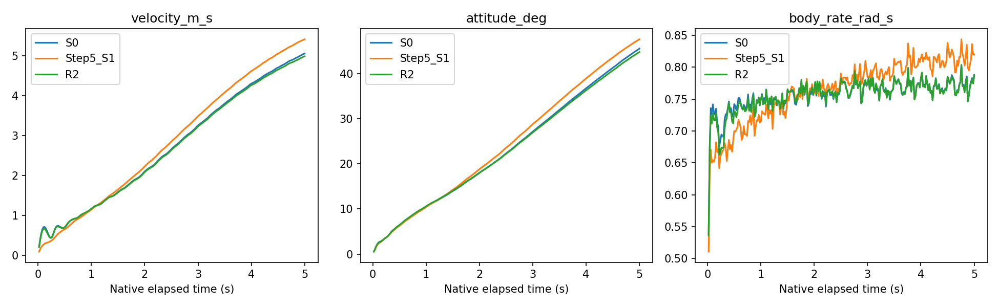
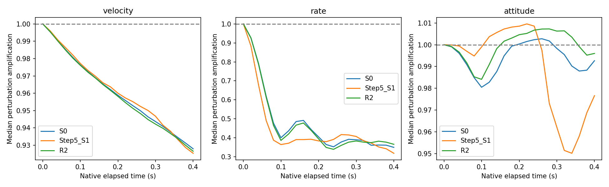
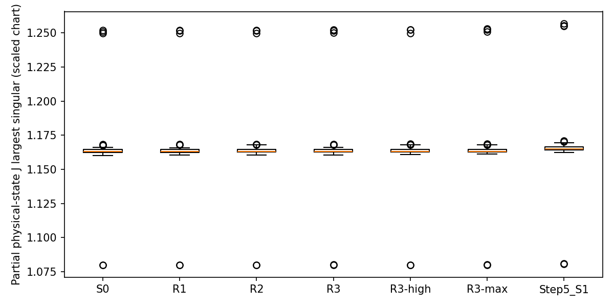
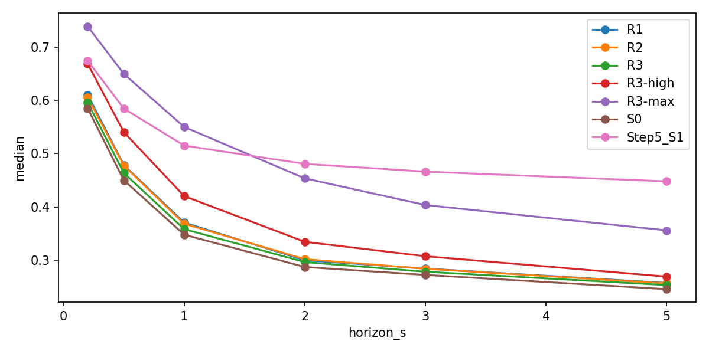

# Step 8 — Short-Horizon Closed-Loop Consistency Training

最佳候选（不等于晋级）：**R2**。全部gate通过：**False**。
测试组合为 H=10 native steps、lambda=0.1。

本轮实际结果：短前缀加权带来局部和长期的小幅调整，但**没有形成联合精度、动态保真和稳定性均达标的候选**。不晋级，不启动RL。以下结论限于该六模型、固定种子和预算的实验，不能推广成所有loss设计都无效。

## 七个问题的直接回答

1. **是否改善autonomous simulator？局部、小幅改善，未达到本轮成功标准。** R2 的5s velocity/attitude变化为 -1.40% / -1.62%，但0.5s为 +1.20% / +0.53%，1s为 +0.57% / +0.93%。所有候选都未通过中期联合改善gate；并非因短期超过10%严重退化被剔除。
2. **最佳测试组合为H=10、lambda=0.1**，实际prefix平均 0.199992s，范围 0.189618–0.209613s。这里的最佳仅指已测试组合的描述性排名，不是最优horizon证明。增加lambda到1未产生持续长期收益。
3. **更有证据的是局部velocity误差改善，未证实长期稳定性机制被修复。** R2 teacher一步v/attitude/rate变化为 -4.22% / -0.17% / -0.27%。5s variation prefix从 0.24582 到 0.25662，末1s从 0.07411 到 0.07454，衰减仍然明显。
4. **没有从指数发散转为有界增长的证据。** baseline本就不是已证实的指数发散；R2 3–5s velocity误差斜率仍为 0.88147m/s²（S0 0.90381），attitude误差斜率仍为 9.00180deg/s（S0 9.27061），并未形成平台。
5. **扰动恢复没有一致改善。** validation 20步后的velocity/rate/attitude扰动中位放大率：S0=0.92795/0.34960/0.99266，R2=0.92657/0.36569/0.99600。这是同command tape下的模型内敏感性，不是扰动后真实飞机的恢复试验。
6. **Jacobian没有一致、足以说明更稳定的变化。** validation teacher operating points的完整J最大singular中位数 S0=1.163042，R2=1.163170；刚体子块最大singular为 1.041609→1.041108，刚体spectral radius为 0.998965→0.999354。变化方向并不一致，接近1的谱还受差分精度限制。
7. **没有全面超过Step5 S1。** R2 相对S1的5s velocity/attitude/rate误差变化为 -7.89% / -5.93% / -3.99%，轨迹更好；但prefix/last1s variation=0.25662/0.07454，明显低于S1的 0.44792/0.40724。它没有把S1的动态恢复与baseline以上的轨迹精度合并起来。

## 科学问题与实际objective

代码审计纠正：原Main V2已有50步自主递推state loss，不是teacher-forced one-step objective。Step7证明真实physical输入下hidden稳定，并未证明局部transition误差已经足够小。因此本实验检验的是**保留原50步objective、增加短前缀权重**，不能声称第一次引入closed-loop training，或已证明distribution mismatch为唯一原因。

经训练契约确认：L=L_legacy50+lambda/H sum(k=1..H)[L_velocity+L_attitude+L_body_rate]，H=5/10/20，lambda=.1/.5/1。原phase/frequency/position项及actuator正则仍保留。所有state normalization沿用原合同（v/2、omega/2、rotation/.35）；A/B/C分量诊断不是额外训练的state-group ablation。6模型矩阵只改变短前缀H/lambda，optimizer、seeds17/29、40+25epochs、680+425updates及最后epoch选择保持一致。所有步来自原forward自递推，future truth只进入loss，无teacher forcing。

具体duration、数据/来源hash、选择门槛见protocol.json与experiment_manifest.csv；5/10/20是实现步数，积分仍读取native dt。S0参数与state tensor hash以及722起点复现见baseline_reproduction.json。checkpoint容器hash不要求相同，因为metadata不同。

优先通道在前H步的系数由1/50变成1/50+lambda/H，后续仍为1/50，总系数由1增为1+lambda。这既增加早期时间权重，也增加这三类状态相对其他通道的总权重；本矩阵不能把两者隔离，不能由性能变化直接证明temporal credit assignment的特定机制。

## Q1/Q2：是否改善，最佳horizon？

**没有候选通过全部预声明晋级门槛。** 最佳排名只是描述性比较，不作为最终模型晋级。

| experiment | gate1_teacher | gate2_mid | gate3_long | gate4_variation | gate5_support | short_guard | frequency_guard | promoted | selection_score |
| --- | --- | --- | --- | --- | --- | --- | --- | --- | --- |
| R1 | True | False | True | True | True | True | True | False | 0.99137 |
| R2 | True | False | True | True | True | True | True | False | 0.98870 |
| R3 | True | False | True | True | True | True | True | False | 0.99059 |
| R3-high | True | False | False | True | True | True | True | False | 0.99376 |
| R3-max | True | False | False | True | True | True | True | False | 1.01604 |
| Step5_S1 | True | False | False | True | True | True | True | False | 1.06209 |

| name | added_horizon | lambda_roll | short_group | duration_min_s | duration_mean_s | duration_max_s | duration_p1_s | duration_p99_s | priority_prefix_step_weight | priority_late_step_weight | priority_total_weight |
| --- | --- | --- | --- | --- | --- | --- | --- | --- | --- | --- | --- |
| S0 | 0 | 0.00000 | velocity+attitude+body_rate | 0.98801 | 1.00002 | 1.00814 | 0.98810 | 1.00809 | 0.02000 | 0.02000 | 1.00000 |
| R1 | 5 | 0.10000 | velocity+attitude+body_rate | 0.08871 | 0.10000 | 0.10980 | 0.08982 | 0.10979 | 0.04000 | 0.02000 | 1.10000 |
| R2 | 10 | 0.10000 | velocity+attitude+body_rate | 0.18962 | 0.19999 | 0.20961 | 0.19714 | 0.20959 | 0.03000 | 0.02000 | 1.10000 |
| R3 | 20 | 0.10000 | velocity+attitude+body_rate | 0.38922 | 0.39999 | 0.40925 | 0.38925 | 0.40921 | 0.02500 | 0.02000 | 1.10000 |
| R3-high | 20 | 0.50000 | velocity+attitude+body_rate | 0.38922 | 0.39999 | 0.40925 | 0.38925 | 0.40921 | 0.04500 | 0.02000 | 1.50000 |
| R3-max | 20 | 1.00000 | velocity+attitude+body_rate | 0.38922 | 0.39999 | 0.40925 | 0.38925 | 0.40921 | 0.07000 | 0.02000 | 2.00000 |

| experiment | horizon_s | position_m_equal_log_rmse | velocity_m_s_equal_log_rmse | attitude_deg_equal_log_rmse | body_rate_rad_s_equal_log_rmse | frequency_hz_equal_log_rmse | phase_rad_equal_log_rmse |
| --- | --- | --- | --- | --- | --- | --- | --- |
| S0 | 0.20000 | 0.08749 | 0.50382 | 3.22738 | 0.70738 | 0.19248 | 0.22616 |
| S0 | 0.50000 | 0.20379 | 0.69117 | 6.42703 | 0.74227 | 0.18697 | 0.33658 |
| S0 | 1.00000 | 0.57072 | 1.15586 | 10.51395 | 0.74947 | 0.19691 | 0.58994 |
| S0 | 2.00000 | 1.93583 | 2.09558 | 18.01418 | 0.76335 | 0.20240 | 0.91426 |
| S0 | 3.00000 | 4.26920 | 3.24902 | 27.15784 | 0.77416 | 0.20392 | 1.18099 |
| S0 | 5.00000 | 11.80726 | 5.05151 | 45.53176 | 0.78788 | 0.20164 | 1.62593 |
| R1 | 0.20000 | 0.08341 | 0.49178 | 3.20087 | 0.70342 | 0.19044 | 0.22337 |
| R1 | 0.50000 | 0.19753 | 0.69906 | 6.44029 | 0.73164 | 0.18639 | 0.33230 |
| R1 | 1.00000 | 0.56807 | 1.16140 | 10.56154 | 0.74964 | 0.19720 | 0.58915 |
| R1 | 2.00000 | 1.92795 | 2.08515 | 17.99128 | 0.76493 | 0.20301 | 0.92341 |
| R1 | 3.00000 | 4.23862 | 3.23150 | 26.98225 | 0.77417 | 0.20503 | 1.20576 |
| R1 | 5.00000 | 11.70102 | 4.99843 | 44.97810 | 0.78654 | 0.20286 | 1.64851 |
| R2 | 0.20000 | 0.08186 | 0.48205 | 3.20134 | 0.69827 | 0.18981 | 0.22231 |
| R2 | 0.50000 | 0.19547 | 0.69948 | 6.46097 | 0.73086 | 0.18635 | 0.33117 |
| R2 | 1.00000 | 0.56754 | 1.16248 | 10.61166 | 0.75010 | 0.19736 | 0.58991 |
| R2 | 2.00000 | 1.92308 | 2.07917 | 18.03641 | 0.76503 | 0.20291 | 0.92518 |
| R2 | 3.00000 | 4.22240 | 3.22440 | 26.95622 | 0.77427 | 0.20530 | 1.20694 |
| R2 | 5.00000 | 11.65402 | 4.98077 | 44.79600 | 0.78712 | 0.20327 | 1.65158 |
| R3 | 0.20000 | 0.08474 | 0.49282 | 3.20193 | 0.70108 | 0.19122 | 0.22445 |
| R3 | 0.50000 | 0.19951 | 0.69361 | 6.43503 | 0.73461 | 0.18659 | 0.33418 |
| R3 | 1.00000 | 0.56799 | 1.15565 | 10.55191 | 0.75001 | 0.19707 | 0.59014 |
| R3 | 2.00000 | 1.92441 | 2.08222 | 17.98937 | 0.76456 | 0.20275 | 0.92047 |
| R3 | 3.00000 | 4.23459 | 3.22710 | 26.98126 | 0.77395 | 0.20462 | 1.19777 |
| R3 | 5.00000 | 11.68491 | 4.99210 | 44.95709 | 0.78660 | 0.20245 | 1.63985 |
| R3-high | 0.20000 | 0.07224 | 0.43835 | 3.20841 | 0.67999 | 0.18365 | 0.21588 |
| R3-high | 0.50000 | 0.18729 | 0.71099 | 6.50658 | 0.71306 | 0.18534 | 0.32748 |
| R3-high | 1.00000 | 0.56999 | 1.17108 | 10.70718 | 0.74531 | 0.19718 | 0.59155 |
| R3-high | 2.00000 | 1.93282 | 2.08762 | 18.24553 | 0.77021 | 0.20204 | 0.92875 |
| R3-high | 3.00000 | 4.24363 | 3.24689 | 27.20872 | 0.77861 | 0.20529 | 1.21384 |
| R3-high | 5.00000 | 11.68891 | 4.99396 | 44.86251 | 0.79026 | 0.20376 | 1.66371 |
| R3-max | 0.20000 | 0.05729 | 0.34600 | 3.23773 | 0.65896 | 0.16913 | 0.20050 |
| R3-max | 0.50000 | 0.17692 | 0.67901 | 6.46301 | 0.68616 | 0.18124 | 0.31822 |
| R3-max | 1.00000 | 0.56367 | 1.15191 | 10.63580 | 0.71839 | 0.19599 | 0.58878 |
| R3-max | 2.00000 | 1.96057 | 2.12425 | 18.40733 | 0.76331 | 0.20141 | 0.94381 |
| R3-max | 3.00000 | 4.32918 | 3.32144 | 27.65434 | 0.79220 | 0.20462 | 1.22946 |
| R3-max | 5.00000 | 11.98400 | 5.17491 | 45.50160 | 0.81925 | 0.20382 | 1.67119 |
| Step5_S1 | 0.20000 | 0.04925 | 0.32586 | 3.24268 | 0.67062 | 0.15389 | 0.18180 |
| Step5_S1 | 0.50000 | 0.17279 | 0.64592 | 6.27505 | 0.69999 | 0.16529 | 0.31006 |
| Step5_S1 | 1.00000 | 0.56692 | 1.13963 | 10.42506 | 0.71518 | 0.17674 | 0.57687 |
| Step5_S1 | 2.00000 | 2.03029 | 2.22344 | 18.84272 | 0.75874 | 0.19016 | 0.90873 |
| Step5_S1 | 3.00000 | 4.55175 | 3.48165 | 28.80583 | 0.78443 | 0.20196 | 1.17400 |
| Step5_S1 | 5.00000 | 12.63447 | 5.40721 | 47.61927 | 0.81985 | 0.21498 | 1.65642 |

模型排名不能代替gate。优先从通过全部gate的模型中按3/5s v/att比值几何平均选取；若无通过者，仅报告排名最佳。短期/teacher/frequency>10%为退化警戒，variation允许最多5%相对下降；support/numeric/clipping不得增加。中期要求0.5/1/2s v/att均改善且至少一项paired-flight CI不跨零；长期3/5s至少一个核心状态持续改善且其余不超过10%退化。五flight cluster bootstrap，不把重叠722起点作为独立样本；只有一个配对训练seed政策，不宣称跨seed统计稳定。区间是这五条validation flight的描述性重采样，并非新飞行分布或多重模型选择后的确认性显著性保证。

## Q3：local transition还是long-term stability？

分别报告one-step、轨迹和扰动/Jacobian，不能由单一RMSE归因。
| experiment | velocity_m_s | attitude_deg | body_rate_rad_s | frequency_hz |
| --- | --- | --- | --- | --- |
| R1 | 0.20218 | 0.54511 | 0.51069 | 0.10709 |
| R2 | 0.20201 | 0.54578 | 0.51232 | 0.10708 |
| R3 | 0.20623 | 0.54583 | 0.51216 | 0.10722 |
| R3-high | 0.17813 | 0.54549 | 0.51351 | 0.10608 |
| R3-max | 0.13155 | 0.54570 | 0.51479 | 0.10319 |
| S0 | 0.21090 | 0.54672 | 0.51372 | 0.10723 |
| Step5_S1 | 0.08532 | 0.53572 | 0.48910 | 0.09901 |

| experiment | horizon_s | metric | change_pct | ci95_low | ci95_high | improved_flights |
| --- | --- | --- | --- | --- | --- | --- |
| R2 | 0.20000 | velocity_m_s | -4.32130 | -4.63886 | -3.99111 | 5 |
| R2 | 0.20000 | attitude_deg | -0.80666 | -1.57687 | -0.06963 | 4 |
| R2 | 0.20000 | body_rate_rad_s | -1.28779 | -1.89446 | -0.57778 | 5 |
| R2 | 0.50000 | velocity_m_s | 1.20220 | 0.69727 | 1.72522 | 0 |
| R2 | 0.50000 | attitude_deg | 0.52812 | 0.13663 | 0.84813 | 1 |
| R2 | 0.50000 | body_rate_rad_s | -1.53829 | -1.87030 | -1.18728 | 5 |
| R2 | 1.00000 | velocity_m_s | 0.57262 | 0.15985 | 1.00340 | 1 |
| R2 | 1.00000 | attitude_deg | 0.92942 | 0.47920 | 1.25498 | 0 |
| R2 | 1.00000 | body_rate_rad_s | 0.08492 | -0.15660 | 0.47846 | 3 |
| R2 | 2.00000 | velocity_m_s | -0.78301 | -1.08650 | -0.38600 | 5 |
| R2 | 2.00000 | attitude_deg | 0.12341 | -0.54482 | 0.73960 | 2 |
| R2 | 2.00000 | body_rate_rad_s | 0.22003 | -0.31485 | 0.57089 | 1 |
| R2 | 3.00000 | velocity_m_s | -0.75759 | -1.30740 | -0.10912 | 4 |
| R2 | 3.00000 | attitude_deg | -0.74242 | -1.43888 | -0.05864 | 4 |
| R2 | 3.00000 | body_rate_rad_s | 0.01425 | -0.12253 | 0.18328 | 3 |
| R2 | 5.00000 | velocity_m_s | -1.40027 | -2.27363 | -0.66966 | 5 |
| R2 | 5.00000 | attitude_deg | -1.61592 | -2.20413 | -1.11413 | 5 |
| R2 | 5.00000 | body_rate_rad_s | -0.09620 | -0.29895 | 0.15925 | 3 |

## Q4：error growth从unstable变为bounded吗？

**不能证明渐近bounded。** 只观察0–5秒；角度geodesic天然上限180°，不能把角误差饱和当系统稳定。原baseline也未被证明指数发散。下面保留线性、指数拟合及3–5秒斜率；正的末段斜率意味着该窗口仍增长，有限不等于有界稳定。
| experiment | metric | linear_fit_rmse | exponential_fit_rmse | late_3to5_slope |
| --- | --- | --- | --- | --- |
| R1 | attitude_deg | 0.63959 | 2.67244 | 9.08193 |
| R1 | velocity_m_s | 0.09426 | 0.40218 | 0.88680 |
| R2 | attitude_deg | 0.62558 | 2.65482 | 9.00180 |
| R2 | velocity_m_s | 0.09548 | 0.39931 | 0.88147 |
| R3 | attitude_deg | 0.63571 | 2.67862 | 9.07056 |
| R3 | velocity_m_s | 0.09423 | 0.40302 | 0.88576 |
| R3-high | attitude_deg | 0.58791 | 2.71402 | 8.90426 |
| R3-high | velocity_m_s | 0.09538 | 0.40373 | 0.87578 |
| R3-max | attitude_deg | 0.58197 | 2.87060 | 9.08123 |
| R3-max | velocity_m_s | 0.08996 | 0.43789 | 0.92805 |
| S0 | attitude_deg | 0.66339 | 2.71755 | 9.27061 |
| S0 | velocity_m_s | 0.09355 | 0.40784 | 0.90381 |
| Step5_S1 | attitude_deg | 0.64440 | 3.34015 | 9.55658 |
| Step5_S1 | velocity_m_s | 0.09171 | 0.50693 | 0.97040 |



## Q5：扰动恢复？

固定train每flight10点、validation每flight10个共同origin：velocity整体±5/10%；三轴omega±5deg/s；三轴SO(3)右扰动±2deg。h/proxies保持原初始化以隔离physical扰动。运行20个native步，同一recorded command tape，不重新计算controller。真实未来并不是扰动后的反事实真值，因此同时报告相对真实轨迹误差和相对**未扰动模型轨迹**的放大率；后者是模型内数值敏感性，不是真实闭环稳定证明。距离只含缩放后的v/rotation/omega（不混入translation中性漂移），全部方向完整保存。
| experiment | partition | amplification_median | velocity_rmse | attitude_rmse |
| --- | --- | --- | --- | --- |
| R1 | train | 0.80072 | 1.33653 | 9.59686 |
| R1 | validation | 0.79921 | 0.76389 | 6.47709 |
| R2 | train | 0.80120 | 1.33842 | 9.60304 |
| R2 | validation | 0.79989 | 0.76238 | 6.48690 |
| R3 | train | 0.79931 | 1.33835 | 9.52267 |
| R3 | validation | 0.79742 | 0.76744 | 6.48479 |
| R3-high | train | 0.80303 | 1.33031 | 9.50842 |
| R3-high | validation | 0.80253 | 0.74892 | 6.50152 |
| R3-max | train | 0.80413 | 1.30630 | 9.30719 |
| R3-max | validation | 0.80847 | 0.68919 | 6.60458 |
| S0 | train | 0.79704 | 1.34030 | 9.50769 |
| S0 | validation | 0.79628 | 0.77017 | 6.49885 |
| Step5_S1 | train | 0.78758 | 1.28325 | 9.13055 |
| Step5_S1 | validation | 0.78891 | 0.63213 | 6.64484 |



## Q6：state Jacobian更稳定？

J_x是native-step map的14维physical切空间partial Jacobian，h/proxies/phase anchor固定；不是完整recurrent系统Jacobian。坐标为p,v,body-right SO(3),omega,f,phase；固定尺度1m/2m/s/.35rad/2rad/s/3Hz/1rad。最大singular依赖尺度，spectral radius在相似缩放下不变。central差分epsilon=.001，并以.002检查数值敏感性。位置平移必有中性unit modes，因此另报去掉position的11维block。不得用J的单步谱单独断言长期稳定。
| experiment | partition | step | largest_singular_median | largest_singular_p95 | spectral_radius_median | dynamic_singular_median | dynamic_radius_median | rigid_singular_median | rigid_radius_median | epsilon_max_singular_difference | epsilon_max_radius_difference |
| --- | --- | --- | --- | --- | --- | --- | --- | --- | --- | --- | --- |
| R1 | train | 0 | 1.16320 | 1.24555 | 1.00131 | 1.16319 | 1.00072 | 1.04031 | 0.99968 | 0.00020 | 0.00668 |
| R1 | validation | 0 | 1.16313 | 1.21319 | 1.00118 | 1.16311 | 1.00057 | 1.04113 | 0.99913 | 0.00025 | 0.00668 |
| R1 | validation | 249 | 1.16222 | 1.17051 | 1.00244 | 1.16221 | 1.00088 | 1.03847 | 0.99828 | 0.00018 | 0.00668 |
| R2 | train | 0 | 1.16336 | 1.24571 | 1.00136 | 1.16335 | 1.00070 | 1.04019 | 0.99965 | 0.00026 | 0.00668 |
| R2 | validation | 0 | 1.16317 | 1.21324 | 1.00111 | 1.16317 | 1.00051 | 1.04111 | 0.99935 | 0.00023 | 0.00668 |
| R2 | validation | 249 | 1.16229 | 1.17061 | 1.00250 | 1.16228 | 1.00102 | 1.03842 | 0.99819 | 0.00029 | 0.00668 |
| R3 | train | 0 | 1.16339 | 1.24582 | 1.00130 | 1.16339 | 1.00066 | 1.04040 | 0.99959 | 0.00019 | 0.00668 |
| R3 | validation | 0 | 1.16321 | 1.21332 | 1.00119 | 1.16321 | 1.00049 | 1.04114 | 0.99919 | 0.00022 | 0.00668 |
| R3 | validation | 249 | 1.16234 | 1.17050 | 1.00253 | 1.16233 | 1.00113 | 1.03877 | 0.99827 | 0.00019 | 0.00668 |
| R3-high | train | 0 | 1.16321 | 1.24544 | 1.00147 | 1.16320 | 1.00078 | 1.03912 | 0.99960 | 0.00025 | 0.00668 |
| R3-high | validation | 0 | 1.16324 | 1.21327 | 1.00118 | 1.16324 | 1.00056 | 1.04000 | 0.99984 | 0.00031 | 0.00668 |
| R3-high | validation | 249 | 1.16243 | 1.17062 | 1.00217 | 1.16242 | 1.00096 | 1.03699 | 0.99825 | 0.00024 | 0.00668 |
| R3-max | train | 0 | 1.16324 | 1.24527 | 1.00197 | 1.16323 | 1.00104 | 1.03886 | 0.99973 | 0.00017 | 0.00668 |
| R3-max | validation | 0 | 1.16329 | 1.21383 | 1.00285 | 1.16328 | 1.00206 | 1.03957 | 1.00039 | 0.00022 | 0.00668 |
| R3-max | validation | 249 | 1.16257 | 1.17022 | 1.00220 | 1.16256 | 1.00107 | 1.03584 | 0.99845 | 0.00030 | 0.00668 |
| S0 | train | 0 | 1.16315 | 1.24539 | 1.00113 | 1.16314 | 1.00041 | 1.04096 | 0.99963 | 0.00020 | 0.00668 |
| S0 | validation | 0 | 1.16304 | 1.21313 | 1.00131 | 1.16304 | 1.00101 | 1.04161 | 0.99897 | 0.00022 | 0.00668 |
| S0 | validation | 249 | 1.16216 | 1.17007 | 1.00307 | 1.16216 | 1.00154 | 1.03956 | 0.99824 | 0.00017 | 0.00668 |
| Step5_S1 | train | 0 | 1.16520 | 1.24936 | 1.00386 | 1.16520 | 1.00308 | 1.04168 | 1.00160 | 0.00030 | 0.00668 |
| Step5_S1 | validation | 0 | 1.16504 | 1.21711 | 1.00446 | 1.16503 | 1.00364 | 1.04240 | 1.00127 | 0.00017 | 0.00668 |
| Step5_S1 | validation | 249 | 1.16455 | 1.17154 | 1.00333 | 1.16454 | 1.00227 | 1.03823 | 1.00003 | 0.00022 | 0.00668 |



## Q7：是否超过Step5 increment？

同722起点直接比较S0、Step5_S1、最佳short-prefix候选。Step5只读旧checkpoint/trace，未重训或覆盖。
| experiment | horizon_s | velocity_m_s_equal_log_rmse | attitude_deg_equal_log_rmse | body_rate_rad_s_equal_log_rmse |
| --- | --- | --- | --- | --- |
| S0 | 2.00000 | 2.09558 | 18.01418 | 0.76335 |
| S0 | 3.00000 | 3.24902 | 27.15784 | 0.77416 |
| S0 | 5.00000 | 5.05151 | 45.53176 | 0.78788 |
| R2 | 2.00000 | 2.07917 | 18.03641 | 0.76503 |
| R2 | 3.00000 | 3.22440 | 26.95622 | 0.77427 |
| R2 | 5.00000 | 4.98077 | 44.79600 | 0.78712 |
| Step5_S1 | 2.00000 | 2.22344 | 18.84272 | 0.75874 |
| Step5_S1 | 3.00000 | 3.48165 | 28.80583 | 0.78443 |
| Step5_S1 | 5.00000 | 5.40721 | 47.61927 | 0.81985 |

| experiment | horizon_s | scope | median | p10 | p90 |
| --- | --- | --- | --- | --- | --- |
| S0 | 0.20000 | prefix | 0.58464 | 0.33603 | 0.87908 |
| S0 | 0.50000 | prefix | 0.45001 | 0.26550 | 0.70006 |
| S0 | 1.00000 | prefix | 0.34796 | 0.21657 | 0.56870 |
| S0 | 2.00000 | prefix | 0.28738 | 0.19740 | 0.45001 |
| S0 | 3.00000 | prefix | 0.27255 | 0.18884 | 0.40333 |
| S0 | 5.00000 | prefix | 0.24582 | 0.17183 | 0.36059 |
| S0 | 5.00000 | last1s | 0.07411 | 0.05418 | 0.11356 |
| R2 | 0.20000 | prefix | 0.60554 | 0.36072 | 0.90592 |
| R2 | 0.50000 | prefix | 0.47748 | 0.29072 | 0.72274 |
| R2 | 1.00000 | prefix | 0.36851 | 0.22978 | 0.58781 |
| R2 | 2.00000 | prefix | 0.30208 | 0.20911 | 0.47860 |
| R2 | 3.00000 | prefix | 0.28407 | 0.19635 | 0.42566 |
| R2 | 5.00000 | prefix | 0.25662 | 0.17826 | 0.37791 |
| R2 | 5.00000 | last1s | 0.07454 | 0.05274 | 0.11829 |
| Step5_S1 | 0.20000 | prefix | 0.67423 | 0.46226 | 0.94986 |
| Step5_S1 | 0.50000 | prefix | 0.58440 | 0.43871 | 0.78288 |
| Step5_S1 | 1.00000 | prefix | 0.51501 | 0.37116 | 0.69833 |
| Step5_S1 | 2.00000 | prefix | 0.48077 | 0.32831 | 0.63863 |
| Step5_S1 | 3.00000 | prefix | 0.46622 | 0.32575 | 0.60182 |
| Step5_S1 | 5.00000 | prefix | 0.44792 | 0.32228 | 0.57498 |
| Step5_S1 | 5.00000 | last1s | 0.40724 | 0.25930 | 0.53124 |



所有模型数值/clip事件及训练域支持检查：

| experiment | n_origins | numeric_failures | support_failures | clipping_failures |
| --- | --- | --- | --- | --- |
| S0 | 722 | 0 | 255 | 0 |
| R1 | 722 | 0 | 225 | 0 |
| R2 | 722 | 0 | 207 | 0 |
| R3 | 722 | 0 | 228 | 0 |
| R3-high | 722 | 0 | 234 | 0 |
| R3-max | 722 | 0 | 125 | 0 |
| Step5_S1 | 722 | 0 | 40 | 0 |

支持域越界减少不是物理安全认证，也不能替代trajectory与variation门槛。

## Loss components and training budget

| experiment | horizon_steps | group_A | group_B | group_C | group_priority |
| --- | --- | --- | --- | --- | --- |
| S0 | 5 | 0.07188 | 0.18433 | 0.25660 | 0.25546 |
| S0 | 10 | 0.08774 | 0.20389 | 0.29203 | 0.28835 |
| S0 | 20 | 0.09743 | 0.23648 | 0.33428 | 0.32454 |
| S0 | 50 | 0.22157 | 0.32025 | 0.54222 | 0.46322 |
| R1 | 5 | 0.06631 | 0.17796 | 0.24466 | 0.24356 |
| R1 | 10 | 0.08116 | 0.19764 | 0.27920 | 0.27573 |
| R1 | 20 | 0.09177 | 0.22960 | 0.32174 | 0.31259 |
| R1 | 50 | 0.21488 | 0.31352 | 0.52879 | 0.45254 |
| R2 | 5 | 0.06533 | 0.17880 | 0.24451 | 0.24341 |
| R2 | 10 | 0.07898 | 0.19693 | 0.27630 | 0.27290 |
| R2 | 20 | 0.09029 | 0.22877 | 0.31943 | 0.31045 |
| R2 | 50 | 0.21303 | 0.31278 | 0.52621 | 0.45086 |
| R3 | 5 | 0.06840 | 0.18024 | 0.24903 | 0.24791 |
| R3 | 10 | 0.08320 | 0.19879 | 0.28239 | 0.27885 |
| R3 | 20 | 0.09348 | 0.23066 | 0.32451 | 0.31517 |
| R3 | 50 | 0.21687 | 0.31459 | 0.53186 | 0.45476 |
| R3-high | 5 | 0.05204 | 0.17223 | 0.22464 | 0.22365 |
| R3-high | 10 | 0.06344 | 0.18706 | 0.25087 | 0.24798 |
| R3-high | 20 | 0.07726 | 0.21691 | 0.29453 | 0.28672 |
| R3-high | 50 | 0.20044 | 0.30453 | 0.50536 | 0.43428 |
| R3-max | 5 | 0.02970 | 0.16560 | 0.19562 | 0.19484 |
| R3-max | 10 | 0.03810 | 0.17701 | 0.21544 | 0.21334 |
| R3-max | 20 | 0.05504 | 0.20407 | 0.25943 | 0.25301 |
| R3-max | 50 | 0.18002 | 0.29352 | 0.47390 | 0.40700 |
| experiment | base_epochs | actuator_epochs | wall_time_s | base_samples_per_s | actuator_samples_per_s | peak_gpu_bytes | parameter_hash |
| --- | --- | --- | --- | --- | --- | --- | --- |
| S0 | 40 | 25 | 324.39414 | 947.55685 | 722.95751 | 144409088 | 06be66044a22d95e012bf6554f3cfb27ab7566152437fba0fedc73087a507287 |
| R1 | 40 | 25 | 345.44559 | 809.36397 | 771.57838 | 144431616 | 48d7ca5b066f4473ec1d5afd40d75413340ed984b9831c1462bb6f580393e702 |
| R2 | 40 | 25 | 327.97412 | 931.78616 | 720.24210 | 144457216 | 5237893a027f70467730f8aa466ba8e3619ec01123225bb43b2ab618acca0de0 |
| R3 | 40 | 25 | 318.79569 | 965.82585 | 733.90608 | 144508416 | 9f75bdee2971b14307547f47f7636924a3e20a07c4034277a30a6ae27b9ba25e |
| R3-high | 40 | 25 | 320.65511 | 935.46757 | 753.87628 | 144508416 | 764537fbbe5d6f87600949b47c1fae5bac8c10a1ae7db6acde1e228f83aba9b3 |
| R3-max | 40 | 25 | 325.30099 | 932.44348 | 732.88414 | 144508416 | c89ba7c654676abcd958f2fe4a81819297620ca14a9322d5fbabf9b91ab7f25c |

Wall-clock/throughput记录实际共享机器环境，不是独占GPU的效率比较。

## Verification limits

全仓pytest：633 passed，1 failed。失败为 `tests/test_px4_flap_ratio_contract.py::test_px4_default_flap_ratio_is_current_aircraft_ratio`：FileNotFoundError: external checkout file /home/zn/PX4-Autopilot/src/modules/rpm_pid/rpm_pid_params.c is absent。没有修改外部PX4或隐藏该失败；Main V2相关回归另见pytest.log。

刚体9维子块（v/rotation/omega）另报，以排除frequency→phase积分对完整Jacobian范数的影响。接近1的特征值必须与epsilon控制的数值误差对照。S0本来就可能强烈收缩rate扰动；收缩可能反映过度阻尼，只有与trajectory和variation联合改善才有意义。

## 复现

```bash
/home/zn/anaconda3/envs/flap-train-gpu/bin/python scripts/run_main_v2_rollout_consistency.py --results /tmp/main-v2-step8/results --artifacts /tmp/main-v2-step8/models --device cuda:1 --contract legacy50_plus_short_prefix
```

使用空目录。sealed test未打开，不训练RL，不更改架构、integration、phase或actuator constants。原文件hash与pytest/git diff验收见verification.json。
