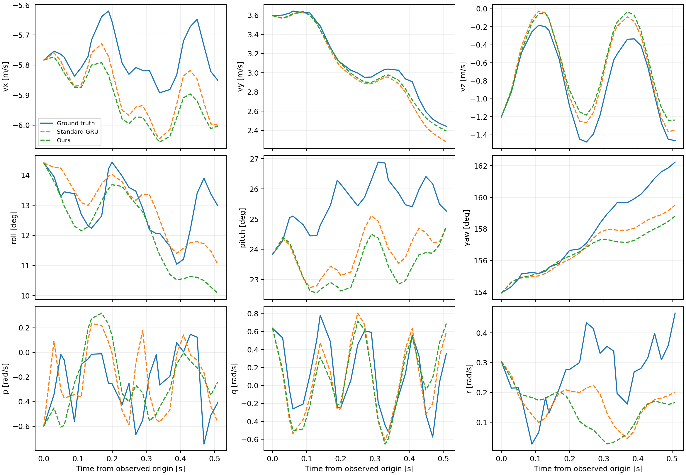
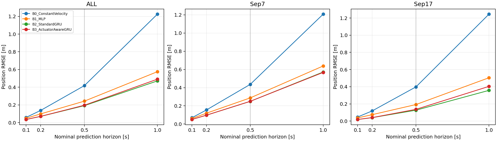
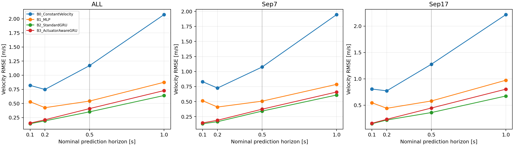
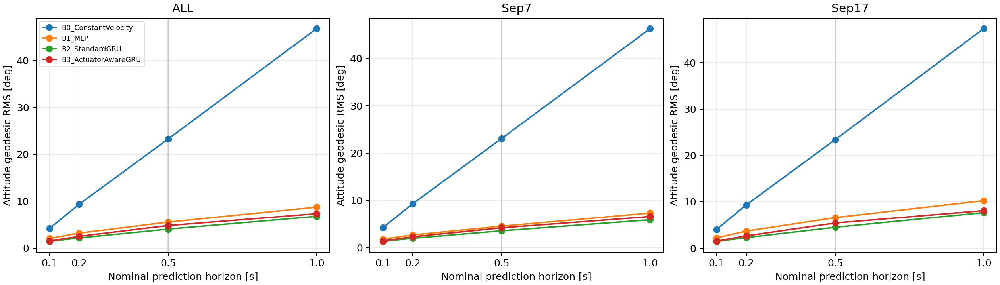
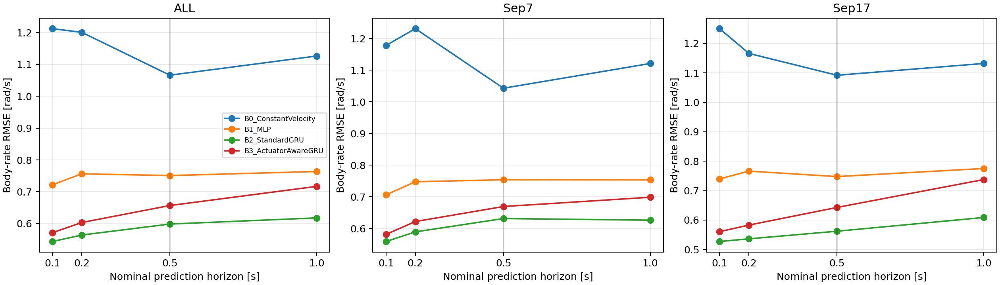

# Paper Experiment Step 1 — Baseline Comparison (single-replicate pilot)

## 1. Goal and status

Short-horizon dynamics modeling from real flight data. Primary horizon 0.5 s, supporting 0.1/0.2 s, extended 1.0 s. This is a single-replicate pilot, not final three-seed paper statistics. Ours was not modified, tuned or retrained. See [audit.md](audit.md) for the full implementation/data audit and [protocol.json](protocol.json) for exact provenance.

## 2. Dataset split

41 train flights / 28,293 windows; 17 validation flights / 2,582 identical origins across all models and all horizons. Sep7 has 9 validation flights; Sep17 has 8. Full flight identities and counts: [flight_coverage.csv](flight_coverage.csv). Complete sealed/reserved metadata lists are in the audit and protocol; no test data/results were read.

## 3. Models and formulas

B0: v(t+h)=v0, ω(t+h)=ω0, p(t+h)=p0+h v0, q(t+h)=normalize(q0 ⊗ [cos(|ω0|h/2), sin(|ω0|h/2) ω0/|ω0|]), with the continuous zero-rate limit. Existing constant-twist implementation integrates the actual dt values; flap frequency stays fixed. No fitted parameters.

B1: current normalized 12-state features plus four controls → existing 64×64 ReLU MLP → seven derivatives. No history or recurrent hidden state. The physical integrator, derivative scale/clipping and phase/frequency update are inherited from the existing recurrent model.

B2: existing GRU64 with the same 26-sample history, states/normalization, derivative head and physical integration. Raw normalized commands enter history encoding, current derivative prediction and the recurrent transition directly.

B3: frozen expanded Main V2, history-only GRU64 plus causal drive/tail filtered residuals (τ=0.10/0.04 s). Previous actuator state affects the current derivative; the current command updates the proxy for the next step. Base weights, gates, signs, τ, normalization and losses are unchanged.

| model | total | trainable | base_stage_trainable |
| --- | --- | --- | --- |
| B0_ConstantVelocity | 0 | 0 |  |
| B1_MLP | 5703 | 5703 |  |
| B2_StandardGRU | 21383 | 21383 |  |
| B3_ActuatorAwareGRU | 21376 | 1017 | 20359.00000 |

For Ours, total is deployment parameter count; trainable is its actuator-stage subset. Base-stage trainable count is reported separately.

## 4. Fairness controls and checkpoint selection

Selected schedule: **matched-budget**. Use every registered training window, train-only statistics bitwise matched to Ours, identical batch size and native dt, and the existing multi-step rollout/increment objective. Last epoch only, no validation early stopping, checkpoint ranking, per-metric selection or baseline-driven Ours tuning. All normalization uses training only.

This is a matched-budget model-family comparison, **not a strict single-factor actuator ablation**: Ours freezes its backbone during the actuator stage; generic models update all parameters and have no actuator-specific regularizer. MLP also differs in capacity and activation, so an MLP–GRU difference is consistent with temporal value but does not isolate memory alone. The actual random seeds are recorded by stage; Ours uses 17/29, and label 17 denotes the pilot replicate. A second-stage sampling seed 29 matches the historical Ours permutation protocol where that stage is used.

## 5. Primary and supporting results

Horizon labels are nominal 5/10/25/50 native steps. Actual elapsed time is integrated and recorded per origin; validation 25-step durations range 0.4887–0.5189 s. See [validation_horizon_timing.csv](validation_horizon_timing.csv). No resampling or time stretching was applied. All values below are equal-flight means of per-flight endpoint RMSE. Attitude is RMS geodesic angle in degrees. Vector errors sum all three squared axes before taking the per-flight RMS. Flight SD (ddof=1) is in [aggregate.csv](aggregate.csv); axes are in [summary.csv](summary.csv). No standard error based on window count is reported.


### ALL

| model | horizon_s | position_rmse_m | velocity_rmse_m_s | attitude_error_deg | body_rate_rmse_rad_s | delta_v_rmse_m_s | delta_omega_rmse_rad_s |
| --- | --- | --- | --- | --- | --- | --- | --- |
| B0_ConstantVelocity | 0.10000 | 0.05872 | 0.81960 | 4.15541 | 1.21208 | 0.81960 | 1.21208 |
| B0_ConstantVelocity | 0.20000 | 0.13779 | 0.74797 | 9.31332 | 1.20047 | 0.74797 | 1.20047 |
| B0_ConstantVelocity | 0.50000 | 0.41818 | 1.17071 | 23.24548 | 1.06599 | 1.17071 | 1.06599 |
| B0_ConstantVelocity | 1.00000 | 1.22493 | 2.07328 | 46.77787 | 1.12619 | 2.07328 | 1.12619 |
| B1_MLP | 0.10000 | 0.04943 | 0.52998 | 2.04605 | 0.72195 | 0.52998 | 0.72195 |
| B1_MLP | 0.20000 | 0.09838 | 0.42485 | 3.18587 | 0.75637 | 0.42485 | 0.75637 |
| B1_MLP | 0.50000 | 0.24279 | 0.54205 | 5.53087 | 0.75092 | 0.54205 | 0.75092 |
| B1_MLP | 1.00000 | 0.57521 | 0.87454 | 8.70368 | 0.76366 | 0.87454 | 0.76366 |
| B2_StandardGRU | 0.10000 | 0.03536 | 0.14036 | 1.38451 | 0.54389 | 0.14036 | 0.54389 |
| B2_StandardGRU | 0.20000 | 0.07037 | 0.19134 | 2.15392 | 0.56425 | 0.19134 | 0.56425 |
| B2_StandardGRU | 0.50000 | 0.19182 | 0.35121 | 4.03374 | 0.59871 | 0.35121 | 0.59871 |
| B2_StandardGRU | 1.00000 | 0.47101 | 0.63974 | 6.74367 | 0.61796 | 0.63974 | 0.61796 |
| B3_ActuatorAwareGRU | 0.10000 | 0.03540 | 0.15125 | 1.47802 | 0.57153 | 0.15125 | 0.57153 |
| B3_ActuatorAwareGRU | 0.20000 | 0.07073 | 0.21009 | 2.49966 | 0.60353 | 0.21009 | 0.60353 |
| B3_ActuatorAwareGRU | 0.50000 | 0.19651 | 0.40850 | 4.79614 | 0.65685 | 0.40850 | 0.65685 |
| B3_ActuatorAwareGRU | 1.00000 | 0.49050 | 0.72739 | 7.30260 | 0.71694 | 0.72739 | 0.71694 |

### Sep7

| model | horizon_s | position_rmse_m | velocity_rmse_m_s | attitude_error_deg | body_rate_rmse_rad_s | delta_v_rmse_m_s | delta_omega_rmse_rad_s |
| --- | --- | --- | --- | --- | --- | --- | --- |
| B0_ConstantVelocity | 0.10000 | 0.06890 | 0.83106 | 4.24495 | 1.17800 | 0.83106 | 1.17800 |
| B0_ConstantVelocity | 0.20000 | 0.15475 | 0.72543 | 9.28907 | 1.23092 | 0.72543 | 1.23092 |
| B0_ConstantVelocity | 0.50000 | 0.43567 | 1.07536 | 23.09190 | 1.04280 | 1.07536 | 1.04280 |
| B0_ConstantVelocity | 1.00000 | 1.20721 | 1.94501 | 46.28182 | 1.12091 | 1.94501 | 1.12091 |
| B1_MLP | 0.10000 | 0.06052 | 0.51466 | 1.84581 | 0.70612 | 0.51466 | 0.70612 |
| B1_MLP | 0.20000 | 0.11922 | 0.40985 | 2.71990 | 0.74756 | 0.40985 | 0.74756 |
| B1_MLP | 0.50000 | 0.28727 | 0.50747 | 4.57494 | 0.75371 | 0.50747 | 0.75371 |
| B1_MLP | 1.00000 | 0.63806 | 0.78646 | 7.32221 | 0.75338 | 0.78646 | 0.75338 |
| B2_StandardGRU | 0.10000 | 0.05014 | 0.13254 | 1.32149 | 0.55878 | 0.13254 | 0.55878 |
| B2_StandardGRU | 0.20000 | 0.09725 | 0.16625 | 2.01038 | 0.58916 | 0.16625 | 0.58916 |
| B2_StandardGRU | 0.50000 | 0.24940 | 0.34247 | 3.59587 | 0.63126 | 0.34247 | 0.63126 |
| B2_StandardGRU | 1.00000 | 0.57182 | 0.60888 | 5.91528 | 0.62614 | 0.60888 | 0.62614 |
| B3_ActuatorAwareGRU | 0.10000 | 0.05028 | 0.14591 | 1.43022 | 0.58117 | 0.14591 | 0.58117 |
| B3_ActuatorAwareGRU | 0.20000 | 0.09747 | 0.18992 | 2.33387 | 0.62180 | 0.18992 | 0.62180 |
| B3_ActuatorAwareGRU | 0.50000 | 0.24961 | 0.37415 | 4.21674 | 0.66924 | 0.37415 | 0.66924 |
| B3_ActuatorAwareGRU | 1.00000 | 0.56739 | 0.65909 | 6.58989 | 0.69848 | 0.65909 | 0.69848 |

### Sep17

| model | horizon_s | position_rmse_m | velocity_rmse_m_s | attitude_error_deg | body_rate_rmse_rad_s | delta_v_rmse_m_s | delta_omega_rmse_rad_s |
| --- | --- | --- | --- | --- | --- | --- | --- |
| B0_ConstantVelocity | 0.10000 | 0.04727 | 0.80671 | 4.05468 | 1.25042 | 0.80671 | 1.25042 |
| B0_ConstantVelocity | 0.20000 | 0.11871 | 0.77333 | 9.34059 | 1.16620 | 0.77333 | 1.16620 |
| B0_ConstantVelocity | 0.50000 | 0.39851 | 1.27797 | 23.41825 | 1.09207 | 1.27797 | 1.09207 |
| B0_ConstantVelocity | 1.00000 | 1.24488 | 2.21758 | 47.33592 | 1.13213 | 2.21758 | 1.13213 |
| B1_MLP | 0.10000 | 0.03694 | 0.54721 | 2.27132 | 0.73977 | 0.54721 | 0.73977 |
| B1_MLP | 0.20000 | 0.07494 | 0.44173 | 3.71008 | 0.76628 | 0.44173 | 0.76628 |
| B1_MLP | 0.50000 | 0.19275 | 0.58094 | 6.60629 | 0.74779 | 0.58094 | 0.74779 |
| B1_MLP | 1.00000 | 0.50451 | 0.97363 | 10.25783 | 0.77522 | 0.97363 | 0.77522 |
| B2_StandardGRU | 0.10000 | 0.01873 | 0.14916 | 1.45540 | 0.52714 | 0.14916 | 0.52714 |
| B2_StandardGRU | 0.20000 | 0.04014 | 0.21956 | 2.31541 | 0.53622 | 0.21956 | 0.53622 |
| B2_StandardGRU | 0.50000 | 0.12704 | 0.36104 | 4.52634 | 0.56209 | 0.36104 | 0.56209 |
| B2_StandardGRU | 1.00000 | 0.35760 | 0.67445 | 7.67561 | 0.60876 | 0.67445 | 0.60876 |
| B3_ActuatorAwareGRU | 0.10000 | 0.01865 | 0.15726 | 1.53179 | 0.56068 | 0.15726 | 0.56068 |
| B3_ActuatorAwareGRU | 0.20000 | 0.04064 | 0.23279 | 2.68617 | 0.58298 | 0.23279 | 0.58298 |
| B3_ActuatorAwareGRU | 0.50000 | 0.13676 | 0.44715 | 5.44798 | 0.64291 | 0.44715 | 0.64291 |
| B3_ActuatorAwareGRU | 1.00000 | 0.40399 | 0.80422 | 8.10439 | 0.73770 | 0.80422 | 0.73770 |

Δv and Δω are computed using the requested common true initial state. Their errors equal endpoint v and ω errors algebraically; these duplicate columns are included for transparency and do not provide independent evidence. The frozen training increment loss is a different, 40 ms supervision term; it is not retuned to the 500 ms reporting horizon.

## 6. Per-flight results

Full four-horizon results are in [per_flight.csv](per_flight.csv). Primary 500 ms values follow:

| cohort | log_id | model | position_rmse_m | velocity_rmse_m_s | attitude_error_deg | body_rate_rmse_rad_s |
| --- | --- | --- | --- | --- | --- | --- |
| Sep17 | 9.17数据/log_10_2026-9-17-06-34-34.ulg | B0_ConstantVelocity | 0.42234 | 1.39971 | 23.80366 | 1.05278 |
| Sep17 | 9.17数据/log_11_2026-9-17-06-40-30.ulg | B0_ConstantVelocity | 0.39931 | 1.26560 | 23.57535 | 1.11252 |
| Sep17 | 9.17数据/log_12_2026-9-17-06-46-02.ulg | B0_ConstantVelocity | 0.38497 | 1.24669 | 21.97221 | 1.13499 |
| Sep17 | 9.17数据/log_13_2026-9-17-06-52-30.ulg | B0_ConstantVelocity | 0.43686 | 1.42605 | 22.91369 | 1.12312 |
| Sep17 | 9.17数据/log_6_2026-9-17-06-02-24.ulg | B0_ConstantVelocity | 0.38355 | 1.19422 | 22.30807 | 0.95645 |
| Sep17 | 9.17数据/log_7_2026-9-17-06-12-16.ulg | B0_ConstantVelocity | 0.38556 | 1.20910 | 23.99706 | 1.05072 |
| Sep17 | 9.17数据/log_8_2026-9-17-06-17-52.ulg | B0_ConstantVelocity | 0.36746 | 1.17793 | 21.76258 | 1.10535 |
| Sep17 | 9.17数据/log_9_2026-9-17-06-28-10.ulg | B0_ConstantVelocity | 0.40802 | 1.30447 | 27.01342 | 1.20066 |
| Sep7 | 2026.9.7/log_21_2026-9-7-05-54-56.ulg | B0_ConstantVelocity | 0.33337 | 1.06978 | 22.11639 | 0.87688 |
| Sep7 | 2026.9.7/log_22_2026-9-7-06-01-40.ulg | B0_ConstantVelocity | 0.40457 | 0.95155 | 21.66962 | 1.04813 |
| Sep7 | 2026.9.7/log_23_2026-9-7-06-09-22.ulg | B0_ConstantVelocity | 0.34840 | 1.08832 | 24.51451 | 1.14447 |
| Sep7 | 2026.9.7/log_24_2026-9-7-06-16-04.ulg | B0_ConstantVelocity | 0.37584 | 1.15676 | 22.50406 | 1.06581 |
| Sep7 | 2026.9.7/log_26_2026-9-7-06-30-26.ulg | B0_ConstantVelocity | 0.35111 | 0.99369 | 21.17921 | 1.12010 |
| Sep7 | 2026.9.7/log_27_2026-9-7-06-37-24.ulg | B0_ConstantVelocity | 0.41802 | 1.09328 | 24.51863 | 1.05605 |
| Sep7 | 2026.9.7/log_28_2026-9-7-06-44-02.ulg | B0_ConstantVelocity | 0.54776 | 1.06959 | 23.21132 | 1.00728 |
| Sep7 | 2026.9.7/log_29_2026-9-7-06-51-04.ulg | B0_ConstantVelocity | 0.38104 | 1.09854 | 23.87585 | 1.06371 |
| Sep7 | 2026.9.7/log_30_2026-9-7-06-58-22.ulg | B0_ConstantVelocity | 0.76090 | 1.15672 | 24.23755 | 1.00279 |
| Sep17 | 9.17数据/log_10_2026-9-17-06-34-34.ulg | B1_MLP | 0.20810 | 0.64358 | 6.78119 | 0.77487 |
| Sep17 | 9.17数据/log_11_2026-9-17-06-40-30.ulg | B1_MLP | 0.17698 | 0.58301 | 6.74705 | 0.77838 |
| Sep17 | 9.17数据/log_12_2026-9-17-06-46-02.ulg | B1_MLP | 0.17320 | 0.52324 | 6.00280 | 0.78968 |
| Sep17 | 9.17数据/log_13_2026-9-17-06-52-30.ulg | B1_MLP | 0.20292 | 0.60902 | 7.18705 | 0.75476 |
| Sep17 | 9.17数据/log_6_2026-9-17-06-02-24.ulg | B1_MLP | 0.19065 | 0.55571 | 6.27520 | 0.65606 |
| Sep17 | 9.17数据/log_7_2026-9-17-06-12-16.ulg | B1_MLP | 0.19853 | 0.50081 | 6.39882 | 0.69424 |
| Sep17 | 9.17数据/log_8_2026-9-17-06-17-52.ulg | B1_MLP | 0.17671 | 0.55425 | 6.70944 | 0.74844 |
| Sep17 | 9.17数据/log_9_2026-9-17-06-28-10.ulg | B1_MLP | 0.21487 | 0.67791 | 6.74880 | 0.78593 |
| Sep7 | 2026.9.7/log_21_2026-9-7-05-54-56.ulg | B1_MLP | 0.15635 | 0.51013 | 4.89269 | 0.72450 |
| Sep7 | 2026.9.7/log_22_2026-9-7-06-01-40.ulg | B1_MLP | 0.29545 | 0.47082 | 4.84152 | 0.75964 |
| Sep7 | 2026.9.7/log_23_2026-9-7-06-09-22.ulg | B1_MLP | 0.15820 | 0.48903 | 5.07124 | 0.90765 |
| Sep7 | 2026.9.7/log_24_2026-9-7-06-16-04.ulg | B1_MLP | 0.18421 | 0.59241 | 5.86871 | 0.80014 |
| Sep7 | 2026.9.7/log_26_2026-9-7-06-30-26.ulg | B1_MLP | 0.18572 | 0.51223 | 4.25101 | 0.72960 |
| Sep7 | 2026.9.7/log_27_2026-9-7-06-37-24.ulg | B1_MLP | 0.26655 | 0.39999 | 3.58252 | 0.71850 |
| Sep7 | 2026.9.7/log_28_2026-9-7-06-44-02.ulg | B1_MLP | 0.44180 | 0.51516 | 4.04771 | 0.71740 |
| Sep7 | 2026.9.7/log_29_2026-9-7-06-51-04.ulg | B1_MLP | 0.22380 | 0.51117 | 4.02959 | 0.73030 |
| Sep7 | 2026.9.7/log_30_2026-9-7-06-58-22.ulg | B1_MLP | 0.67333 | 0.56632 | 4.58947 | 0.69562 |
| Sep17 | 9.17数据/log_10_2026-9-17-06-34-34.ulg | B2_StandardGRU | 0.13108 | 0.38397 | 4.98591 | 0.60615 |
| Sep17 | 9.17数据/log_11_2026-9-17-06-40-30.ulg | B2_StandardGRU | 0.12367 | 0.35901 | 4.50558 | 0.58230 |
| Sep17 | 9.17数据/log_12_2026-9-17-06-46-02.ulg | B2_StandardGRU | 0.11229 | 0.37032 | 4.22266 | 0.56453 |
| Sep17 | 9.17数据/log_13_2026-9-17-06-52-30.ulg | B2_StandardGRU | 0.13869 | 0.39187 | 5.04823 | 0.56903 |
| Sep17 | 9.17数据/log_6_2026-9-17-06-02-24.ulg | B2_StandardGRU | 0.12372 | 0.33559 | 4.67723 | 0.49880 |
| Sep17 | 9.17数据/log_7_2026-9-17-06-12-16.ulg | B2_StandardGRU | 0.13108 | 0.29860 | 4.08148 | 0.49335 |
| Sep17 | 9.17数据/log_8_2026-9-17-06-17-52.ulg | B2_StandardGRU | 0.12017 | 0.35947 | 4.27584 | 0.56189 |
| Sep17 | 9.17数据/log_9_2026-9-17-06-28-10.ulg | B2_StandardGRU | 0.13559 | 0.38951 | 4.41382 | 0.62067 |
| Sep7 | 2026.9.7/log_21_2026-9-7-05-54-56.ulg | B2_StandardGRU | 0.09125 | 0.34724 | 4.13654 | 0.65452 |
| Sep7 | 2026.9.7/log_22_2026-9-7-06-01-40.ulg | B2_StandardGRU | 0.27468 | 0.31824 | 3.90111 | 0.62602 |
| Sep7 | 2026.9.7/log_23_2026-9-7-06-09-22.ulg | B2_StandardGRU | 0.12267 | 0.30604 | 3.83189 | 0.73221 |
| Sep7 | 2026.9.7/log_24_2026-9-7-06-16-04.ulg | B2_StandardGRU | 0.11567 | 0.42828 | 4.13966 | 0.65110 |
| Sep7 | 2026.9.7/log_26_2026-9-7-06-30-26.ulg | B2_StandardGRU | 0.11671 | 0.31260 | 3.52284 | 0.59913 |
| Sep7 | 2026.9.7/log_27_2026-9-7-06-37-24.ulg | B2_StandardGRU | 0.23171 | 0.26970 | 3.02553 | 0.61640 |
| Sep7 | 2026.9.7/log_28_2026-9-7-06-44-02.ulg | B2_StandardGRU | 0.41985 | 0.28336 | 3.11108 | 0.60928 |
| Sep7 | 2026.9.7/log_29_2026-9-7-06-51-04.ulg | B2_StandardGRU | 0.20228 | 0.45626 | 3.13774 | 0.60041 |
| Sep7 | 2026.9.7/log_30_2026-9-7-06-58-22.ulg | B2_StandardGRU | 0.66980 | 0.36052 | 3.55642 | 0.59230 |
| Sep17 | 9.17数据/log_10_2026-9-17-06-34-34.ulg | B3_ActuatorAwareGRU | 0.13982 | 0.46068 | 5.78944 | 0.67017 |
| Sep17 | 9.17数据/log_11_2026-9-17-06-40-30.ulg | B3_ActuatorAwareGRU | 0.12998 | 0.46214 | 5.61930 | 0.67328 |
| Sep17 | 9.17数据/log_12_2026-9-17-06-46-02.ulg | B3_ActuatorAwareGRU | 0.12766 | 0.43487 | 5.32841 | 0.66976 |
| Sep17 | 9.17数据/log_13_2026-9-17-06-52-30.ulg | B3_ActuatorAwareGRU | 0.15385 | 0.49155 | 6.05446 | 0.63825 |
| Sep17 | 9.17数据/log_6_2026-9-17-06-02-24.ulg | B3_ActuatorAwareGRU | 0.11755 | 0.40215 | 5.33263 | 0.59767 |
| Sep17 | 9.17数据/log_7_2026-9-17-06-12-16.ulg | B3_ActuatorAwareGRU | 0.13793 | 0.36775 | 4.73032 | 0.55469 |
| Sep17 | 9.17数据/log_8_2026-9-17-06-17-52.ulg | B3_ActuatorAwareGRU | 0.13631 | 0.45593 | 5.11232 | 0.65769 |
| Sep17 | 9.17数据/log_9_2026-9-17-06-28-10.ulg | B3_ActuatorAwareGRU | 0.15103 | 0.50210 | 5.61693 | 0.68174 |
| Sep7 | 2026.9.7/log_21_2026-9-7-05-54-56.ulg | B3_ActuatorAwareGRU | 0.10393 | 0.37485 | 4.60863 | 0.67729 |
| Sep7 | 2026.9.7/log_22_2026-9-7-06-01-40.ulg | B3_ActuatorAwareGRU | 0.27240 | 0.37334 | 4.48399 | 0.64448 |
| Sep7 | 2026.9.7/log_23_2026-9-7-06-09-22.ulg | B3_ActuatorAwareGRU | 0.12716 | 0.38898 | 4.66219 | 0.78148 |
| Sep7 | 2026.9.7/log_24_2026-9-7-06-16-04.ulg | B3_ActuatorAwareGRU | 0.11277 | 0.48272 | 4.99983 | 0.69660 |
| Sep7 | 2026.9.7/log_26_2026-9-7-06-30-26.ulg | B3_ActuatorAwareGRU | 0.11808 | 0.34037 | 4.25573 | 0.64478 |
| Sep7 | 2026.9.7/log_27_2026-9-7-06-37-24.ulg | B3_ActuatorAwareGRU | 0.22921 | 0.28065 | 3.56071 | 0.63455 |
| Sep7 | 2026.9.7/log_28_2026-9-7-06-44-02.ulg | B3_ActuatorAwareGRU | 0.42090 | 0.32186 | 3.34069 | 0.64203 |
| Sep7 | 2026.9.7/log_29_2026-9-7-06-51-04.ulg | B3_ActuatorAwareGRU | 0.19664 | 0.42924 | 3.75928 | 0.64664 |
| Sep7 | 2026.9.7/log_30_2026-9-7-06-58-22.ulg | B3_ActuatorAwareGRU | 0.66541 | 0.37538 | 4.27959 | 0.65531 |

## 7. Failure cases and representative rollout

[failure_cases.csv](failure_cases.csv) retains the three largest velocity, attitude and body-rate endpoint errors for every model/cohort at 500 ms. No outlier is removed from any aggregate. These are descriptive failure cases, not exclusion gates.

The representative 500 ms rollout is selected by fixed middle index after lexicographic origin sorting, independently of model errors. Identity: [representative_selection.json](representative_selection.json). Euler angles are used only for display; metrics remain quaternion geodesic errors.












## 8. Interpretation

Positive reductions below mean Ours has lower macro RMSE than Standard GRU; negative values favor Standard GRU. No criterion is changed to favor Ours.

| cohort | position_rmse_m | velocity_rmse_m_s | attitude_error_deg | body_rate_rmse_rad_s |
| --- | --- | --- | --- | --- |
| ALL | -2.44446 | -16.31312 | -18.90069 | -9.71027 |
| Sep7 | -0.08425 | -9.25172 | -17.26616 | -6.01614 |
| Sep17 | -7.65727 | -23.84855 | -20.36153 | -14.37760 |

- ALL, 500 ms: B2_StandardGRU improves 4/4 metrics over B0_ConstantVelocity: position_rmse_m, velocity_rmse_m_s, attitude_error_deg, body_rate_rmse_rad_s.
- ALL, 500 ms: B2_StandardGRU improves 4/4 metrics over B1_MLP: position_rmse_m, velocity_rmse_m_s, attitude_error_deg, body_rate_rmse_rad_s.
- ALL, 500 ms: B3_ActuatorAwareGRU improves 0/4 metrics over B2_StandardGRU: none.
- Sep7, 500 ms: B2_StandardGRU improves 4/4 metrics over B0_ConstantVelocity: position_rmse_m, velocity_rmse_m_s, attitude_error_deg, body_rate_rmse_rad_s.
- Sep7, 500 ms: B2_StandardGRU improves 4/4 metrics over B1_MLP: position_rmse_m, velocity_rmse_m_s, attitude_error_deg, body_rate_rmse_rad_s.
- Sep7, 500 ms: B3_ActuatorAwareGRU improves 0/4 metrics over B2_StandardGRU: none.
- Sep17, 500 ms: B2_StandardGRU improves 4/4 metrics over B0_ConstantVelocity: position_rmse_m, velocity_rmse_m_s, attitude_error_deg, body_rate_rmse_rad_s.
- Sep17, 500 ms: B2_StandardGRU improves 4/4 metrics over B1_MLP: position_rmse_m, velocity_rmse_m_s, attitude_error_deg, body_rate_rmse_rad_s.
- Sep17, 500 ms: B3_ActuatorAwareGRU improves 0/4 metrics over B2_StandardGRU: none.


These are observed differences, not statistically established significance. Cross-flight patterns are supported descriptively by the paired per-flight table, not by treating correlated windows as repeated trials. Logged control replay alone cannot establish action-dependent causal effectiveness.

## 9. Limitations and next step

Single replicate; two validation days and correlated flights; already-used development cohorts; family/training differences noted above; observed logged feedback controls; uncertain absolute mechanical phase pose. No OOD, uncertainty, long-horizon, controller or RL claims. Endpoint increments are redundant with endpoint state errors. Full history favors temporal models by design and is intentionally absent from memoryless B1.

After all sanity checks pass, the pipeline can support additional seeds technically. Final-paper execution still requires explicitly freezing the matched-budget interpretation and a two-stage seed mapping for Ours (the existing 17/29 checkpoint is only one replicate). Do not describe this pilot as final mean±SD across seeds, and do not open sealed test yet. No ablation or additional seeds are started here.

## 10. Sanity and sealed-test status

See [sanity_checks.json](sanity_checks.json): finite arrays, normalized quaternions, full 51-state rollout length, native timestamps/integrated-dt alignment (nominal rather than exact wall-clock horizons), full causal history, unchanged checkpoint, identical origins, train-only normalization reproduction, future-label poisoning and 500 ms prefix parity. Automated synthetic tests additionally cover constant-velocity/quaternion integration, history-free MLP, increment identities, unknown cohort rejection and equal-flight aggregation under unequal window counts.

Only explicit train/validation Parquet files were opened. Six Sep8 sealed flights and 23 Sep19 reserved flights were not evaluated, used for training/selection, or opened for exploratory analysis. Their names were read solely from split metadata. Historical metadata inventory predates this run; no claim of universally unopened historical metadata is made.

## Reproduction

Use `/home/zn/anaconda3/envs/flap-train-gpu/bin/python`, without dependency changes:

```bash
python scripts/run_paper_baseline_comparison.py --phase audit
python scripts/run_paper_baseline_comparison.py --phase run --schedule matched-budget
python scripts/report_paper_baseline_comparison.py
```

The runner refuses to overwrite completed summary results. Full predictions, per-origin metrics, reusable prepared batches, training histories and learned checkpoints are under `artifacts/paper_baseline_comparison_v1/`. Source/data/model hashes accompany the protocol because the starting workspace was already dirty.

## Completion verification and inherited exclusions

All four model/horizon/cohort grids, training epochs, optimizer-step counts and finite metrics were checked automatically after training exited. Full training histories remain under the artifact directory. No training-time monitoring or validation-based selection was performed by this finalizer.

Three additional historical exclusions inherited from the September v2 configuration (names only, not newly opened):

- `2026.9.6/log_15_2026-9-6-17-48-14.ulg`
- `2026.9.8/log_3_2026-9-8-06-03-36.ulg`
- `2026.9.8/log_8_2026-9-8-07-00-42.ulg`

The physical phase feature is encoder-count-derived relative phase re-anchored at the prediction origin. Logged Hall/wing-phase metadata does not imply that this frozen network consumes absolute mechanical phase.

Frozen Ours evaluator parity with 5,164 existing validation endpoints is recorded in `frozen_ours_evaluator_parity.json`; maximum differences are at CPU/GPU rounding scale. `unit_tests.json` records 29 passing focused tests.

Suggested commit message: `feat: add frozen short-horizon paper baseline pilot`
