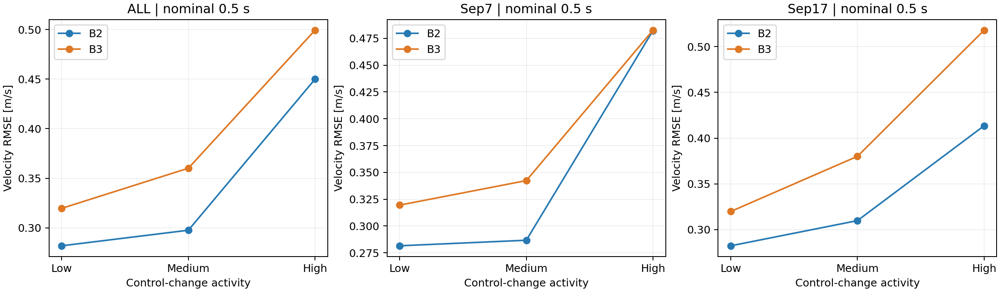
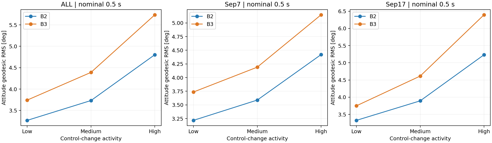
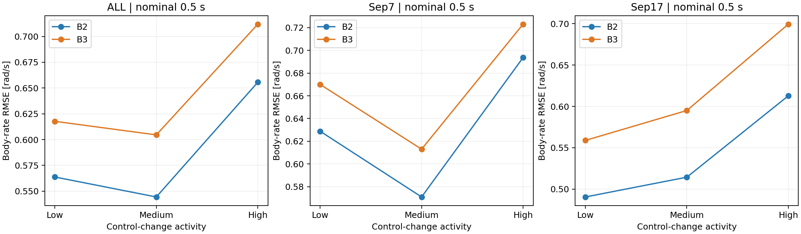
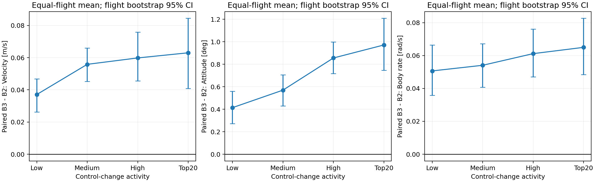
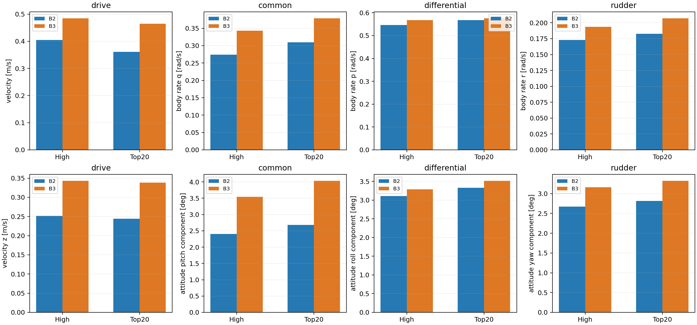

# Paper Experiment Step 2 — Control-Conditioned Evaluation

## Conclusion: Outcome C for the frozen pilot

There is no evidence that actuator-aware B3 gains a stable prediction advantage under stronger control changes. At nominal 500 ms, B2 is better on velocity, attitude and aggregate body rate in Low, Medium, High and Top20. For High and Top20, both equal-flight mean paired-origin error and paired per-flight RMSE differences favor B2, and their flight-bootstrap 95% intervals are above zero. Most flights agree. The channel-associated 500 ms point estimates also favor B2; differential Top20 p-rate has a CI crossing zero and should be treated as unresolved, not as a proven B2 gain.

This is not a claim that B2 wins every cell: Low-activity 500 ms position slightly favors B3; Sep7 Top20 velocity slightly favors B3 (−0.003842 m/s, 95% flight CI [−0.069219, +0.052717]), while Sep7 High velocity is effectively tied (+0.000375 m/s, CI [−0.041897, +0.041576]); some individual flights and shorter-horizon/channel cells favor B3. Those exceptions do not establish the proposed high-excitation advantage. Do not retune tau, normalization, signs, B2 or B3 to rescue a preferred narrative.

For paper planning, the supported next decision is to designate Standard GRU as the main method, with actuator-aware results as negative ablation/discussion/supplementary. This run does **not** implement that next step, launch training/seeds or open sealed test. The finding concerns these frozen single-replicate models, not a universal theorem about actuator-aware architectures.

## 1. Scope, frozen origins and prediction reuse

Source: `docs/analysis/results/paper_baseline_comparison_v1/`, committed in `cdf7625`. Exactly 2,582 origins from 17 validation flights, Sep7 (9 flights / 1,481 origins) and Sep17 (8 / 1,101). No new origins, filtering by errors, model inference or training. The two saved prediction arrays are joined to the SAME frozen window IDs and future truth and passed through the existing `endpoint_metrics` implementation. Per-origin metric parity and all unconditioned macro results reproduce Step 1. Checkpoint, baseline-output, origin and data hashes are checked before and after the run.

The 5/10/25/50 native steps are nominal 0.1/0.2/0.5/1.0 s; integrate the original timestamps, no resampling. Primary 500 ms actual spans are 0.488664–0.518876 s. 1 s is supplementary only. Only `samples_validation.parquet` and `windows_validation.parquet` are read from the registered expanded September dataset. Training data are not reread: existing train-only normalization buffers supply the activity scales.

## 2. Actual control semantics

Raw logged and dataset/model tape order:

| index | logged source | dataset meaning |
|---|---|---|
| 0 | actuator_motors.control[0] | normalized flapping-drive motor setpoint; **not a Hz command** |
| 1 | actuator_servos.control[0] | left elevon normalized command |
| 2 | actuator_servos.control[1] | right elevon normalized command |
| 3 | actuator_servos.control[2] | rudder normalized command |

These are post-allocation normalized setpoints, not measured servo angles and not `actuator_outputs` PWM. The extractor uses causal publication-time zero-order hold and copies these values without PWM conversion or a second reversal. The September configuration maps Servo1/Servo2/Motor1/Servo3 to MAIN1/MAIN2/MAIN3/MAIN5. `PWM_MAIN_REV=17` reverses MAIN1 and MAIN5 in the downstream output driver. Thus normalization into the actuator topic's dimensionless range has already occurred upstream, while PWM reversal is downstream of the logged coordinates. Do not multiply the logged left/rudder signs again. Measured flap frequency is a state/target, not a future command used for this grouping.

B2 standardizes `[motor,left,right,rudder]` with its frozen train means/stds. B3 uses the history-only state backbone, plus a normalized motor drive proxy and normalized tail coordinates. Conditional statistics use those exact pre-PWM command coordinates, before lag filters:

`u_drive = motor`

`u_common = (left + right) / 2`

`u_differential = (left - right) / 2`

`u_rudder = rudder`

The independent-coordinate terminology refers to an invertible command decomposition, not statistically independent inputs. Channels co-vary in closed-loop flight. Surface-angle calibration in degrees is unavailable, and common/q, differential/p, rudder/r associations do not isolate aerodynamic causality.

Local source evidence: `data/trajectory_dataset.py::CONTROL_COLUMNS` and `extract_trajectory_samples`; `models/trajectory_main_v2.py::transform_tail_controls`; `training/trajectory_main_v2.py::fit_main_v2_stats`; `configs/data/trajectory_september_v2.yaml`. The original September firmware `c9af571575af33d5403fbb479256848797c801e2` and all Sep17 validation flights' firmware `a644ca7868f07004e45658d4ae9a7a8c880c6bb5` were inspected locally (hashes/excerpts in `control_semantics_evidence.json`): `msg/versioned/ActuatorServos.msg`, `src/lib/mixer_module/functions/FunctionServos.hpp`, and `mixer_module.cpp::output_limit_calc_single` put reversal after actuator-topic consumption. No PX4 source or controller was edited.

## 3. Control-only activity protocol

For horizon K, only the applied tape `u[0:K]` is used. The command at the endpoint `u[K]` cannot influence that endpoint and is excluded. For each transformed channel j:

- Magnitude: `sqrt(mean_k((u_j[k]-mu_train,j)^2))`.
- Change: `D_j = max_k |u_j[k]-u_j[0]|`.
- Total variation: `TV_j = sum_k |u_j[k+1]-u_j[k]|` (saved as a descriptive diagnostic).
- Normalized channel score: `D_j / sigma_train,j`.
- Overall score: `sqrt(mean_j((D_j/sigma_train,j)^2))`.

The reference/scale are frozen B3 train statistics, originally fitted on training history and future-control rows, including the original overlapping-window weighting. Motor uses backbone control statistics; common/differential/rudder use tail statistics. No statistics are refitted, and neither model nor its normalization is changed. Constant large commands can have high magnitude but exactly zero change/TV; they cannot qualify as strong excitation through magnitude alone.

| channel | reference | scale |
| --- | --- | --- |
| drive | 0.68657 | 0.09660 |
| common | -0.00206 | 0.11486 |
| differential | -0.13653 | 0.28100 |
| rudder | -0.04773 | 0.12501 |

Quantiles are defined independently for each horizon from all validation **controls only**, and reused unchanged for ALL, Sep7 and Sep17. Low: score ≤ q33; Medium: q33 < score ≤ q67; High: score > q67. Top20: score ≥ q80 and strictly positive. Linear quantiles; ties retained, so realized proportions can differ in degenerate data. Thresholds and the entire `origin_activity.csv` were written before loading model errors. No alternative score was selected after looking at results. “High excitation” here means relatively large command changes, not a persistently exciting open-loop identification input.

Thresholds:

| horizon_s | channel | q33 | q67 | q80 | low | medium | high | top20 | zero_score |
| --- | --- | --- | --- | --- | --- | --- | --- | --- | --- |
| 0.10000 | overall | 0.13897 | 0.18985 | 0.21854 | 852 | 878 | 852 | 517 | 0 |
| 0.10000 | drive | 0.00000 | 0.07762 | 0.10771 | 917 | 813 | 852 | 517 | 917 |
| 0.10000 | common | 0.17286 | 0.26693 | 0.32454 | 852 | 878 | 852 | 517 | 0 |
| 0.10000 | differential | 0.11181 | 0.20837 | 0.26353 | 852 | 878 | 852 | 517 | 0 |
| 0.10000 | rudder | 0.05368 | 0.10401 | 0.13772 | 852 | 878 | 852 | 517 | 0 |
| 0.20000 | overall | 0.21210 | 0.27686 | 0.31376 | 852 | 878 | 852 | 517 | 0 |
| 0.20000 | drive | 0.01035 | 0.13871 | 0.22886 | 925 | 805 | 852 | 517 | 687 |
| 0.20000 | common | 0.25816 | 0.36384 | 0.42566 | 852 | 878 | 852 | 517 | 0 |
| 0.20000 | differential | 0.19716 | 0.32035 | 0.38749 | 852 | 878 | 852 | 517 | 0 |
| 0.20000 | rudder | 0.09486 | 0.16734 | 0.22243 | 852 | 878 | 852 | 517 | 0 |
| 0.50000 | overall | 0.31572 | 0.44166 | 0.51248 | 852 | 878 | 852 | 517 | 0 |
| 0.50000 | drive | 0.02070 | 0.31321 | 0.49090 | 999 | 731 | 852 | 517 | 453 |
| 0.50000 | common | 0.33554 | 0.47464 | 0.56532 | 852 | 878 | 852 | 517 | 0 |
| 0.50000 | differential | 0.31634 | 0.50387 | 0.64882 | 852 | 878 | 852 | 517 | 0 |
| 0.50000 | rudder | 0.16155 | 0.29073 | 0.38228 | 852 | 878 | 852 | 517 | 0 |

## 4. Coverage and flight/cohort balance

Overall bins at each primary horizon:

| channel | activity_bin | horizon_s | cohort | n_origins | n_flights | Sep7_origins | Sep17_origins | max_flight_origin_fraction |
| --- | --- | --- | --- | --- | --- | --- | --- | --- |
| overall | Low | 0.10000 | ALL | 852 | 17 | 551 | 301 | 0.09859 |
| overall | Medium | 0.10000 | ALL | 878 | 17 | 557 | 321 | 0.08884 |
| overall | High | 0.10000 | ALL | 852 | 17 | 373 | 479 | 0.09507 |
| overall | Top20 | 0.10000 | ALL | 517 | 17 | 210 | 307 | 0.11799 |
| overall | Low | 0.20000 | ALL | 852 | 17 | 660 | 192 | 0.10446 |
| overall | Medium | 0.20000 | ALL | 878 | 17 | 476 | 402 | 0.08542 |
| overall | High | 0.20000 | ALL | 852 | 17 | 345 | 507 | 0.09742 |
| overall | Top20 | 0.20000 | ALL | 517 | 17 | 203 | 314 | 0.12186 |
| overall | Low | 0.50000 | ALL | 852 | 17 | 693 | 159 | 0.13146 |
| overall | Medium | 0.50000 | ALL | 878 | 17 | 465 | 413 | 0.08998 |
| overall | High | 0.50000 | ALL | 852 | 17 | 323 | 529 | 0.10329 |
| overall | Top20 | 0.50000 | ALL | 517 | 17 | 202 | 315 | 0.11992 |

All overall bins retain all 17 flights. At 500 ms High has 323 Sep7 + 529 Sep17 origins; Top20 has 202 + 315. High/Top20 are relatively enriched in Sep17, so separate cohort results are required and provided. Their largest individual-flight shares are about 10.3%/12.0%, not one-flight dominance. Drive High/Top20 include 16 flights; all other 500 ms channel High/Top20 subsets include 17. Missing-flight coverage is explicit, not filled with zero error. Full coverage is in `bin_coverage.csv`; flight rows in `per_flight_all_bins.csv` preserve sparse contributions.

Channel coverage at 500 ms:

| channel | activity_bin | horizon_s | cohort | n_origins | n_flights | Sep7_origins | Sep17_origins | max_flight_origin_fraction |
| --- | --- | --- | --- | --- | --- | --- | --- | --- |
| drive | High | 0.50000 | ALL | 852 | 16 | 238 | 614 | 0.10915 |
| drive | Top20 | 0.50000 | ALL | 517 | 16 | 145 | 372 | 0.11219 |
| common | High | 0.50000 | ALL | 852 | 17 | 372 | 480 | 0.09155 |
| common | Top20 | 0.50000 | ALL | 517 | 17 | 218 | 299 | 0.09865 |
| differential | High | 0.50000 | ALL | 852 | 17 | 416 | 436 | 0.08333 |
| differential | Top20 | 0.50000 | ALL | 517 | 17 | 241 | 276 | 0.11219 |
| rudder | High | 0.50000 | ALL | 852 | 17 | 384 | 468 | 0.09977 |
| rudder | Top20 | 0.50000 | ALL | 517 | 17 | 237 | 280 | 0.11219 |

## 5. Overall conditional results, all primary horizons and cohorts

RMSE convention matches Step 1: vector error norm per origin, RMS within each flight, then equal-flight macro mean. Attitude is sign-safe quaternion geodesic RMS in degrees. No window-count weighting of flights. Δv and Δω errors equal endpoint v and ω errors under the common observed initial state; repeated columns are not additional independent evidence.


### ALL

| horizon_s | activity_bin | model | position_rmse_m | velocity_rmse_m_s | attitude_error_deg | body_rate_rmse_rad_s | delta_v_rmse_m_s | delta_omega_rmse_rad_s |
| --- | --- | --- | --- | --- | --- | --- | --- | --- |
| 0.10000 | Low | B2 | 0.02930 | 0.11103 | 1.25232 | 0.50427 | 0.11103 | 0.50427 |
| 0.10000 | Low | B3 | 0.02933 | 0.12268 | 1.32425 | 0.54345 | 0.12268 | 0.54345 |
| 0.10000 | Medium | B2 | 0.03604 | 0.11710 | 1.34664 | 0.51278 | 0.11710 | 0.51278 |
| 0.10000 | Medium | B3 | 0.03613 | 0.13015 | 1.42567 | 0.53581 | 0.13015 | 0.53581 |
| 0.10000 | High | B2 | 0.03873 | 0.17633 | 1.51223 | 0.58356 | 0.17633 | 0.58356 |
| 0.10000 | High | B3 | 0.03878 | 0.18570 | 1.63561 | 0.60784 | 0.18570 | 0.60784 |
| 0.10000 | Top20 | B2 | 0.04230 | 0.19438 | 1.60929 | 0.61165 | 0.19438 | 0.61165 |
| 0.10000 | Top20 | B3 | 0.04243 | 0.20298 | 1.73721 | 0.63161 | 0.20298 | 0.63161 |
| 0.20000 | Low | B2 | 0.06871 | 0.15562 | 1.91791 | 0.56914 | 0.15562 | 0.56914 |
| 0.20000 | Low | B3 | 0.06904 | 0.18223 | 2.16482 | 0.60530 | 0.18223 | 0.60530 |
| 0.20000 | Medium | B2 | 0.05810 | 0.15567 | 1.94909 | 0.55774 | 0.15567 | 0.55774 |
| 0.20000 | Medium | B3 | 0.05834 | 0.17734 | 2.24481 | 0.59407 | 0.17734 | 0.59407 |
| 0.20000 | High | B2 | 0.08086 | 0.24199 | 2.50231 | 0.56671 | 0.24199 | 0.56671 |
| 0.20000 | High | B3 | 0.08145 | 0.25447 | 2.92991 | 0.61183 | 0.25447 | 0.61183 |
| 0.20000 | Top20 | B2 | 0.07983 | 0.27260 | 2.71796 | 0.60075 | 0.27260 | 0.60075 |
| 0.20000 | Top20 | B3 | 0.08109 | 0.28329 | 3.19501 | 0.64454 | 0.28329 | 0.64454 |
| 0.50000 | Low | B2 | 0.19005 | 0.28187 | 3.26813 | 0.56373 | 0.28187 | 0.56373 |
| 0.50000 | Low | B3 | 0.18843 | 0.31963 | 3.74179 | 0.61773 | 0.31963 | 0.61773 |
| 0.50000 | Medium | B2 | 0.16062 | 0.29756 | 3.73216 | 0.54436 | 0.29756 | 0.54436 |
| 0.50000 | Medium | B3 | 0.16317 | 0.36011 | 4.39040 | 0.60457 | 0.36011 | 0.60457 |
| 0.50000 | High | B2 | 0.22490 | 0.44991 | 4.80374 | 0.65559 | 0.44991 | 0.65559 |
| 0.50000 | High | B3 | 0.23165 | 0.49929 | 5.73624 | 0.71191 | 0.49929 | 0.71191 |
| 0.50000 | Top20 | B2 | 0.24900 | 0.51562 | 5.15072 | 0.69532 | 0.51562 | 0.69532 |
| 0.50000 | Top20 | B3 | 0.25716 | 0.56567 | 6.20834 | 0.75117 | 0.56567 | 0.75117 |

### Sep7

| horizon_s | activity_bin | model | position_rmse_m | velocity_rmse_m_s | attitude_error_deg | body_rate_rmse_rad_s | delta_v_rmse_m_s | delta_omega_rmse_rad_s |
| --- | --- | --- | --- | --- | --- | --- | --- | --- |
| 0.10000 | Low | B2 | 0.04031 | 0.10782 | 1.26095 | 0.56995 | 0.10782 | 0.56995 |
| 0.10000 | Low | B3 | 0.04021 | 0.12226 | 1.32910 | 0.60402 | 0.12226 | 0.60402 |
| 0.10000 | Medium | B2 | 0.05227 | 0.10450 | 1.30154 | 0.53499 | 0.10450 | 0.53499 |
| 0.10000 | Medium | B3 | 0.05248 | 0.11944 | 1.43093 | 0.54664 | 0.11944 | 0.54664 |
| 0.10000 | High | B2 | 0.05524 | 0.17668 | 1.42641 | 0.56536 | 0.17668 | 0.56536 |
| 0.10000 | High | B3 | 0.05551 | 0.18769 | 1.56306 | 0.58528 | 0.18769 | 0.58528 |
| 0.10000 | Top20 | B2 | 0.06174 | 0.19518 | 1.51879 | 0.59827 | 0.19518 | 0.59827 |
| 0.10000 | Top20 | B3 | 0.06223 | 0.20722 | 1.63601 | 0.61978 | 0.20722 | 0.61978 |
| 0.20000 | Low | B2 | 0.09735 | 0.14157 | 1.87711 | 0.59423 | 0.14157 | 0.59423 |
| 0.20000 | Low | B3 | 0.09739 | 0.17232 | 2.16159 | 0.61878 | 0.17232 | 0.61878 |
| 0.20000 | Medium | B2 | 0.07892 | 0.14190 | 1.91580 | 0.58562 | 0.14190 | 0.58562 |
| 0.20000 | Medium | B3 | 0.07852 | 0.16702 | 2.23610 | 0.62619 | 0.16702 | 0.62619 |
| 0.20000 | High | B2 | 0.11306 | 0.22343 | 2.36297 | 0.59086 | 0.22343 | 0.59086 |
| 0.20000 | High | B3 | 0.11394 | 0.23885 | 2.73406 | 0.62409 | 0.23885 | 0.62409 |
| 0.20000 | Top20 | B2 | 0.10855 | 0.25147 | 2.50454 | 0.62570 | 0.25147 | 0.62570 |
| 0.20000 | Top20 | B3 | 0.11042 | 0.26530 | 2.87851 | 0.65180 | 0.26530 | 0.65180 |
| 0.50000 | Low | B2 | 0.25517 | 0.28153 | 3.21670 | 0.62882 | 0.28153 | 0.62882 |
| 0.50000 | Low | B3 | 0.25433 | 0.31947 | 3.73570 | 0.67002 | 0.31947 | 0.67002 |
| 0.50000 | Medium | B2 | 0.20697 | 0.28671 | 3.58834 | 0.57097 | 0.28671 | 0.57097 |
| 0.50000 | Medium | B3 | 0.20688 | 0.34233 | 4.19088 | 0.61303 | 0.34233 | 0.61303 |
| 0.50000 | High | B2 | 0.30024 | 0.48223 | 4.42097 | 0.69362 | 0.48223 | 0.69362 |
| 0.50000 | High | B3 | 0.29943 | 0.48261 | 5.14940 | 0.72302 | 0.48261 | 0.72302 |
| 0.50000 | Top20 | B2 | 0.33037 | 0.55848 | 4.75123 | 0.75757 | 0.55848 | 0.75757 |
| 0.50000 | Top20 | B3 | 0.32964 | 0.55464 | 5.49099 | 0.78889 | 0.55464 | 0.78889 |

### Sep17

| horizon_s | activity_bin | model | position_rmse_m | velocity_rmse_m_s | attitude_error_deg | body_rate_rmse_rad_s | delta_v_rmse_m_s | delta_omega_rmse_rad_s |
| --- | --- | --- | --- | --- | --- | --- | --- | --- |
| 0.10000 | Low | B2 | 0.01692 | 0.11464 | 1.24261 | 0.43038 | 0.11464 | 0.43038 |
| 0.10000 | Low | B3 | 0.01710 | 0.12315 | 1.31880 | 0.47530 | 0.12315 | 0.47530 |
| 0.10000 | Medium | B2 | 0.01778 | 0.13128 | 1.39738 | 0.48779 | 0.13128 | 0.48779 |
| 0.10000 | Medium | B3 | 0.01775 | 0.14220 | 1.41974 | 0.52362 | 0.14220 | 0.52362 |
| 0.10000 | High | B2 | 0.02015 | 0.17593 | 1.60877 | 0.60403 | 0.17593 | 0.60403 |
| 0.10000 | High | B3 | 0.01997 | 0.18346 | 1.71722 | 0.63322 | 0.18346 | 0.63322 |
| 0.10000 | Top20 | B2 | 0.02042 | 0.19348 | 1.71112 | 0.62669 | 0.19348 | 0.62669 |
| 0.10000 | Top20 | B3 | 0.02015 | 0.19822 | 1.85106 | 0.64492 | 0.19822 | 0.64492 |
| 0.20000 | Low | B2 | 0.03649 | 0.17142 | 1.96380 | 0.54091 | 0.17142 | 0.54091 |
| 0.20000 | Low | B3 | 0.03716 | 0.19338 | 2.16844 | 0.59012 | 0.19338 | 0.59012 |
| 0.20000 | Medium | B2 | 0.03468 | 0.17116 | 1.98655 | 0.52637 | 0.17116 | 0.52637 |
| 0.20000 | Medium | B3 | 0.03564 | 0.18894 | 2.25461 | 0.55793 | 0.18894 | 0.55793 |
| 0.20000 | High | B2 | 0.04463 | 0.26288 | 2.65906 | 0.53954 | 0.26288 | 0.53954 |
| 0.20000 | High | B3 | 0.04490 | 0.27204 | 3.15025 | 0.59804 | 0.27204 | 0.59804 |
| 0.20000 | Top20 | B2 | 0.04753 | 0.29636 | 2.95807 | 0.57268 | 0.29636 | 0.57268 |
| 0.20000 | Top20 | B3 | 0.04810 | 0.30354 | 3.55106 | 0.63637 | 0.30354 | 0.63637 |
| 0.50000 | Low | B2 | 0.11679 | 0.28225 | 3.32600 | 0.49052 | 0.28225 | 0.49052 |
| 0.50000 | Low | B3 | 0.11429 | 0.31982 | 3.74864 | 0.55890 | 0.31982 | 0.55890 |
| 0.50000 | Medium | B2 | 0.10847 | 0.30977 | 3.89396 | 0.51443 | 0.30977 | 0.51443 |
| 0.50000 | Medium | B3 | 0.11401 | 0.38010 | 4.61486 | 0.59505 | 0.38010 | 0.59505 |
| 0.50000 | High | B2 | 0.14014 | 0.41354 | 5.23435 | 0.61281 | 0.41354 | 0.61281 |
| 0.50000 | High | B3 | 0.15539 | 0.51806 | 6.39644 | 0.69940 | 0.51806 | 0.69940 |
| 0.50000 | Top20 | B2 | 0.15745 | 0.46740 | 5.60014 | 0.62528 | 0.46740 | 0.62528 |
| 0.50000 | Top20 | B3 | 0.17562 | 0.57808 | 7.01536 | 0.70873 | 0.57808 | 0.70873 |

## 6. Paired errors and flight bootstrap

For every matched origin, `delta_e = error_B3 - error_B2`; negative favors B3. The pooled origin mean/median/win fraction below are descriptive, not independent-trial statistics. Flight-level estimands and CIs are separate:

1. Mean paired-origin error: compute mean delta_e inside each flight, then average flights equally.
2. Paired flight RMSE difference: compute each model's RMSE inside each flight, subtract B2 from B3, then average flights equally. This equals the difference between conditional summary macro values.

10,000 bootstrap draws resample whole flights within Sep7/Sep17, retaining each represented stratum's flight count. Percentile 95% intervals; fixed control bins; no window bootstrap. The bootstrap RNG seed 17023 is a statistics seed, not an added model seed. Only two days are represented; within-day dependence can make intervals optimistic. Threshold and model-training uncertainty are not included. Channel/horizon comparisons are descriptive and are not multiplicity-adjusted significance tests.

Primary paired results (all bins, 500 ms):

| activity_bin | metric | origin_pooled_mean_difference | origin_pooled_median_difference | origin_pooled_B3_win_fraction | flight_equal_mean_paired_difference | mean_paired_ci95_low | mean_paired_ci95_high |
| --- | --- | --- | --- | --- | --- | --- | --- |
| Low | velocity_rmse_m_s | 0.03870 | 0.03497 | 0.37441 | 0.03709 | 0.02628 | 0.04687 |
| Low | attitude_error_deg | 0.47468 | 0.44344 | 0.33451 | 0.41396 | 0.27155 | 0.55878 |
| Low | body_rate_rmse_rad_s | 0.03819 | 0.02439 | 0.43427 | 0.05065 | 0.03586 | 0.06646 |
| Medium | velocity_rmse_m_s | 0.05787 | 0.05181 | 0.32688 | 0.05585 | 0.04519 | 0.06603 |
| Medium | attitude_error_deg | 0.57476 | 0.43040 | 0.36902 | 0.56960 | 0.43058 | 0.70608 |
| Medium | body_rate_rmse_rad_s | 0.05721 | 0.04704 | 0.37130 | 0.05407 | 0.04072 | 0.06719 |
| High | velocity_rmse_m_s | 0.07435 | 0.06406 | 0.34038 | 0.05983 | 0.04557 | 0.07581 |
| High | attitude_error_deg | 0.89481 | 0.74575 | 0.33451 | 0.85560 | 0.71737 | 0.99892 |
| High | body_rate_rmse_rad_s | 0.06826 | 0.05917 | 0.37089 | 0.06115 | 0.04705 | 0.07604 |
| Top20 | velocity_rmse_m_s | 0.08146 | 0.07434 | 0.33462 | 0.06302 | 0.04093 | 0.08446 |
| Top20 | attitude_error_deg | 1.05721 | 0.91723 | 0.30174 | 0.97127 | 0.74649 | 1.20849 |
| Top20 | body_rate_rmse_rad_s | 0.06861 | 0.06140 | 0.38298 | 0.06498 | 0.04839 | 0.08264 |

High and Top20 flight-RMSE differences and robustness:

| activity_bin | metric | flight_equal_mean_RMSE_difference | RMSE_difference_ci95_low | RMSE_difference_ci95_high | B3_flight_wins | B2_flight_wins | flight_ties |
| --- | --- | --- | --- | --- | --- | --- | --- |
| High | velocity_rmse_m_s | 0.04938 | 0.02518 | 0.07300 | 5 | 12 | 0 |
| High | attitude_error_deg | 0.93250 | 0.75428 | 1.11514 | 1 | 16 | 0 |
| High | body_rate_rmse_rad_s | 0.05632 | 0.04276 | 0.07051 | 1 | 16 | 0 |
| Top20 | velocity_rmse_m_s | 0.05005 | 0.01176 | 0.08486 | 4 | 13 | 0 |
| Top20 | attitude_error_deg | 1.05762 | 0.77798 | 1.37050 | 2 | 15 | 0 |
| Top20 | body_rate_rmse_rad_s | 0.05585 | 0.03785 | 0.07532 | 2 | 15 | 0 |

Individual-flight High/Top20 results, overall score at 500 ms:

| activity_bin | log_id | cohort | n_origins | metric | B2_error | B3_error | delta |
| --- | --- | --- | --- | --- | --- | --- | --- |
| High | 2026.9.7/log_21_2026-9-7-05-54-56.ulg | Sep7 | 41 | velocity_rmse_m_s | 0.52376 | 0.51685 | -0.00691 |
| High | 2026.9.7/log_21_2026-9-7-05-54-56.ulg | Sep7 | 41 | attitude_error_deg | 5.06898 | 5.83519 | 0.76621 |
| High | 2026.9.7/log_21_2026-9-7-05-54-56.ulg | Sep7 | 41 | body_rate_rmse_rad_s | 0.72023 | 0.79532 | 0.07509 |
| High | 2026.9.7/log_21_2026-9-7-05-54-56.ulg | Sep7 | 41 | delta_v_rmse_m_s | 0.52376 | 0.51685 | -0.00691 |
| High | 2026.9.7/log_21_2026-9-7-05-54-56.ulg | Sep7 | 41 | delta_omega_rmse_rad_s | 0.72023 | 0.79532 | 0.07509 |
| High | 2026.9.7/log_22_2026-9-7-06-01-40.ulg | Sep7 | 42 | velocity_rmse_m_s | 0.33792 | 0.40456 | 0.06664 |
| High | 2026.9.7/log_22_2026-9-7-06-01-40.ulg | Sep7 | 42 | attitude_error_deg | 4.19692 | 4.96721 | 0.77029 |
| High | 2026.9.7/log_22_2026-9-7-06-01-40.ulg | Sep7 | 42 | body_rate_rmse_rad_s | 0.68338 | 0.69620 | 0.01281 |
| High | 2026.9.7/log_22_2026-9-7-06-01-40.ulg | Sep7 | 42 | delta_v_rmse_m_s | 0.33792 | 0.40456 | 0.06664 |
| High | 2026.9.7/log_22_2026-9-7-06-01-40.ulg | Sep7 | 42 | delta_omega_rmse_rad_s | 0.68338 | 0.69620 | 0.01281 |
| High | 2026.9.7/log_23_2026-9-7-06-09-22.ulg | Sep7 | 51 | velocity_rmse_m_s | 0.34013 | 0.44986 | 0.10973 |
| High | 2026.9.7/log_23_2026-9-7-06-09-22.ulg | Sep7 | 51 | attitude_error_deg | 4.41662 | 5.41398 | 0.99737 |
| High | 2026.9.7/log_23_2026-9-7-06-09-22.ulg | Sep7 | 51 | body_rate_rmse_rad_s | 0.80913 | 0.83388 | 0.02474 |
| High | 2026.9.7/log_23_2026-9-7-06-09-22.ulg | Sep7 | 51 | delta_v_rmse_m_s | 0.34013 | 0.44986 | 0.10973 |
| High | 2026.9.7/log_23_2026-9-7-06-09-22.ulg | Sep7 | 51 | delta_omega_rmse_rad_s | 0.80913 | 0.83388 | 0.02474 |
| High | 2026.9.7/log_24_2026-9-7-06-16-04.ulg | Sep7 | 44 | velocity_rmse_m_s | 0.65121 | 0.69677 | 0.04556 |
| High | 2026.9.7/log_24_2026-9-7-06-16-04.ulg | Sep7 | 44 | attitude_error_deg | 5.21919 | 6.87900 | 1.65981 |
| High | 2026.9.7/log_24_2026-9-7-06-16-04.ulg | Sep7 | 44 | body_rate_rmse_rad_s | 0.70427 | 0.72285 | 0.01859 |
| High | 2026.9.7/log_24_2026-9-7-06-16-04.ulg | Sep7 | 44 | delta_v_rmse_m_s | 0.65121 | 0.69677 | 0.04556 |
| High | 2026.9.7/log_24_2026-9-7-06-16-04.ulg | Sep7 | 44 | delta_omega_rmse_rad_s | 0.70427 | 0.72285 | 0.01859 |
| High | 2026.9.7/log_26_2026-9-7-06-30-26.ulg | Sep7 | 21 | velocity_rmse_m_s | 0.49565 | 0.42686 | -0.06878 |
| High | 2026.9.7/log_26_2026-9-7-06-30-26.ulg | Sep7 | 21 | attitude_error_deg | 4.77060 | 5.52405 | 0.75345 |
| High | 2026.9.7/log_26_2026-9-7-06-30-26.ulg | Sep7 | 21 | body_rate_rmse_rad_s | 0.57390 | 0.57596 | 0.00206 |
| High | 2026.9.7/log_26_2026-9-7-06-30-26.ulg | Sep7 | 21 | delta_v_rmse_m_s | 0.49565 | 0.42686 | -0.06878 |
| High | 2026.9.7/log_26_2026-9-7-06-30-26.ulg | Sep7 | 21 | delta_omega_rmse_rad_s | 0.57390 | 0.57596 | 0.00206 |
| High | 2026.9.7/log_27_2026-9-7-06-37-24.ulg | Sep7 | 28 | velocity_rmse_m_s | 0.32666 | 0.30284 | -0.02383 |
| High | 2026.9.7/log_27_2026-9-7-06-37-24.ulg | Sep7 | 28 | attitude_error_deg | 3.30005 | 3.87266 | 0.57261 |
| High | 2026.9.7/log_27_2026-9-7-06-37-24.ulg | Sep7 | 28 | body_rate_rmse_rad_s | 0.74281 | 0.80866 | 0.06584 |
| High | 2026.9.7/log_27_2026-9-7-06-37-24.ulg | Sep7 | 28 | delta_v_rmse_m_s | 0.32666 | 0.30284 | -0.02383 |
| High | 2026.9.7/log_27_2026-9-7-06-37-24.ulg | Sep7 | 28 | delta_omega_rmse_rad_s | 0.74281 | 0.80866 | 0.06584 |
| High | 2026.9.7/log_28_2026-9-7-06-44-02.ulg | Sep7 | 36 | velocity_rmse_m_s | 0.33908 | 0.34091 | 0.00182 |
| High | 2026.9.7/log_28_2026-9-7-06-44-02.ulg | Sep7 | 36 | attitude_error_deg | 3.82028 | 3.72583 | -0.09445 |
| High | 2026.9.7/log_28_2026-9-7-06-44-02.ulg | Sep7 | 36 | body_rate_rmse_rad_s | 0.62915 | 0.63379 | 0.00465 |
| High | 2026.9.7/log_28_2026-9-7-06-44-02.ulg | Sep7 | 36 | delta_v_rmse_m_s | 0.33908 | 0.34091 | 0.00182 |
| High | 2026.9.7/log_28_2026-9-7-06-44-02.ulg | Sep7 | 36 | delta_omega_rmse_rad_s | 0.62915 | 0.63379 | 0.00465 |
| High | 2026.9.7/log_29_2026-9-7-06-51-04.ulg | Sep7 | 43 | velocity_rmse_m_s | 0.87588 | 0.76201 | -0.11386 |
| High | 2026.9.7/log_29_2026-9-7-06-51-04.ulg | Sep7 | 43 | attitude_error_deg | 4.14241 | 4.33954 | 0.19712 |
| High | 2026.9.7/log_29_2026-9-7-06-51-04.ulg | Sep7 | 43 | body_rate_rmse_rad_s | 0.86083 | 0.85336 | -0.00747 |
| High | 2026.9.7/log_29_2026-9-7-06-51-04.ulg | Sep7 | 43 | delta_v_rmse_m_s | 0.87588 | 0.76201 | -0.11386 |
| High | 2026.9.7/log_29_2026-9-7-06-51-04.ulg | Sep7 | 43 | delta_omega_rmse_rad_s | 0.86083 | 0.85336 | -0.00747 |
| High | 2026.9.7/log_30_2026-9-7-06-58-22.ulg | Sep7 | 17 | velocity_rmse_m_s | 0.44979 | 0.44278 | -0.00700 |
| High | 2026.9.7/log_30_2026-9-7-06-58-22.ulg | Sep7 | 17 | attitude_error_deg | 4.85372 | 5.78716 | 0.93344 |
| High | 2026.9.7/log_30_2026-9-7-06-58-22.ulg | Sep7 | 17 | body_rate_rmse_rad_s | 0.51888 | 0.58716 | 0.06828 |
| High | 2026.9.7/log_30_2026-9-7-06-58-22.ulg | Sep7 | 17 | delta_v_rmse_m_s | 0.44979 | 0.44278 | -0.00700 |
| High | 2026.9.7/log_30_2026-9-7-06-58-22.ulg | Sep7 | 17 | delta_omega_rmse_rad_s | 0.51888 | 0.58716 | 0.06828 |
| High | 9.17数据/log_10_2026-9-17-06-34-34.ulg | Sep17 | 69 | velocity_rmse_m_s | 0.44249 | 0.53498 | 0.09249 |
| High | 9.17数据/log_10_2026-9-17-06-34-34.ulg | Sep17 | 69 | attitude_error_deg | 5.93527 | 6.87094 | 0.93567 |
| High | 9.17数据/log_10_2026-9-17-06-34-34.ulg | Sep17 | 69 | body_rate_rmse_rad_s | 0.67271 | 0.73422 | 0.06151 |
| High | 9.17数据/log_10_2026-9-17-06-34-34.ulg | Sep17 | 69 | delta_v_rmse_m_s | 0.44249 | 0.53498 | 0.09249 |
| High | 9.17数据/log_10_2026-9-17-06-34-34.ulg | Sep17 | 69 | delta_omega_rmse_rad_s | 0.67271 | 0.73422 | 0.06151 |
| High | 9.17数据/log_11_2026-9-17-06-40-30.ulg | Sep17 | 65 | velocity_rmse_m_s | 0.39944 | 0.51363 | 0.11419 |
| High | 9.17数据/log_11_2026-9-17-06-40-30.ulg | Sep17 | 65 | attitude_error_deg | 5.29972 | 6.93302 | 1.63329 |
| High | 9.17数据/log_11_2026-9-17-06-40-30.ulg | Sep17 | 65 | body_rate_rmse_rad_s | 0.63520 | 0.74286 | 0.10767 |
| High | 9.17数据/log_11_2026-9-17-06-40-30.ulg | Sep17 | 65 | delta_v_rmse_m_s | 0.39944 | 0.51363 | 0.11419 |
| High | 9.17数据/log_11_2026-9-17-06-40-30.ulg | Sep17 | 65 | delta_omega_rmse_rad_s | 0.63520 | 0.74286 | 0.10767 |
| High | 9.17数据/log_12_2026-9-17-06-46-02.ulg | Sep17 | 59 | velocity_rmse_m_s | 0.41549 | 0.48406 | 0.06857 |
| High | 9.17数据/log_12_2026-9-17-06-46-02.ulg | Sep17 | 59 | attitude_error_deg | 5.03313 | 6.14886 | 1.11573 |
| High | 9.17数据/log_12_2026-9-17-06-46-02.ulg | Sep17 | 59 | body_rate_rmse_rad_s | 0.58165 | 0.70513 | 0.12347 |
| High | 9.17数据/log_12_2026-9-17-06-46-02.ulg | Sep17 | 59 | delta_v_rmse_m_s | 0.41549 | 0.48406 | 0.06857 |
| High | 9.17数据/log_12_2026-9-17-06-46-02.ulg | Sep17 | 59 | delta_omega_rmse_rad_s | 0.58165 | 0.70513 | 0.12347 |
| High | 9.17数据/log_13_2026-9-17-06-52-30.ulg | Sep17 | 88 | velocity_rmse_m_s | 0.42797 | 0.55606 | 0.12809 |
| High | 9.17数据/log_13_2026-9-17-06-52-30.ulg | Sep17 | 88 | attitude_error_deg | 5.62426 | 6.81010 | 1.18583 |
| High | 9.17数据/log_13_2026-9-17-06-52-30.ulg | Sep17 | 88 | body_rate_rmse_rad_s | 0.61647 | 0.67874 | 0.06227 |
| High | 9.17数据/log_13_2026-9-17-06-52-30.ulg | Sep17 | 88 | delta_v_rmse_m_s | 0.42797 | 0.55606 | 0.12809 |
| High | 9.17数据/log_13_2026-9-17-06-52-30.ulg | Sep17 | 88 | delta_omega_rmse_rad_s | 0.61647 | 0.67874 | 0.06227 |
| High | 9.17数据/log_6_2026-9-17-06-02-24.ulg | Sep17 | 60 | velocity_rmse_m_s | 0.41265 | 0.48365 | 0.07099 |
| High | 9.17数据/log_6_2026-9-17-06-02-24.ulg | Sep17 | 60 | attitude_error_deg | 5.74669 | 6.89367 | 1.14698 |
| High | 9.17数据/log_6_2026-9-17-06-02-24.ulg | Sep17 | 60 | body_rate_rmse_rad_s | 0.53634 | 0.67031 | 0.13397 |
| High | 9.17数据/log_6_2026-9-17-06-02-24.ulg | Sep17 | 60 | delta_v_rmse_m_s | 0.41265 | 0.48365 | 0.07099 |
| High | 9.17数据/log_6_2026-9-17-06-02-24.ulg | Sep17 | 60 | delta_omega_rmse_rad_s | 0.53634 | 0.67031 | 0.13397 |
| High | 9.17数据/log_7_2026-9-17-06-12-16.ulg | Sep17 | 57 | velocity_rmse_m_s | 0.32090 | 0.41353 | 0.09264 |
| High | 9.17数据/log_7_2026-9-17-06-12-16.ulg | Sep17 | 57 | attitude_error_deg | 4.58757 | 5.66168 | 1.07410 |
| High | 9.17数据/log_7_2026-9-17-06-12-16.ulg | Sep17 | 57 | body_rate_rmse_rad_s | 0.55158 | 0.60534 | 0.05376 |
| High | 9.17数据/log_7_2026-9-17-06-12-16.ulg | Sep17 | 57 | delta_v_rmse_m_s | 0.32090 | 0.41353 | 0.09264 |
| High | 9.17数据/log_7_2026-9-17-06-12-16.ulg | Sep17 | 57 | delta_omega_rmse_rad_s | 0.55158 | 0.60534 | 0.05376 |
| High | 9.17数据/log_8_2026-9-17-06-17-52.ulg | Sep17 | 76 | velocity_rmse_m_s | 0.40973 | 0.52625 | 0.11652 |
| High | 9.17数据/log_8_2026-9-17-06-17-52.ulg | Sep17 | 76 | attitude_error_deg | 4.78891 | 5.62205 | 0.83314 |
| High | 9.17数据/log_8_2026-9-17-06-17-52.ulg | Sep17 | 76 | body_rate_rmse_rad_s | 0.61494 | 0.69139 | 0.07645 |
| High | 9.17数据/log_8_2026-9-17-06-17-52.ulg | Sep17 | 76 | delta_v_rmse_m_s | 0.40973 | 0.52625 | 0.11652 |
| High | 9.17数据/log_8_2026-9-17-06-17-52.ulg | Sep17 | 76 | delta_omega_rmse_rad_s | 0.61494 | 0.69139 | 0.07645 |
| High | 9.17数据/log_9_2026-9-17-06-28-10.ulg | Sep17 | 55 | velocity_rmse_m_s | 0.47965 | 0.63229 | 0.15263 |
| High | 9.17数据/log_9_2026-9-17-06-28-10.ulg | Sep17 | 55 | attitude_error_deg | 4.85927 | 6.23119 | 1.37192 |
| High | 9.17数据/log_9_2026-9-17-06-28-10.ulg | Sep17 | 55 | body_rate_rmse_rad_s | 0.69359 | 0.76724 | 0.07365 |
| High | 9.17数据/log_9_2026-9-17-06-28-10.ulg | Sep17 | 55 | delta_v_rmse_m_s | 0.47965 | 0.63229 | 0.15263 |
| High | 9.17数据/log_9_2026-9-17-06-28-10.ulg | Sep17 | 55 | delta_omega_rmse_rad_s | 0.69359 | 0.76724 | 0.07365 |
| Top20 | 2026.9.7/log_21_2026-9-7-05-54-56.ulg | Sep7 | 27 | velocity_rmse_m_s | 0.60962 | 0.58411 | -0.02551 |
| Top20 | 2026.9.7/log_21_2026-9-7-05-54-56.ulg | Sep7 | 27 | attitude_error_deg | 5.19453 | 5.75637 | 0.56184 |
| Top20 | 2026.9.7/log_21_2026-9-7-05-54-56.ulg | Sep7 | 27 | body_rate_rmse_rad_s | 0.64440 | 0.76993 | 0.12553 |
| Top20 | 2026.9.7/log_21_2026-9-7-05-54-56.ulg | Sep7 | 27 | delta_v_rmse_m_s | 0.60962 | 0.58411 | -0.02551 |
| Top20 | 2026.9.7/log_21_2026-9-7-05-54-56.ulg | Sep7 | 27 | delta_omega_rmse_rad_s | 0.64440 | 0.76993 | 0.12553 |
| Top20 | 2026.9.7/log_22_2026-9-7-06-01-40.ulg | Sep7 | 32 | velocity_rmse_m_s | 0.32065 | 0.42393 | 0.10328 |
| Top20 | 2026.9.7/log_22_2026-9-7-06-01-40.ulg | Sep7 | 32 | attitude_error_deg | 4.29070 | 4.73029 | 0.43960 |
| Top20 | 2026.9.7/log_22_2026-9-7-06-01-40.ulg | Sep7 | 32 | body_rate_rmse_rad_s | 0.68946 | 0.70234 | 0.01288 |
| Top20 | 2026.9.7/log_22_2026-9-7-06-01-40.ulg | Sep7 | 32 | delta_v_rmse_m_s | 0.32065 | 0.42393 | 0.10328 |
| Top20 | 2026.9.7/log_22_2026-9-7-06-01-40.ulg | Sep7 | 32 | delta_omega_rmse_rad_s | 0.68946 | 0.70234 | 0.01288 |
| Top20 | 2026.9.7/log_23_2026-9-7-06-09-22.ulg | Sep7 | 36 | velocity_rmse_m_s | 0.34822 | 0.45390 | 0.10568 |
| Top20 | 2026.9.7/log_23_2026-9-7-06-09-22.ulg | Sep7 | 36 | attitude_error_deg | 4.68828 | 5.74322 | 1.05494 |
| Top20 | 2026.9.7/log_23_2026-9-7-06-09-22.ulg | Sep7 | 36 | body_rate_rmse_rad_s | 0.86502 | 0.86629 | 0.00127 |
| Top20 | 2026.9.7/log_23_2026-9-7-06-09-22.ulg | Sep7 | 36 | delta_v_rmse_m_s | 0.34822 | 0.45390 | 0.10568 |
| Top20 | 2026.9.7/log_23_2026-9-7-06-09-22.ulg | Sep7 | 36 | delta_omega_rmse_rad_s | 0.86502 | 0.86629 | 0.00127 |
| Top20 | 2026.9.7/log_24_2026-9-7-06-16-04.ulg | Sep7 | 26 | velocity_rmse_m_s | 0.81073 | 0.86638 | 0.05565 |
| Top20 | 2026.9.7/log_24_2026-9-7-06-16-04.ulg | Sep7 | 26 | attitude_error_deg | 5.39701 | 7.85924 | 2.46224 |
| Top20 | 2026.9.7/log_24_2026-9-7-06-16-04.ulg | Sep7 | 26 | body_rate_rmse_rad_s | 0.81036 | 0.82575 | 0.01540 |
| Top20 | 2026.9.7/log_24_2026-9-7-06-16-04.ulg | Sep7 | 26 | delta_v_rmse_m_s | 0.81073 | 0.86638 | 0.05565 |
| Top20 | 2026.9.7/log_24_2026-9-7-06-16-04.ulg | Sep7 | 26 | delta_omega_rmse_rad_s | 0.81036 | 0.82575 | 0.01540 |
| Top20 | 2026.9.7/log_26_2026-9-7-06-30-26.ulg | Sep7 | 12 | velocity_rmse_m_s | 0.60404 | 0.49252 | -0.11152 |
| Top20 | 2026.9.7/log_26_2026-9-7-06-30-26.ulg | Sep7 | 12 | attitude_error_deg | 5.38499 | 6.34329 | 0.95831 |
| Top20 | 2026.9.7/log_26_2026-9-7-06-30-26.ulg | Sep7 | 12 | body_rate_rmse_rad_s | 0.61958 | 0.64593 | 0.02635 |
| Top20 | 2026.9.7/log_26_2026-9-7-06-30-26.ulg | Sep7 | 12 | delta_v_rmse_m_s | 0.60404 | 0.49252 | -0.11152 |
| Top20 | 2026.9.7/log_26_2026-9-7-06-30-26.ulg | Sep7 | 12 | delta_omega_rmse_rad_s | 0.61958 | 0.64593 | 0.02635 |
| Top20 | 2026.9.7/log_27_2026-9-7-06-37-24.ulg | Sep7 | 18 | velocity_rmse_m_s | 0.28859 | 0.29436 | 0.00577 |
| Top20 | 2026.9.7/log_27_2026-9-7-06-37-24.ulg | Sep7 | 18 | attitude_error_deg | 3.21929 | 4.06717 | 0.84788 |
| Top20 | 2026.9.7/log_27_2026-9-7-06-37-24.ulg | Sep7 | 18 | body_rate_rmse_rad_s | 0.77620 | 0.83558 | 0.05938 |
| Top20 | 2026.9.7/log_27_2026-9-7-06-37-24.ulg | Sep7 | 18 | delta_v_rmse_m_s | 0.28859 | 0.29436 | 0.00577 |
| Top20 | 2026.9.7/log_27_2026-9-7-06-37-24.ulg | Sep7 | 18 | delta_omega_rmse_rad_s | 0.77620 | 0.83558 | 0.05938 |
| Top20 | 2026.9.7/log_28_2026-9-7-06-44-02.ulg | Sep7 | 20 | velocity_rmse_m_s | 0.36575 | 0.34820 | -0.01755 |
| Top20 | 2026.9.7/log_28_2026-9-7-06-44-02.ulg | Sep7 | 20 | attitude_error_deg | 4.14317 | 3.74435 | -0.39882 |
| Top20 | 2026.9.7/log_28_2026-9-7-06-44-02.ulg | Sep7 | 20 | body_rate_rmse_rad_s | 0.66922 | 0.65637 | -0.01285 |
| Top20 | 2026.9.7/log_28_2026-9-7-06-44-02.ulg | Sep7 | 20 | delta_v_rmse_m_s | 0.36575 | 0.34820 | -0.01755 |
| Top20 | 2026.9.7/log_28_2026-9-7-06-44-02.ulg | Sep7 | 20 | delta_omega_rmse_rad_s | 0.66922 | 0.65637 | -0.01285 |
| Top20 | 2026.9.7/log_29_2026-9-7-06-51-04.ulg | Sep7 | 21 | velocity_rmse_m_s | 1.22793 | 1.03235 | -0.19558 |
| Top20 | 2026.9.7/log_29_2026-9-7-06-51-04.ulg | Sep7 | 21 | attitude_error_deg | 4.67042 | 4.64094 | -0.02949 |
| Top20 | 2026.9.7/log_29_2026-9-7-06-51-04.ulg | Sep7 | 21 | body_rate_rmse_rad_s | 1.15704 | 1.12178 | -0.03526 |
| Top20 | 2026.9.7/log_29_2026-9-7-06-51-04.ulg | Sep7 | 21 | delta_v_rmse_m_s | 1.22793 | 1.03235 | -0.19558 |
| Top20 | 2026.9.7/log_29_2026-9-7-06-51-04.ulg | Sep7 | 21 | delta_omega_rmse_rad_s | 1.15704 | 1.12178 | -0.03526 |
| Top20 | 2026.9.7/log_30_2026-9-7-06-58-22.ulg | Sep7 | 10 | velocity_rmse_m_s | 0.45077 | 0.49598 | 0.04521 |
| Top20 | 2026.9.7/log_30_2026-9-7-06-58-22.ulg | Sep7 | 10 | attitude_error_deg | 5.77272 | 6.53401 | 0.76129 |
| Top20 | 2026.9.7/log_30_2026-9-7-06-58-22.ulg | Sep7 | 10 | body_rate_rmse_rad_s | 0.58686 | 0.67608 | 0.08921 |
| Top20 | 2026.9.7/log_30_2026-9-7-06-58-22.ulg | Sep7 | 10 | delta_v_rmse_m_s | 0.45077 | 0.49598 | 0.04521 |
| Top20 | 2026.9.7/log_30_2026-9-7-06-58-22.ulg | Sep7 | 10 | delta_omega_rmse_rad_s | 0.58686 | 0.67608 | 0.08921 |
| Top20 | 9.17数据/log_10_2026-9-17-06-34-34.ulg | Sep17 | 45 | velocity_rmse_m_s | 0.46588 | 0.55487 | 0.08899 |
| Top20 | 9.17数据/log_10_2026-9-17-06-34-34.ulg | Sep17 | 45 | attitude_error_deg | 6.51858 | 7.43915 | 0.92056 |
| Top20 | 9.17数据/log_10_2026-9-17-06-34-34.ulg | Sep17 | 45 | body_rate_rmse_rad_s | 0.67219 | 0.72557 | 0.05338 |
| Top20 | 9.17数据/log_10_2026-9-17-06-34-34.ulg | Sep17 | 45 | delta_v_rmse_m_s | 0.46588 | 0.55487 | 0.08899 |
| Top20 | 9.17数据/log_10_2026-9-17-06-34-34.ulg | Sep17 | 45 | delta_omega_rmse_rad_s | 0.67219 | 0.72557 | 0.05338 |
| Top20 | 9.17数据/log_11_2026-9-17-06-40-30.ulg | Sep17 | 42 | velocity_rmse_m_s | 0.44945 | 0.57666 | 0.12721 |
| Top20 | 9.17数据/log_11_2026-9-17-06-40-30.ulg | Sep17 | 42 | attitude_error_deg | 5.29304 | 7.41734 | 2.12431 |
| Top20 | 9.17数据/log_11_2026-9-17-06-40-30.ulg | Sep17 | 42 | body_rate_rmse_rad_s | 0.67896 | 0.78539 | 0.10644 |
| Top20 | 9.17数据/log_11_2026-9-17-06-40-30.ulg | Sep17 | 42 | delta_v_rmse_m_s | 0.44945 | 0.57666 | 0.12721 |
| Top20 | 9.17数据/log_11_2026-9-17-06-40-30.ulg | Sep17 | 42 | delta_omega_rmse_rad_s | 0.67896 | 0.78539 | 0.10644 |
| Top20 | 9.17数据/log_12_2026-9-17-06-46-02.ulg | Sep17 | 25 | velocity_rmse_m_s | 0.52031 | 0.53437 | 0.01407 |
| Top20 | 9.17数据/log_12_2026-9-17-06-46-02.ulg | Sep17 | 25 | attitude_error_deg | 5.76126 | 6.79587 | 1.03461 |
| Top20 | 9.17数据/log_12_2026-9-17-06-46-02.ulg | Sep17 | 25 | body_rate_rmse_rad_s | 0.55708 | 0.64596 | 0.08888 |
| Top20 | 9.17数据/log_12_2026-9-17-06-46-02.ulg | Sep17 | 25 | delta_v_rmse_m_s | 0.52031 | 0.53437 | 0.01407 |
| Top20 | 9.17数据/log_12_2026-9-17-06-46-02.ulg | Sep17 | 25 | delta_omega_rmse_rad_s | 0.55708 | 0.64596 | 0.08888 |
| Top20 | 9.17数据/log_13_2026-9-17-06-52-30.ulg | Sep17 | 62 | velocity_rmse_m_s | 0.46641 | 0.61629 | 0.14988 |
| Top20 | 9.17数据/log_13_2026-9-17-06-52-30.ulg | Sep17 | 62 | attitude_error_deg | 5.99519 | 7.46568 | 1.47049 |
| Top20 | 9.17数据/log_13_2026-9-17-06-52-30.ulg | Sep17 | 62 | body_rate_rmse_rad_s | 0.62515 | 0.69962 | 0.07446 |
| Top20 | 9.17数据/log_13_2026-9-17-06-52-30.ulg | Sep17 | 62 | delta_v_rmse_m_s | 0.46641 | 0.61629 | 0.14988 |
| Top20 | 9.17数据/log_13_2026-9-17-06-52-30.ulg | Sep17 | 62 | delta_omega_rmse_rad_s | 0.62515 | 0.69962 | 0.07446 |
| Top20 | 9.17数据/log_6_2026-9-17-06-02-24.ulg | Sep17 | 41 | velocity_rmse_m_s | 0.45880 | 0.52632 | 0.06752 |
| Top20 | 9.17数据/log_6_2026-9-17-06-02-24.ulg | Sep17 | 41 | attitude_error_deg | 6.47121 | 7.72181 | 1.25060 |
| Top20 | 9.17数据/log_6_2026-9-17-06-02-24.ulg | Sep17 | 41 | body_rate_rmse_rad_s | 0.60340 | 0.74110 | 0.13770 |
| Top20 | 9.17数据/log_6_2026-9-17-06-02-24.ulg | Sep17 | 41 | delta_v_rmse_m_s | 0.45880 | 0.52632 | 0.06752 |
| Top20 | 9.17数据/log_6_2026-9-17-06-02-24.ulg | Sep17 | 41 | delta_omega_rmse_rad_s | 0.60340 | 0.74110 | 0.13770 |
| Top20 | 9.17数据/log_7_2026-9-17-06-12-16.ulg | Sep17 | 24 | velocity_rmse_m_s | 0.37088 | 0.48320 | 0.11232 |
| Top20 | 9.17数据/log_7_2026-9-17-06-12-16.ulg | Sep17 | 24 | attitude_error_deg | 5.09330 | 6.45362 | 1.36032 |
| Top20 | 9.17数据/log_7_2026-9-17-06-12-16.ulg | Sep17 | 24 | body_rate_rmse_rad_s | 0.52997 | 0.57584 | 0.04587 |
| Top20 | 9.17数据/log_7_2026-9-17-06-12-16.ulg | Sep17 | 24 | delta_v_rmse_m_s | 0.37088 | 0.48320 | 0.11232 |
| Top20 | 9.17数据/log_7_2026-9-17-06-12-16.ulg | Sep17 | 24 | delta_omega_rmse_rad_s | 0.52997 | 0.57584 | 0.04587 |
| Top20 | 9.17数据/log_8_2026-9-17-06-17-52.ulg | Sep17 | 44 | velocity_rmse_m_s | 0.46146 | 0.58051 | 0.11905 |
| Top20 | 9.17数据/log_8_2026-9-17-06-17-52.ulg | Sep17 | 44 | attitude_error_deg | 4.74721 | 5.99458 | 1.24736 |
| Top20 | 9.17数据/log_8_2026-9-17-06-17-52.ulg | Sep17 | 44 | body_rate_rmse_rad_s | 0.59054 | 0.66634 | 0.07581 |
| Top20 | 9.17数据/log_8_2026-9-17-06-17-52.ulg | Sep17 | 44 | delta_v_rmse_m_s | 0.46146 | 0.58051 | 0.11905 |
| Top20 | 9.17数据/log_8_2026-9-17-06-17-52.ulg | Sep17 | 44 | delta_omega_rmse_rad_s | 0.59054 | 0.66634 | 0.07581 |
| Top20 | 9.17数据/log_9_2026-9-17-06-28-10.ulg | Sep17 | 32 | velocity_rmse_m_s | 0.54603 | 0.75244 | 0.20641 |
| Top20 | 9.17数据/log_9_2026-9-17-06-28-10.ulg | Sep17 | 32 | attitude_error_deg | 4.92135 | 6.83482 | 1.91346 |
| Top20 | 9.17数据/log_9_2026-9-17-06-28-10.ulg | Sep17 | 32 | body_rate_rmse_rad_s | 0.74498 | 0.83005 | 0.08508 |
| Top20 | 9.17数据/log_9_2026-9-17-06-28-10.ulg | Sep17 | 32 | delta_v_rmse_m_s | 0.54603 | 0.75244 | 0.20641 |
| Top20 | 9.17数据/log_9_2026-9-17-06-28-10.ulg | Sep17 | 32 | delta_omega_rmse_rad_s | 0.74498 | 0.83005 | 0.08508 |

## 7. Channel-associated response comparisons

Drive: velocity and NED vertical velocity (positive down), plus all rate/attitude metrics in the CSV. Common elevon: q and pitch-associated orientation error; differential: p and roll-associated error; rudder: r and yaw-associated error. Orientation components use the principal rotation vector `Log(q_truth^-1*q_pred)` in truth-body axes; they are not independent Euler-angle errors. Their norm is the geodesic attitude error. Association with a channel is not an intervention or a physical transfer-function identification.


### drive


ALL:

| activity_bin | model | n_origins | n_flights | velocity_rmse_m_s | velocity_z_rmse_m_s | velocity_rmse_m_s | attitude_error_deg | body_rate_rmse_rad_s |
| --- | --- | --- | --- | --- | --- | --- | --- | --- |
| High | B2 | 852 | 16 | 0.40493 | 0.25181 | 0.40493 | 4.14911 | 0.58101 |
| High | B3 | 852 | 16 | 0.48443 | 0.34298 | 0.48443 | 5.11038 | 0.65725 |
| Top20 | B2 | 517 | 16 | 0.36107 | 0.24409 | 0.36107 | 4.00484 | 0.57159 |
| Top20 | B3 | 517 | 16 | 0.46429 | 0.33814 | 0.46429 | 4.90528 | 0.68053 |

Sep7:

| activity_bin | model | n_origins | n_flights | velocity_rmse_m_s | velocity_z_rmse_m_s | velocity_rmse_m_s | attitude_error_deg | body_rate_rmse_rad_s |
| --- | --- | --- | --- | --- | --- | --- | --- | --- |
| High | B2 | 238 | 8 | 0.43922 | 0.24098 | 0.43922 | 3.78732 | 0.59727 |
| High | B3 | 238 | 8 | 0.49944 | 0.33490 | 0.49944 | 4.74800 | 0.66666 |
| Top20 | B2 | 145 | 8 | 0.32421 | 0.20708 | 0.32421 | 3.38019 | 0.57990 |
| Top20 | B3 | 145 | 8 | 0.42564 | 0.30252 | 0.42564 | 4.24842 | 0.69834 |

Sep17:

| activity_bin | model | n_origins | n_flights | velocity_rmse_m_s | velocity_z_rmse_m_s | velocity_rmse_m_s | attitude_error_deg | body_rate_rmse_rad_s |
| --- | --- | --- | --- | --- | --- | --- | --- | --- |
| High | B2 | 614 | 8 | 0.37064 | 0.26265 | 0.37064 | 4.51089 | 0.56476 |
| High | B3 | 614 | 8 | 0.46942 | 0.35106 | 0.46942 | 5.47275 | 0.64784 |
| Top20 | B2 | 372 | 8 | 0.39793 | 0.28109 | 0.39793 | 4.62949 | 0.56328 |
| Top20 | B3 | 372 | 8 | 0.50294 | 0.37376 | 0.50294 | 5.56214 | 0.66272 |

Paired flight-RMSE differences:

| activity_bin | metric | flight_equal_mean_RMSE_difference | RMSE_difference_ci95_low | RMSE_difference_ci95_high | B3_flight_wins | B2_flight_wins |
| --- | --- | --- | --- | --- | --- | --- |
| High | velocity_rmse_m_s | 0.07950 | 0.03678 | 0.12485 | 2 | 14 |
| High | velocity_z_rmse_m_s | 0.09117 | 0.06569 | 0.11840 | 0 | 16 |
| Top20 | velocity_rmse_m_s | 0.10322 | 0.05230 | 0.16563 | 2 | 14 |
| Top20 | velocity_z_rmse_m_s | 0.09405 | 0.06300 | 0.12807 | 1 | 15 |

### common


ALL:

| activity_bin | model | n_origins | n_flights | body_rate_q_rmse_rad_s | attitude_pitch_component_rmse_deg | velocity_rmse_m_s | attitude_error_deg | body_rate_rmse_rad_s |
| --- | --- | --- | --- | --- | --- | --- | --- | --- |
| High | B2 | 852 | 17 | 0.27409 | 2.40052 | 0.43634 | 4.55705 | 0.63616 |
| High | B3 | 852 | 17 | 0.34337 | 3.54174 | 0.49330 | 5.56483 | 0.68992 |
| Top20 | B2 | 517 | 17 | 0.30950 | 2.68300 | 0.49952 | 4.96228 | 0.66002 |
| Top20 | B3 | 517 | 17 | 0.37869 | 4.03378 | 0.55560 | 6.13371 | 0.71335 |

Sep7:

| activity_bin | model | n_origins | n_flights | body_rate_q_rmse_rad_s | attitude_pitch_component_rmse_deg | velocity_rmse_m_s | attitude_error_deg | body_rate_rmse_rad_s |
| --- | --- | --- | --- | --- | --- | --- | --- | --- |
| High | B2 | 372 | 9 | 0.28840 | 2.30287 | 0.45840 | 4.21182 | 0.66165 |
| High | B3 | 372 | 9 | 0.32904 | 3.23213 | 0.47085 | 4.96641 | 0.68845 |
| Top20 | B2 | 218 | 9 | 0.33331 | 2.50260 | 0.53898 | 4.59778 | 0.68790 |
| Top20 | B3 | 218 | 9 | 0.37089 | 3.61325 | 0.53672 | 5.41149 | 0.71392 |

Sep17:

| activity_bin | model | n_origins | n_flights | body_rate_q_rmse_rad_s | attitude_pitch_component_rmse_deg | velocity_rmse_m_s | attitude_error_deg | body_rate_rmse_rad_s |
| --- | --- | --- | --- | --- | --- | --- | --- | --- |
| High | B2 | 480 | 8 | 0.25798 | 2.51037 | 0.41153 | 4.94543 | 0.60748 |
| High | B3 | 480 | 8 | 0.35948 | 3.89005 | 0.51856 | 6.23805 | 0.69156 |
| Top20 | B2 | 299 | 8 | 0.28272 | 2.88595 | 0.45514 | 5.37236 | 0.62865 |
| Top20 | B3 | 299 | 8 | 0.38746 | 4.50687 | 0.57684 | 6.94621 | 0.71271 |

Paired flight-RMSE differences:

| activity_bin | metric | flight_equal_mean_RMSE_difference | RMSE_difference_ci95_low | RMSE_difference_ci95_high | B3_flight_wins | B2_flight_wins |
| --- | --- | --- | --- | --- | --- | --- |
| High | body_rate_q_rmse_rad_s | 0.06928 | 0.05312 | 0.08592 | 3 | 14 |
| High | attitude_pitch_component_rmse_deg | 1.14122 | 0.97189 | 1.32317 | 0 | 17 |
| Top20 | body_rate_q_rmse_rad_s | 0.06918 | 0.04743 | 0.09220 | 2 | 15 |
| Top20 | attitude_pitch_component_rmse_deg | 1.35078 | 1.12758 | 1.60086 | 0 | 17 |

### differential


ALL:

| activity_bin | model | n_origins | n_flights | body_rate_p_rmse_rad_s | attitude_roll_component_rmse_deg | velocity_rmse_m_s | attitude_error_deg | body_rate_rmse_rad_s |
| --- | --- | --- | --- | --- | --- | --- | --- | --- |
| High | B2 | 852 | 17 | 0.54606 | 3.10669 | 0.41854 | 4.61968 | 0.63444 |
| High | B3 | 852 | 17 | 0.56749 | 3.29232 | 0.47158 | 5.54855 | 0.69191 |
| Top20 | B2 | 517 | 17 | 0.56724 | 3.33201 | 0.47242 | 4.93629 | 0.66738 |
| Top20 | B3 | 517 | 17 | 0.57562 | 3.51679 | 0.51486 | 5.84376 | 0.71640 |

Sep7:

| activity_bin | model | n_origins | n_flights | body_rate_p_rmse_rad_s | attitude_roll_component_rmse_deg | velocity_rmse_m_s | attitude_error_deg | body_rate_rmse_rad_s |
| --- | --- | --- | --- | --- | --- | --- | --- | --- |
| High | B2 | 416 | 9 | 0.59655 | 2.67954 | 0.41586 | 4.13110 | 0.67824 |
| High | B3 | 416 | 9 | 0.60945 | 2.81091 | 0.42695 | 4.74008 | 0.70903 |
| Top20 | B2 | 241 | 9 | 0.62135 | 2.83286 | 0.47726 | 4.35963 | 0.71757 |
| Top20 | B3 | 241 | 9 | 0.62381 | 2.91041 | 0.47300 | 4.91231 | 0.74268 |

Sep17:

| activity_bin | model | n_origins | n_flights | body_rate_p_rmse_rad_s | attitude_roll_component_rmse_deg | velocity_rmse_m_s | attitude_error_deg | body_rate_rmse_rad_s |
| --- | --- | --- | --- | --- | --- | --- | --- | --- |
| High | B2 | 436 | 8 | 0.48925 | 3.58724 | 0.42155 | 5.16934 | 0.58516 |
| High | B3 | 436 | 8 | 0.52028 | 3.83390 | 0.52178 | 6.45807 | 0.67265 |
| Top20 | B2 | 276 | 8 | 0.50636 | 3.89356 | 0.46697 | 5.58503 | 0.61091 |
| Top20 | B3 | 276 | 8 | 0.52140 | 4.19897 | 0.56196 | 6.89165 | 0.68684 |

Paired flight-RMSE differences:

| activity_bin | metric | flight_equal_mean_RMSE_difference | RMSE_difference_ci95_low | RMSE_difference_ci95_high | B3_flight_wins | B2_flight_wins |
| --- | --- | --- | --- | --- | --- | --- |
| High | body_rate_p_rmse_rad_s | 0.02143 | 0.00798 | 0.03548 | 6 | 11 |
| High | attitude_roll_component_rmse_deg | 0.18563 | 0.04952 | 0.32833 | 5 | 12 |
| Top20 | body_rate_p_rmse_rad_s | 0.00838 | -0.01179 | 0.02856 | 6 | 11 |
| Top20 | attitude_roll_component_rmse_deg | 0.18478 | 0.02948 | 0.35180 | 5 | 12 |

### rudder


ALL:

| activity_bin | model | n_origins | n_flights | body_rate_r_rmse_rad_s | attitude_yaw_component_rmse_deg | velocity_rmse_m_s | attitude_error_deg | body_rate_rmse_rad_s |
| --- | --- | --- | --- | --- | --- | --- | --- | --- |
| High | B2 | 852 | 17 | 0.17298 | 2.66831 | 0.43819 | 4.67821 | 0.65215 |
| High | B3 | 852 | 17 | 0.19349 | 3.16006 | 0.48393 | 5.59182 | 0.70280 |
| Top20 | B2 | 517 | 17 | 0.18258 | 2.81197 | 0.49179 | 4.98260 | 0.66714 |
| Top20 | B3 | 517 | 17 | 0.20705 | 3.32311 | 0.52509 | 5.89847 | 0.70861 |

Sep7:

| activity_bin | model | n_origins | n_flights | body_rate_r_rmse_rad_s | attitude_yaw_component_rmse_deg | velocity_rmse_m_s | attitude_error_deg | body_rate_rmse_rad_s |
| --- | --- | --- | --- | --- | --- | --- | --- | --- |
| High | B2 | 384 | 9 | 0.15872 | 2.51167 | 0.45250 | 4.20685 | 0.68316 |
| High | B3 | 384 | 9 | 0.17065 | 2.74525 | 0.46497 | 4.94058 | 0.70807 |
| Top20 | B2 | 237 | 9 | 0.17325 | 2.63641 | 0.51717 | 4.42985 | 0.70364 |
| Top20 | B3 | 237 | 9 | 0.18277 | 2.89736 | 0.52089 | 5.23782 | 0.71514 |

Sep17:

| activity_bin | model | n_origins | n_flights | body_rate_r_rmse_rad_s | attitude_yaw_component_rmse_deg | velocity_rmse_m_s | attitude_error_deg | body_rate_rmse_rad_s |
| --- | --- | --- | --- | --- | --- | --- | --- | --- |
| High | B2 | 468 | 8 | 0.18901 | 2.84453 | 0.42208 | 5.20849 | 0.61726 |
| High | B3 | 468 | 8 | 0.21917 | 3.62673 | 0.50525 | 6.32447 | 0.69687 |
| Top20 | B2 | 280 | 8 | 0.19307 | 3.00948 | 0.46324 | 5.60445 | 0.62608 |
| Top20 | B3 | 280 | 8 | 0.23438 | 3.80207 | 0.52982 | 6.64171 | 0.70127 |

Paired flight-RMSE differences:

| activity_bin | metric | flight_equal_mean_RMSE_difference | RMSE_difference_ci95_low | RMSE_difference_ci95_high | B3_flight_wins | B2_flight_wins |
| --- | --- | --- | --- | --- | --- | --- |
| High | body_rate_r_rmse_rad_s | 0.02051 | 0.01124 | 0.02870 | 2 | 15 |
| High | attitude_yaw_component_rmse_deg | 0.49175 | 0.32925 | 0.65351 | 2 | 15 |
| Top20 | body_rate_r_rmse_rad_s | 0.02448 | 0.01217 | 0.03573 | 3 | 14 |
| Top20 | attitude_yaw_component_rmse_deg | 0.51114 | 0.32492 | 0.71396 | 3 | 14 |

## 8. Figures

Figure 1: error vs control-change bin at nominal 500 ms, including separate cohorts.







Figure 2: equal-flight mean of origin-paired B3−B2 error, flight-bootstrap 95% CI; zero line marked. Positive is worse for B3.



Figure 3: channel-specific High and Top20 response-associated metrics, 500 ms.



## 9. Interpretation and limitations

The overall high-excitation advantage hypothesized for B3 is not observed. At 500 ms its velocity/body-rate differences do not cross into a stable favorable region as activity increases, and attitude disadvantage increases. High and Top20 core differences favor B2 in the combined aggregate and in Sep17. Sep7 velocity is effectively tied: High has B3/B2 flight wins 5/4 but near-zero macro difference, while Top20 macro velocity slightly favors B3 with a broad CI crossing zero and B3/B2 wins 4/5. Sep7 attitude/body-rate results still favor B2. Thus the combined velocity disadvantage is substantially driven by Sep17; no stable cross-cohort velocity advantage is claimed for either method on these subsets. Channel point estimates show no 500 ms reversal of this finding. Differential Top20 p-rate is a near-tie with CI spanning zero, so it is not described as a statistically resolved B2 improvement.

An isolated gain is insufficient to reframe the paper around actuator-aware superiority: Low-bin position at 500 ms favors B3 slightly, and individual flights sometimes do, but the requested velocity/attitude/body-rate high-excitation evidence is unfavorable. Tables retain all cases, including negative findings. No score, reference, threshold, checkpoint, loss or model was changed to obtain a win.

This is a conditional prediction diagnostic on previously used validation logs. Feedback commands respond to flight state/disturbances, and multiple channels move together. High change does not imply an independent control intervention or persistent excitation. Max-departure score ignores the pre-origin-to-origin jump and does not separately identify amplitude, bandwidth and duration; TV and magnitude are saved but not searched for favorable bins. Native horizons are approximate wall-clock durations. Step 1 also has training-family differences (frozen B3 backbone with actuator-only second stage versus fully trainable B2 continuation, actuator-specific regularization, mixed 17/29 stage seeds). No strict architectural causality is inferred from this comparison.

## 10. Sealed status, validation and reproducibility

No sealed/reserved raw flight, sample, prediction or evaluation was opened. Six Sep8 sealed and 23 Sep19 reserved identities are only exclusion metadata inherited from Step 1. No train data were loaded or statistics refitted; no model inference, optimization, checkpoint write, new model seed, RL or OOD analysis occurred. Checkpoint and baseline result hashes remain unchanged.

`sanity_checks.json` records parity/immutability; `unit_tests.json` records focused tests. `protocol.json` records exact checkpoints, origin hash, control representation/scales, all quantiles, metric definitions and bootstrap estimands. Supplementary 1 s values and all axis/Δ metrics remain in the CSVs. `paired_summary.csv` contains all origin-descriptive and flight-bootstrap results; `per_flight_high_excitation.csv` contains the requested individual-flight comparison.

```bash
/home/zn/anaconda3/envs/flap-train-gpu/bin/python scripts/evaluate_paper_control_conditioned.py
/home/zn/anaconda3/envs/flap-train-gpu/bin/python scripts/report_paper_control_conditioned.py
```

The evaluator refuses to overwrite completed outputs. An incomplete run can resume only with identical control thresholds/activity hash. Report generation uses only the frozen conditional CSVs. The report is a decision deliverable; no subsequent experiment is started.

Suggested commit message: `feat: add frozen control-conditioned baseline evaluation`
