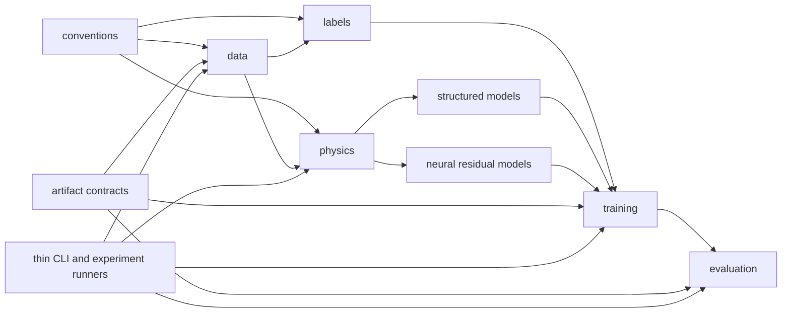

# Proposed Repository Architecture

Date: 2026-07-15

Decision status: recommendation for independent review; not implemented

## 1. Design principles

### Observed facts

The repository already has a working `src` package, an editable install, cohesive physics primitives, extensive tests, and traceable dated experiments. Its main weakness is boundary placement: reusable data, calibration, evaluation, and reporting behavior remains in scripts, while `pipeline.py` and `training.py` accumulate unrelated responsibilities.

### Recommendations

1. Preserve behavior before relocating it.
2. Make sample identity, split, selection, coordinate, label, and prior semantics explicit contracts.
3. Keep library code free of repository-relative output policy and dated experiment defaults.
4. Make CLIs thin and configs declarative; avoid a new framework dependency.
5. Keep aircraft facts separate from experiment choices.
6. Make every output immutable and provenance-addressable.
7. Permit frozen physics, structured correction, and neural residual approaches to coexist behind common prediction/evaluation contracts.
8. Never make model adapters redefine canonical labels.

## 2. Candidate A: conservative staged structure

```text
src/system_identification/
├── conventions/       # frames, units, phase and sample identity
├── data/              # ULog I/O, canonical assembly, resampling, metadata, splits
├── labels/            # effective-wrench reconstruction and label variants
├── physics/           # DeLaurier primitives, baselines, prior interfaces
├── models/
│   ├── structured/    # gain-bias, bounded calibration, harmonic/conditioned corrections
│   └── neural/        # MLP, recurrent, TCN, Transformer, residual TCN
├── training/          # adapters, normalization, losses, fitting, selection
├── evaluation/        # metrics, replay, diagnostics, plotting/report data
├── artifacts/         # manifests, hashes, run paths, serialization contracts
└── cli/               # optional callable CLI functions; no scientific core
scripts/{data,physics,training,evaluation,analysis,audit,experiments}/
configs/{data,physics,models,experiments,evaluation}/
```

Advantages: preserves package/import identity; allows one-module-at-a-time extraction; inexpensive compatibility shims; historical commands can remain. Disadvantages: generic package name remains; temporary old/new modules coexist; disciplined shims are required. Migration cost: medium. Import risk: controlled by re-exports. Historical experiment risk: low if command mapping is maintained.

## 3. Candidate B: complete package rename and replatform

```text
src/flap_sysid/...
src/system_identification/   # temporary compatibility facade
flap-sysid CLI entry points
Hydra-style config composition
```

Advantages: domain-specific import name, clean public API opportunity, conventional console commands. Disadvantages: touches imports in most scripts/tests/docs; external consumers are unknown; artifact/config references contain old paths; package rename does not solve script coupling; Hydra would add concepts and resolved-default behavior before configuration contracts are stable. Migration cost: high. Import and historical reproduction risk: high. A compatibility package would be mandatory for at least one migration/reproduction window.

## 4. Decision

### Recommendation

Choose Candidate A. Retain the `system_identification` package name for the entire repository-structure migration. This is not an aesthetic endorsement; it is a risk decision. The editable package works, internal use is extensive, and no confirmed package-name collision or external distribution requirement justifies multiplying the migration surface. Record a later ADR if external publication or namespace collision creates a concrete need for `flap_sysid`. If renamed later, first add `flap_sysid`, keep `system_identification` as a warning-free forwarding facade, migrate internal imports mechanically, verify all old commands, then deprecate only after an explicit independent audit.

## 5. Recommended target tree

```text
.
├── AGENTS.md
├── pyproject.toml
├── configs/
│   ├── data/
│   ├── physics/
│   ├── models/
│   ├── experiments/
│   └── evaluation/
├── metadata/
│   └── aircraft/<aircraft_id>/
│       ├── aircraft_metadata.yaml
│       ├── geometry/          # introduce when path migration is manifest-backed
│       ├── mass_properties/   # add only when multiple measured assets exist
│       ├── sensors/           # calibration/logging assets, not experiment choices
│       └── model_parameters/  # aircraft-specific physical parameters only
├── src/system_identification/
│   ├── conventions/{frames.py,units.py,phase.py,sample_keys.py}
│   ├── data/{ulog.py,canonical.py,resampling.py,preprocessing.py,metadata.py,splits.py}
│   ├── labels/{effective_wrench.py,variants.py,alignment.py}
│   ├── physics/
│   │   ├── delaurier/{airflow.py,dynamic_twist.py,strip_wrench.py}
│   │   ├── baselines/{wing_only.py}
│   │   └── priors/{protocol.py,export.py}
│   ├── models/
│   │   ├── AGENTS.md
│   │   ├── structured/{gain_bias.py,bounded_calibration.py,phase_discrepancy.py,lag.py}
│   │   └── neural/{mlp.py,recurrent.py,tcn.py,transformer.py,residual.py}
│   ├── training/{features.py,windows.py,normalization.py,losses.py,fit.py,selection.py,bundles.py}
│   ├── evaluation/{metrics.py,predictions.py,replay.py,diagnostics/,plotting/,reports.py}
│   ├── artifacts/{manifest.py,run_paths.py,hashing.py,schemas.py}
│   └── cli/
├── scripts/
│   ├── data/ physics/ training/ evaluation/ analysis/ audit/
│   ├── experiments/          # active, config-driven orchestration
│   └── legacy/               # immutable wrappers plus command map; no shared core
├── tests/
│   ├── unit/ integration/ regression/ fixtures/
│   └── external/             # explicit optional cross-repository contracts
├── docs/
│   ├── contracts/ architecture/ design/ audits/ decisions/
│   ├── experiments/ results/ reports/ runbooks/ plans/
│   └── PROJECT_STATE.md
└── outputs/runs/<run_id>/
    ├── config_resolved.yaml
    ├── manifest.json
    ├── environment.txt
    ├── metrics.json
    ├── parameters/ predictions/ figures/ logs/
    └── report.md
```

Directories are created only when their first migrated artifact exists; the tree is a target, not a Phase 0B request to create empty scaffolding everywhere.

Phase 0B is limited to the exact contract, decision, status, report, and 13-path AGENTS allowlist in the migration plan. Creating an allowlisted AGENTS file may create its parent directory, but no empty package, `__init__.py`, runtime config, or other skeleton placeholder is implied by this target tree.

## 6. Responsibilities and dependency direction



Recommended dependencies: conventions are leaf foundations and are the sole owner of timestamp, phase, canonical sample identity, and alignment-key semantics; data may use conventions; labels may use canonical data and conventions; physics may use canonical types/conventions but not labels or training; models may use physics protocol and tensor/data types; training uses models and label/data adapters; evaluation uses frozen prediction interfaces; artifacts record and validate convention-defined identities but do not redefine them; CLIs call library services.

Forbidden directions:

- package modules importing `scripts.*`;
- data/labels importing training, evaluation, or plots;
- physics importing experiment configs or learned-model selection;
- model inference reading train/val/test paths directly;
- evaluation fitting parameters or selecting candidates from test data;
- metadata importing configs, or experiment configs redefining aircraft facts;
- plots recomputing labels, priors, or selections silently;
- library code choosing dated artifact paths.

## 7. Boundary decisions

### Data versus labels versus physics

Canonical data represents aligned measured/derived state with validity and identity. Labels reconstruct the effective whole-aircraft wrench from kinematics and aircraft mass properties. Physics predicts a prior wrench from state and physical parameters. Residual targets are an explicit join product: `label - aligned prior`; they are not a mutation of the canonical contract.

Timestamp representation, phase semantics, canonical sample identity, and alignment-key construction are frozen in `conventions/` before data, label, or physics implementations migrate. Data owns aligned canonical rows; `labels/` owns residual and smoothed-label builders plus keyed prior/label alignment. Label builders are not ordinary data migration.

### Models and stages

Frozen raw DeLaurier belongs in `physics/baselines`. Gain-bias and bounded physical calibration belong in `models/structured` but consume immutable prior predictions and train-only fitting data. Wingbeat decomposition and phase-only/conditioned discrepancy belong in `models/structured` with explicit deployable features. Dynamic lag belongs there only after its causal input/output contract is fixed. Residual TCN belongs in `models/neural/residual.py`. Closed-loop integration belongs in evaluation/integration adapters or an external simulator repository, not inside label generation.

### Scripts

Each retained CLI should parse arguments, load a resolved config, allocate a new run directory, call one library service, write/print the manifest, and exit. Dated hard-coded grids stay as immutable experiment configs/runners. Old command-to-new command mappings are mandatory. `legacy/` means reproducible compatibility, not unsupported dumping ground.

## 8. Configuration strategy

Do not introduce Hydra now. Use schema-checked YAML/JSON plus `argparse` overrides and small typed Python loaders (dataclasses are sufficient). Reasons: current configs first need ownership and provenance; composition depth is low; Hydra is not a declared project dependency; adding it would mix framework behavior with migration.

Ownership:

- `metadata/`: aircraft identity, geometry, mass properties, sensor/control semantics, physical constants and provenance.
- `configs/data`: topic mapping, resampling/filtering, admission and split policy.
- `configs/physics`: baseline/prior algorithm parameters; aircraft-specific values reference metadata rather than duplicate it.
- `configs/models`: architecture and structured-model hyperparameters.
- `configs/experiments`: references to data/physics/model/evaluation configs and sweep grids.
- `configs/evaluation`: partitions, metrics, bins, replay horizons, plot/report choices.
- `docs/contracts`: immutable semantic rules; not runtime knobs.
- CLI: run-local overrides only.

Every run saves a fully resolved config, including defaults and overrides, plus its content hash. Existing experiment defaults are first encoded without changing values. Unknown legacy defaults remain in the legacy command manifest.

## 9. Metadata strategy

Keep `metadata/aircraft/<id>/` as the repository boundary. Do not move aircraft metadata into `configs/`. Introduce geometry, mass-properties, sensor/logging, and physical-model subfolders only when there are multiple assets and a manifest/schema can preserve paths. The current YAML should eventually reference content hashes and statuses. Learned parameters never enter aircraft metadata; bounded physical calibration parameters may be promoted only through an explicit decision and provenance record.

## 10. Output and provenance strategy

`outputs/` should be Git-ignored runtime state; only compact reviewed reports/tables and manifests are copied into `docs/results/` or `docs/experiments/`. Large predictions/models remain outside Git, with URI/path, size, hash, and storage policy in the manifest. Never overwrite a nonempty run directory.

Required manifest fields: run ID and UTC time; command; resolved config hash; Git commit and dirty diff hash/status; Python/environment snapshot; source data paths/hashes/contract versions; aircraft metadata/geometry hashes; split policy, assignments and hash; sample-key schema; label/prior/model versions; physical versus learned parameter blocks; train/val/test role; selection metric and selected-on partition; artifact list with hashes; parent-run IDs; known limitations.

Figures store a sidecar or manifest entry naming the prediction/metric table, filters, target, split, and generating code/config. `docs/results/` contains only small reviewed evidence and links back to immutable runs.

## 11. Compatibility and legacy strategy

For each move: add the new implementation, run characterization/regression comparisons, change the old module into a forwarding wrapper without CLI changes, migrate internal callers/tests, document old/new commands, and freeze before removing any wrapper. Historical script names, flags, default values, artifact columns, and hashes remain discoverable. No file is deleted solely because it contains a date, `exp`, `old`, or `legacy`.

AGENTS rules attached to a target directory become binding for migrated code only when that code is introduced or moved into the directory. Before migration, legacy code remains governed by the root/nearest existing AGENTS files and the active phase contract. Target rules may prohibit expansion of legacy debt, but they do not retroactively claim that unmigrated code already satisfies the target architecture.

The companion plan realizes this architecture through 13 independently gated phases: 0B; 0C1; 0C2 conventions/timestamp/phase/sample identity/alignment keys; 0C3 data; 0C4 labels; 0C5 frozen physics; 0C6 structured models; 0C7A behavior-preserving training decomposition; 0C7B fit/validation-selection/final-test isolation; 0C8 evaluation; 0C9 CLIs/configs; 0C10 tests; and 0D legacy decisions. No label builder is owned by 0C3, and no 0C7B protocol change is an acceptance condition for 0C7A.

## 12. Alternatives not adopted

- Rename immediately to `flap_sysid`: high disruption without solving core coupling.
- Put all experiment logic under the package: would make library APIs depend on dated research orchestration.
- Keep all reusable behavior in categorized scripts: improves browsing but preserves the wrong dependency boundary.
- Introduce Hydra now: configuration ownership and schema must stabilize first.
- Mimic IsaacLab extension/application structure: unnecessary for a focused offline identification library.
- Rewrite the pipeline or training stack: violates behavior-first migration and destroys historical comparability.

## 13. Unknowns requiring decision

The long-term storage location for large runs, required retention period for old commands, whether outputs and artifacts should converge, authoritative dataset/split aliases, and external package consumers must be decided before retirement phases. None blocks Phase 0B documentation/skeleton work if defaults are preserved.
