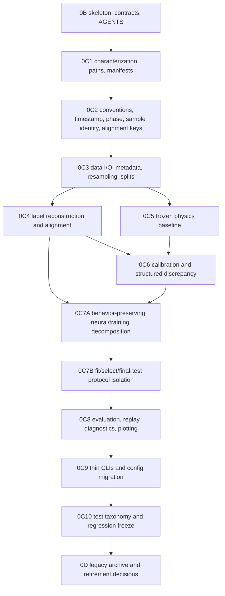

# Repository Migration Plan

Date: 2026-07-15

Status: proposed plan; Phase 0A only

## 1. Goal and non-goals

### Goal

Move reusable behavior into coherent library boundaries; establish executable data, coordinate, label, split, physics-prior and evaluation contracts; make CLIs thin; preserve historical commands/artifacts; and freeze each step with tests, regression evidence, provenance and independent audit.

### Non-goals

This plan does not authorize a new calibration method, Fourier/harmonic discrepancy, dynamic lag, residual TCN, closed-loop integration, changed label/filter/split behavior, package rename, dependency framework, data regeneration, or historical asset deletion. Research stages begin only after the migration baseline is frozen under a separately approved plan.

## 2. Phase sequence



There are 13 independently gated phases including Phase 0B, Phase 0C7A, Phase 0C7B, and Phase 0D. Each phase uses one branch/PR and stops after its audit result.

## 3. Uniform phase contract and stage gate

Allowed states:

```text
PLANNED -> IN_PROGRESS -> IMPLEMENTED -> SELF_CHECKED
  -> AUDIT_FAILED / REWORK_REQUIRED -> IMPLEMENTED
  -> AUDIT_PASSED -> FROZEN
```

Only an independent read-only reviewer can move `SELF_CHECKED` to `AUDIT_PASSED`. `FROZEN` requires an identifiable merge/commit after audit findings are resolved. Failure leaves the phase branch intact; it does not trigger the next phase.

Required freeze checklist:

```text
[ ] Scope matches the phase contract
[ ] Relevant tests pass
[ ] Smoke test passes
[ ] Regression comparison is documented
[ ] No train/validation/test leakage is introduced
[ ] Documentation is updated
[ ] Manifest or migration record exists
[ ] Independent read-only audit passes
[ ] Known limitations are recorded
[ ] Git commit is identifiable
```

Every implementation report is `docs/reports/<phase>_implementation_report.md` and contains: phase contract/commit, changed files, old-to-new mapping, commands/environment, tests/smoke, numeric/schema regression, config/manifest evidence, leakage review, pollution check, limitations, rollback, and proposed audit inputs.

Every independent report is `docs/audits/<phase>_independent_audit.md` and contains: reviewer/commit, scope-diff verification, evidence independently rerun, old/new behavior comparison, API/artifact compatibility, split/leakage review, AGENTS compliance, pollution/unexpected changes, findings by severity, verdict (`AUDIT_PASSED` or `REWORK_REQUIRED`), and freeze recommendation. These future reports are not created in Phase 0A.

### Phase 0B exact allowlist

Phase 0B may modify the existing root `AGENTS.md` and may add only the following files (with their parent directories created only as needed to contain them):

- `src/system_identification/AGENTS.md`
- `src/system_identification/data/AGENTS.md`
- `src/system_identification/physics/AGENTS.md`
- `src/system_identification/labels/AGENTS.md`
- `src/system_identification/models/AGENTS.md`
- `src/system_identification/training/AGENTS.md`
- `src/system_identification/evaluation/AGENTS.md`
- `scripts/AGENTS.md`
- `configs/AGENTS.md`
- `tests/AGENTS.md`
- `docs/AGENTS.md`
- `metadata/AGENTS.md`
- `docs/contracts/repository_conventions.md`
- `docs/contracts/sample_identity.md`
- `docs/contracts/split_protocol.md`
- `docs/contracts/label_and_prior.md`
- `docs/contracts/training_evaluation.md`
- `docs/contracts/raw_physics_baseline.md`
- `docs/decisions/0001_legacy_dataset_artifact_output_roots.md`
- `docs/PROJECT_STATE.md`
- `docs/reports/phase0b_implementation_report.md`
- `docs/audits/phase0b_independent_audit.md` (only when written by the independent reviewer)

This allowlist authorizes no other file. It does not authorize empty placeholder files, runtime configuration, production modules, imports, generated artifacts, or implementation of a target contract. Any different name or additional path requires approval before Phase 0B starts. Contract and AGENTS text must label observed legacy behavior, target behavior, unresolved items, and the phase in which each target rule activates.

## 4. Regression and test strategy

Regression layers:

1. Structural: import graph, public names/signatures, CLI `--help`, file/column/schema sets.
2. Deterministic numeric: small fixtures with exact/tolerance comparisons, frozen physics fixture, split assignment, sample keys, model predictions and selected epoch/candidate.
3. Artifact: manifest/config fields, hashes, paths, output protection, serialization round trip.
4. Protocol: train-only fitted statistics; validation-only selection; test-not-loaded selection; group/time-window isolation.
5. Representative smoke: tiny local fixture, no external writes, no full training.

Baseline outputs are captured before changing implementation. Comparisons state row ordering/key, dtype, tolerance, seed/device and known nondeterminism. A changed result is failure unless behavior change is explicitly a later phase goal. Full tests are run only where cost is understood; focused tests and collect-only are always recorded.

## 5. Detailed phase contracts

### Phase 0B — Target skeleton, contracts, and AGENTS hierarchy

- Objective: create only approved directory skeleton where needed, status/index documents, contract drafts grounded in Phase 0A, and the designed AGENTS hierarchy.
- Scope/input: the five Phase 0A documents, current root AGENTS, draft contracts, current code references.
- Targets: only the files enumerated in the Phase 0B exact allowlist above; directories may be created only to contain an allowlisted file.
- Allowed modifications: allowlisted documentation, AGENTS, and directories needed to contain those files; no placeholder skeleton files, runtime configs, or production behavior.
- Explicitly not done: moves, imports, config conversion, model/data/output generation.
- Behavior/test: byte-identical tracked production files; `pytest --collect-only`; links and inheritance walkthrough.
- Smoke/regression: simulate representative data/physics/training tasks against AGENTS; compare Git diff to allowlist.
- Risks/rollback: conflicting or excessive rules; revert only Phase 0B commit.
- Completion/audit: every contract has status/owner/unknowns/activation phase; hierarchy matches architecture; every child states that it governs code only after code enters its directory; independent rules/conflict audit passes.
- Merge: allowed after `FROZEN`. Next phase requires contract identifiers and audit pass.

### Phase 0C1 — Characterization, path management, and manifest foundation

- Objective: add behavior-neutral hash, run-path and manifest utilities plus characterization fixtures for hotspots.
- Inputs: current path/hash code in pipeline and analysis; current manifests; output guards; inventory.
- Targets: `artifacts/{hashing,run_paths,manifest,schemas}.py`, focused tests, migration mapping. These utilities record convention-defined identities but do not define sample identity or alignment keys.
- Allowed modifications: new utility modules/tests/docs and minimal opt-in callers; existing defaults remain.
- Not done: moving pipeline/training, changing output roots, regenerating artifacts.
- Behavior/test: old path behavior is default; nonempty output refusal, dirty Git capture, data/split/metadata hashes, and faithful recording of existing identity fields.
- Smoke/regression: construct a temporary run in `tmp_path`; compare current wing-sweep manifest fields; no repo output.
- Risk/rollback: accidental output-policy change; remove opt-in calls and new module commit.
- Completion/audit: manifest v1 schema and legacy-field mapping documented; all current commands still resolve.
- Merge/next: merge only frozen; 0C2 requires characterization and manifest utilities stable.

### Phase 0C2 — Conventions, timestamp, phase, sample identity, and alignment keys

- Objective: freeze and centralize the existing timestamp representation, coordinate/unit rules, phase semantics, canonical sample identity, and alignment-key construction as named helpers and executable validations.
- Inputs: `phase.py`, airflow transforms, pipeline quaternion/timestamp helpers, metadata frames, current alignment helpers, tests and draft contracts.
- Targets: `conventions/{frames,units,timestamps,phase,sample_keys}.py` and contract validators; compatibility exports.
- Allowed modifications: behavior-preserving relocations and assertions that fail only previously ambiguous invalid inputs; any behavior-changing correction requires a separate approved subphase.
- Not done: change interpolation, quaternion sign handling/SLERP, ratio, phase offset, frequency hierarchy, alignment tolerance, physics equations, labels, or split assignments.
- Behavior/test: PX4 `wxyz` body-FRD-to-NED, timestamp units/rounding, NED/FRD signs, phase ratio-8/cycle annotations, stable sample identity, and current keyed-alignment behavior are preserved.
- Smoke/regression: identity/known rotations, timestamp/key fixtures, shuffled keyed rows, duplicate/missing-key failures, phase fixtures, and current frozen physics inputs.
- Risks/rollback: duplicated timestamp/quaternion/key semantics; keep old helpers forwarding until all consumers compare equal.
- Completion/audit: one convention source for timestamp, phase, sample identity, and alignment-key semantics; consumer inventory complete; no hidden sign/default/tolerance change.
- Merge/next: 0C3, 0C4, and 0C5 require the frozen convention contract.

### Phase 0C3 — Data I/O, metadata, preprocessing, and split extraction

- Objective: extract ULog I/O, canonical assembly, resampling/preprocessing, metadata loading and split services from `pipeline.py`, `dataset_split.py`, and data build scripts without changing behavior.
- Inputs: those modules; frozen 0C2 conventions; thin data CLIs; metadata YAML; related tests.
- Targets: `data/{ulog,canonical,resampling,preprocessing,metadata,splits}.py`; old-module re-exports/wrappers.
- Allowed modifications: package data modules, corresponding wrappers/tests/docs.
- Not done: label reconstruction/variants/alignment, quaternion behavior correction, phase convention change, new split policy, or data regeneration.
- Behavior/test: same columns/order/counts/dtypes, freshness/defaults, cycle/log assignments and manifests on fixtures.
- Existing tests: metadata, resample, dataset_split, pipeline data assembly, materializers/regeneration. Smoke: synthetic topic frames and tiny temp split.
- Regression: Parquet/schema and split assignment equality keyed by the frozen sample identity.
- Risks/rollback: private API consumers and mixed pipeline label calls; retain forwarding facade and leave label helpers at the old path until 0C4.
- Completion/audit: data modules consume but do not redefine conventions; label builders have not moved into data; old CLIs work; documented unresolved doc/code drift remains unchanged.
- Merge/next: frozen required; 0C4 and 0C5 start only after the data API mapping is stable.

### Phase 0C4 — Effective-wrench labels, variants, and keyed alignment

- Objective: extract label reconstruction, derivative variants, validity reporting and prior/label alignment into `labels/`.
- Inputs: pipeline label helper; smoothed/time-aligned builders; residual builder; metadata.
- Targets: `labels/{effective_wrench,variants,alignment}.py`; thin builders/wrappers.
- Allowed modifications: behavior-preserving extraction; fail-closed keyed join may be introduced only with a compatibility flag for verified legacy artifacts and explicit migration record.
- Not done: new smoothing/lag choice, mass/inertia update, prior calibration, silent sample dropping.
- Behavior/test: raw/smoothed force/moment arrays, masks, label columns and manifests; per-group filtering; one-to-one key join.
- Existing tests: pipeline label, signal preprocessing, smoothed builders, lag/input filtering, residual split. Smoke: shuffled prior fixture must realign; missing/duplicate keys must fail.
- Regression: keyed numeric equality and valid/invalid reason counts.
- Risks/rollback: legacy unkeyed priors; retain explicit audited fallback without making it default.
- Completion/audit: canonical labels remain distinct from residuals; contract/version saved; all consumers inventoried.
- Merge/next: 0C6/0C7A require frozen label/alignment API.

### Phase 0C5 — Frozen raw physics baseline

- Objective: relocate DeLaurier primitives and wing-only adapter into cohesive physics subpackages, preserving the frozen raw baseline exactly.
- Inputs: `physics/*`, baseline adapter, geometry, frozen fixture, theta analysis.
- Targets: `physics/delaurier/`, `physics/baselines/`, compatibility re-exports.
- Allowed modifications: moves, import facades, explicit contracts/manifests.
- Not done: tune parameters, add tail/fuselage, change airflow, twist, geometry, reference, filter or calibrated prior.
- Behavior/test: frozen `1e-10` fixture, zero-twist parity, polar/axial reflection, `r x F`, CG, phase mapping, attitude airflow.
- Smoke/regression: tiny segment produces identical component and total columns/hashes.
- Risks/rollback: sign/reference regression and metadata path move; keep geometry path alias and old modules.
- Completion/audit: full frame/unit/reference inventory; raw baseline immutable/versioned.
- Merge/next: 0C6 requires physics audit pass.

### Phase 0C6 — Existing calibration and structured discrepancy extraction

- Objective: move existing gain-bias, bounded calibration, structured phase/condition correction and dynamic-arm logic from scripts into `models/structured`.
- Inputs: calibration/correction scripts and direct tests.
- Targets: structured model modules, fit/predict protocols, old script wrappers.
- Allowed modifications: one algorithm family per PR/subgate; no numerical/selection behavior change.
- Not done: invent bounded calibration variants, phase-only harmonic research, dynamic lag research, or refit published artifacts.
- Behavior/test: same design matrices, bounds, coefficients, validation selections, predictions and artifact columns.
- Existing tests: prior regression/nonlinear, force recalibration, Fx/Fz, deployable, dynamic-arm, phase-structured. Smoke: tiny three-split fixture.
- Regression: test partition is unavailable to selector; physical parameters and learned coefficients serialized separately.
- Risks/rollback: cross-script private API and row-order alignment; use 0C4 join service and wrappers.
- Completion/audit: migrated model cores no longer depend on shared script-private implementations; evaluation/report wrappers may remain until 0C8; every model has fit/predict/serialize contract and provenance.
- Merge/next: 0C7A requires each family subgate frozen.

### Phase 0C7A — Behavior-preserving features, neural models, and training decomposition

- Objective: mechanically decompose `training.py` into features/windows, model definitions, normalization/losses, fitting/selection, and bundles while preserving every existing public default and command behavior.
- Inputs: `training.py`, training/sanity/screen tests and thin callers.
- Targets: `models/neural/`, `training/`, compatibility exports from `training.py`.
- Allowed modifications: mechanical extraction in small subgates; identical defaults and serialization.
- Not done: architecture/hyperparameter changes, new residual TCN, performance optimization, full training, changing when test data is loaded, or separating final evaluation behavior.
- Behavior/test: train-only statistics, val-only early stopping, causal window/group/order behavior, bundle round trip, deterministic tiny predictions and selected epoch.
- Existing tests: the unit/integration/regression portions currently mixed in `test_training.py`, model sanity, temporal-order, and prior-vs-TCN helper tests. Smoke: CPU tiny fixture through the legacy-compatible wrapper.
- Regression: old/new bundle prediction and metrics within declared tolerance; old public names resolve.
- Risks/rollback: huge surface and PyTorch nondeterminism; one concern per commit and retain facade.
- Completion/audit: old defaults, test-loading behavior, artifacts, predictions, selection results, and serialization remain equivalent; `training.py` is a compatibility facade with no implementation core.
- Merge/next: 0C7B requires the frozen prediction bundle and fit/selection interfaces.

### Phase 0C7B — Fit, validation selection, and final test-evaluation protocol isolation

- Objective: make fitting, validation-only selection, and one-shot final test evaluation separate commands/services and artifacts.
- Inputs: frozen 0C7A training/model/bundle interfaces; split and evaluation contracts; existing training and structured-selection wrappers.
- Targets: `training/{fit,selection}.py`, the minimal locked final-evaluation interface needed for separation, explicit command/config contracts, and compatibility wrappers.
- Allowed modifications: the explicitly approved protocol change that prevents fit/selection code from loading test; legacy commands may forward through the separated services while recording their compatibility behavior.
- Not done: change model architectures, features, hyperparameters, normalization math, validation metric, selected epoch/candidate, test metric definitions, or develop new research models.
- Behavior/test: train alone fits statistics/weights; validation alone selects epoch/form/features/hyperparameters; test is unavailable to both and is accepted only by final evaluation with a frozen model/config/split manifest.
- Smoke/regression: deterministic tiny fixture proves the same train/validation-selected bundle as 0C7A; a test-not-loaded sentinel passes; final evaluation reproduces prior test predictions/metrics within declared tolerance.
- Risks/rollback: command/default compatibility and users relying on automatic test plots; retain an explicit legacy wrapper and revert the protocol-isolation commit without reverting 0C7A.
- Completion/audit: fit/select cannot resolve or open test paths; final evaluation cannot fit/select; compatibility behavior and changed artifact boundaries are documented and independently audited.
- Merge/next: 0C8 requires the frozen protocol and prediction-bundle interfaces.

### Phase 0C8 — Evaluation, replay, diagnostics, plotting, and reports

- Objective: extract reusable metrics, replay integrators, diagnostic tables and plotting from scripts/package analysis.
- Inputs: frozen 0C7B final-evaluation interface, evaluate/analyze/diagnose/plot scripts and related tests.
- Targets: `evaluation/{metrics,predictions,replay,diagnostics,plotting,reports}.py`; thin entries.
- Allowed modifications: behavior-preserving extraction and standardized sidecar provenance.
- Not done: choose new models/windows, reinterpret results, regenerate large reports.
- Behavior/test: metric values, replay closure, phase/frequency bins, plot data and filenames preserved on fixtures.
- Existing tests: replay, rotational, Level 2, residual diagnostics, plots, wing theta analysis. Smoke: synthetic constant-force/rate replay.
- Regression: saved table hashes/columns and image existence/dimensions; test evaluation accepts only frozen manifest.
- Risks/rollback: plotting nondeterminism and script defaults; compare source tables primarily, retain wrappers.
- Completion/audit: evaluators do not fit/select; every figure traces to saved data/config.
- Merge/next: 0C9 requires all shared script logic relocated.

### Phase 0C9 — Thin categorized CLIs and lightweight configs

- Objective: categorize scripts, convert stable defaults to schema-checked configs, and keep old commands as wrappers.
- Inputs: all current scripts/constants/CLI help; config ownership design.
- Targets: categorized `scripts/`, `configs/*`, command mapping and resolved configs.
- Allowed modifications: CLI routing/default encoding; no behavior changes.
- Not done: Hydra, dependency change, old command removal, experiment reruns.
- Behavior/test: old/new command parity, identical resolved values, output refusal, manifests.
- Smoke/regression: `--help`; one tiny command per category; compare resolved config and output schema.
- Risks/rollback: hidden defaults and absolute paths; unresolved paths stay explicit legacy config until decided.
- Completion/audit: no new script-to-script library imports; all runs write resolved config/manifest; command map complete.
- Merge/next: 0C10 requires CLI compatibility pass.

### Phase 0C10 — Test taxonomy and repository regression freeze

- Objective: move tests into unit/integration/regression/fixtures/external categories and define default/slow/external suites.
- Inputs: 275 collected tests from 46 test modules plus one JSON fixture, runtime/dependency inventory, all migration reports.
- Targets: categorized tests, marks/config, regression baseline index.
- Allowed modifications: per-test moves, splits of mixed-responsibility modules, marks/fixtures and test-only helpers; a mixed module is not mechanically assigned one destination.
- Not done: weaken assertions, fix production behavior opportunistically, regenerate fixtures without provenance.
- Behavior/test: collect the same tests; old node map documented; unit default writes only tmp; focused integration/regression suites pass.
- Smoke/regression: compare collection count and outcome; pollution check.
- Risks/rollback: CI/node references and misclassified expensive tests; compatibility map and reversible moves.
- Completion/audit: every test has class/cost/dependency; critical contracts have regression coverage; full feasible suite result recorded.
- Merge/next: 0D only after entire migrated baseline is frozen.

### Phase 0D — Legacy archive and old-entry retirement decisions

- Objective: archive immutable historical orchestration, index artifacts/commands/status, and retire only explicitly approved wrappers.
- Inputs: complete command map, usage search, external-consumer decision, frozen migration baseline.
- Targets: `scripts/legacy/`, `docs/experiments/history/`, decisions and redirect wrappers.
- Allowed modifications: archive/move/status marking; deletion only under a separate explicit decision (inventory currently recommends none).
- Not done: rewrite history, delete data/models/results, alter archived defaults, package rename.
- Behavior/test: retained legacy commands reproduce help and documented tiny fixtures; hashes/status preserved.
- Smoke/regression: representative old commands and artifact lookup.
- Risks/rollback: unknown external users and lost provenance; retain aliases and revert archive commit.
- Completion/audit: every legacy file has reason, replacement, last-known command/artifact, compatibility status and retention decision.
- Merge: allowed only frozen. New research starts under a new roadmap, never automatically.

## 6. Compatibility, legacy, rollback, and Git strategy

Compatibility uses forwarding modules and old CLI wrappers. Every mapping records old path/command, new API/command, first compatibility version, evidence, and retirement status. Artifact schemas are versioned; readers support old versions explicitly or fail with a migration instruction. No silent schema reinterpretation.

Use branch names such as `phase-0c4-label-extraction`, one phase per PR, small commits by subgate, and tag or record the pre-phase and frozen commits. Never merge `IMPLEMENTED` or merely `SELF_CHECKED`. Rollback reverts the phase commits while old facades remain operational; generated test runs live outside tracked paths and are not part of rollback.

## 7. Complete program acceptance

- All tracked files have a resolved inventory action and mapping.
- Package dependency direction passes static inspection.
- Shared scientific logic is absent from scripts.
- Old imports/commands either work through documented wrappers or have explicit approved retirement decisions.
- Data, coordinate, label, split, evaluation and physics-prior contracts are active and validated.
- Selection cannot access test data; final evaluation cannot fit/select.
- All runs are immutable and manifest-backed.
- Frozen physics and representative pipeline/model artifacts match regression baselines.
- Tests are categorized with cost/external dependency.
- Historical experiments/results remain traceable.
- Every phase is independently audited, frozen and tied to a commit.

## 8. Phase 0B execution prompt outline

Use a future prompt with these sections:

1. State `Phase 0B only` and require stopping after its report.
2. Pin branch/HEAD/environment and capture preexisting workspace changes.
3. Allow only root/child AGENTS, approved docs/contracts/decisions, and empty-free skeleton needed by those files.
4. Prohibit production code, scripts, tests, metadata values, configs that change behavior, dependencies, data/artifacts, migration and model work.
5. Require reading all five Phase 0A deliverables and reconciling cross-document inconsistencies before edits.
6. Create the hierarchy in the documented order; preserve root skill policy.
7. Draft contract status/owner/unknowns and link code facts without claiming behavior changes.
8. Run `pytest -p no:cacheprovider --collect-only`, diff/pollution/link/inheritance checks.
9. Write the Phase 0B implementation report, but do not self-author the independent audit verdict.
10. End: `Phase 0B implemented and self-checked. Stop and wait for independent read-only audit.`

This outline is a recommendation only. Phase 0B was not executed.
