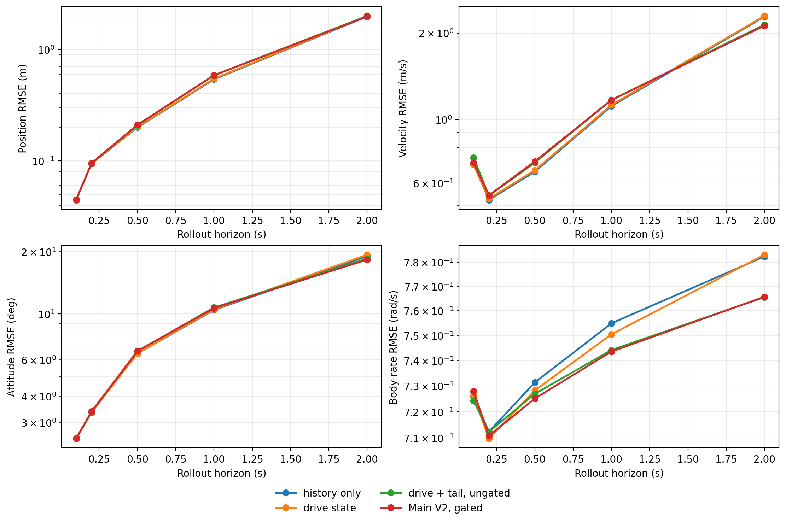
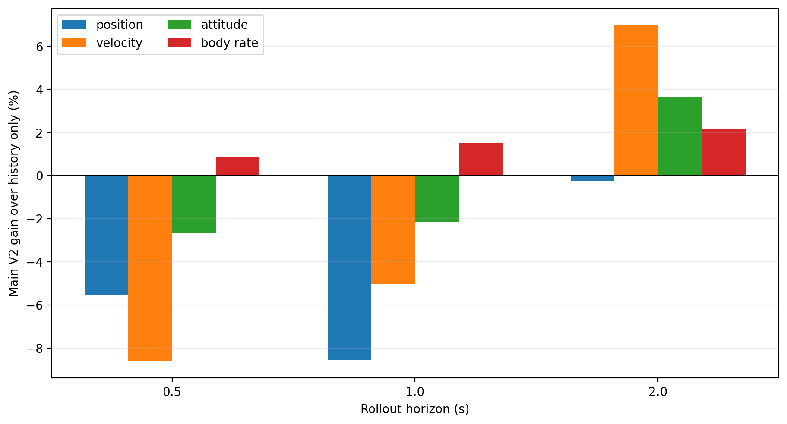

# Step 5: Actuator-Aware Trajectory Main V2

Date: 2026-09-03

## Decision

Main V2 does not pass the H1/H2 gate. The actuator-aware design is substantially safer than Step 3 direct control conditioning, and the explicit motor-drive state cuts validation flap-frequency RMSE by 27–48% at 0.5–2.0 s. That improvement does not transfer to rigid-body trajectory accuracy: drive-only worsens position and velocity at every 0.5–2.0 s horizon and worsens attitude at 1–2 s.

The gated tail path avoids the severe long-horizon instability of an ungated residual and produces useful 2 s gains in velocity, attitude, and body rate. It nevertheless worsens position, velocity, and attitude on every validation flight at 0.5 s, and on four or five flights at 1 s. The current closed-loop August data therefore support actuator-state prediction, but do not support a stable, transferable control-conditioned rigid-body dynamics claim.

## Frozen task and leakage boundary

Step 5 consumes the unchanged Step 1 `trajectory_dataset_v1` windows and Step 3 `trajectory_history_context_v1` history:

\[
x(t_0-0.5\,\mathrm{s}:t_0),\;u(t_0-0.5\,\mathrm{s}:t_0+T)
\longrightarrow x(t_0:t_0+T).
\]

- History contains 26 causal samples including `t0`, never crossing a log, segment, invalid interval, mode change, gap, or estimator reset.
- Future-known inputs remain the four final-exclusive Step 1 actuator commands only.
- Future realized rigid-body state, flap frequency, phase, RPM, airspeed, wind, quality fields, and labels are never model inputs.
- Realized flap frequency is an auxiliary training target. The model rolls it forward from its predicted value.
- Phase uses `sin/cos(relative_phase - phase_at_t0)`. No common phase zero is assumed across logs.
- Train contains 4,214 windows from six 2026-08-19 logs. Validation contains the same frozen 3,920 windows from five 2026-08-20 logs used in Steps 2–4.
- The 2026-08-26 sealed test remains unmaterialized and unread.

All normalization is fitted on train. The configurations, time constants, objectives, epoch counts, and success gate were fixed before the formal validation run. Validation was not used for fitting, early stopping, or post-result parameter adjustment.

## Main V2 architecture

The reference is the exact Step 3 64-unit history-only GRU and physical integration path, retrained for the same 40 epochs with the same seed and 1 s multi-step objective. Its validation aggregate reproduces the committed Step 3 result with maximum numerical difference below `1e-16`.

Every actuator-aware ablation starts from that reference and freezes its recurrent state encoder and derivative head. Controls enter only through additive derivative residuals, so the learned history-only dynamics cannot be overwritten by closed-loop control correlations.

### Flapping-drive state

The motor command drives a causal first-order state with fixed time constant 0.10 s, selected from the Step 4 command-to-frequency lag rather than validation performance. Its initial value is reconstructed from the past 0.5 s command history. The residual sees this state and the currently predicted flap frequency and is restricted to flap-frequency rate; it cannot directly alter force or angular acceleration. A flap-frequency loss supervises the drive path using the realized frequency as a target only.

`rpm_estimate` was not added because Step 4 showed that it is numerically the same filtered information as `flap_frequency_hz`. The noisier `rpm_raw` is absent from the Step 1 contract and is not introduced as an ad hoc future input.

### Tail representation and fallback

Raw left/right commands are transformed to

\[
u_{sym}=\frac{u_L+u_R}{2},\qquad
u_{diff}=\frac{u_L-u_R}{2},\qquad
u_{rud}=u_{rudder}.
\]

Each drives a causal 0.04 s first-order state, matching the 0.02–0.04 s Step 4 angular-response peaks. The residual output masks reflect only the supported control meaning:

- symmetric: body x/z acceleration and pitch angular acceleration;
- differential: roll angular acceleration;
- rudder: body y acceleration and yaw angular acceleration.

The gated model applies one learned sigmoid gate per tail channel, initialized at 0.05, plus gate and residual penalties. Final gates are 0.0605 symmetric, 0.0597 differential, and 0.0523 rudder. These small values show that the optimizer retained a near-history-only fallback rather than assigning every command a large compulsory effect.

## Matched ablations

| Model | Frozen history base | Drive state | Tail representation | Tail conditioning |
| --- | --- | --- | --- | --- |
| `history_no_control_multistep` | reference | none | none | none |
| `v2_drive_state` | yes | 0.10 s, frequency-rate only | none | none |
| `v2_drive_tail_ungated` | yes | same | sym/diff/rudder, 0.04 s | ungated residual |
| `main_v2_drive_tail_gated` | yes | same | same | learned gates plus regularization |

The three actuator variants use the same seed, 25 epochs, 1 s rollout objective, batch size, optimizer, and train windows. The ungated/gated comparison changes the control fallback mechanism, not the backbone, control representation, or delay states.

## Validation rollout results

Values are equal-log macro endpoint RMSE on the same 3,920 windows.

| Model | Horizon | Position (m) | Velocity (m/s) | Attitude (deg) | Body rate (rad/s) |
| --- | ---: | ---: | ---: | ---: | ---: |
| history only | 0.5 s | 0.200 | 0.658 | 6.45 | 0.731 |
| drive state | 0.5 s | 0.201 | 0.665 | 6.45 | 0.728 |
| drive + tail ungated | 0.5 s | 0.209 | 0.707 | 6.62 | 0.727 |
| Main V2 gated | 0.5 s | 0.211 | 0.714 | 6.63 | 0.725 |
| history only | 1.0 s | 0.540 | 1.113 | 10.45 | 0.755 |
| drive state | 1.0 s | 0.546 | 1.123 | 10.53 | 0.750 |
| drive + tail ungated | 1.0 s | 0.587 | 1.169 | 10.74 | 0.744 |
| Main V2 gated | 1.0 s | 0.586 | 1.169 | 10.67 | 0.744 |
| history only | 2.0 s | 1.975 | 2.283 | 18.98 | 0.782 |
| drive state | 2.0 s | 1.995 | 2.295 | 19.30 | 0.783 |
| drive + tail ungated | 2.0 s | 1.996 | 2.141 | 18.48 | 0.766 |
| Main V2 gated | 2.0 s | 1.979 | 2.124 | 18.28 | 0.766 |



Main V2 gain relative to history-only is:

| Horizon | Position | Velocity | Attitude | Body rate |
| --- | ---: | ---: | ---: | ---: |
| 0.1 s | +0.10% | -1.21% | +0.31% | -0.28% |
| 0.2 s | -0.75% | -3.68% | -1.05% | +0.22% |
| 0.5 s | -5.54% | -8.61% | -2.68% | +0.86% |
| 1.0 s | -8.55% | -5.04% | -2.15% | +1.50% |
| 2.0 s | -0.24% | +6.97% | +3.64% | +2.14% |



At 0.5 s, Main V2 worsens position, velocity, and attitude on all five validation logs while improving body rate on all five. At 1 s it improves velocity and attitude on only one log and position on none. At 2 s it improves velocity and attitude on four logs, body rate on all five, and position on three; the remaining failure is concentrated in the shifted `log_22`, where position, velocity, and attitude worsen by 10.0%, 5.0%, and 3.8%.

The gate helps primarily at long horizon. Relative to the ungated model it improves 2 s position, velocity, and attitude by 0.85%, 0.79%, and 1.08%, including four or five validation logs. It does not improve the 0.5 s translational errors. This demonstrates fallback value, but not sufficient control identifiability.

Compared with Step 3's direct jointly trained controlled model, Main V2 reduces 2 s position, velocity, attitude, and body-rate RMSE by 10.8%, 15.9%, 28.6%, and 1.1%. The architecture therefore fixes much of the previous instability without meeting the stronger requirement of outperforming history-only.

## Motor-drive result

| Horizon | History-only frequency RMSE | Drive-state frequency RMSE | Gain |
| --- | ---: | ---: | ---: |
| 0.1 s | 0.246 Hz | 0.211 Hz | +14.2% |
| 0.2 s | 0.254 Hz | 0.199 Hz | +21.4% |
| 0.5 s | 0.259 Hz | 0.190 Hz | +26.5% |
| 1.0 s | 0.324 Hz | 0.191 Hz | +41.1% |
| 2.0 s | 0.377 Hz | 0.196 Hz | +47.9% |

The actuator state is effective for its directly supervised variable in the equal-log validation aggregate. It is not effective for rigid-body trajectory: drive-only position and velocity worsen on all five logs at 0.5 and 1 s, and its 2 s attitude worsens by 1.72% in aggregate. This separates actuator observability from aerodynamic-control identifiability. A better frequency trajectory does not establish that the present data identify its causal force/moment effect.

## Tail-control result

The tail path has a real long-horizon signal: relative to drive-only, the gated tail model improves 2 s velocity, attitude, and body rate by 7.47%, 5.27%, and 2.22%. It simultaneously worsens 0.5 s position, velocity, and attitude by 4.59%, 7.37%, and 2.68%, and worsens their 1 s counterparts by 7.31%, 4.08%, and 1.34%.

This horizon reversal is inconsistent with a stable identified actuator-to-dynamics map. It is more consistent with the Step 4 diagnosis: tail commands contain some trajectory information, but that information is entangled with feedback policy, operating point, and cross-day control distribution. The small learned gates and the `log_22` failure reinforce that conclusion.

## Gate and next-stage recommendation

The formal success gate requires positive Main V2 gain for all four metrics at 0.5, 1.0, and 2.0 s, with at least three of five logs improved in every metric/horizon cell. Both conditions fail. Do not enter H1/H2 and do not tune a larger network against these five validation flights.

Recommended route:

1. Keep `history_no_control_multistep` as the rigid-body trajectory reference. The current drive state may be retained only as a separately evaluated actuator-frequency estimator.
2. Collect multi-day flights with safety-bounded, persistently exciting and independently varied motor, symmetric elevon, differential elevon, and rudder commands. Balance their operating-point distributions across days.
3. Log measured servo position and preferably current, retain `rpm_raw`, and add an absolute Hall/mechanical phase reference. These measurements are needed to separate command delay, actuator motion, aerodynamic response, and controller feedback.
4. Reserve entire days/logs for validation exactly as in Step 1. Demonstrate actuator transfer first, then require consistent 0.5–2.0 s rigid-body gains before revisiting H1/H2.
5. If new excitation and instrumentation are unavailable, frame the scientific result as history-aware trajectory prediction under the observed PX4 policy. The available August data do not justify a generally control-conditioned flight-dynamics claim.

## Reproduction and artifacts

```bash
/home/zn/anaconda3/envs/flap-train-gpu/bin/python \
  scripts/run_trajectory_main_v2.py \
  --dataset-root dataset/trajectory_v1_august_f5_c4 \
  --output-root artifacts/trajectory_main_v2 \
  --summary-root docs/analysis/results/trajectory_main_v2
```

The runner refuses to overwrite a nonempty output root, verifies that only train and validation are materialized, and fails if sealed-test samples are present. Full checkpoints, training history, and window metrics remain under ignored `artifacts/trajectory_main_v2/`. The compact manifest, aggregate/per-log metrics, matched gains, frequency metrics, and figures are retained under `docs/analysis/results/trajectory_main_v2/`.
