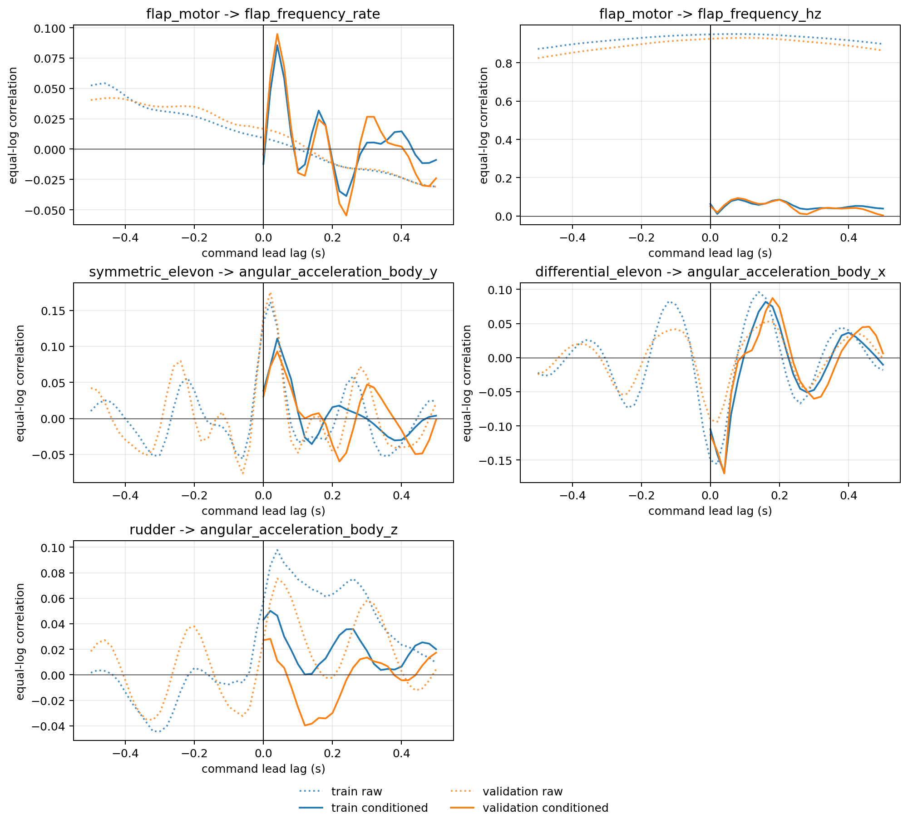
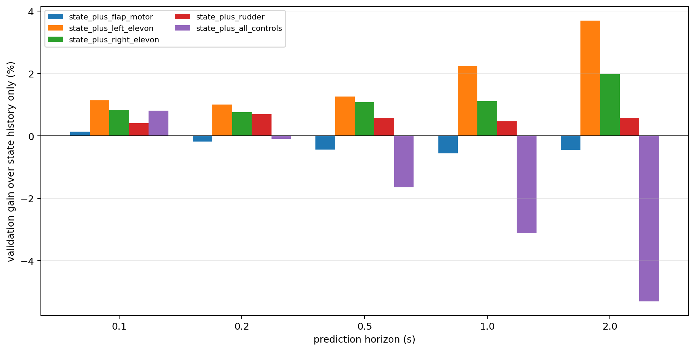

# Step 4: Control Observability and Actuator-State Diagnosis

Date: 2026-09-03

## Decision

The Step 3 controlled-model failure is best explained by a combination of closed-loop redundancy and train-to-validation control shift, amplified by an incompletely observed actuator path. The data reject the stronger claim that commands contain no useful information: individual elevon channels provide small, repeatable validation gains after conditioning on state history. They also reject proceeding directly to a larger temporal network: the four-channel diagnostic improves every train log but becomes progressively worse on held-out validation from 0.2 to 2.0 s.

There is enough evidence to prototype a small actuator-aware state for the flapping drive, because motor command leads the realized filtered flapping rate by about 0.08–0.10 s and a less filtered encoder-derived RPM proxy exists. There is not enough telemetry to identify or validate an explicit servo state: `actuator_outputs` is commanded PWM, not measured surface position, and none of the 11 admitted train/validation ULogs contains servo position or current feedback.

## Frozen scope and method

The analysis consumes the immutable Step 1 `trajectory_dataset_v1` and the frozen Step 3 per-log validation result. It reads 6 train logs from 2026-08-19 and 5 validation logs from 2026-08-20. The 3 sealed-test logs from 2026-08-26 are neither materialized nor read.

- State conditioning uses four taps from the causal 0.5 s Step 3 history at -0.50, -0.20, -0.10, and 0.00 s. A window is used only when the full history is present.
- State features contain velocity, attitude, body rate, flap frequency, and `sin/cos(relative_phase - phase_at_t0)`. The log-local phase-zero offset therefore cancels. No future realized state, phase, frequency, airspeed, or wind is an input.
- Future-control diagnostics use only commands from `t0` through the evaluated horizon, final-exclusive, summarized by first/last/mean/standard deviation/total variation and three fixed causal low-pass states (0.05, 0.15, 0.40 s).
- All ridge fits use train-only normalization and a fixed `alpha=10`; validation is never used for fitting or selection.
- Endpoint targets are trajectory innovations: position after subtracting constant-velocity motion, velocity change, sign-safe relative attitude rotation vector, and body-rate change.
- Uncertainty is a paired bootstrap over flight logs (5,000 draws). Sample-level p-values are deliberately omitted because 50 Hz rows and overlapping trajectory windows are autocorrelated.
- Lag curves correlate `u(t)` with response at `t + lag` over -0.5 to +0.5 s. Positive lag means that the command leads the response. Acceleration uses a centered 0.08 s derivative. The conditioned curve removes the train-fitted state-history prediction of the future response.

The trajectory-innovation analysis retains 4,151 of 4,214 train windows and 3,860 of 3,920 validation windows after requiring a real, unpadded 0.5 s history. The zero-lag timing analysis contains 43,854 train and 40,582 validation samples. Equal-log Fisher correlations prevent longer flights from dominating.

## Timing and correlation results

The predeclared physical channel-response pairs are:

| Command / composite | Response | Train raw peak | Validation raw peak | Train conditioned peak | Validation conditioned peak |
| --- | --- | ---: | ---: | ---: | ---: |
| flap motor | flap frequency level | 0.08 s, +0.950 | 0.10 s, +0.931 | 0.08 s, +0.087 | 0.08 s, +0.094 |
| flap motor | flap frequency rate | 0.50 s, -0.031 | 0.50 s, -0.031 | 0.04 s, +0.086 | 0.04 s, +0.095 |
| symmetric elevon | pitch angular acceleration | 0.02 s, +0.162 | 0.02 s, +0.176 | 0.04 s, +0.111 | 0.04 s, +0.093 |
| differential elevon | roll angular acceleration | 0.02 s, -0.156 | 0.02 s, -0.094 | 0.04 s, -0.169 | 0.04 s, -0.170 |
| rudder | yaw angular acceleration | 0.04 s, +0.098 | 0.04 s, +0.075 | 0.02 s, +0.050 | 0.12 s, -0.040 |

The motor-to-frequency level relation is strong but mostly redundant with current state history; after conditioning, its correlation falls below 0.10. Frequency derivative is noisy and has no meaningful broad raw peak. Elevon composites have reproducible but modest 0.02–0.04 s angular-acceleration peaks. Rudder coupling is weak, and its conditioned peak changes delay and sign between train and validation, so a unique rudder delay is not identifiable from these flights.

The commands are not independently excited. Left and right elevons have equal-log correlation -0.648 in train and -0.837 in validation. Motor-rudder correlation also changes from +0.258 to +0.374, while the remaining channel pairs are weaker. This structure is expected under a feedback controller and makes it easy for a joint model to use day-specific command combinations as shortcuts.



## Independent information after state history

Positive values mean lower standardized trajectory-innovation RMSE than the state-history-only ridge. The values below are equal-log macro validation gains.

| Added future command | 0.1 s | 0.2 s | 0.5 s | 1.0 s | 2.0 s |
| --- | ---: | ---: | ---: | ---: | ---: |
| flap motor | +0.13% | -0.18% | -0.44% | -0.56% | -0.45% |
| left elevon | +1.14% | +1.01% | +1.27% | +2.24% | +3.70% |
| right elevon | +0.84% | +0.76% | +1.08% | +1.12% | +1.98% |
| rudder | +0.41% | +0.69% | +0.57% | +0.47% | +0.58% |
| all four controls | +0.80% | -0.09% | -1.65% | -3.11% | -5.30% |

The left-elevon gain occurs on all five validation logs at every horizon. The right-elevon gain occurs on four of five logs. The rudder effect is smaller and its 2 s log-bootstrap interval crosses zero. Motor control worsens all five validation logs at 0.5 and 1.0 s.

The decisive generalization gap is in the joint model. Adding all controls improves all six train logs by 5.66%, 7.54%, 8.76%, 9.65%, and 11.40% at 0.1, 0.2, 0.5, 1.0, and 2.0 s, respectively. On validation the corresponding sequence is +0.80%, -0.09%, -1.65%, -3.11%, and -5.30%; the 1 and 2 s log-bootstrap intervals are entirely below zero. This small linear diagnostic reproduces the direction of the Step 3 neural ablation without adding network capacity.



State history predicts future mean flap command very well on validation (`R2=0.940` at 0.1 s and `0.639` at 2.0 s), so the motor command adds little independent excitation. For elevons, state-history predictions remain correlated with future commands (0.57–0.69 equal-log correlation), but validation `R2` is negative because calibration and mean shift do not transfer. Rudder is intermediate (`R2=0.19` at 0.1 s and `0.12` at 2.0 s). Thus PX4 feedback makes the command tape highly state-related, while cross-day offsets make the learned command mapping unreliable.

## Distribution shift and Step 3 impact

| Control | Validation mean shift (train SD) | Normalized Wasserstein distance | Validation outside train 1–99% |
| --- | ---: | ---: | ---: |
| flap motor | -0.391 | 0.410 | 0.95% |
| left elevon | -0.783 | 0.783 | 6.27% |
| right elevon | -0.457 | 0.457 | 13.42% |
| rudder | -0.032 | 0.231 | 3.02% |

The largest shift is in the left/right elevon operating point, not in rudder. Across the five validation flights, the L2 norm of the four control mean shifts has descriptive Spearman correlation 0.7–0.9 with Step 3 controlled-minus-no-control degradation for position, velocity, attitude, and body rate at 1 s, and 0.8–0.9 at 2 s. This is only five logs and is not causal evidence, but the direction is consistent across all four rollout metrics. The least-shifted validation flight (`log_19`, shift norm 0.794) is also the only flight where Step 3 control improves 2 s position and velocity; the largest degradation is concentrated in more shifted flights.

The conclusion is therefore stronger than “commands are delayed”: distribution shift materially tracks the Step 3 failure, and the all-channel train/validation reversal shows non-transferable command correlations. Delay alone cannot explain that reversal.

## What the raw ULG can and cannot identify

All 11 logs use the same output-function mapping. Command-to-`actuator_outputs` correlation is approximately ±0.96–0.99 in train and ±0.98–0.997 in validation; the sign follows PX4 output reversal. This verifies logger/channel mapping, not physical surface motion.

The logged `rpm_estimate`, divided by the per-log `FLAP_RATIO=7.909091`, reproduces the Step 1 `flap_frequency_hz` almost exactly (equal-log correlation 1.000 and RMSE about 2.4e-7 Hz). It is therefore the same filtered information, not independent actuator evidence. The less filtered `rpm_raw` proxy has correlation 0.921 in train and 0.901 in validation with about 0.23 Hz RMSE, so it is a plausible observation for a bounded flapping-drive state experiment.

No admitted log exposes measured servo position, servo current, ESC status, or another independent aerodynamic-load measurement. Consequently:

- The data support a flapping-drive lag/state, but do not determine whether one low-pass state is sufficient.
- The data are consistent with hidden servo dynamics, but cannot distinguish servo delay/backlash from aerodynamic delay, derivative noise, or closed-loop correlation.
- A future Hall reference would add absolute mechanical phase. The current relative phase remains log-local and must continue to be encoded relative to `t0`; phase zero cannot be compared across logs.

## Recommended next stage

Do not increase the general temporal backbone or enter multiscale/uncertainty/RL work. Use a bounded actuator-aware experiment with the frozen `history_no_control_multistep` reference:

1. Add one explicit flapping-drive state driven by motor command and supervised or initialized from `rpm_raw`; keep future realized flap frequency target-only.
2. Represent elevons as symmetric/differential channels and use strong channel-wise regularization or gated residual injection so an unhelpful channel can revert to the no-control dynamics.
3. Require per-log gains at 0.5–2.0 s and reject any variant that repeats the all-control train/validation reversal or increases attitude drift.
4. Treat servo-state modeling as provisional until new flights log measured surface position/current. For new experiments, inject persistently exciting, independently varied, safety-bounded motor/symmetric/differential/rudder commands across multiple days and add absolute Hall phase reference.
5. If new instrumentation and excitation are not feasible, narrow the paper claim to history-aware autonomous trajectory prediction under the observed PX4 policy; do not claim independently identified control-conditioned dynamics.

## Reproduction and artifacts

```bash
/home/zn/anaconda3/envs/flap-train-gpu/bin/python \
  scripts/diagnose_control_observability.py \
  --dataset-root dataset/trajectory_v1_august_f5_c4 \
  --log-root /home/zn/QgcLogs \
  --output-root artifacts/control_observability_v1 \
  --summary-root docs/analysis/results/control_observability_v1
```

The runner refuses to overwrite nonempty outputs, fails closed if sealed-test materialization is detected, resolves raw log identities only from the Step 1 manifest, and records the code HEAD and split contract. Compact CSVs, two figures, and the run manifest are committed under `docs/analysis/results/control_observability_v1/`; the full lag curves and per-log incremental metrics remain under ignored `artifacts/control_observability_v1/`.
