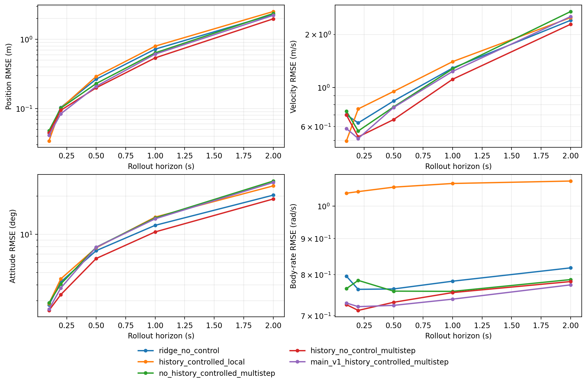

# Step 3: History-Aware Trajectory Dynamics Main V1

Date: 2026-09-03

## Decision

Main V1 does **not** pass the gate for H1/H2. Causal history and multi-step training are useful, but the controlled Main V1 does not produce stable control gain and does not beat `ridge_no_control` on every 0.5–2.0 s trajectory metric.

The strongest result is the `history_no_control_multistep` ablation. It beats `ridge_no_control` on all four equal-log macro metrics at 0.5, 1.0, and 2.0 s. At 1 and 2 s it also improves every metric on every one of the five validation logs. This establishes that recent flight history contains transferable hidden-dynamics information. Adding the logged control tape reverses much of that gain, especially in attitude.

## Causal history contract

Step 3 consumes the immutable Step 1 train and validation samples and window IDs. It adds a versioned consumer contract named `trajectory_history_context_v1`; it does not rebuild or alter `trajectory_dataset_v1`.

- History: 26 state samples including `t0`, nominally 0.5 s or about two wingbeats at the train mean frequency.
- Boundary: history is drawn only from the same `log_id + segment_id` and ends at `t0`.
- Short history: unavailable leading samples are left padded and ignored by an explicit mask. This preserves all 3,920 Step 2 validation windows.
- Past observations: rigid-body state, relative flap state, and, for controlled variants, past actuator outputs.
- Future-known input: only the four Step 1 actuator channels from `t0` through `tT` exclusive.
- Forbidden future input: realized state, flap phase/frequency, airspeed, wind, quality fields, labels, or samples after `tT`.
- Relative phase: state features use `sin(phi - phi_t0)` and `cos(phi - phi_t0)`. A log-specific constant phase-zero offset therefore cannot affect the model. Future realized phase/frequency are target-only auxiliary signals and never rollout inputs.
- Split: 4,214 train windows from six 2026-08-19 logs; 3,920 validation windows from five 2026-08-20 logs. Sealed test was not materialized or read.

## Main V1 model

The model has about 21k trainable parameters. A shared 64-unit GRUCell encodes the masked history and carries a compact hidden dynamics state through rollout. At each future step, a small tanh MLP predicts body acceleration, body angular acceleration, and flap-frequency rate from the hidden state, predicted physical state, and optionally the current known control. The existing Step 2 midpoint-quaternion rigid-body integration contract is reproduced differentiably with actual per-window time increments.

The shared recurrent cell is intentional: it makes the local versus multi-step comparison fair because the transition used at rollout is trained even under the local objective. Derivative outputs are expressed using train-only target statistics and constrained to six standardized deviations. Flap frequency retains the Step 1 0.5–20 Hz validity range.

## Training objective and matched ablations

All configurations use the same seed, hidden size, train windows, train-only normalization, optimizer, 40 epochs, and no validation fitting, early stopping, or hyperparameter selection.

| Model | History | Controls | Training objective |
| --- | --- | --- | --- |
| `history_controlled_local` | 0.5 s | past + future | one-step trajectory |
| `no_history_controlled_multistep` | `t0` only | future | 1.0 s trajectory rollout |
| `history_no_control_multistep` | 0.5 s | none | 1.0 s trajectory rollout |
| `main_v1_history_controlled_multistep` | 0.5 s | past + future | 1.0 s trajectory rollout |

The multi-step loss directly penalizes position, velocity, sign-invariant quaternion attitude, and body-rate trajectories over 50 integration steps. Relative-phase and flap-frequency target losses have 0.1 auxiliary weight so their realized future values supervise the internal flap state without becoming inference inputs.

## Validation results

Values are equal-log macro endpoint RMSE on the same 3,920 windows used in Step 2.

| Model | Horizon | Position (m) | Velocity (m/s) | Attitude (deg) | Body rate (rad/s) |
| --- | ---: | ---: | ---: | ---: | ---: |
| ridge no-control | 0.1 s | 0.045 | 0.700 | 2.78 | 0.796 |
| ridge no-control | 0.2 s | 0.104 | 0.630 | 4.22 | 0.763 |
| ridge no-control | 0.5 s | 0.266 | 0.838 | 7.44 | 0.764 |
| ridge no-control | 1.0 s | 0.721 | 1.289 | 11.78 | 0.783 |
| ridge no-control | 2.0 s | 2.289 | 2.403 | 20.35 | 0.818 |
| history controlled local | 0.1 s | 0.034 | 0.498 | 2.85 | 1.043 |
| history controlled local | 0.2 s | 0.101 | 0.755 | 4.46 | 1.048 |
| history controlled local | 0.5 s | 0.291 | 0.950 | 7.84 | 1.063 |
| history controlled local | 1.0 s | 0.797 | 1.401 | 13.67 | 1.076 |
| history controlled local | 2.0 s | 2.520 | 2.490 | 24.06 | 1.085 |
| no-history controlled multi-step | 0.1 s | 0.048 | 0.734 | 2.88 | 0.765 |
| no-history controlled multi-step | 0.2 s | 0.101 | 0.566 | 4.06 | 0.785 |
| no-history controlled multi-step | 0.5 s | 0.230 | 0.776 | 7.92 | 0.758 |
| no-history controlled multi-step | 1.0 s | 0.638 | 1.274 | 13.47 | 0.758 |
| no-history controlled multi-step | 2.0 s | 2.359 | 2.696 | 26.28 | 0.787 |
| history no-control multi-step | 0.1 s | 0.045 | 0.698 | 2.52 | 0.726 |
| history no-control multi-step | 0.2 s | 0.094 | 0.524 | 3.35 | 0.712 |
| history no-control multi-step | 0.5 s | 0.200 | 0.658 | 6.45 | 0.731 |
| history no-control multi-step | 1.0 s | 0.540 | 1.113 | 10.45 | 0.755 |
| history no-control multi-step | 2.0 s | 1.975 | 2.283 | 18.98 | 0.782 |
| Main V1 history controlled multi-step | 0.1 s | 0.041 | 0.585 | 2.57 | 0.730 |
| Main V1 history controlled multi-step | 0.2 s | 0.084 | 0.514 | 3.78 | 0.721 |
| Main V1 history controlled multi-step | 0.5 s | 0.210 | 0.770 | 7.91 | 0.724 |
| Main V1 history controlled multi-step | 1.0 s | 0.611 | 1.234 | 13.25 | 0.739 |
| Main V1 history controlled multi-step | 2.0 s | 2.220 | 2.524 | 25.60 | 0.774 |



## What the ablations show

Positive values below mean that the candidate has lower error than its matched reference.

| Comparison | Horizon | Position gain | Velocity gain | Attitude gain | Body-rate gain |
| --- | ---: | ---: | ---: | ---: | ---: |
| history no-control vs ridge | 0.5 s | +24.96% | +21.56% | +13.24% | +4.25% |
| history no-control vs ridge | 1.0 s | +25.16% | +13.62% | +11.26% | +3.63% |
| history no-control vs ridge | 2.0 s | +13.71% | +5.02% | +6.73% | +4.36% |
| Main history vs no-history | 0.5 s | +8.85% | +0.73% | +0.10% | +4.52% |
| Main history vs no-history | 1.0 s | +4.24% | +3.17% | +1.62% | +2.50% |
| Main history vs no-history | 2.0 s | +5.89% | +6.37% | +2.60% | +1.70% |
| Main control vs no-control | 0.5 s | -4.98% | -17.09% | -22.65% | +0.99% |
| Main control vs no-control | 1.0 s | -13.24% | -10.84% | -26.81% | +2.12% |
| Main control vs no-control | 2.0 s | -12.41% | -10.57% | -34.89% | +1.07% |
| Main multi-step vs local | 0.5 s | +27.98% | +18.91% | -0.97% | +31.91% |
| Main multi-step vs local | 1.0 s | +23.32% | +11.95% | +3.09% | +31.35% |
| Main multi-step vs local | 2.0 s | +11.90% | -1.37% | -6.37% | +28.65% |

History gain is the most consistent result: the controlled Main improves over its no-history counterpart on all 12 equal-log macro cells from 0.5–2.0 s. The no-control history model also beats ridge on all 12 cells. Multi-step training strongly improves position and body rate, but its 2 s velocity and attitude gains over the local objective do not persist.

Control gain fails clearly. Relative to the history no-control model, the controlled Main is worse on position, velocity, and attitude at every 0.5–2.0 s horizon. At the per-log level, control improves none of the 15 attitude cells and none of the five 0.5 s velocity cells. The small body-rate gain does not compensate for the coupled attitude degradation.

## Remaining error sources and failure modes

- Logged post-allocation command is not measured actuator or wing state. A recurrent model can still learn closed-loop command correlations that do not transfer to the next flight day.
- There is meaningful train-to-validation control shift: the left-elevon mean shifts by 0.78 train standard deviations, the right elevon by 0.46, and the flapping command by 0.39. This is consistent with, but does not by itself prove, the observed controlled-model degradation.
- The 1 s training objective improves dynamics inside its trained horizon, but velocity and attitude drift return at 2 s.
- Attitude remains the limiting coupled channel. Main V1 has lower body-rate RMSE than ridge but larger integrated attitude error, indicating that small directional or low-frequency angular-rate bias still accumulates.
- Validation log `log_22_2026-8-20-07-09-54.ulg` is the worst 2 s Main V1 case: 2.83 m position, 3.47 m/s velocity, 34.9 deg attitude, and 0.875 rad/s body-rate RMSE.
- The absolute mechanical wing phase remains unobserved. Offset-invariant phase handling prevents a false cross-log zero assumption, but cannot recover the missing physical wing pose by itself.

## Recommendation

Do not enter H1/H2 yet. The stage demonstrates that causal history is worth retaining and that direct multi-step training improves several rollout channels, but the central control-utilization criterion fails reproducibly.

The next bounded step should diagnose the control path before increasing architecture complexity: quantify train-only command-to-response lags per channel, distinguish command history from inferred actuator state, and test whether a fixed causal delay/state filter restores matched control gain. Keep `history_no_control_multistep` as the Main V1 performance reference and require any controlled revision to improve it consistently without worsening attitude.

## Reproduction and validation

```bash
/home/zn/anaconda3/envs/flap-train-gpu/bin/python \
  scripts/run_trajectory_main_v1.py \
  --dataset-root dataset/trajectory_v1_august_f5_c4 \
  --output-root artifacts/trajectory_main_v1 \
  --summary-root docs/analysis/results/trajectory_main_v1
```

The runner refuses to overwrite nonempty output directories. Two independent CUDA runs from the same fixed configuration produced byte-identical training histories, window metrics, per-log metrics, and horizon metrics. The committed result directory retains aggregate/per-log metrics, matched gains, the figure, and the complete compact manifest. Checkpoints, training history, and the 3,920-window metric table remain in ignored `artifacts/trajectory_main_v1/`.
