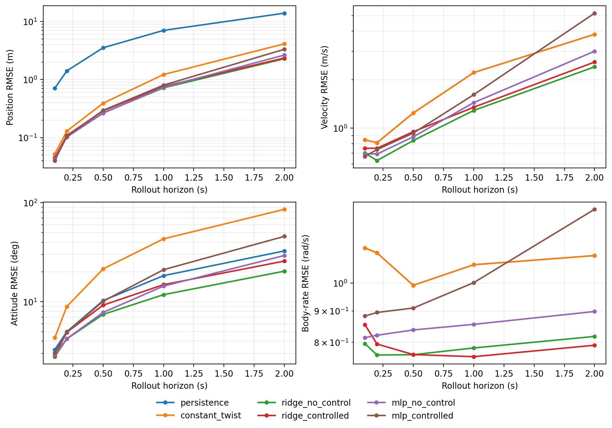

# Step 2: Trajectory Prediction Baselines

Date: 2026-09-03

## Conclusion

The August `F5 + C4` cohort has useful short-horizon predictability, but a memoryless one-step model does not turn the logged future actuator commands into a reliable validation-rollout gain. The strongest balanced baseline is the ridge dynamics model without controls: at 0.5/1.0/2.0 s it reaches position RMSE of 0.266/0.721/2.289 m, velocity RMSE of 0.838/1.289/2.403 m/s, attitude RMSE of 7.44/11.78/20.35 deg, and body-rate RMSE of 0.764/0.783/0.818 rad/s.

Controls improve a few isolated short-horizon cells but degrade most metrics and horizons in matched ridge and MLP comparisons. This is a negative baseline result, not evidence that control has no physical effect. The controlled MLP fits train one-step targets better than the no-control MLP, yet rolls out worse on the next-day validation set. That pattern points to closed-loop correlation, command-to-response delay, hidden actuator/aerodynamic state, and accumulated rollout error.

## Frozen task and data boundary

This stage consumes `trajectory_dataset_v1` exactly as built in Step 1:

\[
x(t_0),\;u(t_0:t_0+T) \rightarrow x(t_0:t_0+T).
\]

- Train: six 2026-08-19 logs, 44,676 valid consecutive transitions.
- Validation: five 2026-08-20 logs, 3,920 fixed 2 s windows.
- Evaluation horizons: 0.1, 0.2, 0.5, 1.0, and 2.0 s, all evaluated on the same 3,920-window cohort.
- Primary aggregation: compute window endpoint errors, then per-log RMSE, then equal-log macro mean across the five validation logs.
- Sealed test: not materialized, read, fitted, or evaluated.
- All normalization is fitted from train transitions only. Validation is not used for fitting, early stopping, or hyperparameter selection.

Each predictor receives only the initial rigid-body/flap state, the future logged four-channel actuator sequence, and actual time increments. Future realized state, flap frequency, phase, wind, and airspeed never enter rollout inputs.

## Baselines

1. `persistence` holds position, velocity, attitude, angular velocity, phase, and frequency fixed. It provides a deliberately weak stationary floor.
2. `constant_twist` integrates initial NED velocity, initial body rate, and initial flap frequency without learning. It tests how much trajectory structure is explained by simple kinematics.
3. `ridge_{no_control,controlled}` fits a regularized linear map from body velocity, body rate, body-frame gravity, relative-phase sine/cosine, and flap frequency to body acceleration, angular acceleration, and flap-frequency rate. The controlled variant appends the four Step 1 future controls.
4. `mlp_{no_control,controlled}` uses the same dynamics targets and matched feature ablation with a fixed two-layer `64 x 64` ReLU MLP. It is trained for 40 epochs on CPU with no validation tuning. This is the lightweight nonlinear learned baseline, not a proposed Main Model.

All learned models are autoregressively integrated with actual per-window `dt`; attitude uses a sign-safe quaternion update. Frequency is constrained only to the Step 1 physical-validity range of 0.5–20 Hz.

## Validation results

The values below are equal-log macro RMSE.

### Position RMSE (m)

| model | 0.1 s | 0.2 s | 0.5 s | 1.0 s | 2.0 s |
| --- | ---: | ---: | ---: | ---: | ---: |
| persistence | 0.709 | 1.415 | 3.535 | 7.050 | 13.962 |
| constant_twist | 0.052 | 0.129 | 0.392 | 1.223 | 4.139 |
| ridge_no_control | 0.045 | 0.104 | 0.266 | 0.721 | 2.289 |
| ridge_controlled | 0.045 | 0.109 | 0.290 | 0.763 | 2.354 |
| mlp_no_control | 0.043 | 0.102 | 0.264 | 0.739 | 2.650 |
| mlp_controlled | 0.040 | 0.105 | 0.295 | 0.802 | 3.331 |

### Velocity RMSE (m/s)

| model | 0.1 s | 0.2 s | 0.5 s | 1.0 s | 2.0 s |
| --- | ---: | ---: | ---: | ---: | ---: |
| persistence | 0.846 | 0.812 | 1.243 | 2.214 | 3.829 |
| constant_twist | 0.846 | 0.812 | 1.243 | 2.214 | 3.829 |
| ridge_no_control | 0.700 | 0.630 | 0.838 | 1.289 | 2.403 |
| ridge_controlled | 0.750 | 0.750 | 0.951 | 1.349 | 2.574 |
| mlp_no_control | 0.695 | 0.691 | 0.884 | 1.441 | 3.005 |
| mlp_controlled | 0.668 | 0.736 | 0.933 | 1.614 | 5.178 |

### Attitude RMSE (deg)

| model | 0.1 s | 0.2 s | 0.5 s | 1.0 s | 2.0 s |
| --- | ---: | ---: | ---: | ---: | ---: |
| persistence | 3.28 | 4.98 | 10.26 | 18.32 | 32.59 |
| constant_twist | 4.32 | 8.95 | 21.43 | 43.14 | 85.78 |
| ridge_no_control | 2.78 | 4.22 | 7.44 | 11.78 | 20.35 |
| ridge_controlled | 2.87 | 4.91 | 9.23 | 14.86 | 25.74 |
| mlp_no_control | 2.92 | 4.23 | 7.79 | 14.37 | 29.30 |
| mlp_controlled | 3.05 | 4.89 | 10.12 | 21.04 | 45.73 |

### Body-rate RMSE (rad/s)

| model | 0.1 s | 0.2 s | 0.5 s | 1.0 s | 2.0 s |
| --- | ---: | ---: | ---: | ---: | ---: |
| persistence | 1.141 | 1.120 | 0.991 | 1.071 | 1.108 |
| constant_twist | 1.141 | 1.120 | 0.991 | 1.071 | 1.108 |
| ridge_no_control | 0.796 | 0.763 | 0.764 | 0.783 | 0.818 |
| ridge_controlled | 0.855 | 0.795 | 0.764 | 0.758 | 0.791 |
| mlp_no_control | 0.814 | 0.822 | 0.838 | 0.856 | 0.898 |
| mlp_controlled | 0.883 | 0.895 | 0.910 | 1.001 | 1.319 |



## Does future control help?

Not reliably under these memoryless one-step baselines. Positive gain means lower validation RMSE after adding controls.

| Family | Horizon | Position gain | Velocity gain | Attitude gain | Body-rate gain |
| --- | ---: | ---: | ---: | ---: | ---: |
| ridge | 0.1 s | +0.13% | -7.16% | -2.97% | -7.35% |
| ridge | 0.2 s | -4.70% | -19.20% | -16.41% | -4.21% |
| ridge | 0.5 s | -8.90% | -13.42% | -24.11% | -0.04% |
| ridge | 1.0 s | -5.80% | -4.70% | -26.15% | +3.22% |
| ridge | 2.0 s | -2.85% | -7.10% | -26.51% | +3.25% |
| MLP | 0.1 s | +6.35% | +3.86% | -4.59% | -8.48% |
| MLP | 0.2 s | -2.81% | -6.55% | -15.66% | -8.94% |
| MLP | 0.5 s | -11.74% | -5.51% | -29.81% | -8.58% |
| MLP | 1.0 s | -8.54% | -12.02% | -46.46% | -16.97% |
| MLP | 2.0 s | -25.70% | -72.29% | -56.04% | -46.82% |

The controlled MLP ends with lower train standardized one-step MSE (`0.3638` versus `0.4666`) but worse validation rollouts after 0.1 s. Therefore the control channels contain train-predictive correlation, but this direct instantaneous mapping does not provide robust next-day trajectory information.

## Modeling difficulties exposed

- Initial velocity explains much of short-horizon position, but acceleration error compounds rapidly after 0.5 s.
- A constant initial body rate is a poor attitude model: it reaches 85.8 deg RMSE at 2 s. Body-rate oscillation and rotational dynamics require a learned evolving state.
- Current actuator output is not the same as realized wing/surface state. Delay, motor/flapping dynamics, aerodynamic memory, and the original controller's closed-loop response can make controls spuriously predictive for one-step train loss.
- One-step nonlinear fit does not guarantee stable rollout. The controlled MLP is the clearest example.
- August phase zero is log-local. Phase sine/cosine can describe within-log periodicity but cannot identify a common cross-log mechanical pose.
- The Step 1 contract has no pre-`t0` history, so actuator state immediately before `t0` remains partly latent. This limitation must be handled explicitly rather than using forbidden future state.

## Main Model recommendation

The next model should retain explicit rigid-body integration and focus learning capacity on a compact causal latent dynamics state. Its priority should be multi-step rollout stability, command-to-flapping/actuator dynamics, and coupled velocity/rotation prediction. Relative phase should be treated as periodic but not as a cross-log absolute pose. Any latent initialization must use only Step 1 `x(t0)`; adding prehistory would require a separately versioned data contract.

The comparison target to beat is `ridge_no_control`, not the controlled MLP. A Main Model should first demonstrate consistent control gain over matched no-control ablations on validation, especially at 0.5–2.0 s, before adding larger architectures.

## Reproduction and artifacts

```bash
/home/zn/anaconda3/envs/flap-train-gpu/bin/python \
  scripts/run_trajectory_baselines.py \
  --dataset-root dataset/trajectory_v1_august_f5_c4 \
  --output-root artifacts/trajectory_baselines_v1 \
  --summary-root docs/analysis/results/trajectory_baselines_v1
```

The runner refuses to overwrite a nonempty output directory. The committed summary contains aggregate and per-log metrics, control gains, the figure, and a provenance manifest. Full window-level metrics and fitted model files remain under ignored `artifacts/trajectory_baselines_v1/`.
