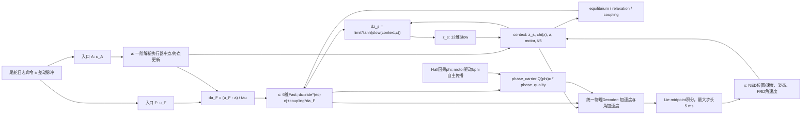

```mermaid
flowchart LR
 UL["尾舵日志命令 ± 差动脉冲"] --> UA["入口 A: u_A"]
 UL --> UF["入口 F: u_F"]
 UA --> ACT["a: 一阶解析执行器中点/终点更新"]
 UF --> DA["da_F = (u_F - a) / tau"]
 ACT --> DA
 ACT --> CT["context: z_s, chi(x), a, motor, f/5"]
 X["x: NED位置/速度、姿态、FRD角速度"] --> CT
 Z["z_s: 12维Slow"] --> CT
 CT --> EQ["equilibrium / relaxation / coupling"]
 EQ --> C["c: 6维Fast; dc=rate*(eq-c)+coupling*da_F"]
 DA --> C
 CT --> SLOW["dz_s = limit*tanh(slow(context,c))"]
 C --> SLOW
 SLOW --> Z
 CT --> DEC["统一物理Decoder: 加速度与角加速度"]
 C --> DEC
 C --> Q["phase_carrier Q(phi)c * phase_quality"]
 PHI["Hall因果phi; motor驱动f/phi自主传播"] --> Q
 Q --> DEC
 DEC --> LIE["Lie midpoint积分，最大步长5 ms"]
 LIE --> X
```
